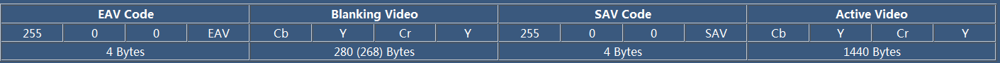
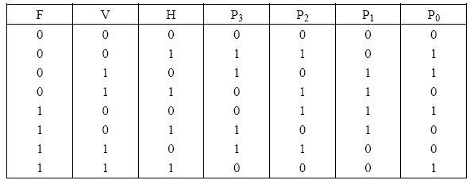

# 视频信号传输标准 BT656

本文将主要介绍 标准的 8bit BT656（4:2:2）YCbCr SDTV（标清） 数字视频信号格式，主要针对刚刚入门模拟视频采集的初学者入门之用。

**1. 帧的概念（Frame）**

一个视频序列是由N个帧组成的，采集图像的时候一般有2种扫描方式，一种是[逐行扫描](http://baike.baidu.com/view/84623.htm#sub84623)（progressive scanning），一种是[隔行扫描](http://baike.baidu.com/view/115294.htm#sub115294)（interlaced scanning）。对于隔行扫描，每一帧一般有2个场（field），一个叫顶场（top field），一个叫底场（bottom field）。

假设一帧图像是720行，那么，顶场就**包含**其中所有的偶数行，而底场则**包含**其中所有的奇数行。

**2. 场的概念（field）**  

注意，上面提到顶场和底场，用的是&ldquo;包含&rdquo;二字，而不是说完全由后者组成，因为在BT.656标准中，一个场是由三个部分组成的
场 = 垂直消隐顶场（First Vertical Blanking） + 有效数据行（Active Video） +垂直消隐底场（Second Vertical Blanking）

对于顶场，有效数据行就是一帧图像的所有偶数行，而底场，有效数据行就是一帧图像的所有奇数行。顶场和底场的空白行的个数也有所不同，那么，对于一个标准的 8bit BT656（4:2:2）SDTV（标清）的视频而言，对于一帧图像，其格式定义如下：

由上图可以知道，对于PAL制式，每一帧有625行，其中，顶场有效数据288行，底场有效数据也是288行，其余行即为垂直消隐信号。为什么是288行？因为PAL制式的SDTV或者D1的分辨率为 720*576，即一帧有576行，故一场为288行。

由上图我们还可以知道，顶场有效数据的起始行为第23行，底场有效数据的起始行为第335行。

另外，上图中的 F 标记奇偶场，V标记 是否为垂直消隐信号。

**3. 每一行的组成（Lines）**

下面说明每一行的组成，一行是由4个部分组成

行 = 结束码（EAV） + 水平消隐（Horizontal Vertical Blanking） + 起始码（SAV） + 有效数据（Active Video）

典型的一行数据组成如下图所示：

起始码（SAV）和结束码（EAV），它是标志着一行的开始结束的重要标记，也包含了其他的一些重要的信息，后面将会讲到。
为什么水平消隐 是280字节，这个我暂时还没搞清楚，不知道是不是标准定义的。

为什么一行中的有效数据是 1440 字节？ 因为PAL制式的SDTV或者D1的分辨率为 720*576，即一行有720个有效点，由于采集的是彩***像，那么一行就是由亮度信息（Y）和色差信息（CbCr）组成的，由于是 YCbCr422格式，故一行中有720列Y，720列CbCr，这样，一行的有效字节数就自然为 720 x 2 = 1440 字节了。

**4. EAV和SAV**

EAV和SAV都是4个字节（Bytes），由上面的图可以知道，SAV后面跟着的就是有效的视频数据了。那么，EAV和SAV的格式是怎么样的呢？
EAV和SAV的4个字节的格式规定如下（下面以16进制表示）：

FF 00 00 XY
其中，前三个字节为固定的，必须是FF 00 00，而第4个字节（XY）是根据场、消隐信息而定的，其8个bit含义如下： 1 F V H P3 P2 P1 P0
其中，F：标记场信息，传输顶场时为0，传输底场时为1

V：标记消隐信息，传输消隐数据时为1，传输有效视频数据时为0
H：标记EAV还是SAV，SAV为0，EAV为1

而 P0~P3为保护比特，其值取决于F、H、V，起到校验的作用，计算方法如下：

**5. 总结**

这篇文章仅仅讲了BT.656格式中最基本的一些概念，权当入门，许多视频采集芯片都会涉及这方面的知识。如有疑问，欢迎留言讨论。最后，感谢[《A Brief Introduction to Digital Video》](http://www.spacewire.co.uk/video_standard.html)这篇英文文章对BT.656的介绍，写得很不错，我基本上根据它了解BT656和写这篇文章的，有兴趣的童鞋可以看看。

##  常用数字视频标准

### BT656

首先要理解模拟PAL/NTSC的视频信号的波形：

要进行视频的数字传输，首先我们要将模拟视频信号数字化，获得每个像素的YUV值，一般采用YUV422格式，仅仅传输图像数据还不行，还要传输行同步、场同步、奇偶场信号、以及每行图像什么时候开始的，什么时候结束的。这样在接收端才能正确接收和理解数据，并获得视频的重现。

SAV（有效视频开始）和EAV（有效视频结束）码，反映了模拟视频的同步信号。由前导符FF、00、00开始，这三个字节的前导符在视频数据中是不可能存在的，XY为状态字，每一位定义如下：

有时我们会看到BT.601，其与656的差别不过是数据流中缺少了同步信息，所以，必须另外有HS、VS、FIED、DE等同步信息才能完整传输数字视频。

大部分情况我们使用8bit的BT656，标准本身是支持10bit的。

BT656主要是针对PAL/NTSC等标清视频。时钟频率是27MHz。注意采样频率灰度为12.5MHz，色度为6.25MHz。

随着高清视频的发展的需要，又推出了BT1120标准，它与BT656是类似的，只不过时钟频率更高了，以适合高清视频的传输。