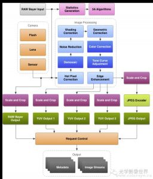

#  ISP 图像处理器

做为拍照手机的核心模块之一，camera sensor效果的调整，涉及到众多的参数，如果对基本的光学原理及sensor软/硬件对图像处理的原理能有深入的理解和把握的话，对我们的工作将会起 到事半功倍的效果。否则，缺乏了理论的指导，只能是凭感觉和经验去碰，往往无法准确的把握问题的关键，不能掌握sensor调试的核心技术，无法根本的解 决问题。所以，这里笔者结合自己出于对摄影的爱好所学习的一些图像处理相关的原理，试图通过分析一些与Sensor图像处理相关的因素，和大家分享一下自己的一些理解，共同探讨，共同学习进步。

ISP(Image Signal Processor)，即图像信号处理器，用于处理图像信号传感器输出的图像信号。它在相机系统中占有核心主导的地位，是构成相机的重要设备。

##  1 主要内部构成

如下图所示，ISP 内部包含 CPU、SUP IP、IF 等设备，事实上，可以认为 ISP 是一个 SOC，可以运行各种算法程序，实时处理图像信号。

ISP 架构

### 1.CPU
CPU 即中央处理器，可以运行 AF、LSC 等各种图像处理算法，控制外围设备。现代的 ISP 内部的 CPU 一般都是 ARM Cortex-A 系列的，例如 Cortex-A5、Cortex-A7。

2.SUB IP
SUB IP 是各种功能模块的通称，对图像进行各自专业的处理。常见的 SUB IP 如 DIS、CSC、VRA 等。

3.图像传输接口
图像传输接口主要分两种，并口 ITU 和串口 CSI。CSI 是 MIPI CSI 的简称，鉴于 MIPI CSI 的诸多优点，在手机相机领域，已经广泛使用 MIPI-CSI 接口传输图像数据和各种自定义数据。外置 ISP 一般包含 MIPI-CSIS 和 MIPI-CSIM 两个接口。内置 ISP 一般只需要 MIPI-CSIS 接口。

4.通用外围设备
通用外围设备指 I2C、SPI、PWM、UART、WATCHDOG 等。ISP 中包含 I2C 控制器，用于读取 OTP 信息，控制 VCM等。对于外置 ISP，ISP 本身还是 I2C 从设备。AP 可以通过 I2C 控制 ISP 的工作模式，获取其工作状态等。

## 主要功能特性

ISP 作为图像处理的核心器件，拥有十分重要的功能，下图展示了 ISP 处理图像数据的基本流程。
ISP 处理流程

下面针对 ISP 的主要功能特性进行下介绍。

1.DEMOSAIC

​    DEMOSAIC 是 ISP 的主要功能之一。SENSOR 的像素点上覆盖着 CFA，光线通过 CFA 后照射到像素上。CFA 由 R、G、B 三种颜色的遮光罩组成，每种遮光罩只允许一种颜色通过，因此每个像素输出的信号只包含 R、G、B 三者 中的一种颜色信息。SENSOR 输出的这种数据就是 BAYER 数据，即通常所说的 RAW 数据。显而易见，RAW 数据所反映的颜色信息不是真实的颜色信息。DEMOSAIC 就是通过插值算法将将每个像素所代表的真实颜色计算出来。

2.FOCUS

​    根据光学知识，景物在传感器上成像最清晰时处于合焦平面上。通过更改 LENS 的位置，使得景物在传感器上清晰的成像，是 ISP FOCUS 功能所需要完成的任务。FOCUS 分为手动和自动两种模式。ISP 可以运行 CONTRAST AF、PDAF、LASER AF 等算法实现自动对焦。

3.EXPOSURE

​    曝光。EXPOSURE 主要影响图像的明暗程度。ISP 需要实现 AE 功能，通过控制曝光程度，使得图像亮度适宜。

4.WB

​    白平衡。白平衡与色温相关，用于衡量图像的色彩真实性和准确性。ISP需要实现 AWB 功能，力求在各种复杂场景下都能精确的还原物体本来的颜色。

5.LSC

​    用于消除图像周边和图片中心的不一致性，包含亮度和色度两方面。ISP 需要借助 OTP 中的校准数据完成 LSC 功能。

6.GAMMA CORRECTION

​    伽玛校正。传感器对光线的响应和人眼对光线的响应是不同的。伽玛校正就是使得图像看起来符合人眼的特性。

7.CROP/RESIZE

​    图像剪裁，即改变图像的尺寸。可用于输出不同分辨率的图像。

8.VRA

​    视觉识别。用于识别特定的景物，例如人脸识别，车牌识别。ISP 通过各种 VRA 算法，准确的识别特定的景物。

9.DRC

​    动态范围校正。动态范围即图像的明暗区间。DRC 可以使得暗处的景物不至于欠曝，而亮处的景物不至于过曝。ISP需要支持 DRC 功能。

10.CSC

​    颜色空间转换。例如，ISP 会将 RGB 信号转化为 YUV 信号输出。

11.IS

​    图像稳定。IS 的主要作用是使得图像不要因为手持时轻微的抖动而模糊不清。IS 有很多种，例如 OIS、DIS、EIS。 ISP 可以实现 DIS 和 EIS。

事实上，ISP 除了上面提到的主要功能外，还需要支持 DENOISE、CONTRAST、SATURATION、SHARPNESS 等调整功能。

## 控制方式

这里所说的控制方式是 AP 对 ISP 的操控方式。

1.I2C/SPI

​    这一般是外置 ISP 的做法。SPI 一般用于下载固件、I2C 一般用于寄存器控制。在内核的 ISP 驱动中，外置 ISP 一般是实现为 I2C 设备，然后封装成 V4L2-SUBDEV。

2.MEM MAP

​    这一般是内置 ISP 的做法。将 ISP 内部的寄存器地址空间映射到内核地址空间。

3.MEM SHARE

​    这也是内置 ISP 的做法。AP 这边分配内存，然后将内存地址传给 ISP，二者实际上共享同一块内存。因此 AP 对这段共享内存的操作会实时反馈到 ISP 端。

## ISP 架构方案

上文多次提到外置 ISP 和内置 ISP，这实际上是 ISP 的架构方案。

### 外置 ISP 架构

外置 ISP 架构是指在 AP 外部单独布置 ISP 芯片用于图像信号处理。外置 ISP 的架构图一般如下所示：

外置 ISP 架构图

外置 ISP 架构的优点主要有：

1.能够提供更优秀的图像质量

​    在激烈的市场竞争下，能够存活到现在的外置 ISP 生产厂商在此领域一般都有很深的造诣，积累了丰富的影像质量调试经验，能够提供比内置 ISP 更优秀的性能和效果。因此，选用优质的外置 ISP 能提供专业而且优秀的图像质量。

2.能够支援更丰富的设计规划

​    外置 ISP 的选型基本不受 AP 的影响，因此很多手机厂家（比如美图秀秀手机、魅族、华为等）都是从从各个优秀 ISP芯片供应商的众多产品中甄选最合适的器件，从而设计出更多优秀的产品。

3.能够实现产品的差异化

​    内置 ISP 是封装在 AP 内部的，是和 AP 紧密的联系在一起，如果 AP 相同，那么 ISP 也就是一样的。因此基于同样AP 生产出来的手机，其 ISP 的性能也是一样的，可供调教的条件也是固定的，这样就不利于实现产品的差异化。而如果选择外置 ISP，那么同一颗 AP，可以搭配不同型号的 ISP，这样可以实现产品的差异化，为给用户提供更丰富和优质的产品。

外置 ISP 架构的缺点主要有：

1.成本价格高

   外置 ISP 需要单独购买，其售价往往不菲，而且某些特殊功能还需要额外支付费用。使用外置 ISP，需要进行额外的原理图设计和 LAYOUT，需要使用额外的元器件。

2.开发周期长

​    外置 ISP 驱动的设计需要多费精力和时间。使用外置 ISP 时，AP 供应商提供的 ISP 驱动就无法使用，需要额外设计编写外置 ISP 驱动。另外，为了和 AP 进行完美的搭配，将效果最大化，也往往需要付出更多的调试精力。上文也提到，使用外置 ISP，需要进行额外的原理图设计和 LAYOUT，需要使用额外的元器件，这也是需要花费时间进行处理的。

### 内置 ISP 架构

内置 ISP 架构是指在 AP 内部嵌入了 ISP IP，直接使用 AP 内部的 ISP 进行图像信号处理。 内置 ISP 的架构图一般如下所示：

内置 ISP 架构图

内置 ISP 架构的优点主要有：

1.能降低成本价格

​    内置 ISP 内嵌在 AP 内部，因此无需像外置 ISP 一样需要额外购买，且不占 PCB 空间，无需单独为其设计外围电路，这样就能节省 BOM，降低成本。鉴于大多数用户在选购手机时会将价格因素放在重要的位置，因此降低成本能有效的降低终端成品价格，有利于占领市场。

2.能提高产品的上市速度

​     内置 ISP 和 AP 紧密结合，无需进行原理图设计和 LAYOUT 设计，因此可以减小开发周期，加快产品上市的速度。

3.能降低开发难度

​    如果使用内置 ISP，那么 AP 供应商能在前期提供相关资料，驱动开发人员可以有充足的时间熟悉相关资料，而且不会存在软件版本适配问题，也不存在平台架构兼容性问题。但是，如果使用外置 ISP，那么 ISP 供应商往往都不能提供针对某个平台的代码/资料，而且一般都存在软件版本兼容问题，这就需要驱动开发人员付出额的经历和时间。

​    使用内置 ISP 当然也有相应的不足之处，具体见上文的分析，这里就不赘述了。

事实上，鉴于 ISP 的重要性，为了推广其 AP，提高其 AP 竞争力，现在 AP 内置的 ISP 也越来越强大，其性能足以满足手机市场的需求。再加上其一系列优点，现在使用内置 ISP 方案的手机越来越多。

## Camera效果问题评估

摄像头效果评测都有哪些？

# 2 ISP和摄像头工原理

## 1摄像头的基本知识

**1：摄像头结构**

常用的结构如下图所示，主要包括镜头，基座，[传感器](http://www.hqchip.com/app/835)以及[PCB](http://bbs.elecfans.com/zhuti_pads_1.html)部分。

**2：摄像头模组的种类**

CCM分为4种：FF、MF、AF和ZOOM。FF（Fix Focus），定焦摄像头，是国内目前用的最多摄像头，用于30万和130万的[手机](http://bbs.elecfans.com/zhuti_tel_1.html)产品。MF（[micro](http://www.elecfans.com/tags/MicroLED/) Focus），两档变焦摄像头，主要用于近景拍照，如带有名片识别以及条形码识别的手机上，用于130万和200万的手机产品。AF（Auto Focus），自动变焦摄像头，主要用于高像素手机，同时具有MF的功能，用于200万和300万的手机产品。Zoom（Auto Zoom），自动数码变焦摄像头，主要用于相机手机，类似于相机影像的品质，用于300万以上的手机产品。

**3：摄像头的工作原理**

景物(SCE)通过镜头（LENS）生成的[光学](http://www.hqchip.com/app/960)图像投射到图像传感器(Sensor)表面上，然后转为电信号，经过A/D（模数转换）转换后变为数字图像信号，再送到数字信号处理[芯片](http://www.hqchip.com/?u=999)（DSP）中加工处理，再通过[I/O](http://www.hqchip.com/app/1010)[接口](http://www.hqchip.com/app/1039)[传输](http://www.elecfans.com/tags/数据传输/)到CPU中处理，通过[display](http://www.elecfans.com/tags/Display/)就可以看到图像了。 

## 2 Sensor的基本知识

**1：Sensor的工作原理**

Lens的作用是滤去不可见光，让可见光进入，并投射到Sensor上。Sensor的工作原理：光照--〉电荷--〉弱电流--〉RGB数字信号波形--〉Y[UV](http://www.hqchip.com/app/104)数字信号信号

**2：Sensor 的分类**

[元件](http://bbs.elecfans.com/zhuti_yuanjian_1.html)类型不同分为：CCD 和CMOS。CCD（Charge Coup[LED](http://www.hqchip.com/app/957) Device，），一般是用于摄影摄像方面的高端技术元件。CCD的优点是灵敏度高，[噪音](http://www.elecfans.com/tags/噪音/)小，信噪比大。但是生产工艺复杂、成本高、功耗高。CMOS（Complementary Metal-Oxide Semiconductor，金属氧化物[半导体](http://bbs.elecfans.com/zhuti_bandaoti_1.html)元件）应用于较低影像品质的产品中。CMOS的优点是集成度高、功耗低(不到CCD的1/3)、成本低。但是噪音比较大、灵敏度较低。对于CMOS来说，具有便于大规模生产，且速度快、成本较低，将是数字相机关键器件的发展方向。CMOS感光器以已经有逐渐取代CCD感光器的趋势，并有希望在不久的将来成为主流的感光器。

**3：Sensor的封装形式**

Sensor的封装形式有两种：CSP和DICE。在模组厂商加工制造中，CSP所对应的制程是[SMT](http://smt.hqchip.com/)，DICE所对应的制程是COB。

**4：常用的Sensor的厂商**

厂商有[omnivision](http://www.elecfans.com/tags/omnivision/)、Siliconfile、Samsung 、SONY、Ap[ti](http://bbs.elecfans.com/zhuti_715_1.html)na等

**5：Sensor 的基本框图**

Sensor 的框图如图所示（以 O[v2](http://www.elecfans.com/tags/V2X/)718 为例）：

**三：ISP** **的基本知识**

**1：ISP的定义**

ISP (Image Signal Processor)，即图像处理，主要作用是对前端图像传感器输出的信号做后期处理，主要功能有线性纠正、噪声去除、坏点去除、内插、白平衡、自动曝光控制等，依赖于ISP才能在不同的光学条件下都能较好的还原现场细节。

**2：ISP的工作原理**

从 Sensor 端过来的图像是 Bayer 图像，经过黑电平补偿、镜头矫正、坏像素矫正、颜色插值、Bayer 噪声去除、白平衡、色彩矫正、Gamma 矫正、色彩空间转换（ RGB 转换为 YUV ）、在 YUV 色彩空间上彩噪去除与边缘加强、色彩与对比度加强，中间还要进行自动曝光控制等，然后输出 YUV（ 或者 RGB ）格式的数据，再通过 I/O 接口传输到 CPU 中处理。（以 OV495 为例）

**四：ISP 图像处理算法**

### **1：AE ( Automatic Exposure )**

自动曝光是指根据光线的强弱自动调整曝光量，防止曝光过度或者不足，在不同的照明条件和场景中实现欣赏亮度级别或所谓的目标亮度级别，从而捕获的视频或图像既不太暗也不太亮。

### **2：HDR ( High-Dynamic Range Imaging ) 高[动态范围](http://www.elecfans.com/tags/动态范围/)成像**

Sensor的动态范围就是Sensor在一幅图像里能够同时体现高光和阴影部分内容的能力。在自然界的真实情况，有些场景的动态范围要大于100 dB，人眼的动态范围可以达到100dB。高动态范围成像的目的就是要正确地表示真实世界中的亮度范围。适合场景：比较适合在具有背光的高对比度场景下使用如：日落、室内窗户，这样能使明处的景物不致过曝，而使得暗处的景物不致欠曝。

###  **3：AWB ( Auto White Balance ) 自动白平衡**

白平衡就是针对不同光线条件下，通过找到图像中的白块，然后调整 R/G/B 的比例抵消[偏色](http://www.elecfans.com/tags/偏色/)，把白色物体还原成白色物体，使其更接近人眼的视觉习惯。

### **4：CCM ( Color Correction Matrix ) 颜色校正**

颜色校正主要为了校正在滤光板处各颜色块之间的颜色渗透带来的颜色误差。一般颜色校正的过程是首先利用该图像传感器拍摄到的图像与标准图像相比较，以此来计算得到一个校正矩阵。该矩阵就是该图像传感器的颜色校正矩阵。在该图像传感器应用的过程中，及可以利用该矩阵对该图像传感器所拍摄的所有图像来进行校正，以获得最接近于物体真实颜色的图像。

###  **5：DNS ( Denoise ) [去噪](http://www.elecfans.com/tags/去噪/)**

使用 CMOS Sensor 获取图像，光照程度和传感器问题是生成图像中大量噪声的主要因素。同时，当信号经过 ADC 时，又会引入其他一些噪声。这些噪声会使图像整体变得模糊，而且丢失很多细节，所以需要对图像进行去噪处理空间去噪传统的方法有均值滤波、高斯滤波

###  **6：BLC ( Black Level Correction ) 黑电平校正**

Black Level 是用来定义图像数据为 0 时对应的信号电平。由于暗电流的影响，传感器出来的实际原始数据并不是我们需要的黑平衡。为减少暗电流对图像信号的影响，采用的方法是从已获得的图像信号中减去参考暗电流信号。一般情况下,在传感器中，实际像素要比有效像素多,像素区头几行作为不感光区，用于自动黑电平校正,其平均值作为校正值，然后在下面区域的像素都减去此矫正值，那么就可以将黑电平矫正过来了。

###  **7：LSC ( Lens Shade Correction ) 镜头阴影校正**

由于相机在成像距离较远时，随着视场角慢慢增大，能够通过照相机镜头的斜光束将慢慢减少，从而使得获得的图像中间比较亮，边缘比较暗，这个现象就是光学系统中的渐晕。由于渐晕现象带来的图像亮度不均会影响后续处理的准确性。因此从图像传感器输出的数字信号必须先经过镜头矫正功能块来消除渐晕给图像带来的影响。

