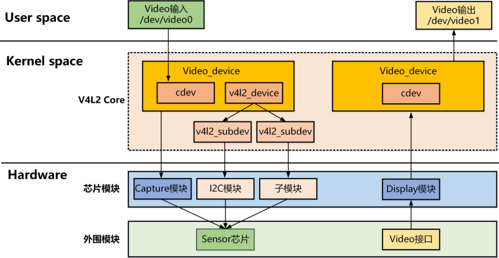
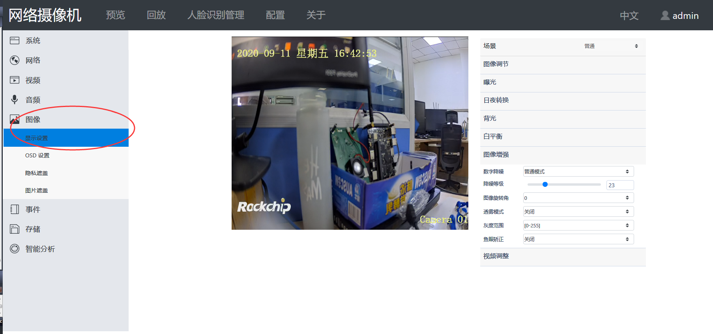

## OS04A10


```
cw@SYS3:~/sdk/rv1109/kernel ag os04a
drivers/media/i2c/Makefile
71:obj-(CONFIG_VIDEO_OS04A10) += os04a10.o

drivers/media/i2c/Kconfig
771:config VIDEO_OS04A10
772:    tristate "OmniVision OS04A10 sensor support"
778:      OS04A10 camera.

drivers/media/i2c/os04a10.c
3: * os04a10 driver
47:#define OS04A10_XVCLK_FREQ           24000000
50:#define OS04A10_REG_CHIP_ID          0x300a
52:#define OS04A10_REG_CTRL_MODE                0x0100
53:#define OS04A10_MODE_SW_STANDBY              0x0
54:#define OS04A10_MODE_STREAMING               BIT(0)
56:#define      OS04A10_EXPOSURE_MIN            2
57:#define      OS04A10_EXPOSURE_STEP           1
58:#define OS04A10_VTS_MAX                      0xffff
60:#define OS04A10_REG_EXP_LONG_H               0x3501
61:#define OS04A10_REG_EXP_MID_H                0x3541
62:#define OS04A10_REG_EXP_VS_H         0x3581
64:#define OS04A10_REG_HCG_SWITCH               0x376C
65:#define OS04A10_REG_AGAIN_LONG_H     0x3508
66:#define OS04A10_REG_AGAIN_MID_H              0x3548
67:#define OS04A10_REG_AGAIN_VS_H               0x3588
68:#define OS04A10_REG_DGAIN_LONG_H     0x350A
69:#define OS04A10_REG_DGAIN_MID_H              0x354A
70:#define OS04A10_REG_DGAIN_VS_H               0x358A
71:#define OS04A10_GAIN_MIN             0x10
72:#define OS04A10_GAIN_MAX             0xF7C
73:#define OS04A10_GAIN_STEP            1
74:#define OS04A10_GAIN_DEFAULT         0x10
76:#define OS04A10_GROUP_UPDATE_ADDRESS 0x3208
77:#define OS04A10_GROUP_UPDATE_START_DATA      0x00
78:#define OS04A10_GROUP_UPDATE_END_DATA        0x10
79:#define OS04A10_GROUP_UPDATE_END_LAUNCH      0xA0
81:#define OS04A10_SOFTWARE_RESET_REG   0x0103
83:#define OS04A10_FETCH_MSB_BYTE_EXP(VAL)      (((VAL) >> 8) & 0xFF)   /* 8 Bits /
84:#define OS04A10_FETCH_LSB_BYTE_EXP(VAL)      ((VAL) & 0xFF)  / 8 Bits */
86:#define OS04A10_FETCH_LSB_GAIN(VAL)  (((VAL) << 4) & 0xf0)
87:#define OS04A10_FETCH_MSB_GAIN(VAL)  (((VAL) >> 4) & 0x1f)
89:#define OS04A10_REG_TEST_PATTERN     0x5080
90:#define OS04A10_TEST_PATTERN_ENABLE  0x80
91:#define OS04A10_TEST_PATTERN_DISABLE 0x0
93:#define OS04A10_REG_VTS                      0x380e
97:#define OS04A10_REG_VALUE_08BIT              1
98:#define OS04A10_REG_VALUE_16BIT              2
99:#define OS04A10_REG_VALUE_24BIT              3
101:#define OS04A10_LANES                       4
106:#define OS04A10_NAME                        "os04a10"
112:static const char * const os04a10_supply_names[] = {
118:#define OS04A10_NUM_SUPPLIES ARRAY_SIZE(os04a10_supply_names)
120:#define OS04A10_FLIP_REG            0x3820
124:enum os04a10_max_pad {
137:struct os04a10_mode {
150:struct os04a10 {
155:    struct regulator_bulk_data supplies[OS04A10_NUM_SUPPLIES];
177:    const struct os04a10_mode *cur_mode;
194:#define to_os04a10(sd) container_of(sd, struct os04a10, subdev)
199:static const struct regval os04a10_global_regs[] = {
436:static const struct regval os04a10_linear10bit_2688x1520_regs[] = {
507:static const struct regval os04a10_linear12bit_2688x1520_regs[] = {
578:static const struct regval os04a10_hdr10bit_2688x1520_regs[] = {
651:static const struct regval os04a10_hdr12bit_2688x1520_regs[] = {
722:static const struct regval os04a10_hdr12bit_2560x1440_regs[] = {
805:static const struct os04a10_mode supported_modes[] = {
817:            .reg_list = os04a10_linear10bit_2688x1520_regs,
834:            .reg_list = os04a10_hdr10bit_2688x1520_regs,
852:            .reg_list = os04a10_linear12bit_2688x1520_regs,
867:            .reg_list = os04a10_hdr12bit_2688x1520_regs,
885:            .reg_list = os04a10_hdr12bit_2560x1440_regs,
899:static const char * const os04a10_test_pattern_menu[] = {
907:static int os04a10_power_on(struct os04a10 *os04a10);
910:static int os04a10_write_reg(struct i2c_client *client, u16 reg,
938:static int os04a10_write_array(struct i2c_client *client,
945:            ret |= os04a10_write_reg(client, regs[i].addr,
946:                    OS04A10_REG_VALUE_08BIT, regs[i].val);
952:static int os04a10_read_reg(struct i2c_client *client,
988:static int os04a10_get_reso_dist(const struct os04a10_mode *mode,
995:static const struct os04a10_mode *
996:os04a10_find_best_fit(struct os04a10 *os04a10, struct v4l2_subdev_format *fmt)
1004:   for (i = 0; i < os04a10->cfg_num; i++) {
1005:           dist = os04a10_get_reso_dist(&supported_modes[i], framefmt);
1016:static int os04a10_set_fmt(struct v4l2_subdev *sd,
1020:   struct os04a10 *os04a10 = to_os04a10(sd);
1021:   const struct os04a10_mode *mode;
1026:   mutex_lock(&os04a10->mutex);
1028:   mode = os04a10_find_best_fit(os04a10, fmt);
1037:           mutex_unlock(&os04a10->mutex);
1041:           os04a10->cur_mode = mode;
1043:           v4l2_ctrl_modify_range(os04a10->hblank, h_blank,
1046:           v4l2_ctrl_modify_range(os04a10->vblank, vblank_def,
1047:                                    OS04A10_VTS_MAX - mode->height,
1071:           v4l2_ctrl_s_ctrl_int64(os04a10->pixel_rate,
1073:           v4l2_ctrl_s_ctrl(os04a10->link_freq,
1077:   mutex_unlock(&os04a10->mutex);
1082:static int os04a10_get_fmt(struct v4l2_subdev *sd,
1086:   struct os04a10 *os04a10 = to_os04a10(sd);
1087:   const struct os04a10_mode *mode = os04a10->cur_mode;
1089:   mutex_lock(&os04a10->mutex);
1094:           mutex_unlock(&os04a10->mutex);
1107:   mutex_unlock(&os04a10->mutex);
1112:static int os04a10_enum_mbus_code(struct v4l2_subdev *sd,
1116:   struct os04a10 *os04a10 = to_os04a10(sd);
1120:   code->code = os04a10->cur_mode->bus_fmt;
1125:static int os04a10_enum_frame_sizes(struct v4l2_subdev *sd,
1129:   struct os04a10 *os04a10 = to_os04a10(sd);
1131:   if (fse->index >= os04a10->cfg_num)
1145:static int os04a10_enable_test_pattern(struct os04a10 *os04a10, u32 pattern)
1151:           val = ((pattern - 1) << 2) | OS04A10_TEST_PATTERN_ENABLE;
1153:           val = OS04A10_TEST_PATTERN_DISABLE;
1154:   ret = os04a10_write_reg(os04a10->client, OS04A10_REG_TEST_PATTERN,
1155:                           OS04A10_REG_VALUE_08BIT, val);
1156:   ret |= os04a10_write_reg(os04a10->client, OS04A10_REG_TEST_PATTERN + 0x40,
1157:                           OS04A10_REG_VALUE_08BIT, val);
1161:static int os04a10_g_frame_interval(struct v4l2_subdev *sd,
1164:   struct os04a10 *os04a10 = to_os04a10(sd);
1165:   const struct os04a10_mode *mode = os04a10->cur_mode;
1167:   mutex_lock(&os04a10->mutex);
1169:   mutex_unlock(&os04a10->mutex);
1174:static int os04a10_g_mbus_config(struct v4l2_subdev *sd,
1177:   struct os04a10 *os04a10 = to_os04a10(sd);
1178:   const struct os04a10_mode *mode = os04a10->cur_mode;
1182:           val = 1 << (OS04A10_LANES - 1) |
1186:           val = 1 << (OS04A10_LANES - 1) |
1197:static void os04a10_get_module_inf(struct os04a10 *os04a10,
1201:   strlcpy(inf->base.sensor, OS04A10_NAME, sizeof(inf->base.sensor));
1202:   strlcpy(inf->base.module, os04a10->module_name,
1204:   strlcpy(inf->base.lens, os04a10->len_name, sizeof(inf->base.lens));
1207:static int os04a10_set_hdrae(struct os04a10 *os04a10,
1222:   if (!os04a10->has_init_exp && !os04a10->streaming) {
1223:           os04a10->init_hdrae_exp = *ae;
1224:           os04a10->has_init_exp = true;
1225:           dev_dbg(&os04a10->client->dev, "os04a10 don't stream, record exp for hdr!\n");
1237:   dev_dbg(&os04a10->client->dev,
1243:   if (os04a10->cur_mode->hdr_mode == HDR_X2) {
1252:   ret = os04a10_read_reg(os04a10->client, OS04A10_REG_HCG_SWITCH,
1253:                          OS04A10_REG_VALUE_08BIT, &gain_switch);
1255:   if (os04a10->long_hcg && l_cg_mode == GAIN_MODE_LCG) {
1257:           os04a10->long_hcg = false;
1259:   } else if (!os04a10->long_hcg && l_cg_mode == GAIN_MODE_HCG) {
1261:           os04a10->long_hcg = true;
1264:   if (os04a10->middle_hcg && m_cg_mode == GAIN_MODE_LCG) {
1266:           os04a10->middle_hcg = false;
1268:   } else if (!os04a10->middle_hcg && m_cg_mode == GAIN_MODE_HCG) {
1270:           os04a10->middle_hcg = true;
1281:   if (os04a10->cur_mode->hdr_mode == HDR_X3 && s_a_gain > 248) {
1286:   ret |= os04a10_write_reg(os04a10->client,
1287:           OS04A10_GROUP_UPDATE_ADDRESS,
1288:           OS04A10_REG_VALUE_08BIT,
1289:           OS04A10_GROUP_UPDATE_START_DATA);
1290:   ret |= os04a10_write_reg(os04a10->client,
1291:           OS04A10_REG_AGAIN_LONG_H,
1292:           OS04A10_REG_VALUE_16BIT,
1294:   ret |= os04a10_write_reg(os04a10->client,
1295:           OS04A10_REG_DGAIN_LONG_H,
1296:           OS04A10_REG_VALUE_24BIT,
1298:   ret |= os04a10_write_reg(os04a10->client,
1299:           OS04A10_REG_EXP_LONG_H,
1300:           OS04A10_REG_VALUE_16BIT,
1302:   ret |= os04a10_write_reg(os04a10->client,
1303:           OS04A10_REG_AGAIN_MID_H,
1304:           OS04A10_REG_VALUE_16BIT,
1306:   ret |= os04a10_write_reg(os04a10->client,
1307:           OS04A10_REG_DGAIN_MID_H,
1308:           OS04A10_REG_VALUE_24BIT,
1310:   ret |= os04a10_write_reg(os04a10->client,
1311:           OS04A10_REG_EXP_MID_H,
1312:           OS04A10_REG_VALUE_16BIT,
1314:   if (os04a10->cur_mode->hdr_mode == HDR_X3) {
1316:           ret |= os04a10_write_reg(os04a10->client,
1317:                   OS04A10_REG_AGAIN_VS_H,
1318:                   OS04A10_REG_VALUE_16BIT,
1320:           ret |= os04a10_write_reg(os04a10->client,
1321:                   OS04A10_REG_EXP_VS_H,
1322:                   OS04A10_REG_VALUE_16BIT,
1324:           ret |= os04a10_write_reg(os04a10->client,
1325:                   OS04A10_REG_DGAIN_VS_H,
1326:                   OS04A10_REG_VALUE_24BIT,
1328:           if (os04a10->short_hcg && s_cg_mode == GAIN_MODE_LCG) {
1330:                   os04a10->short_hcg = false;
1332:           } else if (!os04a10->short_hcg && s_cg_mode == GAIN_MODE_HCG) {
1334:                   os04a10->short_hcg = true;
1339:           ret |= os04a10_write_reg(os04a10->client,
1340:                   OS04A10_REG_HCG_SWITCH,
1341:                   OS04A10_REG_VALUE_08BIT,
1343:   ret |= os04a10_write_reg(os04a10->client,
1344:           OS04A10_GROUP_UPDATE_ADDRESS,
1345:           OS04A10_REG_VALUE_08BIT,
1346:           OS04A10_GROUP_UPDATE_END_DATA);
1347:   ret |= os04a10_write_reg(os04a10->client,
1348:           OS04A10_GROUP_UPDATE_ADDRESS,
1349:           OS04A10_REG_VALUE_08BIT,
1350:           OS04A10_GROUP_UPDATE_END_LAUNCH);
1354:static int os04a10_set_conversion_gain(struct os04a10 *os04a10, u32 *cg)
1357:   struct i2c_client *client = os04a10->client;
1362:   dev_dbg(&os04a10->client->dev, "set conversion gain %d\n", cur_cg);
1363:   if (os04a10->is_thunderboot && rkisp_tb_get_state() == RKISP_TB_NG) {
1364:           os04a10->is_thunderboot = false;
1365:           os04a10->is_thunderboot_ng = true;
1366:           os04a10_power_on(os04a10);
1369:   ret = os04a10_read_reg(client,
1370:           OS04A10_REG_HCG_SWITCH,
1371:           OS04A10_REG_VALUE_08BIT,
1373:   if (os04a10->long_hcg && cur_cg == GAIN_MODE_LCG) {
1376:           os04a10->long_hcg = false;
1377:   } else if (!os04a10->long_hcg && cur_cg == GAIN_MODE_HCG) {
1380:           os04a10->long_hcg = true;
1382:   ret |= os04a10_write_reg(client,
1383:           OS04A10_GROUP_UPDATE_ADDRESS,
1384:           OS04A10_REG_VALUE_08BIT,
1385:           OS04A10_GROUP_UPDATE_START_DATA);
1387:           ret |= os04a10_write_reg(client,
1388:                   OS04A10_REG_HCG_SWITCH,
1389:                   OS04A10_REG_VALUE_08BIT,
1391:   ret |= os04a10_write_reg(client,
1392:           OS04A10_GROUP_UPDATE_ADDRESS,
1393:           OS04A10_REG_VALUE_08BIT,
1394:           OS04A10_GROUP_UPDATE_END_DATA);
1395:   ret |= os04a10_write_reg(client,
1396:           OS04A10_GROUP_UPDATE_ADDRESS,
1397:           OS04A10_REG_VALUE_08BIT,
1398:           OS04A10_GROUP_UPDATE_END_LAUNCH);
1411:   struct os04a10 *os04a10 = to_os04a10(sd);
1417:           os04a10_set_conversion_gain(os04a10, &status);
1443:static long os04a10_ioctl(struct v4l2_subdev *sd, unsigned int cmd, void *arg)
1445:   struct os04a10 *os04a10 = to_os04a10(sd);
1452:           return os04a10_set_hdrae(os04a10, arg);
1455:           w = os04a10->cur_mode->width;
1456:           h = os04a10->cur_mode->height;
1457:           for (i = 0; i < os04a10->cfg_num; i++) {
1461:                           os04a10->cur_mode = &supported_modes[i];
1465:           if (i == os04a10->cfg_num) {
1466:                   dev_err(&os04a10->client->dev,
1471:                   w = os04a10->cur_mode->hts_def - os04a10->cur_mode->width;
1472:                   h = os04a10->cur_mode->vts_def - os04a10->cur_mode->height;
1473:                   __v4l2_ctrl_modify_range(os04a10->hblank, w, w, 1, w);
1474:                   __v4l2_ctrl_modify_range(os04a10->vblank, h,
1475:                           OS04A10_VTS_MAX - os04a10->cur_mode->height,
1477:                   dev_info(&os04a10->client->dev,
1479:                           os04a10->cur_mode->hdr_mode);
1483:           os04a10_get_module_inf(os04a10, (struct rkmodule_inf *)arg);
1488:           hdr_cfg->hdr_mode = os04a10->cur_mode->hdr_mode;
1491:           ret = os04a10_set_conversion_gain(os04a10, (u32 *)arg);
1502:static long os04a10_compat_ioctl32(struct v4l2_subdev *sd,
1521:           ret = os04a10_ioctl(sd, cmd, inf);
1535:                   ret = os04a10_ioctl(sd, cmd, cfg);
1545:           ret = os04a10_ioctl(sd, cmd, hdr);
1559:                   ret = os04a10_ioctl(sd, cmd, hdr);
1571:                   ret = os04a10_ioctl(sd, cmd, hdrae);
1577:                   ret = os04a10_ioctl(sd, cmd, &cg);
1588:static int os04a10_init_conversion_gain(struct os04a10 *os04a10)
1591:   struct i2c_client *client = os04a10->client;
1594:   ret = os04a10_read_reg(client,
1595:           OS04A10_REG_HCG_SWITCH,
1596:           OS04A10_REG_VALUE_08BIT,
1599:   ret |= os04a10_write_reg(client,
1600:           OS04A10_REG_HCG_SWITCH,
1601:           OS04A10_REG_VALUE_08BIT,
1603:   os04a10->long_hcg = false;
1604:   os04a10->middle_hcg = false;
1605:   os04a10->short_hcg = false;
1609:static int __os04a10_start_stream(struct os04a10 *os04a10)
1613:   if (!os04a10->is_thunderboot) {
1614:           ret = os04a10_write_array(os04a10->client, os04a10_global_regs);
1616:                   dev_err(&os04a10->client->dev,
1621:           ret = os04a10_write_array(os04a10->client, os04a10->cur_mode->reg_list);
1626:   ret = os04a10_init_conversion_gain(os04a10);
1631:   ret = __v4l2_ctrl_handler_setup(&os04a10->ctrl_handler);
1634:   if (os04a10->has_init_exp && os04a10->cur_mode->hdr_mode != NO_HDR) {
1635:           ret = os04a10_ioctl(&os04a10->subdev, PREISP_CMD_SET_HDRAE_EXP, &os04a10->init_hdrae_exp);
1637:                   dev_err(&os04a10->client->dev,
1642:   return os04a10_write_reg(os04a10->client, OS04A10_REG_CTRL_MODE,
1643:           OS04A10_REG_VALUE_08BIT, OS04A10_MODE_STREAMING);
1646:static int __os04a10_stop_stream(struct os04a10 *os04a10)
1648:   os04a10->has_init_exp = false;
1649:   if (os04a10->is_thunderboot)
1650:           os04a10->is_first_streamoff = true;
1651:   return os04a10_write_reg(os04a10->client, OS04A10_REG_CTRL_MODE,
1652:           OS04A10_REG_VALUE_08BIT, OS04A10_MODE_SW_STANDBY);
1655:static int os04a10_s_stream(struct v4l2_subdev *sd, int on)
1657:   struct os04a10 *os04a10 = to_os04a10(sd);
1658:   struct i2c_client *client = os04a10->client;
1661:   mutex_lock(&os04a10->mutex);
1663:   if (on == os04a10->streaming)
1667:           if (os04a10->is_thunderboot && rkisp_tb_get_state() == RKISP_TB_NG) {
1668:                   os04a10->is_thunderboot = false;
1669:                   __os04a10_power_on(os04a10);
1677:           ret = __os04a10_start_stream(os04a10);
1684:           __os04a10_stop_stream(os04a10);
1688:   os04a10->streaming = on;
1691:   mutex_unlock(&os04a10->mutex);
1696:static int os04a10_s_power(struct v4l2_subdev *sd, int on)
1698:   struct os04a10 *os04a10 = to_os04a10(sd);
1699:   struct i2c_client *client = os04a10->client;
1702:   mutex_lock(&os04a10->mutex);
1705:   if (os04a10->power_on == !!on)
1715:           if (!os04a10->is_thunderboot) {
1716:                   ret |= os04a10_write_reg(os04a10->client,
1717:                                            OS04A10_SOFTWARE_RESET_REG,
1718:                                            OS04A10_REG_VALUE_08BIT,
1723:           os04a10->power_on = true;
1726:           os04a10->power_on = false;
1730:   mutex_unlock(&os04a10->mutex);
1736:static inline u32 os04a10_cal_delay(u32 cycles)
1738:   return DIV_ROUND_UP(cycles, OS04A10_XVCLK_FREQ / 1000 / 1000);
1741:static int __os04a10_power_on(struct os04a10 *os04a10)
1745:   struct device *dev = &os04a10->client->dev;
1747:   if (os04a10->is_thunderboot)
1750:   if (!IS_ERR_OR_NULL(os04a10->pins_default)) {
1751:           ret = pinctrl_select_state(os04a10->pinctrl,
1752:                                      os04a10->pins_default);
1756:   ret = clk_set_rate(os04a10->xvclk, OS04A10_XVCLK_FREQ);
1759:   if (clk_get_rate(os04a10->xvclk) != OS04A10_XVCLK_FREQ)
1761:   ret = clk_prepare_enable(os04a10->xvclk);
1766:   if (!IS_ERR(os04a10->reset_gpio))
1767:           gpiod_direction_output(os04a10->reset_gpio, 1);
1769:   ret = regulator_bulk_enable(OS04A10_NUM_SUPPLIES, os04a10->supplies);
1775:   if (!IS_ERR(os04a10->reset_gpio))
1776:           gpiod_direction_output(os04a10->reset_gpio, 0);
1779:   if (!IS_ERR(os04a10->pwdn_gpio))
1780:           gpiod_direction_output(os04a10->pwdn_gpio, 1);
1785:   if (!IS_ERR(os04a10->reset_gpio))
1791:   delay_us = os04a10_cal_delay(8192);
1797:   clk_disable_unprepare(os04a10->xvclk);
1802:static void __os04a10_power_off(struct os04a10 *os04a10)
1805:   struct device *dev = &os04a10->client->dev;
1807:   if (os04a10->is_thunderboot) {
1808:           if (os04a10->is_first_streamoff) {
1809:                   os04a10->is_thunderboot = false;
1810:                   os04a10->is_first_streamoff = false;
1816:   if (!IS_ERR(os04a10->pwdn_gpio))
1817:           gpiod_direction_output(os04a10->pwdn_gpio, 0);
1819:   clk_disable_unprepare(os04a10->xvclk);
1821:   if (!IS_ERR(os04a10->reset_gpio))
1822:           gpiod_direction_output(os04a10->reset_gpio, 0);
1823:   if (!IS_ERR_OR_NULL(os04a10->pins_sleep)) {
1824:           ret = pinctrl_select_state(os04a10->pinctrl,
1825:                                      os04a10->pins_sleep);
1830:   if (os04a10->is_thunderboot_ng) {
1831:           os04a10->is_thunderboot_ng = false;
1832:           regulator_bulk_disable(OS04A10_NUM_SUPPLIES, os04a10->supplies);
1836:static int os04a10_runtime_resume(struct device *dev)
1840:   struct os04a10 *os04a10 = to_os04a10(sd);
1842:   return __os04a10_power_on(os04a10);
1845:static int os04a10_runtime_suspend(struct device *dev)
1849:   struct os04a10 *os04a10 = to_os04a10(sd);
1851:   __os04a10_power_off(os04a10);
1857:static int os04a10_open(struct v4l2_subdev *sd, struct v4l2_subdev_fh *fh)
1859:   struct os04a10 *os04a10 = to_os04a10(sd);
1862:   const struct os04a10_mode *def_mode = &supported_modes[0];
1864:   mutex_lock(&os04a10->mutex);
1871:   mutex_unlock(&os04a10->mutex);
1878:static int os04a10_enum_frame_interval(struct v4l2_subdev *sd,
1882:   struct os04a10 *os04a10 = to_os04a10(sd);
1884:   if (fie->index >= os04a10->cfg_num)
1895:static const struct dev_pm_ops os04a10_pm_ops = {
1896:   SET_RUNTIME_PM_OPS(os04a10_runtime_suspend,
1897:                      os04a10_runtime_resume, NULL)
1901:static const struct v4l2_subdev_internal_ops os04a10_internal_ops = {
1902:   .open = os04a10_open,
1906:static const struct v4l2_subdev_core_ops os04a10_core_ops = {
1907:   .s_power = os04a10_s_power,
1908:   .ioctl = os04a10_ioctl,
1910:   .compat_ioctl32 = os04a10_compat_ioctl32,
1914:static const struct v4l2_subdev_video_ops os04a10_video_ops = {
1915:   .s_stream = os04a10_s_stream,
1916:   .g_frame_interval = os04a10_g_frame_interval,
1917:   .g_mbus_config = os04a10_g_mbus_config,
1920:static const struct v4l2_subdev_pad_ops os04a10_pad_ops = {
1921:   .enum_mbus_code = os04a10_enum_mbus_code,
1922:   .enum_frame_size = os04a10_enum_frame_sizes,
1923:   .enum_frame_interval = os04a10_enum_frame_interval,
1924:   .get_fmt = os04a10_get_fmt,
1925:   .set_fmt = os04a10_set_fmt,
1928:static const struct v4l2_subdev_ops os04a10_subdev_ops = {
1929:   .core   = &os04a10_core_ops,
1930:   .video  = &os04a10_video_ops,
1931:   .pad    = &os04a10_pad_ops,
1934:static int os04a10_set_ctrl(struct v4l2_ctrl *ctrl)
1936:   struct os04a10 *os04a10 = container_of(ctrl->handler,
1937:                                        struct os04a10, ctrl_handler);
1938:   struct i2c_client *client = os04a10->client;
1948:           max = os04a10->cur_mode->height + ctrl->val - 4;
1949:           __v4l2_ctrl_modify_range(os04a10->exposure,
1950:                                    os04a10->exposure->minimum, max,
1951:                                    os04a10->exposure->step,
1952:                                    os04a10->exposure->default_value);
1961:           ret = os04a10_write_reg(os04a10->client,
1962:                                   OS04A10_REG_EXP_LONG_H,
1963:                                   OS04A10_REG_VALUE_16BIT,
1976:           ret = os04a10_write_reg(os04a10->client,
1977:                                   OS04A10_REG_AGAIN_LONG_H,
1978:                                   OS04A10_REG_VALUE_16BIT,
1980:           ret |= os04a10_write_reg(os04a10->client,
1981:                                   OS04A10_REG_DGAIN_LONG_H,
1982:                                   OS04A10_REG_VALUE_24BIT,
1988:           ret = os04a10_write_reg(os04a10->client, OS04A10_REG_VTS,
1989:                                   OS04A10_REG_VALUE_16BIT,
1990:                                   ctrl->val + os04a10->cur_mode->height);
1995:           ret = os04a10_enable_test_pattern(os04a10, ctrl->val);
1998:           ret = os04a10_read_reg(os04a10->client, OS04A10_FLIP_REG,
1999:                                  OS04A10_REG_VALUE_08BIT,
2005:           ret = os04a10_write_reg(os04a10->client, OS04A10_FLIP_REG,
2006:                                   OS04A10_REG_VALUE_08BIT,
2009:                   os04a10->flip = val;
2012:           ret = os04a10_read_reg(os04a10->client, OS04A10_FLIP_REG,
2013:                                  OS04A10_REG_VALUE_08BIT,
2019:           ret = os04a10_write_reg(os04a10->client, OS04A10_FLIP_REG,
2020:                                   OS04A10_REG_VALUE_08BIT,
2023:                   os04a10->flip = val;
2036:static const struct v4l2_ctrl_ops os04a10_ctrl_ops = {
2037:   .s_ctrl = os04a10_set_ctrl,
2040:static int os04a10_initialize_controls(struct os04a10 *os04a10)
2042:   const struct os04a10_mode *mode;
2050:   handler = &os04a10->ctrl_handler;
2051:   mode = os04a10->cur_mode;
2055:   handler->lock = &os04a10->mutex;
2057:   os04a10->link_freq = v4l2_ctrl_new_int_menu(handler, NULL,
2061:   if (os04a10->cur_mode->bus_fmt == MEDIA_BUS_FMT_SBGGR10_1X10) {
2069:   os04a10->pixel_rate = v4l2_ctrl_new_std(handler, NULL,
2074:   __v4l2_ctrl_s_ctrl(os04a10->link_freq,
2078:   os04a10->hblank = v4l2_ctrl_new_std(handler, NULL, V4L2_CID_HBLANK,
2080:   if (os04a10->hblank)
2081:           os04a10->hblank->flags |= V4L2_CTRL_FLAG_READ_ONLY;
2084:   os04a10->vblank = v4l2_ctrl_new_std(handler, &os04a10_ctrl_ops,
2086:                           OS04A10_VTS_MAX - mode->height,
2090:   os04a10->exposure = v4l2_ctrl_new_std(handler, &os04a10_ctrl_ops,
2091:                           V4L2_CID_EXPOSURE, OS04A10_EXPOSURE_MIN,
2092:                           exposure_max, OS04A10_EXPOSURE_STEP,
2095:   os04a10->anal_gain = v4l2_ctrl_new_std(handler, &os04a10_ctrl_ops,
2096:                           V4L2_CID_ANALOGUE_GAIN, OS04A10_GAIN_MIN,
2097:                           OS04A10_GAIN_MAX, OS04A10_GAIN_STEP,
2098:                           OS04A10_GAIN_DEFAULT);
2100:   os04a10->test_pattern = v4l2_ctrl_new_std_menu_items(handler,
2101:                           &os04a10_ctrl_ops, V4L2_CID_TEST_PATTERN,
2102:                           ARRAY_SIZE(os04a10_test_pattern_menu) - 1,
2103:                           0, 0, os04a10_test_pattern_menu);
2105:   os04a10->h_flip = v4l2_ctrl_new_std(handler, &os04a10_ctrl_ops,
2108:   os04a10->v_flip = v4l2_ctrl_new_std(handler, &os04a10_ctrl_ops,
2110:   os04a10->flip = 0;
2113:           dev_err(&os04a10->client->dev,
2118:   os04a10->subdev.ctrl_handler = handler;
2119:   os04a10->has_init_exp = false;
2120:   os04a10->long_hcg = false;
2121:   os04a10->middle_hcg = false;
2122:   os04a10->short_hcg = false;
2132:static int os04a10_check_sensor_id(struct os04a10 *os04a10,
2135:   struct device *dev = &os04a10->client->dev;
2139:   if (os04a10->is_thunderboot) {
2144:   ret = os04a10_read_reg(client, OS04A10_REG_CHIP_ID,
2145:                          OS04A10_REG_VALUE_24BIT, &id);
2156:static int os04a10_configure_regulators(struct os04a10 *os04a10)
2160:   for (i = 0; i < OS04A10_NUM_SUPPLIES; i++)
2161:           os04a10->supplies[i].supply = os04a10_supply_names[i];
2163:   return devm_regulator_bulk_get(&os04a10->client->dev,
2164:                                  OS04A10_NUM_SUPPLIES,
2165:                                  os04a10->supplies);
2168:static int os04a10_probe(struct i2c_client *client,
2173:   struct os04a10 os04a10;
2184:   os04a10 = devm_kzalloc(dev, sizeof(os04a10), GFP_KERNEL);
2185:   if (!os04a10)
2189:                              &os04a10->module_index);
2191:                                  &os04a10->module_facing);
2193:                                  &os04a10->module_name);
2195:                                  &os04a10->len_name);
2201:   os04a10->is_thunderboot = IS_ENABLED(CONFIG_VIDEO_ROCKCHIP_THUNDER_BOOT_ISP);
2208:   os04a10->cfg_num = ARRAY_SIZE(supported_modes);
2209:   for (i = 0; i < os04a10->cfg_num; i++) {
2211:                   os04a10->cur_mode = &supported_modes[i];
2215:   os04a10->client = client;
2217:   os04a10->xvclk = devm_clk_get(dev, "xvclk");
2218:   if (IS_ERR(os04a10->xvclk)) {
2223:   os04a10->reset_gpio = devm_gpiod_get(dev, "reset", GPIOD_ASIS);
2224:   if (IS_ERR(os04a10->reset_gpio))
2227:   os04a10->pwdn_gpio = devm_gpiod_get(dev, "pwdn", GPIOD_ASIS);
2228:   if (IS_ERR(os04a10->pwdn_gpio))
2231:   os04a10->pinctrl = devm_pinctrl_get(dev);
2232:   if (!IS_ERR(os04a10->pinctrl)) {
2233:           os04a10->pins_default =
2234:                   pinctrl_lookup_state(os04a10->pinctrl,
2236:           if (IS_ERR(os04a10->pins_default))
2239:           os04a10->pins_sleep =
2240:                   pinctrl_lookup_state(os04a10->pinctrl,
2242:           if (IS_ERR(os04a10->pins_sleep))
2248:   ret = os04a10_configure_regulators(os04a10);
2254:   mutex_init(&os04a10->mutex);
2256:   sd = &os04a10->subdev;
2257:   v4l2_i2c_subdev_init(sd, client, &os04a10_subdev_ops);
2258:   ret = os04a10_initialize_controls(os04a10);
2262:   ret = os04a10_power_on(os04a10);
2266:   ret = os04a10_check_sensor_id(os04a10, client);
2271:   sd->internal_ops = &os04a10_internal_ops;
2275:   os04a10->pad.flags = MEDIA_PAD_FL_SOURCE;
2277:   ret = media_entity_pads_init(&sd->entity, 1, &os04a10->pad);
2283:   if (strcmp(os04a10->module_facing, "back") == 0)
2289:            os04a10->module_index, facing,
2290:            OS04A10_NAME, dev_name(sd->dev));
2310:   os04a10_power_off(os04a10);
2312:   v4l2_ctrl_handler_free(&os04a10->ctrl_handler);
2314:   mutex_destroy(&os04a10->mutex);
2319:static int os04a10_remove(struct i2c_client *client)
2322:   struct os04a10 *os04a10 = to_os04a10(sd);
2328:   v4l2_ctrl_handler_free(&os04a10->ctrl_handler);
2329:   mutex_destroy(&os04a10->mutex);
2333:           __os04a10_power_off(os04a10);
2340:static const struct of_device_id os04a10_of_match[] = {
2341:   { .compatible = "ovti,os04a10" },
2344:MODULE_DEVICE_TABLE(of, os04a10_of_match);
2347:static const struct i2c_device_id os04a10_match_id[] = {
2348:   { "ovti,os04a10", 0 },
2352:static struct i2c_driver os04a10_i2c_driver = {
2354:           .name = OS04A10_NAME,
2355:           .pm = &os04a10_pm_ops,
2356:           .of_match_table = of_match_ptr(os04a10_of_match),
2358:   .probe          = &os04a10_probe,
2359:   .remove         = &os04a10_remove,
2360:   .id_table       = os04a10_match_id,
2364:module_i2c_driver(os04a10_i2c_driver);
2368:   return i2c_add_driver(&os04a10_i2c_driver);
2373:   i2c_del_driver(&os04a10_i2c_driver);
2380:MODULE_DESCRIPTION("OmniVision os04a10 sensor driver");

arch/arm/configs/rv1126-spi-nor.config
101:CONFIG_VIDEO_OS04A10=m

arch/arm/configs/rv1126_defconfig
219:CONFIG_VIDEO_OS04A10=y

arch/arm/configs/rv1126-facial-gate.config
7:# CONFIG_VIDEO_OS04A10 is not set

arch/arm/configs/rv1126_robot_defconfig
175:CONFIG_VIDEO_OS04A10=y

arch/arm/configs/rv1126-emmc-drivers-modules.config
100:CONFIG_VIDEO_OS04A10=m

arch/arm/boot/dts/rv1109-evb-ddr3-v12-facial-gate.dts
80:     /delete-node/ os04a10@36;

arch/arm/boot/dts/rv1126-evb-v10.dtsi
902:    os04a10: os04a10@36 {
903:            compatible = "ovti,os04a10";

arch/arm/boot/dts/rv1126-ipc2-ddr3-v10.dts
364:    os04a10: os04a10@36 {
365:            compatible = "ovti,os04a10";

arch/arm/boot/dts/rv1126-evb-v12.dtsi
43:&os04a10 {

arch/arm/boot/dts/rv1109-38-v10-spi-nand.dts
154:    os04a10: os04a10@36 {
155:            compatible = "ovti,os04a10";
cw@SYS3:~/sdk/rv1109/kernel$ ^C

```

## 列出所有的总线格式

media-ctl 是 v4l-utils 包中的一个工具，主要用来配置 media framework 的各节点 fmt、

FourCC 图片在内存中格式。

Mbus-fmt，全称是 Media Bus Pixel Codes，它描述的是用于在物理总线上传输的格式。

```
最新的 media-ctl 可以列举出所支持的 mbus code。
[root@RV1126_RV1109:/]# 
[root@RV1126_RV1109:/]# media-ctl --known-mbus-fmts
RGB444_1X12                     0x1016
RGB444_2X8_PADHI_BE             0x1001
RGB444_2X8_PADHI_LE             0x1002
RGB555_2X8_PADHI_BE             0x1003
RGB555_2X8_PADHI_LE             0x1004
RGB565_1X16                     0x1017
BGR565_2X8_BE                   0x1005
BGR565_2X8_LE                   0x1006
RGB565_2X8_BE                   0x1007
RGB565_2X8_LE                   0x1008
RGB666_1X18                     0x1009
RBG888_1X24                     0x100e
RGB666_1X24_CPADHI              0x1015
RGB666_1X7X3_SPWG               0x1010
BGR888_1X24                     0x1013
GBR888_1X24                     0x1014
RGB888_1X24                     0x100a
RGB888_2X12_BE                  0x100b
忽略
```

## 打印出当前的 pipeline 的链接情况。

 media-ctl -p /dev/media0

驱动如果有支持 Media Controller， 在 CIF 或 ISP 加载成功后会创建 media 设备， 如
/dev/media0。利用 media-ctl 可以打印出当前的 pipeline 的链接情况。

##  v4l-utils 中的两个命令行工具：media-ctl 以及 v4l2-ctl。

```
v4l-utils 工具是由 Linuxtv [1] 维护的一个 V4L2 开发套件， 它提供一系列 V4L2 及 media
framework 相关的工具，用来配置 V4L2 子设备的属性，测试 V4L2 设备，并提供如 libv4l2.so
开发库等等。
这一章主要介绍 v4l-utils 中的两个命令行工具：media-ctl 以及 v4l2-ctl。
 media-ctl， 用以查看、配置拓扑结构
 v4l2-ctl， 用以配置 v4l2 controls，可抓帧，设置 cif，isp，sensor 参数
```

## 查看已注册的设备cat /proc/devices

设备分为三类，字符设备，块设备和网络设备;

```
[root@RV1126_RV1109:/sys]# cat /proc/devices
Character devices:
  1 mem
  4 ttyS
  5 /dev/tty
  5 /dev/console
  5 /dev/ptmx
 10 misc
 13 input
 81 video4linux
 89 i2c
 90 mtd
116 alsa
128 ptm
136 pts
153 spi
180 usb
189 usb_device
199 galcore
216 rfcomm
226 drm
242 rpmb
243 mpp_service
244 bsg
245 watchdog
246 tee
247 iio
248 ptp
249 pps
250 media
251 rtc
252 pmsg
253 ttyFIQ
254 gpiochip

Block devices:
  8 sd
 65 sd
 66 sd
 67 sd
 68 sd
 69 sd
 70 sd
 71 sd
128 sd
129 sd
130 sd
131 sd
132 sd
133 sd
134 sd
135 sd
179 mmc
254 zram
259 blkext
[root@RV1126_RV1109:/sys]# 
```

##    */sys/class*


| */sys/class* | 该目录下包含所有注册在*kernel*里面的设备类型，这是按照设备功能分类的设备模型，每个设备类型表达具有一种功能的设备。每个设备类型子目录下都是这种哦哦那个设备类型的各种具体设备的符号链接，这些链接指向*/sys/devices/name*下的具体设备。设备类型和设备并没有一一对应的关系，一个物理设备可能具备多种设备类型；一个设备类型只表达具有一种功能的设备，比如：系统所有输入设备都会出现在*/sys/class/input*之下，而不论它们是以何种总线连接到系统的。*(/sys/class*也是构成*linux*统一设备模型的一部分*)* |
| ------------ | ------------------------------------------------------------ |
|              |                                                              |

## /sys目录下各个子目录的具体说明

https://blog.csdn.net/kwame211/category_7041343.html)

版权

| */sys*下的子目录  | 内容                                                         |
| ----------------- | ------------------------------------------------------------ |
| */sys/devices*    | 该目录下是全局设备结构体系，包含所有被发现的注册在各种总线上的各种物理设备。一般来说，所有的物理设备都按其在总线上的拓扑结构来显示，但有两个例外，即*platform devices*和*system devices*。*platform devices*一般是挂在芯片内部的高速或者低速总线上的各种控制器和外设，它们能被*CPU*直接寻址；*system devices*不是外设，而是芯片内部的核心结构，比如*CPU*，*timer*等，它们一般没有相关的驱动，但是会有一些体系结构相关的代码来配置它们。*(sys/devices*是内核对系统中所有设备的分层次表达模型，也是*/sys*文件系统管理设备的最重要的目录结构*)* |
| *sys/dev*         | 该目录下维护一个按照字符设备和块设备的主次号码*(major:minor)*链接到真是设备*(/sys/devices)*的符号链接文件。 |
| */sys/class*      | 该目录下包含所有注册在*kernel*里面的设备类型，这是按照设备功能分类的设备模型，每个设备类型表达具有一种功能的设备。每个设备类型子目录下都是这种哦哦那个设备类型的各种具体设备的符号链接，这些链接指向*/sys/devices/name*下的具体设备。设备类型和设备并没有一一对应的关系，一个物理设备可能具备多种设备类型；一个设备类型只表达具有一种功能的设备，比如：系统所有输入设备都会出现在*/sys/class/input*之下，而不论它们是以何种总线连接到系统的。*(/sys/class*也是构成*linux*统一设备模型的一部分*)* |
| */sys/block*      | 该目录下的所有子目录代表着系统中当前被发现的所有块设备。按照功能来说防止在*/sys/class*下会更合适，但由于历史遗留因素而一直存在于*/sys/block*，但从*linux2.6.22*内核开始这部分就已经标记为过去时，只有打开了*CONFIG_SYSFS_DEPRECATED*配置编译才会有这个目录存在，并且其中的内容在从*linux2.6.26*版本开始已经正式移到了*/sys/class/block*，旧的接口*/sys/block*为了向后兼容而保留存在，但其中的内容已经变为了指向它们在*/sys/devices/*中真实设备的符号链接文件。 |
| */sys/bus*        | 该目录下的每个子目录都是*kernel*支持并且已经注册了的总线类型。这是内核设备按照总线类型分层放置的目录结构，*/sys/devices*中的所有设备都是连接于某种总线之下的，*bus*子目录下的每种具体总线之下可以找到每个具体设备的符号链接，一般来说每个子目录*(*总线类型*)*下包含两个子目录，一个是*devices*，另一个是*drivers*；其中*devices*下是这个总线类型下的所有设备，这些设备都是符号链接，它们分别指向真正的设备*(/sys/devices/name/*下*)*；而*drivers*下是所有注册在这个总线上的驱动，每个*driver*子目录下 是一些可以观察和修改的*driver*参数。*(*它也是构成*linux*统一设备模型的一部分*)* |
| */sys/fs*         | 按照设计，该目录使用来描述系统中所有的文件系统，包括文件系统本身和按照文件系统分类存放的已挂载点。 |
| */sys/kernel*     | 这个目录下存放的是内核中所有可调整的参数                     |
| */sys/firmware*   | 该目录下包含对固件对象*(firmware object)*和属性进行操作和观察的接口，即这里是系统加载固件机制的对用户空间的接口*.(*关于固件有专用于固件加载的一套*API)* |
| */sys/hypervisor* | 该目录是与虚拟化*Xen*相关的装置。*(Xen*是一个开放源代码的虚拟机监视器*)* |
| */sys/module*     | 该目录下有系统中所有的模块信息，不论这些模块是以内联*(inlined)*方式编译到内核映像文件中还是编译为外模块*(.ko*文件*)*，都可能出现在*/sys/module*中。即*module*目录下包含了所有的被载入*kernel*的模块。 |
| */sys/power*      | 该目录是系统中的电源选项，对正在使用的*power*子系统的描述。这个目录下有几个属性文件可以用于控制整个机器的电源状态，如可以向其中写入控制命令让机器关机*/*重启等等 |


## 查看拓扑结构

```
[root@RV1126_RV1109:/]#  media-ctl -p -d /dev/media1
Media controller API version 4.19.111

Media device information
------------------------
driver          rkisp
model           rkisp0
serial          
bus info        
hw revision     0x0
driver version  4.19.111

Device topology
- entity 1: rkisp-isp-subdev (4 pads, 10 links)
            type V4L2 subdev subtype Unknown flags 0
            device node name /dev/v4l-subdev5
        pad0: Sink
                [fmt:SBGGR10_1X10/2688x1520 field:none
                 crop.bounds:(0,0)/2688x1520
                 crop:(0,0)/2688x1520]
                <- "rkisp_rawrd0_m":0 [ENABLED]
                <- "rkisp_rawrd1_l":0 [ENABLED]
                <- "rkisp_rawrd2_s":0 [ENABLED]
                <- "rkcif_mipi_lvds":0 [ENABLED]
        pad1: Sink
                <- "rkisp-input-params":0 [ENABLED]
        pad2: Source
                [fmt:YUYV8_2X8/2688x1520 field:none
                 crop.bounds:(0,0)/2688x1520
                 crop:(0,0)/2688x1520]
                -> "rkisp-bridge-ispp":0 [ENABLED]
                -> "rkisp_mainpath":0 []
                -> "rkisp_selfpath":0 []
        pad3: Source
                -> "rkisp-statistics":0 [ENABLED]
                -> "rkisp-mipi-luma":0 [ENABLED]

- entity 6: rkisp-csi-subdev (6 pads, 4 links)
            type V4L2 subdev subtype Unknown flags 0
            device node name /dev/v4l-subdev6
        pad0: Sink
        pad1: Source
        pad2: Source
                -> "rkisp_rawwr0":0 [ENABLED]
        pad3: Source
                -> "rkisp_rawwr1":0 [ENABLED]
        pad4: Source
                -> "rkisp_rawwr2":0 [ENABLED]
        pad5: Source
                -> "rkisp_rawwr3":0 [ENABLED]

- entity 13: rkisp-bridge-ispp (1 pad, 1 link)
             type V4L2 subdev subtype Unknown flags 0
        pad0: Sink
                <- "rkisp-isp-subdev":2 [ENABLED]

- entity 17: rkisp_mainpath (1 pad, 1 link)
             type Node subtype V4L flags 0
             device node name /dev/video5
        pad0: Sink
                <- "rkisp-isp-subdev":2 []

- entity 23: rkisp_selfpath (1 pad, 1 link)
             type Node subtype V4L flags 0
             device node name /dev/video6
        pad0: Sink
                <- "rkisp-isp-subdev":2 []

- entity 29: rkisp_rawwr0 (1 pad, 1 link)
             type Node subtype V4L flags 0
             device node name /dev/video7
        pad0: Sink
                <- "rkisp-csi-subdev":2 [ENABLED]

- entity 35: rkisp_rawwr1 (1 pad, 1 link)
             type Node subtype V4L flags 0
             device node name /dev/video8
        pad0: Sink
                <- "rkisp-csi-subdev":3 [ENABLED]

- entity 41: rkisp_rawwr2 (1 pad, 1 link)
             type Node subtype V4L flags 0
             device node name /dev/video9
        pad0: Sink
                <- "rkisp-csi-subdev":4 [ENABLED]

- entity 47: rkisp_rawwr3 (1 pad, 1 link)
             type Node subtype V4L flags 0
             device node name /dev/video10
        pad0: Sink
                <- "rkisp-csi-subdev":5 [ENABLED]

- entity 53: rkisp_rawrd0_m (1 pad, 1 link)
             type Node subtype V4L flags 0
             device node name /dev/video11
        pad0: Source
                -> "rkisp-isp-subdev":0 [ENABLED]

- entity 59: rkisp_rawrd1_l (1 pad, 1 link)
             type Node subtype V4L flags 0
             device node name /dev/video12
        pad0: Source
                -> "rkisp-isp-subdev":0 [ENABLED]

- entity 65: rkisp_rawrd2_s (1 pad, 1 link)
             type Node subtype V4L flags 0
             device node name /dev/video13
        pad0: Source
                -> "rkisp-isp-subdev":0 [ENABLED]

- entity 71: rkisp-statistics (1 pad, 1 link)
             type Node subtype V4L flags 0
             device node name /dev/video14
        pad0: Sink
                <- "rkisp-isp-subdev":3 [ENABLED]

- entity 77: rkisp-input-params (1 pad, 1 link)
             type Node subtype V4L flags 0
             device node name /dev/video15
        pad0: Source
                -> "rkisp-isp-subdev":1 [ENABLED]

- entity 83: rkisp-mipi-luma (1 pad, 1 link)
             type Node subtype V4L flags 0
             device node name /dev/video16
        pad0: Sink
                <- "rkisp-isp-subdev":3 [ENABLED]

- entity 89: rkcif_mipi_lvds (1 pad, 1 link)
             type V4L2 subdev subtype Unknown flags 0
             device node name /dev/v4l-subdev7
        pad0: Source
                -> "rkisp-isp-subdev":0 [ENABLED]
```


## ①查看m01_f_os04a10

```
[root@RV1126_RV1109:/]# media-ctl -p 
Media controller API version 4.19.111

Media device information
------------------------
driver          rkcif
model           rkcif_mipi_lvds
serial          
bus info        
hw revision     0x0
driver version  4.19.111

Device topology
- entity 1: stream_cif_mipi_id0 (1 pad, 4 links)
            type Node subtype V4L flags 0
            device node name /dev/video0
        pad0: Sink
                <- "rockchip-mipi-csi2":1 [ENABLED]
                <- "rockchip-mipi-csi2":2 []
                <- "rockchip-mipi-csi2":3 []
                <- "rockchip-mipi-csi2":4 []

- entity 5: stream_cif_mipi_id1 (1 pad, 4 links)
            type Node subtype V4L flags 0
            device node name /dev/video1
        pad0: Sink
                <- "rockchip-mipi-csi2":1 []
                <- "rockchip-mipi-csi2":2 [ENABLED]
                <- "rockchip-mipi-csi2":3 []
                <- "rockchip-mipi-csi2":4 []

- entity 9: stream_cif_mipi_id2 (1 pad, 4 links)
            type Node subtype V4L flags 0
            device node name /dev/video2
        pad0: Sink
                <- "rockchip-mipi-csi2":1 []
                <- "rockchip-mipi-csi2":2 []
                <- "rockchip-mipi-csi2":3 [ENABLED]
                <- "rockchip-mipi-csi2":4 []

- entity 13: stream_cif_mipi_id3 (1 pad, 4 links)
             type Node subtype V4L flags 0
             device node name /dev/video3
        pad0: Sink
                <- "rockchip-mipi-csi2":1 []
                <- "rockchip-mipi-csi2":2 []
                <- "rockchip-mipi-csi2":3 []
                <- "rockchip-mipi-csi2":4 [ENABLED]

- entity 17: rockchip-mipi-csi2 (5 pads, 17 links)
             type V4L2 subdev subtype Unknown flags 0
             device node name /dev/v4l-subdev1
        pad0: Sink
                [fmt:SBGGR10_1X10/2688x1520 field:none
                 crop.bounds:(0,0)/2688x1520
                 crop:(0,0)/2688x1520]
                <- "rockchip-mipi-dphy-rx":1 [ENABLED]
        pad1: Source
                [fmt:SBGGR10_1X10/2688x1520 field:none
                 crop.bounds:(0,0)/2688x1520
                 crop:(0,0)/2688x1520]
                -> "stream_cif_mipi_id0":0 [ENABLED]
                -> "stream_cif_mipi_id1":0 []
                -> "stream_cif_mipi_id2":0 []
                -> "stream_cif_mipi_id3":0 []
        pad2: Source
                [fmt:SBGGR10_1X10/2688x1520 field:none
                 crop.bounds:(0,0)/2688x1520
                 crop:(0,0)/2688x1520]
                -> "stream_cif_mipi_id0":0 []
                -> "stream_cif_mipi_id1":0 [ENABLED]
                -> "stream_cif_mipi_id2":0 []
                -> "stream_cif_mipi_id3":0 []
        pad3: Source
                [fmt:SBGGR10_1X10/2688x1520 field:none
                 crop.bounds:(0,0)/2688x1520
                 crop:(0,0)/2688x1520]
                -> "stream_cif_mipi_id0":0 []
                -> "stream_cif_mipi_id1":0 []
                -> "stream_cif_mipi_id2":0 [ENABLED]
                -> "stream_cif_mipi_id3":0 []
        pad4: Source
                [fmt:SBGGR10_1X10/2688x1520 field:none
                 crop.bounds:(0,0)/2688x1520
                 crop:(0,0)/2688x1520]
                -> "stream_cif_mipi_id0":0 []
                -> "stream_cif_mipi_id1":0 []
                -> "stream_cif_mipi_id2":0 []
                -> "stream_cif_mipi_id3":0 [ENABLED]

- entity 23: rockchip-mipi-dphy-rx (2 pads, 2 links)
             type V4L2 subdev subtype Unknown flags 0
             device node name /dev/v4l-subdev2
        pad0: Sink
                [fmt:SBGGR10_1X10/2688x1520@10000/302834 field:none]
                <- "m01_f_os04a10 1-0036-1":0 [ENABLED]
        pad1: Source
                [fmt:SBGGR10_1X10/2688x1520@10000/302834 field:none]
                -> "rockchip-mipi-csi2":0 [ENABLED]

- entity 28: rkcif-mipi-luma (0 pad, 0 link)
             type Node subtype V4L flags 0
             device node name /dev/video4

- entity 31: m01_f_os04a10 1-0036-1 (1 pad, 1 link)
             type V4L2 subdev subtype Sensor flags 0
             device node name /dev/v4l-subdev3
        pad0: Source
                [fmt:SBGGR10_1X10/2688x1520@10000/302834 field:none]
                -> "rockchip-mipi-dphy-rx":0 [ENABLED]

- entity 35: m01_f_ircut (0 pad, 0 link)
             type V4L2 subdev subtype Lens flags 1
             device node name /dev/v4l-subdev4
```


## ②拓扑rkispp_scale0 rkispp_scale1

试试 /dev/media1 、 /dev/media2类推

```powershell
[root@RV1126_RV1109:/]#  media-ctl -p -d /dev/media2
Media controller API version 4.19.111

Media device information
------------------------
driver          rkispp
model           rkispp0
serial          
bus info        
hw revision     0x0
driver version  4.19.111

Device topology
- entity 1: rkispp_input_image (1 pad, 1 link)
            type Node subtype V4L flags 0
            device node name /dev/video17
        pad0: Source
                -> "rkispp-subdev":0 []

- entity 5: rkispp_m_bypass (1 pad, 1 link)
            type Node subtype V4L flags 0
            device node name /dev/video18
        pad0: Sink
                <- "rkispp-subdev":2 [ENABLED]

- entity 9: rkispp_scale0 (1 pad, 1 link)
            type Node subtype V4L flags 0
            device node name /dev/video19
        pad0: Sink
                <- "rkispp-subdev":2 [ENABLED]

- entity 13: rkispp_scale1 (1 pad, 1 link)
             type Node subtype V4L flags 0
             device node name /dev/video20
        pad0: Sink
                <- "rkispp-subdev":2 [ENABLED]

- entity 17: rkispp_scale2 (1 pad, 1 link)
             type Node subtype V4L flags 0
             device node name /dev/video21
        pad0: Sink
                <- "rkispp-subdev":2 [ENABLED]

- entity 21: rkispp_input_params (1 pad, 1 link)
             type Node subtype V4L flags 0
             device node name /dev/video22
        pad0: Source
                -> "rkispp-subdev":1 [ENABLED]

- entity 25: rkispp-stats (1 pad, 1 link)
             type Node subtype V4L flags 0
             device node name /dev/video23
        pad0: Sink
                <- "rkispp-subdev":3 [ENABLED]

- entity 29: rkispp-subdev (4 pads, 7 links)
             type V4L2 subdev subtype Unknown flags 0
             device node name /dev/v4l-subdev0
        pad0: Sink
                [fmt:YUYV8_2X8/2688x1520 field:none
                 crop.bounds:(0,0)/2688x1520
                 crop:(0,0)/2688x1520]
                <- "rkispp_input_image":0 []
        pad1: Sink
                <- "rkispp_input_params":0 [ENABLED]
        pad2: Source
                [fmt:YUYV8_2X8/2688x1520 field:none]
                -> "rkispp_m_bypass":0 [ENABLED]
                -> "rkispp_scale0":0 [ENABLED]
                -> "rkispp_scale1":0 [ENABLED]
                -> "rkispp_scale2":0 [ENABLED]
        pad3: Source
                -> "rkispp-stats":0 [ENABLED]
```

## ③拍照

拍照命令

```
v4l2-ctl -d /dev/video20 \
--set-fmt-video=width=720,height=480,pixelformat=NV12 \
--stream-mmap=3 \
--stream-skip=3 \
--stream-to=/tmp/cif.out \
--stream-count=1 \
--stream-poll \
--stream-to=/data/output_240p_nv16.yuv
```

```shell
[root@RV1126_RV1109:/]# kill -9 676
[root@RV1126_RV1109:/]# ispserver[620]: [ispserver][thread_func]:wait stream stop event success ...
ispserver[620]: [ispserver][thread_func]:stop engine...
[   24.493704] rockchip-mipi-csi2 ffb10000.mipi-csi2: stream off, src_sd: d3cbb6d3, sd_name:rockchip-mipi-dphy-rx
[   24.493760] rockchip-mipi-csi2 ffb10000.mipi-csi2: stream OFF
[   24.493791] rockchip-mipi-dphy-rx ff4b0000.csi-dphy: stream on:0
[   24.494876] rockchip-mipi-dphy-rx ff4b0000.csi-dphy: stream on:0
ispserver[620]: [ispserver][subscrible_stream_event]:subscribe events from /dev/video15 success !
ispserver[620]: [ispserver][thread_func]:----------------------------------------------

ispserver[620]: [ispserver][subscrible_stream_event]:subscribe events from /dev/video15 success !
ispserver[620]: [ispserver][init_engine]:hdr_mode_db: HDR2 
ispserver[620]: [ispserver][init_engine]:hdr mode: 1 
[   24.583071] clk_mipicsi_out2io_fracdiv p_rate(297000000) is low than rate(24000000)*20, use integer or half-div
[   24.595948] os04a10 1-0036-1: sensor mode: 5
ispserver[620]: [ispserver][dbserver_image_blc_get]:dbserver_image_blc_get, json_str is { "iReturn": 0, "sErrMsg": "", "jData": [ { "id": 0, "sBLCRegion": "close", "sWDR": "close", "iWDRLevel": 0, "sHDR": "HDR2", "iHDRLevel": 50, "sHLC": "close", "iHLCLevel": 0, "iPositionX": 0, "iPositionY": 0, "iBLCRegionWidth": 120, "iBLCRegionHeight": 92 }, { "id": 1, "sBLCRegion": "close", "sWDR": "close", "iWDRLevel": 0, "sHDR": "HDR2", "iHDRLevel": 50, "sHLC": "close", "iHLCLevel": 0, "iPositionX": 0, "iPositionY": 0, "iBLCRegionWidth": 120, "iBLCRegionHeight": 92 }, { "id": 2, "sBLCRegion": "close", "sWDR": "close", "iWDRLevel": 0, "sHDR": "HDR2", "iHDRLevel": 50, "sHLC": "close", "iHLCLevel": 0, "iPositionX": 0, "iPositionY": 0, "iBLCRegionWidth": 120, "iBLCRegionHeight": 92 }, { "id": 3, "sBLCRegion": "close", "sWDR": "close", "iWDRLevel": 0, "sHDR": "HDR2", "iHDRLevel": 50, "sHLC": "close", "iHLCLevel": 0, "iPositionX": 0, "iPositionY": 0, "iBLCRegionWidth": 120, "iBLCRegionHeight": 92 }, { "id": 4, "sBLCRegion": "close", "sWDR": "close", "iWDRLevel": 0, "sHDR": "HDR2", "iHDRLevel": 50, "sHLC": "close", "iHLCLevel": 0, "iPositionX": 0, "iPositionY": 0, "iBLCRegionWidth": 120, "iBLCRegionHeight": 92 }, { "id": 5, "sBLCRegion": "close", "sWDR": "close", "iWDRLevel": 0, "sHDR": "HDR2", "iHDRLevel": 50, "sHLC": "close", "iHLCLevel": 0, "iPositionX": 0, "iPositionY": 0, "iBLCRegionWidth": 120, "iBLCRegionHeight": 92 } ] }
ispserver[620]: [ispserver][blc_hdr_level_set]:blc_hdr_level_set, level is 50
ispserver[620]: [ispserver][dbserver_image_adjustment_get]:dbserver_image_adjustment_get, json_str is { "iReturn": 0, "sErrMsg": "", "jData": [ { "id": 0, "iBrightness": 50, "iContrast": 50, "iSaturation": 50, "iSharpness": 50 }, { "id": 1, "iBrightness": 50, "iContrast": 50, "iSaturation": 50, "iSharpness": 50 }, { "id": 2, "iBrightness": 50, "iContrast": 50, "iSaturation": 50, "iSharpness": 50 }, { "id": 3, "iBrightness": 50, "iContrast": 50, "iSaturation": 50, "iSharpness": 50 }, { "id": 4, "iBrightness": 50, "iContrast": 50, "iSaturation": 50, "iSharpness": 50 }, { "id": 5, "iBrightness": 50, "iContrast": 50, "iSaturation": 50, "iSharpness": 50 } ] }
ispserver[620]: [ispserver][init_engine]:brightness:50, contrast:50, saturation:50, sharpness:50

ispserver[620]: [ispserver][dbserver_image_exposure_get]:dbserver_image_exposure_get, json_str is { "iReturn": 0, "sErrMsg": "", "jData": [ { "id": 0, "sIrisType": "auto", "iAutoIrisLevel": 5, "sExposureTime": "1\/6", "iExposureGain": 1 }, { "id": 1, "sIrisType": "auto", "iAutoIrisLevel": 5, "sExposureTime": "1\/6", "iExposureGain": 1 }, { "id": 2, "sIrisType": "auto", "iAutoIrisLevel": 5, "sExposureTime": "1\/6", "iExposureGain": 1 }, { "id": 3, "sIrisType": "auto", "iAutoIrisLevel": 5, "sExposureTime": "1\/6", "iExposureGain": 1 }, { "id": 4, "sIrisType": "auto", "iAutoIrisLevel": 5, "sExposureTime": "1\/6", "iExposureGain": 1 }, { "id": 5, "sIrisType": "auto", "iAutoIrisLevel": 5, "sExposureTime": "1\/6", "iExposureGain": 1 } ] }
ispserver[620]: [ispserver][init_engine]:exposure_time is 1/6, exposure_gain is 1

ispserver[620]: [ispserver][exposure_time_set]:exposure_time_set, time is 1/6
ispserver[620]: [ispserver][exposure_time_set]:exposure_time_set, min is 0.000010, max is 0.166667
ispserver[620]: [ispserver][exposure_gain_set]:exposure_gain_set, min is 1.000000, max is 1.000000
ispserver[620]: [ispserver][dbserver_image_white_balance_get]:dbserver_image_white_balance_get, json_str is { "iReturn": 0, "sErrMsg": "", "jData": [ { "id": 0, "sWhiteBlanceStyle": "autoWhiteBalance", "iWhiteBalanceRed": 50, "iWhiteBalanceBlue": 50 }, { "id": 1, "sWhiteBlanceStyle": "autoWhiteBalance", "iWhiteBalanceRed": 50, "iWhiteBalanceBlue": 50 }, { "id": 2, "sWhiteBlanceStyle": "autoWhiteBalance", "iWhiteBalanceRed": 50, "iWhiteBalanceBlue": 50 }, { "id": 3, "sWhiteBlanceStyle": "autoWhiteBalance", "iWhiteBalanceRed": 50, "iWhiteBalanceBlue": 50 }, { "id": 4, "sWhiteBlanceStyle": "autoWhiteBalance", "iWhiteBalanceRed": 50, "iWhiteBalanceBlue": 50 }, { "id": 5, "sWhiteBlanceStyle": "autoWhiteBalance", "iWhiteBalanceRed": 50, "iWhiteBalanceBlue": 50 } ] }
ispserver[620]: [ispserver][init_engine]:white_balance_style is autoWhiteBalance

ispserver[620]: [ispserver][white_balance_style_set]:white_balance_style_set, style is autoWhiteBalance
ispserver[620]: [ispserver][dbserver_image_enhancement_get]:dbserver_image_enhancement_get, json_str is { "iReturn": 0, "sErrMsg": "", "jData": [ { "id": 0, "sNoiseReduceMode": "general", "iDenoiseLevel": 0, "iSpatialDenoiseLevel": 0, "iTemporalDenoiseLevel": 0, "sDehaze": "close", "iDehazeLevel": 0, "sDIS": "close", "sGrayScaleMode": "[0-255]", "iImageRotation": 0, "sFEC": "close" }, { "id": 1, "sNoiseReduceMode": "general", "iDenoiseLevel": 0, "iSpatialDenoiseLevel": 0, "iTemporalDenoiseLevel": 0, "sDehaze": "close", "iDehazeLevel": 0, "sDIS": "close", "sGrayScaleMode": "[0-255]", "iImageRotation": 0, "sFEC": "close" }, { "id": 2, "sNoiseReduceMode": "general", "iDenoiseLevel": 0, "iSpatialDenoiseLevel": 0, "iTemporalDenoiseLevel": 0, "sDehaze": "close", "iDehazeLevel": 0, "sDIS": "close", "sGrayScaleMode": "[0-255]", "iImageRotation": 0, "sFEC": "close" }, { "id": 3, "sNoiseReduceMode": "general", "iDenoiseLevel": 0, "iSpatialDenoiseLevel": 0, "iTemporalDenoiseLevel": 0, "sDehaze": "close", "iDehazeLevel": 0, "sDIS": "close", "sGrayScaleMode": "[0-255]", "iImageRotation": 0, "sFEC": "close" }, { "id": 4, "sNoiseReduceMode": "general", "iDenoiseLevel": 0, "iSpatialDenoiseLevel": 0, "iTemporalDenoiseLevel": 0, "sDehaze": "close", "iDehazeLevel": 0, "sDIS": "close", "sGrayScaleMode": "[0-255]", "iImageRotation": 0, "sFEC": "close" }, { "id": 5, "sNoiseReduceMode": "general", "iDenoiseLevel": 0, "iSpatialDenoiseLevel": 0, "iTemporalDenoiseLevel": 0, "sDehaze": "close", "iDehazeLevel": 0, "sDIS": "close", "sGrayScaleMode": "[0-255]", "iImageRotation": 0, "sFEC": "close" } ] }
ispserver[620]: [ispserver][init_engine]:nr_mode:general, fec_mode:close, dehaze_mode:close, denoise_level:0, spatial_level:0, temporal_level:0, dehaze_level:0

ispserver[620]: [ispserver][nr_mode_set]:nr_mode_set, mode is general
ispserver[620]: [ispserver][dbserver_image_enhancement_get]:dbserver_image_enhancement_get, json_str is { "iReturn": 0, "sErrMsg": "", "jData": [ { "id": 0, "sNoiseReduceMode": "general", "iDenoiseLevel": 0, "iSpatialDenoiseLevel": 0, "iTemporalDenoiseLevel": 0, "sDehaze": "close", "iDehazeLevel": 0, "sDIS": "close", "sGrayScaleMode": "[0-255]", "iImageRotation": 0, "sFEC": "close" }, { "id": 1, "sNoiseReduceMode": "general", "iDenoiseLevel": 0, "iSpatialDenoiseLevel": 0, "iTemporalDenoiseLevel": 0, "sDehaze": "close", "iDehazeLevel": 0, "sDIS": "close", "sGrayScaleMode": "[0-255]", "iImageRotation": 0, "sFEC": "close" }, { "id": 2, "sNoiseReduceMode": "general", "iDenoiseLevel": 0, "iSpatialDenoiseLevel": 0, "iTemporalDenoiseLevel": 0, "sDehaze": "close", "iDehazeLevel": 0, "sDIS": "close", "sGrayScaleMode": "[0-255]", "iImageRotation": 0, "sFEC": "close" }, { "id": 3, "sNoiseReduceMode": "general", "iDenoiseLevel": 0, "iSpatialDenoiseLevel": 0, "iTemporalDenoiseLevel": 0, "sDehaze": "close", "iDehazeLevel": 0, "sDIS": "close", "sGrayScaleMode": "[0-255]", "iImageRotation": 0, "sFEC": "close" }, { "id": 4, "sNoiseReduceMode": "general", "iDenoiseLevel": 0, "iSpatialDenoiseLevel": 0, "iTemporalDenoiseLevel": 0, "sDehaze": "close", "iDehazeLevel": 0, "sDIS": "close", "sGrayScaleMode": "[0-255]", "iImageRotation": 0, "sFEC": "close" }, { "id": 5, "sNoiseReduceMode": "general", "iDenoiseLevel": 0, "iSpatialDenoiseLevel": 0, "iTemporalDenoiseLevel": 0, "sDehaze": "close", "iDehazeLevel": 0, "sDIS": "close", "sGrayScaleMode": "[0-255]", "iImageRotation": 0, "sFEC": "close" } ] }
ispserver[620]: [ispserver][fec_mode_set]:fec_mode_set, mode is close
ispserver[620]: [ispserver][dbserver_image_video_adjustment_get]:dbserver_image_video_adjustment_get, json_str is { "iReturn": 0, "sErrMsg": "", "jData": [ { "id": 0, "sImageFlip": "close", "sSceneMode": "indoor", "sPowerLineFrequencyMode": "PAL(50HZ)" }, { "id": 1, "sImageFlip": "close", "sSceneMode": "indoor", "sPowerLineFrequencyMode": "PAL(50HZ)" }, { "id": 2, "sImageFlip": "close", "sSceneMode": "indoor", "sPowerLineFrequencyMode": "PAL(50HZ)" }, { "id": 3, "sImageFlip": "close", "sSceneMode": "indoor", "sPowerLineFrequencyMode": "PAL(50HZ)" }, { "id": 4, "sImageFlip": "close", "sSceneMode": "indoor", "sPowerLineFrequencyMode": "PAL(50HZ)" }, { "id": 5, "sImageFlip": "close", "sSceneMode": "indoor", "sPowerLineFrequencyMode": "PAL(50HZ)" } ] }
ispserver[620]: [ispserver][init_engine]:frequency_mode is PAL(50HZ)

ispserver[620]: [ispserver][frequency_mode_set]:frequency_mode_set, mode is PAL(50HZ)
ispserver[620]: [ispserver][night_to_day_param_cap_set_db]:lght src support list is [ "IR" ]
ispserver[620]: [ispserver][night_to_day_param_set]:night_to_day_param_set
ispserver[620]: [ispserver][dbserver_image_night_to_day_get]:dbserver_image_night_to_day_get, json_str is { "iReturn": 0, "sErrMsg": "", "jData": [ { "id": 0, "sNightToDay": "auto", "iNightToDayFilterLevel": 5, "iNightToDayFilterTime": 5, "sBeginTime": "07:00:00", "sEndTime": "18:00:00", "sIrcutFilterAction": "day", "sOverexposeSuppress": "open", "sOverexposeSuppressType": "auto", "sFillLightMode": "IR", "sBrightnessAdjustmentMode": "auto", "iLightBrightness": 1, "iDistanceLevel": 1 }, { "id": 1, "sNightToDay": "auto", "iNightToDayFilterLevel": 5, "iNightToDayFilterTime": 5, "sBeginTime": "07:00:00", "sEndTime": "18:00:00", "sIrcutFilterAction": "day", "sOverexposeSuppress": "open", "sOverexposeSuppressType": "auto", "sFillLightMode": "IR", "sBrightnessAdjustmentMode": "auto", "iLightBrightness": 1, "iDistanceLevel": 1 }, { "id": 2, "sNightToDay": "auto", "iNightToDayFilterLevel": 5, "iNightToDayFilterTime": 5, "sBeginTime": "07:00:00", "sEndTime": "18:00:00", "sIrcutFilterAction": "day", "sOverexposeSuppress": "open", "sOverexposeSuppressType": "auto", "sFillLightMode": "IR", "sBrightnessAdjustmentMode": "auto", "iLightBrightness": 1, "iDistanceLevel": 1 }, { "id": 3, "sNightToDay": "auto", "iNightToDayFilterLevel": 5, "iNightToDayFilterTime": 5, "sBeginTime": "07:00:00", "sEndTime": "18:00:00", "sIrcutFilterAction": "day", "sOverexposeSuppress": "open", "sOverexposeSuppressType": "auto", "sFillLightMode": "IR", "sBrightnessAdjustmentMode": "auto", "iLightBrightness": 1, "iDistanceLevel": 1 }, { "id": 4, "sNightToDay": "auto", "iNightToDayFilterLevel": 5, "iNightToDayFilterTime": 5, "sBeginTime": "07:00:00", "sEndTime": "18:00:00", "sIrcutFilterAction": "day", "sOverexposeSuppress": "open", "sOverexposeSuppressType": "auto", "sFillLightMode": "IR", "sBrightnessAdjustmentMode": "auto", "iLightBrightness": 1, "iDistanceLevel": 1 }, { "id": 5, "sNightToDay": "auto", "iNightToDayFilterLevel": 5, "iNightToDayFilterTime": 5, "sBeginTime": "07:00:00", "sEndTime": "18:00:00", "sIrcutFilterAction": "day", "sOverexposeSuppress": "open", "sOverexposeSuppressType": "auto", "sFillLightMode": "IR", "sBrightnessAdjustmentMode": "auto", "iLightBrightness": 1, "iDistanceLevel": 1 } ] }
ispserver[620]: [ispserver][night_to_day_param_set]:night_to_day_param_set, ret is 0
ispserver[620]: [ispserver][thread_func]:wait stream start event...
v4l2-ctl -d /dev/video20 \
> --set-fmt-video=width=720,height=480,pixelformat=NV12 \
> --stream-mmap=3 \
> --stream-skip=3 \
> --stream-to=/tmp/cif.out \
> --stream-count=1 \
> --stream-poll \
> --stream-to=/data/output_240p_nv16.yuv
ispserver[620]: [ispserver][thread_func]:wait stream start event success ...
ispserver[620]: [ispserver][thread_func]:state=0
ispserver[620]: [ispserver][thread_func]:start engine...
[   27.739497] rkcif_mipi_lvds: Allocate dummy buffer, size: 0x004dee00
[   27.739574] rkcif rkcif_mipi_lvds: write reg[41]:0x70012 failed, maybe useless!!!
[   27.739608] rkcif_mipi_lvds: rkcif_start_streaming successfully!
[   27.763034] rkcif_mipi_lvds: Allocate dummy buffer, size: 0x004dee00
[   27.763076] rkcif rkcif_mipi_lvds: write reg[41]:0x70012 failed, maybe useless!!!
[   27.763104] rockchip-mipi-csi2 ffb10000.mipi-csi2: stream on, src_sd: d3cbb6d3, sd_name:rockchip-mipi-dphy-rx
[   27.763117] rockchip-mipi-csi2 ffb10000.mipi-csi2: stream ON
[   27.763136] rockchip-mipi-dphy-rx ff4b0000.csi-dphy: stream on:1
[   27.764201] rockchip-mipi-dphy-rx ff4b0000.csi-dphy: stream on:1
[   28.013374] rkcif_mipi_lvds: rkcif_start_streaming successfully!
ispserver[620]: [ispserver][start_engine]:rkisp_init engine succeed
ispserver[620]: [ispserver][thread_func]:wait stream stop event...
[14:35:03.261953][AFEC]:XCAM ERROR rk_aiq_uapi_afec_int.cpp:32: failed, fec not enable in xml!

<<<<ispserver[620]: [ispserver][thread_func]:wait stream stop event success ...
ispserver[620]: [ispserver][thread_func]:stop engine...
[   28.378670] rockchip-mipi-csi2 ffb10000.mipi-csi2: stream off, src_sd: d3cbb6d3, sd_name:rockchip-mipi-dphy-rx
[   28.378722] rockchip-mipi-csi2 ffb10000.mipi-csi2: stream OFF
[   28.378745] rockchip-mipi-dphy-rx ff4b0000.csi-dphy: stream on:0
[   28.379808] rockchip-mipi-dphy-rx ff4b0000.csi-dphy: stream on:0

[root@RV1126_RV1109:/]# ispserver[620]: [ispserver][subscrible_stream_event]:subscribe events from /dev/video15 success !
ispserver[620]: [ispserver][thread_func]:----------------------------------------------

ispserver[620]: [ispserver][subscrible_stream_event]:subscribe events from /dev/video15 success !
ispserver[620]: [ispserver][init_engine]:hdr_mode_db: HDR2 
ispserver[620]: [ispserver][init_engine]:hdr mode: 1 
[   28.485801] clk_mipicsi_out2io_fracdiv p_rate(297000000) is low than rate(24000000)*20, use integer or half-div
[   28.499924] os04a10 1-0036-1: sensor mode: 5
ispserver[620]: [ispserver][dbserver_image_blc_get]:dbserver_image_blc_get, json_str is { "iReturn": 0, "sErrMsg": "", "jData": [ { "id": 0, "sBLCRegion": "close", "sWDR": "close", "iWDRLevel": 0, "sHDR": "HDR2", "iHDRLevel": 50, "sHLC": "close", "iHLCLevel": 0, "iPositionX": 0, "iPositionY": 0, "iBLCRegionWidth": 120, "iBLCRegionHeight": 92 }, { "id": 1, "sBLCRegion": "close", "sWDR": "close", "iWDRLevel": 0, "sHDR": "HDR2", "iHDRLevel": 50, "sHLC": "close", "iHLCLevel": 0, "iPositionX": 0, "iPositionY": 0, "iBLCRegionWidth": 120, "iBLCRegionHeight": 92 }, { "id": 2, "sBLCRegion": "close", "sWDR": "close", "iWDRLevel": 0, "sHDR": "HDR2", "iHDRLevel": 50, "sHLC": "close", "iHLCLevel": 0, "iPositionX": 0, "iPositionY": 0, "iBLCRegionWidth": 120, "iBLCRegionHeight": 92 }, { "id": 3, "sBLCRegion": "close", "sWDR": "close", "iWDRLevel": 0, "sHDR": "HDR2", "iHDRLevel": 50, "sHLC": "close", "iHLCLevel": 0, "iPositionX": 0, "iPositionY": 0, "iBLCRegionWidth": 120, "iBLCRegionHeight": 92 }, { "id": 4, "sBLCRegion": "close", "sWDR": "close", "iWDRLevel": 0, "sHDR": "HDR2", "iHDRLevel": 50, "sHLC": "close", "iHLCLevel": 0, "iPositionX": 0, "iPositionY": 0, "iBLCRegionWidth": 120, "iBLCRegionHeight": 92 }, { "id": 5, "sBLCRegion": "close", "sWDR": "close", "iWDRLevel": 0, "sHDR": "HDR2", "iHDRLevel": 50, "sHLC": "close", "iHLCLevel": 0, "iPositionX": 0, "iPositionY": 0, "iBLCRegionWidth": 120, "iBLCRegionHeight": 92 } ] }
ispserver[620]: [ispserver][blc_hdr_level_set]:blc_hdr_level_set, level is 50
ispserver[620]: [ispserver][dbserver_image_adjustment_get]:dbserver_image_adjustment_get, json_str is { "iReturn": 0, "sErrMsg": "", "jData": [ { "id": 0, "iBrightness": 50, "iContrast": 50, "iSaturation": 50, "iSharpness": 50 }, { "id": 1, "iBrightness": 50, "iContrast": 50, "iSaturation": 50, "iSharpness": 50 }, { "id": 2, "iBrightness": 50, "iContrast": 50, "iSaturation": 50, "iSharpness": 50 }, { "id": 3, "iBrightness": 50, "iContrast": 50, "iSaturation": 50, "iSharpness": 50 }, { "id": 4, "iBrightness": 50, "iContrast": 50, "iSaturation": 50, "iSharpness": 50 }, { "id": 5, "iBrightness": 50, "iContrast": 50, "iSaturation": 50, "iSharpness": 50 } ] }
ispserver[620]: [ispserver][init_engine]:brightness:50, contrast:50, saturation:50, sharpness:50

ispserver[620]: [ispserver][dbserver_image_exposure_get]:dbserver_image_exposure_get, json_str is { "iReturn": 0, "sErrMsg": "", "jData": [ { "id": 0, "sIrisType": "auto", "iAutoIrisLevel": 5, "sExposureTime": "1\/6", "iExposureGain": 1 }, { "id": 1, "sIrisType": "auto", "iAutoIrisLevel": 5, "sExposureTime": "1\/6", "iExposureGain": 1 }, { "id": 2, "sIrisType": "auto", "iAutoIrisLevel": 5, "sExposureTime": "1\/6", "iExposureGain": 1 }, { "id": 3, "sIrisType": "auto", "iAutoIrisLevel": 5, "sExposureTime": "1\/6", "iExposureGain": 1 }, { "id": 4, "sIrisType": "auto", "iAutoIrisLevel": 5, "sExposureTime": "1\/6", "iExposureGain": 1 }, { "id": 5, "sIrisType": "auto", "iAutoIrisLevel": 5, "sExposureTime": "1\/6", "iExposureGain": 1 } ] }
ispserver[620]: [ispserver][init_engine]:exposure_time is 1/6, exposure_gain is 1

ispserver[620]: [ispserver][exposure_time_set]:exposure_time_set, time is 1/6
ispserver[620]: [ispserver][exposure_time_set]:exposure_time_set, min is 0.000010, max is 0.166667
ispserver[620]: [ispserver][exposure_gain_set]:exposure_gain_set, min is 1.000000, max is 1.000000
ispserver[620]: [ispserver][dbserver_image_white_balance_get]:dbserver_image_white_balance_get, json_str is { "iReturn": 0, "sErrMsg": "", "jData": [ { "id": 0, "sWhiteBlanceStyle": "autoWhiteBalance", "iWhiteBalanceRed": 50, "iWhiteBalanceBlue": 50 }, { "id": 1, "sWhiteBlanceStyle": "autoWhiteBalance", "iWhiteBalanceRed": 50, "iWhiteBalanceBlue": 50 }, { "id": 2, "sWhiteBlanceStyle": "autoWhiteBalance", "iWhiteBalanceRed": 50, "iWhiteBalanceBlue": 50 }, { "id": 3, "sWhiteBlanceStyle": "autoWhiteBalance", "iWhiteBalanceRed": 50, "iWhiteBalanceBlue": 50 }, { "id": 4, "sWhiteBlanceStyle": "autoWhiteBalance", "iWhiteBalanceRed": 50, "iWhiteBalanceBlue": 50 }, { "id": 5, "sWhiteBlanceStyle": "autoWhiteBalance", "iWhiteBalanceRed": 50, "iWhiteBalanceBlue": 50 } ] }
ispserver[620]: [ispserver][init_engine]:white_balance_style is autoWhiteBalance

ispserver[620]: [ispserver][white_balance_style_set]:white_balance_style_set, style is autoWhiteBalance
ispserver[620]: [ispserver][dbserver_image_enhancement_get]:dbserver_image_enhancement_get, json_str is { "iReturn": 0, "sErrMsg": "", "jData": [ { "id": 0, "sNoiseReduceMode": "general", "iDenoiseLevel": 0, "iSpatialDenoiseLevel": 0, "iTemporalDenoiseLevel": 0, "sDehaze": "close", "iDehazeLevel": 0, "sDIS": "close", "sGrayScaleMode": "[0-255]", "iImageRotation": 0, "sFEC": "close" }, { "id": 1, "sNoiseReduceMode": "general", "iDenoiseLevel": 0, "iSpatialDenoiseLevel": 0, "iTemporalDenoiseLevel": 0, "sDehaze": "close", "iDehazeLevel": 0, "sDIS": "close", "sGrayScaleMode": "[0-255]", "iImageRotation": 0, "sFEC": "close" }, { "id": 2, "sNoiseReduceMode": "general", "iDenoiseLevel": 0, "iSpatialDenoiseLevel": 0, "iTemporalDenoiseLevel": 0, "sDehaze": "close", "iDehazeLevel": 0, "sDIS": "close", "sGrayScaleMode": "[0-255]", "iImageRotation": 0, "sFEC": "close" }, { "id": 3, "sNoiseReduceMode": "general", "iDenoiseLevel": 0, "iSpatialDenoiseLevel": 0, "iTemporalDenoiseLevel": 0, "sDehaze": "close", "iDehazeLevel": 0, "sDIS": "close", "sGrayScaleMode": "[0-255]", "iImageRotation": 0, "sFEC": "close" }, { "id": 4, "sNoiseReduceMode": "general", "iDenoiseLevel": 0, "iSpatialDenoiseLevel": 0, "iTemporalDenoiseLevel": 0, "sDehaze": "close", "iDehazeLevel": 0, "sDIS": "close", "sGrayScaleMode": "[0-255]", "iImageRotation": 0, "sFEC": "close" }, { "id": 5, "sNoiseReduceMode": "general", "iDenoiseLevel": 0, "iSpatialDenoiseLevel": 0, "iTemporalDenoiseLevel": 0, "sDehaze": "close", "iDehazeLevel": 0, "sDIS": "close", "sGrayScaleMode": "[0-255]", "iImageRotation": 0, "sFEC": "close" } ] }
ispserver[620]: [ispserver][init_engine]:nr_mode:general, fec_mode:close, dehaze_mode:close, denoise_level:0, spatial_level:0, temporal_level:0, dehaze_level:0

ispserver[620]: [ispserver][nr_mode_set]:nr_mode_set, mode is general
ispserver[620]: [ispserver][dbserver_image_enhancement_get]:dbserver_image_enhancement_get, json_str is { "iReturn": 0, "sErrMsg": "", "jData": [ { "id": 0, "sNoiseReduceMode": "general", "iDenoiseLevel": 0, "iSpatialDenoiseLevel": 0, "iTemporalDenoiseLevel": 0, "sDehaze": "close", "iDehazeLevel": 0, "sDIS": "close", "sGrayScaleMode": "[0-255]", "iImageRotation": 0, "sFEC": "close" }, { "id": 1, "sNoiseReduceMode": "general", "iDenoiseLevel": 0, "iSpatialDenoiseLevel": 0, "iTemporalDenoiseLevel": 0, "sDehaze": "close", "iDehazeLevel": 0, "sDIS": "close", "sGrayScaleMode": "[0-255]", "iImageRotation": 0, "sFEC": "close" }, { "id": 2, "sNoiseReduceMode": "general", "iDenoiseLevel": 0, "iSpatialDenoiseLevel": 0, "iTemporalDenoiseLevel": 0, "sDehaze": "close", "iDehazeLevel": 0, "sDIS": "close", "sGrayScaleMode": "[0-255]", "iImageRotation": 0, "sFEC": "close" }, { "id": 3, "sNoiseReduceMode": "general", "iDenoiseLevel": 0, "iSpatialDenoiseLevel": 0, "iTemporalDenoiseLevel": 0, "sDehaze": "close", "iDehazeLevel": 0, "sDIS": "close", "sGrayScaleMode": "[0-255]", "iImageRotation": 0, "sFEC": "close" }, { "id": 4, "sNoiseReduceMode": "general", "iDenoiseLevel": 0, "iSpatialDenoiseLevel": 0, "iTemporalDenoiseLevel": 0, "sDehaze": "close", "iDehazeLevel": 0, "sDIS": "close", "sGrayScaleMode": "[0-255]", "iImageRotation": 0, "sFEC": "close" }, { "id": 5, "sNoiseReduceMode": "general", "iDenoiseLevel": 0, "iSpatialDenoiseLevel": 0, "iTemporalDenoiseLevel": 0, "sDehaze": "close", "iDehazeLevel": 0, "sDIS": "close", "sGrayScaleMode": "[0-255]", "iImageRotation": 0, "sFEC": "close" } ] }
ispserver[620]: [ispserver][fec_mode_set]:fec_mode_set, mode is close
ispserver[620]: [ispserver][dbserver_image_video_adjustment_get]:dbserver_image_video_adjustment_get, json_str is { "iReturn": 0, "sErrMsg": "", "jData": [ { "id": 0, "sImageFlip": "close", "sSceneMode": "indoor", "sPowerLineFrequencyMode": "PAL(50HZ)" }, { "id": 1, "sImageFlip": "close", "sSceneMode": "indoor", "sPowerLineFrequencyMode": "PAL(50HZ)" }, { "id": 2, "sImageFlip": "close", "sSceneMode": "indoor", "sPowerLineFrequencyMode": "PAL(50HZ)" }, { "id": 3, "sImageFlip": "close", "sSceneMode": "indoor", "sPowerLineFrequencyMode": "PAL(50HZ)" }, { "id": 4, "sImageFlip": "close", "sSceneMode": "indoor", "sPowerLineFrequencyMode": "PAL(50HZ)" }, { "id": 5, "sImageFlip": "close", "sSceneMode": "indoor", "sPowerLineFrequencyMode": "PAL(50HZ)" } ] }
ispserver[620]: [ispserver][init_engine]:frequency_mode is PAL(50HZ)

ispserver[620]: [ispserver][frequency_mode_set]:frequency_mode_set, mode is PAL(50HZ)
ispserver[620]: [ispserver][night_to_day_param_cap_set_db]:lght src support list is [ "IR" ]

[root@RV1126_RV1109:/]# ispserver[620]: [ispserver][night_to_day_param_set]:night_to_day_param_set
ispserver[620]: [ispserver][dbserver_image_night_to_day_get]:dbserver_image_night_to_day_get, json_str is { "iReturn": 0, "sErrMsg": "", "jData": [ { "id": 0, "sNightToDay": "auto", "iNightToDayFilterLevel": 5, "iNightToDayFilterTime": 5, "sBeginTime": "07:00:00", "sEndTime": "18:00:00", "sIrcutFilterAction": "day", "sOverexposeSuppress": "open", "sOverexposeSuppressType": "auto", "sFillLightMode": "IR", "sBrightnessAdjustmentMode": "auto", "iLightBrightness": 1, "iDistanceLevel": 1 }, { "id": 1, "sNightToDay": "auto", "iNightToDayFilterLevel": 5, "iNightToDayFilterTime": 5, "sBeginTime": "07:00:00", "sEndTime": "18:00:00", "sIrcutFilterAction": "day", "sOverexposeSuppress": "open", "sOverexposeSuppressType": "auto", "sFillLightMode": "IR", "sBrightnessAdjustmentMode": "auto", "iLightBrightness": 1, "iDistanceLevel": 1 }, { "id": 2, "sNightToDay": "auto", "iNightToDayFilterLevel": 5, "iNightToDayFilterTime": 5, "sBeginTime": "07:00:00", "sEndTime": "18:00:00", "sIrcutFilterAction": "day", "sOverexposeSuppress": "open", "sOverexposeSuppressType": "auto", "sFillLightMode": "IR", "sBrightnessAdjustmentMode": "auto", "iLightBrightness": 1, "iDistanceLevel": 1 }, { "id": 3, "sNightToDay": "auto", "iNightToDayFilterLevel": 5, "iNightToDayFilterTime": 5, "sBeginTime": "07:00:00", "sEndTime": "18:00:00", "sIrcutFilterAction": "day", "sOverexposeSuppress": "open", "sOverexposeSuppressType": "auto", "sFillLightMode": "IR", "sBrightnessAdjustmentMode": "auto", "iLightBrightness": 1, "iDistanceLevel": 1 }, { "id": 4, "sNightToDay": "auto", "iNightToDayFilterLevel": 5, "iNightToDayFilterTime": 5, "sBeginTime": "07:00:00", "sEndTime": "18:00:00", "sIrcutFilterAction": "day", "sOverexposeSuppress": "open", "sOverexposeSuppressType": "auto", "sFillLightMode": "IR", "sBrightnessAdjustmentMode": "auto", "iLightBrightness": 1, "iDistanceLevel": 1 }, { "id": 5, "sNightToDay": "auto", "iNightToDayFilterLevel": 5, "iNightToDayFilterTime": 5, "sBeginTime": "07:00:00", "sEndTime": "18:00:00", "sIrcutFilterAction": "day", "sOverexposeSuppress": "open", "sOverexposeSuppressType": "auto", "sFillLightMode": "IR", "sBrightnessAdjustmentMode": "auto", "iLightBrightness": 1, "iDistanceLevel": 1 } ] }
ispserver[620]: [ispserver][night_to_day_param_set]:night_to_day_param_set, ret is 0
ispserver[620]: [ispserver][thread_func]:wait stream start event...


Error writing data to serial port:
  The I/O operation has been aborted because of either a thread exit or an application request.
```


更换这个命令也可以

```
v4l2-ctl -d /dev/video20 \
--set-fmt-video=width=720,height=480,pixelformat=NV12 \
--stream-mmap=3 \
--stream-skip=3 \
--stream-to=/tmp/cif.out \
--stream-count=1 \
--stream-poll \
--stream-to=/data/output_240p_nv16.yuv
```

## v4l2（Linux内核中关于视频设备的内核驱动框架）




​	首先来看看所有的v4l2驱动都必须要有的几个组成部分：

> – 用来描述每一个v4l2设备实例状态的结构(structv4l2_device)。
>
> – 用来初始化和控制子设备的方法(structv4l2_subdev)。
>
> – 要能创建设备节点并且能够对该节点所持有的数据进行跟踪(structvideo_device)。
>
> – 为每一个被打开的节点维护一个文件句柄(structv4l2_fh)。
>
> – 视频缓冲区的处理(videobuf或者videobuf2 framework)。


UVC：

**USB video class**（又称为**USB video device class** or **UVC**）就是[USB](http://en.wikipedia.org/wiki/Universal_Serial_Bus) [device class](http://en.wikipedia.org/wiki/Universal_serial_bus#Device_classes)视频产品在不需要安装任何的驱动程序下即插即用，包括[摄像头](http://zh.wikipedia.org/wiki/網路攝影機)、数字[摄影机](http://zh.wikipedia.org/wiki/攝影機)、模拟视频转换器、[电视卡](http://zh.wikipedia.org/w/index.php?title=電視卡&action=edit&redlink=1)及[静态视频相机](http://zh.wikipedia.org/w/index.php?title=靜態影像相機&action=edit&redlink=1)。

最新的UVC版本为UVC 1.5，由[USB-IF](http://zh.wikipedia.org/wiki/USB-IF)（[USB Implementers Forum](http://en.wikipedia.org/wiki/USB_Implementers_Forum)）定义包括基本协议及负载格式 [[1\]](http://zh.wikipedia.org/wiki/USB視頻類別#cite_note-1) [[2\]](http://zh.wikipedia.org/wiki/USB視頻類別#cite_note-2).

这是wikipedia的解释。

这个链接是Linux中对UVC支持的相关描述。http://www.ideasonboard.org/uvc/

V4L2：

Video4Linux或V4L是一个[视频截取](http://zh.wikipedia.org/w/index.php?title=視訊擷取&action=edit&redlink=1)及设备输出[API](http://zh.wikipedia.org/wiki/应用程序接口)，以及[Linux](http://zh.wikipedia.org/wiki/Linux)的驱动程序框架，支持很多[USB](http://zh.wikipedia.org/wiki/通用串行總線)[摄像头](http://zh.wikipedia.org/wiki/摄像头)、[电视调谐卡](http://zh.wikipedia.org/w/index.php?title=電視調諧卡&action=edit&redlink=1)以及其他设备。Video4Linux与[Linux内核](http://zh.wikipedia.org/wiki/Linux内核)紧密集成，Video4Linux取名的灵感来自[Video for Windows](http://zh.wikipedia.org/wiki/Video_for_Windows)（有时候会缩写为“V4W”），但两者在技术上并没有任何关系[[1\]](http://zh.wikipedia.org/wiki/Video4Linux#cite_note-1)[[2\]](http://zh.wikipedia.org/wiki/Video4Linux#cite_note-2)。

从两个的介绍也能看出来这两者之间的关系。

简单的讲V4L2就是用来管理UVC设备的并且能够提供视频相关的一些API。那么这些API怎么使用或者能被谁使用呢。在Linux系统上有很多的开源软件能够支持V4L2。常见的又FFmpeg、opencv、Skype、Mplayer等等。

这样一个UVC能够进行视频显示的话应该满足三个条件：

1 UVC的camera硬件支持

2 UVC驱动支持，包括USB设备驱动以及v4l2的支持

3 上层的应用程序支持

linux UVC驱动是为了全面的支持UVC设备。它包括V4L2内核驱动程序和用户空间工具补丁。这个视频设备或者USB视频类的USB设备类的定义定义了在USB上的视频流的功能。UVC类型的外设只需要一个通用的驱动支持就能够正常工作，就像USB 大容量存储设备一样。

UVC的linux  kernel驱动程序和支持的硬件设备都在这里有相关的描述：http://www.ideasonboard.org/uvc/。

判断一个摄像头是否属于UVC规范可以使用如下方法：

1 使用lsusb命令或其他硬件信息查看工具，找出摄像头的设备号（Vendor ID）和产品号（Product ID）。

2 查找是否有视频类借口信息

lsusb -d VID：PID -v | grep "14 Video"

如果兼容UVC，则会输出类似信息

bFunctionClass 14 Video

bInterfaceClass 14 Video

bInterfaceClass 14 Video

bInterfaceClass 14 Video

如果没有以上信息，则是non-UVC设备。

## 专业名词

HDR

HDR2

HDR2

3DNR

图像畸变distortion


[同义词](https://baike.baidu.com/subview/71844/10028254.htm) HDR（高动态光照渲染英文缩写）一般指高动态光照渲染

高动态范围图像（High-Dynamic Range，简称HDR），相比普通的图像，可以提供更多的动态范围和图像细节，根据不同的曝光时间的LDR（Low-Dynamic Range，低动态范围图像），并利用每个曝光时间相对应最佳细节的LDR图像来合成最终HDR图像。它能够更好的反映出真实环境中的视觉效果。

*metadata*一般指*元数据*。*元数据*（*Metadata*

##  opp

19.6　OPP

  如今的SoC一般包含很多集成组件，在系统运行过程中，并不需要所有的模块都运行于最高频率和最高性能。在SoC内，某些domain可以运行在较低的频率和电压下，而其他domain可以运行在较高的频率和电压下，某个domain所支持的<频率，电压>对的集合被称为Operating Performance Point，缩写为OPP。

# ## mediaserver 配置文件

```
[root@MiWiFi-R4CM-srv:/]# ls cd 
camerax3_audio_aac_rga_mp4_rtsp_rtmp_jpeg.conf
camerax3_audio_g711a_rga_mp4_rtsp_rtmp_jpeg.conf
camerax3_audio_mp2_rga_mp4_rtsp_rtmp_jpeg.conf
camerax4_audio_g711a_rga_mp4_rtsp_rtmp_jpeg_display.conf
ipc-display.conf
ipc-hdmi-display.conf
ipc-without-audio.conf
ipc.conf
mediaserver_tb.conf
tb_link.conf
tb_rtsp-link.conf
```


\\10.10.10.190\cw\sdk\rv1109\app\mediaserver\src\mediaserver.cpp
函数入口

```c
int main(int argc, char *argv[]) {
#ifdef ENABLE_SHM_SERVER
  shmc::SetLogHandler(shmc::kDebug, [](shmc::LogLevel lv, const char *s) {
    fprintf(stderr, "[%d] %s", lv, s);
  });
  queue_w_.InitForWrite(kShmKey, kQueueBufSize);
#endif
  parse_args(argc, argv);
  setenv("RKMEDIA_LOG_METHOD", "MINILOG", 1);
  setenv("RKMEDIA_LOG_LEVEL", "INFO", 1);
  LOG_INIT();
  __minilog_log_init(argv[0], NULL, false, enable_minilog_backtrace, argv[0],
                     "1.0.0");

  fprintf(stderr, "mediaserver[%d]: start config: %s\n", __LINE__, (char *)media_config.c_str());
  signal(SIGQUIT, sigterm_handler);
  signal(SIGINT, sigterm_handler);
  signal(SIGTERM, sigterm_handler);
  signal(SIGXCPU, sigterm_handler);
  signal(SIGPIPE, SIG_IGN);
  std::unique_ptr<rockchip::mediaserver::MediaServer> MS =
      std::unique_ptr<rockchip::mediaserver::MediaServer>(
          new rockchip::mediaserver::MediaServer());
  while (!quit) {
    std::this_thread::sleep_for(std::chrono::milliseconds(1000));
  }
  MS.reset();
  return 0;
}

```

```shell
mediaserver[688]: mediaserver version 1.0.0
mediaserver[185]: start config: /oem/usr/share/mediaserver/rv1109/ipc-display.conf
mediaserver[688]: [flow_manager.cpp][ConfigParse]:flow manager parse config
mediaserver[688]: [flow_parser.cpp][SyncReOpenFlow]:flowunit: source_1 copy pipe id 0, flow id 0
mediaserver[688]: [flow_parser.cpp][SyncReOpenFlow]:flowunit: audio_enc_0 copy pipe id 0, flow id 0
mediaserver[688]: [flow_parser.cpp][SyncReOpenFlow]:flowunit: source_1 copy pipe id 0, flow id 0
mediaserver[688]: [flow_parser.cpp][SyncReOpenFlow]:flowunit: audio_enc_0 copy pipe id 0, flow id 0
mediaserver[688]: [flow_parser.cpp][GetPipeIndex]:find type 1 in pipe_index 0
mediaserver[688]: [flow_parser.cpp][GetPipeIndex]:find type 1 in pipe_index 0
mediaserver[688]: [flow_parser.cpp][GetPipeIndex]:find type 1 in pipe_index 0
mediaserver[688]: [flow_parser.cpp][GetPipeIndex]:find type 1 in pipe_index 0
mediaserver[688]: [flow_parser.cpp][GetPipeIndex]:find type 1 in pipe_index 0
mediaserver[688]: [flow_parser.cpp][GetPipeIndex]:find type 1 in pipe_index 0
```

配置文件

/oem/usr/share/mediaserver/rv1109/ipc-display.conf


```
cw@SYS3:~/sdk/rv1109/app/mediaserver$ ag scale
src/flows/flow_parser.cpp
116:  } else if (key == DB_IMAGE_GRAY_SCALE_MODE) {
117:    if (!value.compare(DB_IMAGE_GRAY_SCALE_0_255))

src/conf/rv1109-uvc/camera_nv12_rga_nn_link-facelandmark.conf
15:                "device": "rkispp_scale1",

src/conf/rv1109-uvc/camera_nv12_rga_nn_link-facedetect.conf
15:                "device": "rkispp_scale1",

src/conf/rv1109-uvc/camera_nv12_rga_nn_link-posebody.conf
15:                "device": "rkispp_scale1",

src/conf/rv1109-uvc/camera_nv12_rga_nn_link.conf
15:                "device": "rkispp_scale1",

src/conf/rv1109-uvc/camera_nv12_rga_multinn_aync.conf
15:                "device": "rkispp_scale1",

src/conf/rv1109/camerax4_audio_g711a_rga_mp4_rtsp_rtmp_jpeg_display.conf
169:                "device": "rkispp_scale1",
311:                "device": "rkispp_scale0",
552:                "device": "rkispp_scale2",

src/conf/libmediaserver/libmediaserver_test.conf
16:                "device": "rkispp_scale0",
231:                "device": "rkispp_scale1",
317:                "md_down_scale_width": "640",
318:                "md_down_scale_height": "480",
338:                "device": "rkispp_scale2",

src/conf/rv1109/tb_link.conf
197:                "device": "rkispp_scale1",
245:                "device": "rkispp_scale0",

src/conf/rv1109/ipc-hdmi-display.conf
305:                "device": "rkispp_scale1",
347:                "md_down_scale_width": "640",
348:                "md_down_scale_height": "480",
543:                "device": "rkispp_scale0",

src/conf/rv1109/ipc-without-audio.conf
260:                "device": "rkispp_scale1",
292:                "md_down_scale_width": "640",
293:                "md_down_scale_height": "480",
460:                "device": "rkispp_scale0",

src/conf/rv1109/camerax3_audio_g711a_rga_mp4_rtsp_rtmp_jpeg.conf
169:                "device": "rkispp_scale1",
311:                "device": "rkispp_scale0",

src/conf/rv1109/ipc-display.conf
305:                "device": "rkispp_scale1",
347:                "md_down_scale_width": "640",
348:                "md_down_scale_height": "480",
543:                "device": "rkispp_scale0",
668:                "device": "rkispp_scale2",

src/conf/rv1109/mediaserver_tb.conf
17:                "device": "rkispp_scale0",
138:                "device": "rkispp_scale1",

src/dbus/database/dbus_dbserver_key.h
160:#define DB_IMAGE_GRAY_SCALE_MODE "sGrayScaleMode"
161:#define DB_IMAGE_GRAY_SCALE_0_255 "[0-255]"
162:#define DB_IMAGE_GRAY_SCALE_16_235 "[16-235]"

src/conf/rv1109/ipc.conf
305:                "device": "rkispp_scale1",
347:                "md_down_scale_width": "640",
348:                "md_down_scale_height": "480",
543:                "device": "rkispp_scale0",
```

