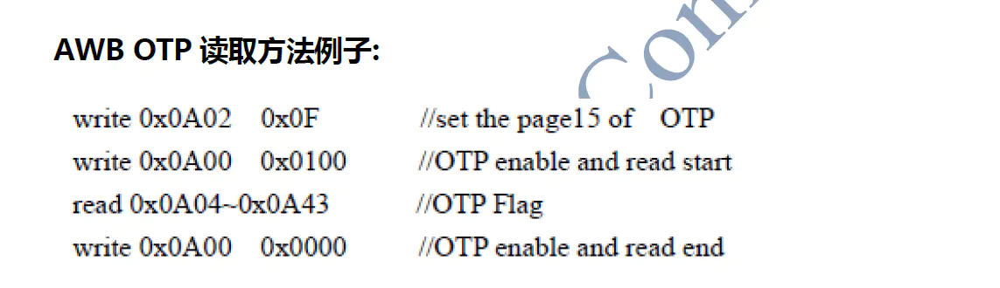
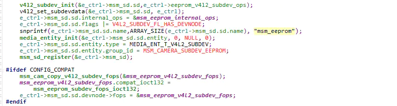
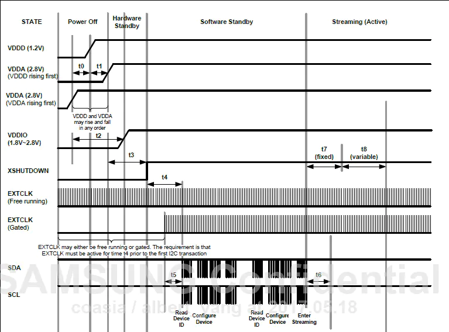

# OTP入门指南=

0.1592019.11.26 20:42:01字数 2,028阅读 1,217

## 前言

OTP加载是摄像头驱动开发中必不可少的一部分，初学者可能会觉得这一概念晦涩难懂，或者不知道其具体用途，本章节作为初学者的入门宝典，会介绍OTP的大致加载流程，并剖析源码，分析其原理。

## OTP的概念

OTP（One Time Programmable）一次性可编程，是MCU的一种存储类型。目前还不太清楚为什么将OTP和eeprom混为一谈，因为OTP是一次性不可擦除，而eeprom是带电可擦除存储单元。所以目前简单认为otp即eeprom，eeprom是一个存储单元，用于存储OTP数据，OTP数据主要包括AF（马达对焦）、AWB（自动白平衡）、LSC（镜头阴影校正）和PDAF（相位对焦）等。具体烧写了哪些数据一般otp datasheet中会有说明，比如说AWB数据一般会有R/Gr,B/Gb,Gr/Gb，多的还会有golden值。最终这些数据会被使用作为白平衡校准的参数。那既然如此，我们直接在代码中写死该参数，不是同样可以白平衡校准吗？答案是不行的。因为每一个模组从模组厂生产出来就一定会存在一些差异，所以用同样的参数调试出来的结果效果会有较大的差异，会避免这种差异性，就需要“因材施教”，对每一个模组烧写合适的OTP数据。

### OTP加载流程

otp加载可以大致分为以下几个步骤：
1）执行probe函数
2）加载库文件
3）对eeprom上电，读取eeprom数据，下电
4）应用数据

#### 一、 执行probe函数

probe函数是在内核空间执行，实现在msm_eeprom.c中，以下为eeprom驱动定义的地方，驱动需要挂在在某一总线上，才能和设备相匹配，一般内核代码中spi,i2c和platform总线的驱动都有注册，具体调用哪个probe函数需要看设备树中的eeprom设备挂载在哪条总线上


```c
static struct i2c_driver msm_eeprom_i2c_driver = {
    .id_table = msm_eeprom_i2c_id,
    .probe  = msm_eeprom_i2c_probe,
    .remove = __exit_p(msm_eeprom_i2c_remove),
    .driver = {
        .name = "qcom,eeprom",
        .owner = THIS_MODULE,
        .of_match_table = msm_eeprom_i2c_dt_match,
    },  
};
static const struct of_device_id msm_eeprom_i2c_dt_match[] = {
        {.compatible = "qcom,eeprom"},      
        {}
};
```

接下来分析设备树文件：


```c
&i2c_2 {
        eeprom0: qcom,eeprom@0 {
                cell-index = <0>;   // subdev_id，配置成相应的sensor的cell-index就可以了
        reg = <0x5A>;  //注册寄存器，配置为i2c地址即可
        qcom,eeprom-name = "sunwin_s5k4h7";   //eeprom名称，加载库文件时需要用到
        compatible = "qcom,eeprom";   //设备与驱动匹配的标识
        qcom,slave-addr = <0x5A>;   //i2c通信地址
        qcom,cci-master = <0>;    //0 
        qcom,num-blocks = <6>;  //以下读写规则的步骤

                page0 = <1 0x0A02 2 21 1 1>;
                qcom,pageen0 = <0 0x0 0 0x0 0 0>;
                qcom,poll0 = <0 0x0 0 0x0 0 0>;
                qcom,mem0 = <0 0x0 2 0 1 1>;

            qcom,page1 = <1 0x0A00 2 0x01 1 1>;
                qcom,pageen1 = <0 0x0 0 0x0 0 0>;
                qcom,poll1 = <0 0x0 0 0x0 0 0>;
                qcom,mem1 = <43 0x0A04 2 0x0 1 10>;

            qcom,page2 = <1 0x0A00 2 0x00 1 1>;
                qcom,pageen2 = <0 0x0 0 0x0 0 0>;
                qcom,poll2 = <0 0x0 0 0x0 0 0>;
                qcom,mem2 = <0 0x0 2 0 1 1>;
        
            qcom,page3 = <1 0x0A02 2 21 1 1>;
                qcom,pageen3 = <0 0x0 0 0x0 0 0>;
                qcom,poll3 = <0 0x0 0 0x0 0 0>;
                qcom,mem3 = <0 0x0 2 0 1 1>;

            qcom,page4 = <1 0x0A00 2 0x01 1 1>;
                qcom,pageen4 = <0 0x0 0 0x0 0 0>;
                qcom,poll4 = <0 0x0 0 0x0 0 0>;
                qcom,mem4 = <12 0x0A30 2 0x0 1 1>;

            qcom,page5 = <1 0x0A00 2 0x00 1 1>;
                qcom,pageen5 = <0 0x0 0 0x0 0 0>;
                qcom,poll5 = <0 0x0 0 0x0 0 0>;
                qcom,mem5 = <0 0x0 2 0 1 1>;

        cam_vdig-supply = <&pm8916_s3>;  // DVDD电路配置1.4V
        cam_vio-supply = <&pm8916_l10>;   // IOVDD电路配置1.8V
        qcom,cam-vreg-name = "cam_vio","cam_vdig";
        qcom,cam-vreg-type = <0 0>;
        qcom,cam-vreg-min-voltage = <1800000 1400000>;
        qcom,cam-vreg-max-voltage = <1800000 1400000>;
        qcom,cam-vreg-op-mode = <80000 200000>;

        qcom,i2c-freq-mode = <0>;
        qcom,enable_pinctrl;
        pinctrl-names = "cam_default", "cam_suspend";
        pinctrl-0 = <&cam_sensor_mclk0_default &cam_sensor_rear_default>;
        pinctrl-1 = <&cam_sensor_mclk0_sleep &cam_sensor_rear_sleep>;
        gpios = <&msm_gpio 26 0>,   //GPIO口配置
        <&msm_gpio 29 0>,
        <&msm_gpio 33 0>;
        qcom,gpio-reset = <1>;
        qcom,gpio-standby = <2>;
        qcom,gpio-req-tbl-num = <0 1 2>;
        qcom,gpio-req-tbl-flags = <1 0 0>;
        qcom,gpio-req-tbl-label = "CAMIF_MCLK",
        "CAM_RESET0",
        "CAM_STANDBY";

        qcom,cam-power-seq-type =     //上电配置
        "sensor_vreg","sensor_vreg","sensor_gpio", "sensor_gpio","sensor_clk";
        qcom,cam-power-seq-val =
        "cam_vdig",
        "cam_vio",
        "sensor_gpio_standby",
        "sensor_gpio_reset",
        "sensor_cam_mclk";
        qcom,cam-power-seq-cfg-val = <1 1 1 1 24000000>;
        qcom,cam-power-seq-delay = <10 10 10 10 5>;
      
        clocks = <&clock_gcc clk_mclk0_clk_src>,
        <&clock_gcc clk_gcc_camss_mclk0_clk>;
        clock-names = "cam_src_clk", "cam_clk";
    };
}
```

设备树节点解析：

1. eeprom0: qcom,eeprom@0
   eeprom0设备名称，该设备节点上一节点是i2c_2，说明该设备是挂载在i2c总线上的。qcom,eeprom@0应该是父节点下的子节点区别于其他子节点的标识。如果需要将sensor与eeprom绑定只要在sensor设备节点中添加属性qcom,eeprom-src = <&eeprom0>;即可。
2. qcom,eeprom-name = "sunwin_s5k4h7"
   高通平台下是否设置该节点区别很大，具体可参考源码:


```rust
static int msm_eeprom_i2c_probe(struct i2c_client *client, const struct i2c_device_id *id){
        ...
    rc = of_property_read_string(of_node, "qcom,eeprom-name",
        &eb_info->eeprom_name);
    CDBG("%s qcom,eeprom-name %s, rc %d\n", __func__,
        eb_info->eeprom_name, rc);
    if (rc < 0) {
        pr_err("%s failed %d\n", __func__, __LINE__);
        e_ctrl->userspace_probe = 1;
    }
}
```

在设置了eeprom-name值后，eeprom的上电、读数据和下电操作都在probe函数中实现，而假如没有设置eeprom-name，这些操作则是由用户空间发送CFG_EEPROM_INIT指令给驱动，才执行这些操作。同时，qcom,eeprom-name属性也要与相应的库文件名称相匹配，否则会导致无法加载库文件。

1. qcom,num-blocks = <6>
   读写规则部分需要参考otp datasheet，代码中我配置的是在0x0A04 读取43个字节，0x0A30 读取12个字节。

   

   image.png

   相关的操作可以查看msm_eeprom_parse_memory_map函数实现

2. gpios 和qcom,cam-power-seq-type
   gpios配置了eeprom需要用到的gpio口，qcom,cam-power-seq-type配置供电电路。具体配置成什么得问下硬件你的开发板是烧成什么样的。至于为什么需要配置这些，很简单，因为你的模组是外挂在主板上的，每个模组对应一个sensor芯片，你的otp数据有可能直接烧写在sensor寄存器中，另一种是在sensor上外挂一个eeprom，但是总的来说，芯片只有一个，那就是sensor芯片，假如需要读取otp数据，得让sensor芯片先工作，然后才能读相关的寄存器，配置相应的gpio口和电路都是为了让sensor芯片上电成功，这也就解释了为什么sensor上电跟eeprom上电一样，I2c通信地址也是一样，因为这俩上电就是一个玩意儿，只是eeprom上电不需要AF供电而已。

叨唠这么多，其实probe的执行只需要看设备树中的compatible 属性是否一致，即“qcom,eeprom”。一般来说probe函数会解析设备树中节点数据，将其存储在e_crtl结构体中，最终还将创建相应的设备节点。eeprom的probe函数中是注册了一个v4l2子设备，msm_sd_register即是注册函数，同时还将子设备与media device绑定，这样便可以通过media设备遍历找到eeprom设备的文件描述符，即是得到操作eeprom的接口。




image.png

#### 二、 加载库文件

库文件是由驱动文件编译得到的，讲到这儿就不得不说一下驱动程序，一般而言驱动是操作系统与硬件的中间桥梁，驱动作为一个硬件的访问接口而存在，而且一般运行在内核中，所以一般上层需要访问硬件，只需要往kernel发送几条IOCTL指令就行了，但是在摄像头的驱动架构中，比这要复杂得多，在高通的架构中，就eeprom而言，内核中有一个公共的驱动程序msm_eeprom.c，用于与硬件打交道，而在mm-camera同样需要加载一个库文件，由供应商提供的驱动函数编译而来，此时的驱动与设备不再是一个一一对应的关系。可以看出设备树与驱动的分离是为了解决不同开发板的硬件差异问题，vendor驱动和kernel驱动的分离则是为了解决不同供应商的硬件访问差异性（eeprom的上电时序不同，读写规则不同等）。
话不多说，入正文


```c
int32_t eeprom_load_library(sensor_eeprom_data_t *e_ctrl)
{
      ...
      snprintf(lib_name, sizeof(lib_name), "libmmcamera_%s_eeprom.so", name);  //libmmcamera_%s_eeprom.so便是eeprom库的命名方式
      e_ctrl->eeprom_lib.eeprom_lib_handle = dlopen(lib_name, RTLD_NOW);
      if (!e_ctrl->eeprom_lib.eeprom_lib_handle) {
          return -EINVAL;
      }
}
Android.mk
LOCAL_MODULE           := libmmcamera_sunwin_s5k4h7_eeprom
```

#### 三、对eeprom上电，读取eeprom数据，下电

这里介绍msm_eeprom_i2c_probe中上电的情况：
···
static int msm_eeprom_i2c_probe(struct i2c_client *client, const struct i2c_device_id *id)
rc = of_property_read_u32(of_node, "cell-index", &cell_id);
e_ctrl->subdev_id = cell_id; //设置subdev_id
rc = of_property_read_string(of_node, "qcom,eeprom-name",&eb_info->eeprom_name); //读取eeprom_name
rc = msm_eeprom_get_dt_data(e_ctrl); //读取设备树信息


```c
  if (e_ctrl->userspace_probe == 0) {
        rc = msm_eeprom_parse_memory_map(of_node, &e_ctrl->cal_data);
    if (rc < 0)
        goto board_free;
    rc = msm_camera_power_up(power_info, e_ctrl->eeprom_device_type,
        &e_ctrl->i2c_client);   //上电
    if (rc) {
        pr_err("failed rc %d\n", rc);
        goto memdata_free;
    }
    rc = read_eeprom_memory(e_ctrl, &e_ctrl->cal_data);   //读数据
    if (rc < 0) {
        pr_err("%s read_eeprom_memory failed\n", __func__);
        goto power_down;
    }
            rc = msm_camera_power_down(power_info,
        e_ctrl->eeprom_device_type, &e_ctrl->i2c_client);   //下电
  }
```

···
之前说过，eeprom上电即是sensor上电，所以上电时序只需要参考sensor的上电时序




image.png

#### 四、应用数据

应用数据也可以认为是验证otp数据是否导通，通过read_eeprom_memory可以读出eeprom的内容，此时首先应该与模组供应商确认otp数据烧写无误，然后再验证驱动的正确性。otp数据校准分为sensor端校准、平台端校准和自动校准。sensor端校准是AP先把OTP或者EEPROM中的数据读出来，然后由AP把相应的值经过转换后写到sensor寄存器中去，平台端校准是AP读出数据之后不写sensor寄存器，而是把这些值利用到ISP的一些数据里面去。自动校准是sensor自己可以自动加载OTP的数据，不需AP做处理。

1. sensor端校准


```c
static eeprom_lib_func_t sunwin_s5k4h7_lib_func_ptr = {
  .get_calibration_items = sunwin_s5k4h7_get_calibration_items,
  .format_calibration_data = sunwin_s5k4h7_format_calibration_data,
  .do_af_calibration = NULL,    //设置为空
  .do_wbc_calibration = NULL,  //设置为空
  .do_lsc_calibration = NULL,  //设置为空
  .get_raw_data = sunwin_s5k4h7_get_raw_data,
};
struct msm_camera_i2c_reg_setting g_reg_setting;
void sunwin_s5k4h7_get_calibration_items(void *e_ctrl)
{
  sensor_eeprom_data_t *ectrl = (sensor_eeprom_data_t *)e_ctrl;
  eeprom_calib_items_t *e_items = &(ectrl->eeprom_data.items);
  e_items->is_insensor = TRUE;
  e_items->is_afc = FALSE;
  e_items->is_wbc = FALSE;
  e_items->is_lsc = FALSE;
  e_items->is_dpc = FALSE;
}
```

sensor端校准将g_reg_setting寄存器组填充，该数组存储所有需要写入sensor寄存器的地址和数据，vendor调用get_raw_data 获取该数组，然后将数据写入sensor。

1. 平台端校准

```c
static eeprom_lib_func_t ov13b10_eeprom_lib_func_ptr = {
  .get_calibration_items    = ov13b10_eeprom_get_calibration_items,
  .format_calibration_data  = ov13b10_eeprom_format_calibration_data,
  .do_af_calibration        = eeprom_autofocus_calibration,   
  .do_wbc_calibration       = eeprom_whitebalance_calibration,
  .do_lsc_calibration       = eeprom_lensshading_calibration,
  .get_raw_data             = NULL,
  .get_ois_raw_data         = NULL,
}
void ov13b10_eeprom_get_calibration_items(void *e_ctrl)
{
  sensor_eeprom_data_t *ectrl = (sensor_eeprom_data_t *)e_ctrl;
  eeprom_calib_items_t *e_items = &(ectrl->eeprom_data.items);
  e_items->is_wbc = TRUE ;
  e_items->is_afc = TRUE ;
  e_items->is_lsc = TRUE;
  e_items->is_dpc = FALSE;
  e_items->is_insensor = FALSE;
  e_items->is_ois = FALSE;
}
```

平台端校准直接利用otp数据进行补偿计算，执行校准操作。

1. sensor自动校准