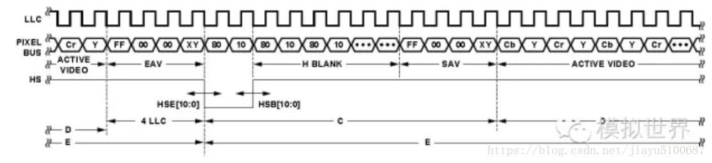
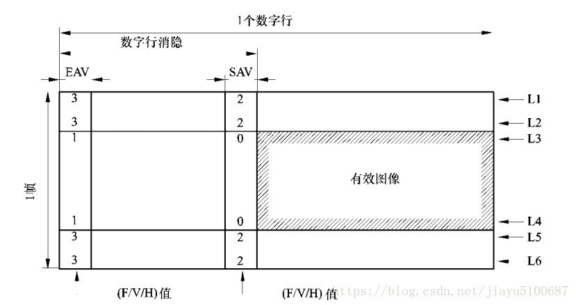
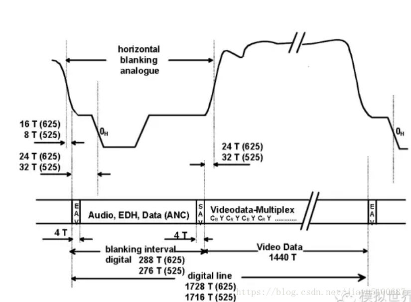
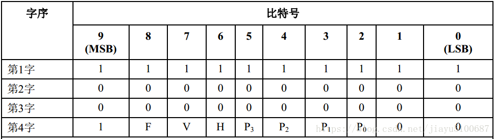
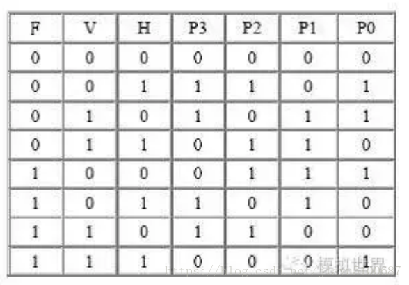
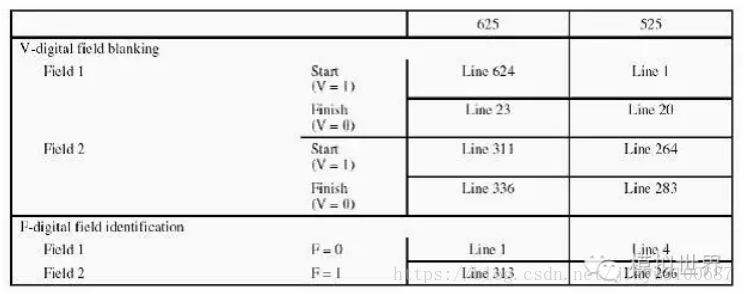
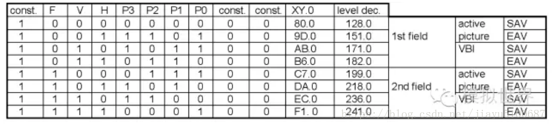
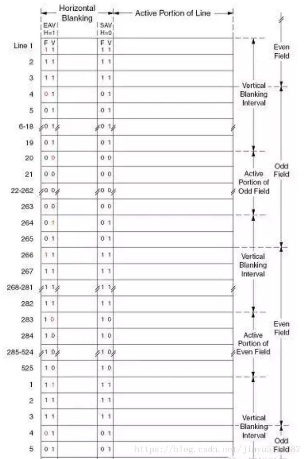
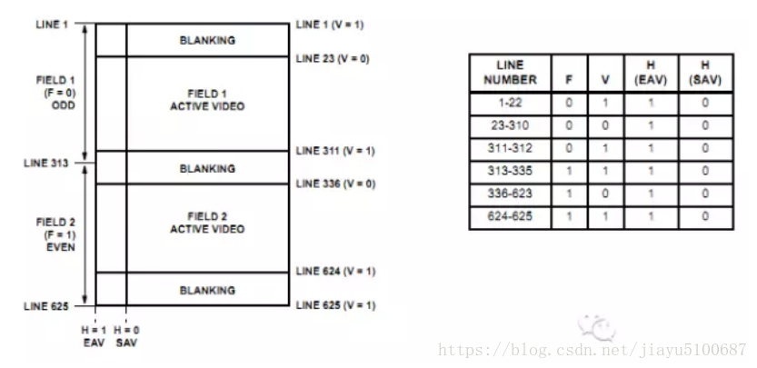
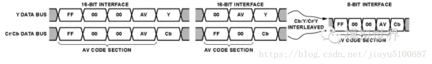

# 1 RAW

## 1.1 Raw数据介绍：
RAW的原意就是“未经加工”。可以理解为：RAW图像就是CMOS或者CCD图像感应器将捕捉到的光源信号转化为数字信号的原始数据。RAW文件是一种记录了数码相机传感器的原始信息，同时记录了由相机拍摄所产生的一些元数据（Metadata，如ISO的设置、快门速度、光圈值、白平衡等）的文件。RAW是未经处理、也未经压缩的格式，可以把RAW概念化为“原始图像编码数据”或更形象的称为“数字底片”。RAW格式的全称是RAW Image Format，在编程中称之为原始。

## 1.2 RAM数据格式解析
Raw格式是sensor的输出格式，是未经处理过的数据，表示sensor接受 到的各种光的强度。
Raw数据在输出的时候是有一定的顺序的，一般为以下四种:
00： GR/BG
01:   RG/GB
10: BG/GR
11:   GB/RG

为什么每种情况里有两个G分量呢？这时因为人的眼睛对绿色比较敏感，所以增加了对绿色的采样。其中每个分量代表一个piexl。所以GR/BG就代表四个piexl，在物理sensor上就表示4个晶体管，用一个晶体管只采样一个颜色分量，然后通过插值计算得到每个piexl，这样做的主要目的是降低功耗。
sensor输出的数据一般要送到ISP中处理才会得到一个好的效果，这就需要ISP知道sensor输出的raw数据的顺序与大小，其中顺序一般通过配置ISP的pattern寄存器来实现，大小一般配置在ISP的输入格式控制寄存器中。

下面说以下raw数据几种常用的格式:
RAW8:
Raw8即是用8bits表示G/R/B/G中的一个分量,而不是使用8bits表示RG/GB四个分量。在sensor中，为了降低功耗，使用一个晶体来表示一种颜色，然后利用差值计算出相邻像素的值。
Raw10:
Raw10就是使用10bit表示上述的一个G/R/B/G，但是数据中是16bit的，高6位没用。

Raw12:
Raw12: 就是使用12bit表示上述的一个G/R/B/G，但是数据中是16bit的，高4位没用。

## 1.3 看raw数据的工具

看raw数据工具有很多，再此我只介绍我使用的三款：

1 > picasa

Google 的免费图片管理工具Picasa，数秒钟内就可找到并欣赏计算机上的图片。 Picasa 原为独立收费的图像管理、处理软件，其界面美观华丽， 功能实用丰富。后来被 Google 收购并改为免费软件， 成为了 Google 的一部分，它最突出的优点是搜索硬盘中的相片图片的速度很快，当你输入一个字后，准备输入第二个字时，它已经即时显示出搜索出的图片。不管照片有多少，空间有多大，几秒内就可以查找到所需要的图片.

使用比较简单，将文件后缀名修改为raw，然后拖到软件中即可。

2>irfanview

仅仅不到2M的小软件，功能却能与体积大到几十M的ACDSee相媲美！这个软件就是IrfanView。图片、音频、视频浏览，图片批量格式转换、批量重命名，JPE图片无损旋转等只是IrfanView最基本的功能。IrfanView是世界第一个支持多页Gif动画的Windows图像查看器，另外强大的插件外挂功能、自定义皮肤功能以及多种热键支持让你可以定制一个完全属于自己的IrfanView！

使用时，需要将文件后缀名改为raw，然后拖到软件中，填入raw的长宽，然后选择depth，主要是选择pattern，需要知道raw数据是RG/GB等的顺序。这个软件有个问题就是打开的raw数据是上下颠倒的。

3>photoshop

功能强大，不需多言。这里只说一下怎样使用其看raw数据：

首先打开raw数据，在弹出的对话框中填入宽度，然后选择通道为1，如果是raw10，depth选择16，然后选择IBM，打开，发现是一张全黑的图片，然后选择：滤镜->其他->自定义。。。"在弹出的对话框中将中间的白框填入64，其他填入0，即可得到raw图，不过图片是黑白的，但是正反是正常的。

# 2  jpeg

 JPEG是常见的一种图像格式，它由联合图像专家组(Joint Photographic Experts Group)开发。JPEG文件的扩展名为.jpg或.jpeg，它用有损压缩方式去除冗余的图像和彩色数据，在获得极高的压缩率的同时能展现十分丰富生动的图像，即可以用较少的磁盘空间得到较好的图片质量 [1] 。 

# 3 vicap模式

VICAP模块有三种工作模式：一帧停止模式，帧乒乓模式，帧块模式。

## 3.1 one frame stop mode,单帧停止模式

在此模式下，将参数WORK_mode配置为一帧停止模式。一次之后帧捕获，VICAP将自动停止并设置帧状态。维查普将

在用户清除帧状态之前，不要捕获传感器数据。Y/UV的地址是帧0地址或帧1地址。

## 3.2 frame ping-pong mode,帧乒乓模式

捕获一帧（F1）后，VICAP将开始自动捕获下一帧（F2），主机必须分配frame1的新地址指针并清除frame1状态，因此

VICAP将自动捕获第三帧（按新的F1地址），而无需任何停止和对于以下帧，如此类推。但如果主机没有更新帧缓冲区地址，则VICAP将用以下帧数据覆盖存储在存储器中的帧前数据。

## 3.3 frame block mode.阻塞乒乓球模式

在此模式下，VICAP将以块为单位工作。块的行数由依次接收BLOCK_LINE_NUM.Block0和block1的配置。什么时候？

块0/1完成后，将设置块状态，用户应清除及时阻止状态。当下一个block0/1开始接收时，如果块状态0/1未清除，当前帧的其余部分将被丢弃。保管部YUV模式和RAW模式的区别在于YUV模式或CCIR656模式，数据将存储在Y数据缓冲区和UV数据缓冲区中，如果唯一的Y模式是所选的紫外线数据将不存储；在原始或JPEG模式下，RGB数据将存储在同一缓冲区中。另外，在YUV模式或RAW8模式下，Y，U的宽度或者V数据是内存中的一个字节；在Raw10/12或JPEG模式下，宽度是半字。作物参数START_Y和START_X定义裁剪起点的坐标。以及裁剪后的帧大小遵循“设置宽度”和“设置高度”的值。

# 3 BT.601和BT.656

转载[Mr_Wing5](https://me.csdn.net/jiayu5100687) 最后发布于2018-08-16 14:32:35 阅读数 5418 收藏

展开

BT601和BT656

CCIR601/656建议书就正式更名为ITU-RBT601和ITU-R BT656。

CCIR601和CCIR656标准

英文缩写: CCIR (Consultative Committee of International Radio)

中文译名: 国际无线电咨询委员会

分　　类: 其它

解　　释: CCIR是国际无线电咨询委员会的简称。成立于1927年，是国际电信联盟（ITU）的常设机构之一。主要职责是研究无线电通信和技术业务问题，并对这类问题通过建议书。

从1993年3月1日起，与国际频率登记委员会（IFRB）合并，成为现今国际电信联盟（ITU）无线电通信部门，简称ITU-R。

 

 

关于这两种信号的区别： ITU-R BT 601:16位数据传输；21芯；Y、U、V信号同时传输。

ITU-R BT 656: 9芯，不需要同步信号；8位数据传输；串行视频传输；传输速率是601的2倍；先传Y，后传UV。

  656输出的是串行数据，行场同步信号嵌入在数据流中；

  601是并行数据，行场同步有单独输出;

  656只是数据传输接口而已，可以说是作为601的一个传输方式。

  简单的说ITU-R BT.601是"演播室数字电视编码参数"标准,而ITU-R BT.656则是ITU-R BT.601附件A中的数字接口标准,用于主要数字视频设备(包括芯片)之间采用27Mhz/s并口或243Mb/s串行接口的数字传输接口标准.

  CCIR601号建议的制定，是向着数字电视广播系统参数统一化、标准化迈出的第一步。在该建议中，规定了625和525行系统电视中心演播室数字编码的基本参数值。

  601号建议单独规定了电视演播室的编码标准。它对彩色电视信号的编码方式、取样频率、取样结构都作了明的规定。

  它规定彩色电视信号采用分量编码。所谓分量编码就是彩色全电视信号在转换成数字形式之前，先被分离成亮度信号和色差信号，然后对它们分别进行编码。分量信号（Y、B -- Y、R -- Y）被分别编码后，再合成数字信号。 它规定了取样频率与取样结构。例如：在4：2：2等级的编码中，规定亮度信号和色差信号的取样频率分别为13.5MHZ和6.75MHZ  ,取样结构为正交结构,即按行、场、帧重复,每行中的R-Y和B-Y取样与奇次(1,3,5……)Y的取样同位置，即取样结构是固定的，取样点在电视屏幕上的相对位置不变。 它规定了编码方式。对亮度信号和两个色差信号进行线性PCM编码，每个取样点取8比特量化。同时，规定在数字编码时，不使用A/D转换的整个动态范围，只给亮度信号分配220个量化级，黑电平对应于量化级16，白电平对应于量化级235。为每个色差信号分配224个量化级，色差信号的零电平对应于量化级128。

   　　

数字视频CCIR 601编码标准

一、采样频率：为了保证信号的同步，采样频率必须是电视信号行频的倍数。CCIR为NTSC、PAL和SECAM制式制定的共同的电视图像采样标准：

​                 f s＝13.5MHz

  这个采样频率正好是PAL、SECAM制行频的864倍，NTSC制行频的858倍，可以保证采样时采样时钟与行同步信号同步。对于4：2：2的采样格式，亮度信号用fs频率采样，两个色差信号分别用

f s／2＝6.75MHz的频率采样。由此可推出色度分量的最小采样率是3.375MHz。

二、分辨率：根据采样频率，可算出对于PAL和SECAM制式，每一扫描行采样864个样本点；对于NTSC制则是858个样本点。由于电视信号中每一行都包括一定的同步信号和回扫信号，故有效的图像信号样本点并没有那么多，CCIR 601规定对所有的制式，其每一行的有效样本点数为720点。由于不同的制式其每帧的有效行数不同（PAL和SECAM制为576行，NTSC制为484行），CCIR 定义720×484为高清晰度电视HDTV（High Definition TV）的基本标准。实际计算机显示数字视频时，通常采用下表的参数：

电视制式

分辨率

帧 率

NTSC

640×480

30

PAL、SECAM

768×576

25

三、数据量：CCIR 601规定，每个样本点都按8位数字化，也即有256个等级。但实际上亮度信号占220级，色度信号占225级，其它位作同步、编码等控制用。如果按f s 的采样率、4：2：2的格式采样，则数字视频的数据量为：

​          13.5(MHz)×8(bit)＋2×6.75(MHz)×8(bit) = 27Mbyte / s同样可以算出，如果按4：4：4的方式采样，数字视频的数据量为每秒40兆字节！按每秒27兆字节的数据率计算，一段10秒钟的数字视频要占用270兆字节的存储空间。按此数据率，一张680兆字节容量的光盘只能记录约25秒的数字视频数据信息，而且即使目前高倍速的光驱，其数据传输率也远远达不到每秒27兆字节的传输要求，视频数据将无法实时回放。这种未压缩的数字视频数据量对于目前的计算机和网络来说无论是存储或传输都是不现实的，因此，在多媒体中应用数字视频的关键问题是数字视频的压缩技术

   在日常的工作中我们常听到BT601（CCIR601）和BT656的说法，另外老一点的文档可能还会提到CCIR601，CCIR656的说法，今天就对这两个概念做简单说明。

首先说明一下ITU-R BT601/656和CCIR601/656的前世今生，CCIR (Consultative Committee of International Radio，国际无线电咨询委员会) 是国际无线电咨询委员会的简称。成立于1927年，是国际电信联盟（ITU）的常设机构之一。主要职责是研究无线电通信和技术业务问题，并对这类问题通过建议书。从1993年3月1日起，与国际频率登记委员会（IFRB）合并，成为现今国际电信联盟（ITU）无线电通信部门，简称ITU-R。之后更新的CCIR601/656建议书就正式更名为ITU-R
BT601和ITU-R BT656。后文中我们就不做另外说明，统一用BT601和BT656来指代。

前面已经介绍了模拟视频的标准和格式，但是模拟电视存在着许多难以克服的缺陷：多次传输或复制后会形成噪声积累，信号的线性、非线性失真，亮色互扰，行间闪烁，爬行，微分相位和微分增益失真等等，致使图像质量不断下降。但这些缺陷大多可通过将模拟信号转变为数字信号进行处理、存储、控制和传输来解决。为了用数字处理和传输电视信号，首先要将模拟电视信号数字化，即对电视信号进行抽样、量化和编码。

在ITU-R关于数字电视的BT.601建议中，从电视广播的角度阐明了如何对数字电视信号进行编码。该标准支持两种色彩空间，最简单明了的是RGB红绿蓝色彩空间。这种色彩空间非常直观，但是色彩通道之间的关系非常复杂，因此，并不适于进行视频压缩。每个像素都有三个色彩值，红、绿、蓝，视频格式中的数值暗示了这三个值。例如，RGB888格式就表示红色分量、绿色分量和蓝色分量各占8位。RGB666格式则表示每个像素中的这三个色彩分量各占6位，而565格式则表示，红色分量和蓝色分量各占5位，而绿色分量占6位。RGB色彩空间在PC电脑显示器为基础的Graphic显示中比较常用。

​        目前，在数字电视及数字视频中，最常用的、也是BT.601建议中首选的色彩空间是YCbCr色彩空间。其中，Y表示亮度分量，Cr或Cb表示色度分量。这些值是根据RGB值计算出的，相互独立，也就是说，比RGB信号更适于进行压缩。这也正是众多制造商纷纷选择采用这种色彩空间，BT.601建议也推选它的主要原因之一。

  YCbCr颜色空间和它的变换(通常写为YUV)是一种流行而高效的表示一个颜色图像的方法。Y是亮度值，由R,G,B的加权平均可以得到：Y=kr*R +kg*G + kb*B; 这里kr,kb,kg是加权因子。kr + kb + kg =1

颜色信号可以由不同的颜色差别来表示：

Cb= B-Y;  Cr =R-Y; Cg = G-Y

对于一个颜色图像的完整的描述由给定Y和三个色差:
Cb, Cr, Cg 来表示。然后Cb+Cr+Cg是一个常数，那么我们只需要两个色度参数就可以了，第三个可以通过其他两个计算出来。在YCbCr空间中，只有Y和Cb,Cr值被传输和存储，而且Cb和Cr的分辨率可以比Y低，因为人类视觉系统对于亮度更加敏感。这就减少了表示图像的数据量。通常的观察情况下，RGB和YCbCr表示的图像看上去没有什么不同。对于色度采用比亮度低的分辨率进行采样是一种简单而有效的压缩办法。

一个RGB图像可以在捕捉之后转换为YCbCr格式用来减少存储和传输负担。在显示图象之前，再转回为RGB。注意没有必要去指明分别的加权值kg（因为kb+kr+kg=1)，而且G可以从YCbCr中解压出来，这说明不需要存储和传输Cg参数。

Y = krR + (1-kb-kr)G + kb B

Cb = 0.5/(1-kb) * (B-Y)

Cr = 0.5/(1-kr) * (R-Y)

则：

R = Y + (1-kr)/0.5 * Cr

G = Y - 2kb(1-kb)/(1-kb-kr) * Cb-2kr(1-kr)/(1-kb-kr) * Cr

B = Y + (1-kb)/0.5 * Cb

 

而ITU-R的BT.601决议定义了kb=0.114, kr=0.299，那么代换参数就有了如下等式：

Y = 0.299R + 0.587G + 0.114B

Cb = 0.564(B - Y )

Cr = 0.713(R - Y )

即

Y = 0.299R + 0.587G + 0.114B

Cb = (-0.1687R - 0.3313G + 0.500B)

Cr = (0.500R - 0.4187G - 0.0813B)

则：

R = Y + 1.402Cr

G = Y - 0.344Cb - 0.714Cr

B = Y + 1.772Cb

 

对Cb和Cr加上偏置，就得到 BT601的色空间转换公式：

Y = 0.299R + 0.587G + 0.114B

Cb = (-0.1687R - 0.3313G + 0.500B)+ 128

Cr = (0.500R - 0.4187G - 0.0813B) +128

 

ITU-R BT.601建议主要针对表示525行或625行隔行扫描数字电视图像的像素特征，规定了视频信号数字编码方法，包括针对宽高比为4∶3和16∶9图像的13.5MHz采样率，这两种图像代表了当前传输制式所需的足够性能。

国际电联无线电通信全会，考虑到

a）    电视广播公司和节目制作商在数字演播室标准中的明显优势，数字演播室标准拥有525行和625行系统通用的最大数目的有效参数值；

b）    全世界兼容的数字方法将允许开发具备许多共同特点的设备，允许运行的经济性，并促进节目的国际交流；

c）     期望一个可扩展的兼容数字编码标准族。该标准族中的成员可能与不同质量等级、不同的宽高比相对应，有助于当前生产技术所需的额外处理，并满足未来需求；

d）    基于部分编码的系统能够满足这些期望的目标；

e）    表示亮度和色差信号YCbCr（或者，如果使用了RGB色空间，为红色、绿色和蓝色信号）的样本，有助于当前生产技术所需的对数字部分信号的处理，建议在那些使用525行系统和使用625行系统的国家中，将BT601内容用作电视演播室数字编码标准的基础。

f)      ITU-R BT．601建议的实际实施要求规定接口和通过接口的数据流的细节；

g)      这些接口在525行和625行两种制式间应该具有最大的共同性；

h)      在ITU-RBT．601建议的实际实施中，希望对接口的串行和并行两种形式都作出规定；

BT.601建议中明确规定，4:2:2YCbCr是适用于电视广播应用的色彩空间。这就意味着，要对色度值进行二次取样，每个像素一个亮度值，一个色度值（Cr或Cb）。BT.601建议支持对色彩空间分量值进行8位或10位量化。BT.601建议的最终结果是将NTSC和PAL制式标准化为每行包含相同数量的有效像素，即720个有效像素。由于PAL信号的刷新率为50场/秒，而NTSC信号的刷新率则为60场/秒，所以通过在PAL信号中添加扫描行，实现了帧刷新率的标准化。

1. ***\*抽样频率的选择\****

电视信号数字化抽样频率的选择首先应满足奈奎斯特抽样定理，即抽样频率至少要等于视频带宽的两倍。对于数字分量编码,BT601建议亮度抽样频率为525/60和625/50三大制式行频公倍数2.25MHz的6倍，即13.5MHz。对现行电视制式而言，亮度信号的最大带宽是6MHz，13.5MHz> （2×6MHz=12MHz），所以它符合奈奎斯特定理。而色差信号的带宽比亮度信号窄得多，所以在分量编码时两个色差信号的抽样频率可以低一些。

因同时考虑到抽样的样点结构应满足正交结构要求，两个色差信号的抽样频率均选为亮度信号抽样频率的一半，即6.75MHz，这样亮度信号与两个色差信号的抽样频率之比为4∶2∶2。

***\*2\**\**．数字分量视频信号有效行取样点数的确定\****

每行数字分量信号的取样点数为：

- 对于625行/50场制式（PAL/SECAM）：每行亮度取样点为13.5Mhz/15625Hz=864点/行；每行每个色度取样点为6.75Mhz/15625Hz=432点/行。
- 对于525行/60场制式(NTSC)：每行亮度取样点为13.5Mhz/15734.266Hz=858点/行；每行每色度取样点为6.75Mhz/15734Hz=429点/行。

可见，这两种制式选用了相同的抽样频率，但每行取样点数却不相同。所以把两者取样点数之差别放在数字有效行以外的部分，而使每个数字有效行内的取样点数相同。BT601建议两种制式有效行内的取样点数亮度信号取720个，两个色差信号各取360个，即每个数字视频的有效行包括720个亮度数据和720个色度数据 (两个色度各360个),这样就统一了数字分量编码标准，使三种不同制式便于转换和统一。所以有效行亮度信号与两个色差信号的取样点数之比也为4:2:2(720:360:360)。

上述两点即为获取高质量的后期制作由BT 601建议所确定的数字分量编码标准：

亮度信号的抽样频率为13.5MHz，每个色差信号的抽样频率为6.75MHz，其抽样频率之比为4:2:2,或者说，每数字有效行亮度信号的取样点数是720个，每个色差信号的取样点数是360个，其取样点数之比也为4:2:2，这就是数字分量编码的4:2:2标准，也称为4:2:2格式。用作演播室数字设备及其联接或国际节目交换时的数字化标准。

除了标准的4:2:2格式之外，还有将色差信号的抽样频率取为3.375MHz的较低标准的4:1:1和4:2:0格式。

另外还有为适合更高图像质量要求而将色差信号抽样频率取为13.5MHz的更高标准的4:4:4格式。

​        与数字视频应用相关的基本定时信号是Hsync，即水平同步信号。该信号标定了一个视频帧的每一个扫描行（从左至右）的有效视频信号起点。Vsync是垂直同步信号，从上到下标定了一个新的视频帧的起点。场是交织视频独有的信号，表示当前显示的场是视频帧的奇场还是偶场。在逐行扫描系统中，并不需要使用场信号。最后，是用于所有像素分量的数据时钟信号。

1. 数据量：BT 601规定，每个样本点都按8位数字化，也即有256个等级。但实际上亮度信号占220级，色度信号占225级，其它位作同步、编码等控制用。那么如果按fs = 13.5Mhz的采样率、4：2：2的格式采样，则数字视频的数据量为：

​         13.5(MHz)×8(bit)＋2×6.75(MHz)×8(bit)= 27Mbyte / s

  同样可以算出，如果按4：4：4的方式采样，数字视频的数据量为每秒40兆字节！按每秒27兆字节的数据率计算，一段10秒钟的数字视频要占用270兆字节的存储空间。按此数据率，一张680兆字节容量的光盘只能记录约25秒的数字视频数据信息，其每秒27兆字节数据传输率也远远超过了当时计算机和网络的传输能力，视频数据将无法实时回放。这种未压缩的数字视频数据量对于当时的计算机和网络来说无论是存储或传输都是不现实的，因此，在多媒体中应用数字视频的关键问题是数字视频的压缩技术。

​         现在，大家已经初步了解了BT.601建议，下面，我们将讨论数字视频实现的第二层——ITU-R发布的BT.656建议。基本上，这个建议是对BT.601建议的补充，定义了实现BT.601建议所必须的物理接口和数据流。或者严格地来说，ITU-RBT.656应该是隶属ITU-R BT.601的一个子协议。ITU-R BT.601是演播室数字电视编码参数标准，而ITU-R BT.656 则是ITU-R BT.601附件A中的数字接口标准，用于主要数字视频设备(包括芯片)之间采用27Mhz并口或243Mbps串行接口的数字传输接口标准。

该建议定义了位并行和位串行两种模式，下面十个简单的对比说明。因为位并行模式是业界主流的应用模式，今天我们仅详细介绍位并行模式。

- 位并行模式

只需要27MHz的时钟（在NTSC 30 帧/s条件下）以及8或10条连线（具体取决于像素的分辨率）。所有的同步化信号都嵌入到数据流中，因此无需额外添加硬件连线。

- 位串行模式

只需要在单个通道上传输一路复用化的10bit/像素串行数据流，不过它需要运用复杂的同步化、频谱整形和时钟恢复调理等技术手段。此外，其位时钟速率接近300MHz，因此要在很多系统中实施基于采用串行位形式的BT.656是极富挑战性的任务。

  BT.656并行接口除了传输4:2:2的YCbCr视频数据流外，还有行、列同步所用的控制信号。对于NTSC和PAL制式信号，该建议规定，额定时钟频率为27MHz，取决于广播系统的分辨率，数据行为8或10。656建议的最大优点是，数据流中包含了我们刚刚讨论的所有同步信号。因此，应用只需要实现数据流和时钟信号。

  BT 656建议既可支持隔行视频，又可支持逐行扫描视频。656输出的视频数据，行场同步信号嵌入在数据流中；601是并行数据，行场同步有单独输出;
656只是数据传输接口而已，可以说是作为601的一个传输方式。

ITU-R BT.601， 16位数据传输；YCbCr (YUV) 信号同时传输，是并行数据，行场同步单独输出。

ITU-R BT.656， 8/10位数据传输；不需要同步信号；串行数据传输；传输速率是601的2倍；每个像素，先传CbCr（UV），后传Y。行场同步信号嵌入在数据流中。

ITU-R BT.656包含三部分

1：视频信号，8/10位数据传输；

2：定时基准信号：

  有两个定时基准信号，一个在每个视频数据块的开始时(Start of Active Video，SAV)，另一个在每个视频数据块的结束(End of Active Video，EAV)；每个定时基准信号由4个字的序列组成，格式如下：FF 00 00 XY （16进制）头三个是固定前缀，第4个字包含定义第二场标识、场消隐状态和行消隐状态的信息。

3：辅助信号：

辅助数据信号可以以10 比特形式只在行消隐期间传送，还可以以8 比特形式只在场消隐中的行的有效期间传送。

  上图显示的就是符合656建议规定的NTSC制式和PAL制式的视频流。为了方便理解，我们先看下面的图来理解一帧（或者一场）图像的有效数据区。对于一帧视频图像，有视频帧消隐区和行消隐区，除去这部分之后就是有效视频数据。

上图我们看到视频中的某一帧的状态。L1和L2 是帧消隐区，同样 L5 和 L6也是帧消隐区。

656建议对信号的规定非常直白，H代表水平同步信号，V代表垂直同步信号，F代表场信号。从图中可以看出，H位标定了水平消隐区域。当H值为1时，表示EAV，即有效视频信号结束。当H值为0时，表示SAV，即有效视频信号开始。同样地，当V值从1变为0时，则表明信号从帧（或者场）消隐区域，变为有效视频区域。对于场信号，也同样是以F值的1、0变化，表明场1和场2的转换。我们先前提过，数据流中除了视频数据，还包含控制代码（定时基准信号SAV/EAV）。在本例中，这个8位视频分量的数据流快照中，SAV/EAV最前面的几个字节是“FF 00 00”。这是与控制代码相关的前同步码，用于通知终端设备，即将收到控制代码。紧接着，就是“XY”控制代码，负责告知终端设备，H值、V值或F值是否变化，此外，还有一些用于纠错的校验和位，具体的定义数据格式，我们稍后详细讨论。之后，如果是扫描行的起点，则会有一长串按“80
10 8010”顺序标定的水平消隐区域（辅助信号区域）。接下来，又是另一个前同步码，告知系统H值为0，即将收到SAV，即有效视频信号开始。然后，将收到整个视频扫描行——720个有效像素，等于1440字节。最后是EAV，即有效视频信号结束，开始接收下一个扫描行。

一帧PAL制式的视频图像数据由一个625行、每行1728字节（1440
有效视频字节＋288字节的控制信号）的数据块组成。其中，23～311行是偶数场视频数据，336～624行是奇数场视频数据，其余为垂直控制信号。每行数据包含水平控制信号和YCbCr视频数据信号。视频数据信号排列顺序为Cb-Y-Cr-Y。每行开始的288字节为行控制信号，开始的4字节为EAV信号(有效视频结束)，紧接着280个固定填充数据，最后是4字节的SAV信号(有效视频起始)。在下面的BT656视频流示意图中，对这部分做了详细标示。标识D部分标识720个有效像素，即1440个字节周期；标识C表示除EAV之外的行控制信号周期，为284字节，加上EAV的4字节，共288字节；标识E表示完整的一行为1440＋288=1728字节；

 

而对于NTSC制式的一帧视频图像信号，有效像素也是720个，即1440个字节周期，行控制信号周期为276个字节，完整的一行为1440＋276=1716字节；

​        具体的时序如下图所示：

下面介绍视频定时基准码(SAV,EAV)，有两个定时基准信号，一个在每个视频数据块的开始(Start of ActiveVideo，SAV)，另一个在每个视频数据块的结束(End of Active Video，EAV)。每个定时基准信号由4个字的序列组成，格式为FF
00 00 XY (数值以16进制表示)。头三个字节FF 00 00是固定前缀，第4
个字节XY包含定义了场标识、场消隐状态和行消隐状态的信息。

定时基准信号内的比特分配如下图所示：

上图给出的数值是为10 比特接口的建议值。如果是8比特的系统取高八位就可以了。

第4字节XY中：

- F是奇偶场标志，F=0/1 对应第1/2 场；
- V表示场同步，V=0/1 表示对应有效行/场消隐行；
- H是行同步信号，H=0/1 对应行有效视频开始处(SAV)/行有效视频结束处(EAV)；
- P0，P1，P2，P3：保护比特，P0，P1，P2，P3 比特的状态决定于F，V 比特的状态，在接收机中，这种安排容许纠正l
  比特误码和检出2
  比特误码。具体逻辑如下：

P3 = V xor H

P2 = F xor H

P1 = F xor V

P0 = F xor V xor H

 

结果参考下表：

 

F和V比特值的变化对应的行数见下表：

下表则是所有的定时基准码以及对应的位置：

以NTSC为例，下面是一个详细的一帧图像的基准码变化示意图：

如是PAL制式， 则参考下图：

  在实际的使用中，有的视频处理芯片要求16bit的视频数据线，但是还是内嵌同步（EAV/SAV）的模式，这种模式按照BT656的规范，严格来说不是BT656模式，但是在使用中，习惯上页称为YUV 16bit 656模式；或者说，这个模式和BT1120规范类似。下图是16bit和8bit线宽下转换的示意图。

