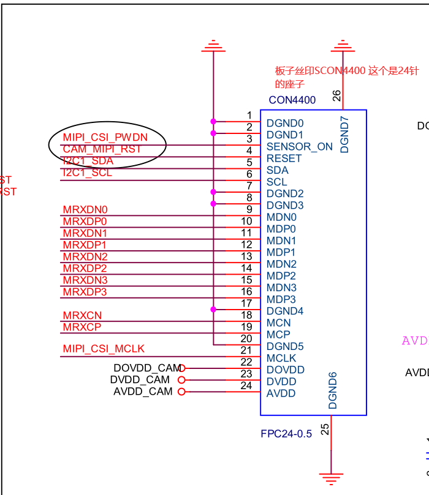
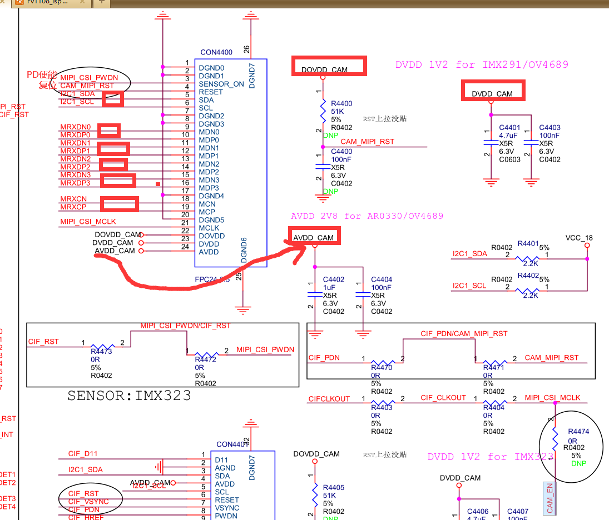
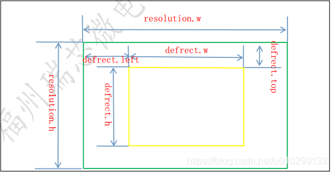
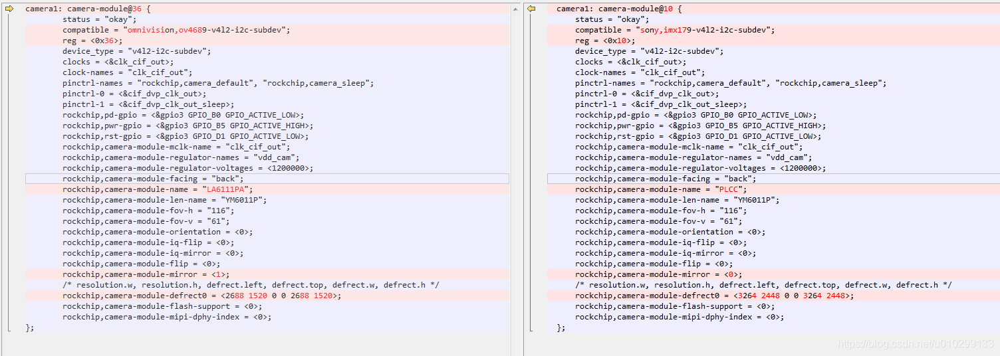

## 硬件




 


DVDD 外接 1.5V，OVDD 外接 1.8V,  AVDD 外接 2.8V，

+               rockchip,pd-gpio = <&gpio3 GPIO_B0 GPIO_ACTIVE_LOW>;  
+               rockchip,pwr-gpio = <&gpio3 GPIO_B5 GPIO_ACTIVE_HIGH>;
+               rockchip,rst-gpio = <&gpio3 GPIO_D1 GPIO_ACTIVE_LOW>;


原理图位24针插座。

## kernel 修改

```
===================defconfig开启==============================
commit 135ec48991b34cc765acf8392c2278784edd1568 (HEAD -> test)
Author: Wei Chen <wei.chen@rock-chips.com>
Date:   Fri Apr 16 16:53:33 2021 +0800

    [ TEST  JX_F37 camera ]
    
    Signed-off-by: Wei Chen <wei.chen@rock-chips.com>
    Change-Id: I19fa05120306b269f6003d9602fba9e7503deed3

:100644 100644 740c03e7505 e5a888789ea M        arch/arm/configs/rv1108_cvr_defconfig

====================DTS支持==============================
commit 990667b1819424d13ce12fa3752e3379d3b216f4
Author: Wei Chen <wei.chen@rock-chips.com>
Date:   Fri Apr 16 16:51:05 2021 +0800

    mecury: cvr: configs: support camera jx_f37
    
    Signed-off-by: Wei Chen <wei.chen@rock-chips.com>
    Change-Id: If2dd053715ef3e40fe1789de49d5ab6f2c601a45

:100644 100644 fe32f81f31c 64bac8b9f24 M        arch/arm/boot/dts/rv1108-minievb-v10-cvr.dts

======================添加相关驱动============================
commit 0a9927e343ebc47a73fbbddaa09adc300932821a
Author: Wei Chen <wei.chen@rock-chips.com>
Date:   Fri Apr 16 16:41:21 2021 +0800

    camera: rockchip: add jx_f37 driver
    
    Signed-off-by: Wei Chen <wei.chen@rock-chips.com>
    Change-Id: I4af4a74a363d6c9ed845ab03090f061ca58ec7d4

:100644 100644 bbfd52dd711 941978ca1bc M        drivers/media/i2c/soc_camera/rockchip/Kconfig
:100644 100644 8619c33d1df cfc92d0c39b M        drivers/media/i2c/soc_camera/rockchip/Makefile
:000000 100644 00000000000 aea530d3016 A        drivers/media/i2c/soc_camera/rockchip/jx_f37_v4l2-i2c-subdev.c

```

### DTS

根据实际的硬件连接、 sensor 要求， 的各项信息，尤其注意 i2c 地址、 pinctrl、 DVDD 配置、 pd、 reset 引脚及其有效电平。

```
--- a/arch/arm/boot/dts/rv1108-minievb-v10-cvr.dts
+++ b/arch/arm/boot/dts/rv1108-minievb-v10-cvr.dts
@@ -305,10 +305,40 @@
                rockchip,camera-module-defrect0 = <2200 1125 48 13 1920 1080>;
                rockchip,camera-module-flash-support = <0>;
        };
+
+       camera3: camera-module@40 {//@40是摄像头的i2c地址
+               status = "okay";  //使能
+               compatible = "soi,jx_f37-v4l2-i2c-subdev"; //驱动匹配：驱动里probe名字要一致
+               reg = <0x40>; //有效i2c地址，是7位的，无读写位
+               device_type = "v4l2-i2c-subdev"; //设备类型
+               clocks = <&clk_cif_out>;
+               clock-names = "clk_cif_out"; //mclk 给摄像头提供的时钟

rv1108 mclk 有 2 个 io 口可选择，根据实际硬件设计来配置：
 clk_mipicsi_out(gpio3_b5), 可输出 12M 或 24M。
 clk_cif_out(gpio3_d2), 可输出 12M, 24M 或 37.125M。
 其他 clk 频率请考虑外接晶振


+               pinctrl-names = "rockchip,camera_default", "rockchip,camera_sleep";
+               pinctrl-0 = <&cif_dvp_clk_out>;    //gpio 复用为 clk
+               pinctrl-1 = <&cif_dvp_clk_out_sleep>;//释放 gpio 复用功能
+               rockchip,pd-gpio = <&gpio3 GPIO_B0 GPIO_ACTIVE_LOW>;  //sensor powerdown gpio配置，低有效，工作时拉高
+               rockchip,pwr-gpio = <&gpio3 GPIO_B5 GPIO_ACTIVE_HIGH>;//power的管脚分配及有效电平，高有效，工作时拉高
+               rockchip,rst-gpio = <&gpio3 GPIO_D1 GPIO_ACTIVE_LOW>;//reset的管脚分配及有效电平，低有效，工作时拉高
+               rockchip,camera-module-mclk-name = "clk_cif_out"; //mclk时钟源配置，具体的解释如下。clk_cif_out这是在dtsi中定义的时钟源节点的名字

//在dts文件rv1108_clock.dtsi中节点clk_cif_out: clk_cif_out_mux {
     compatible = "rockchip,rk3188-mux-con";
     rockchip,bits = <12 1>;
     clocks = <&clk_cif_pll>, <&xin24m>;
     clock-output-names = "clk_cif_out";
     #clock-cells = <0>;
 };

  xin24m: xin24m {
     compatible = "rockchip,rk-fixed-clock";
     clock-output-names = "xin24m";
     clock-frequency = <24000000>;//24Mhz
     #clock-cells = <0>;
 };在 PLTFRM_CAM_ITF_MIPI_CFG(dphy_index, vc , nb_lanes, bit_rate)，
bit_rate 进行设置 Mclk。
当信号为并口时，时钟源应该选择“clk_cif_out”
————————————————
版权声明：本文为CSDN博主「酸菜鱼的鱼」的原创文章，遵循CC 4.0 BY-SA版权协议，转载请附上原文出处链接及本声明。原文链接：https://blog.csdn.net/u010299133/article/details/86593608


+               rockchip,camera-module-facing = "front";
+               rockchip,camera-module-name = "LA6114PA";//模组名，用于匹配 IQ文件

# ls -al /etc/cam_iq/
total 1680
drwxr-xr-x    2 root     root             0 Jan  1 00:05 .
drwxr-xr-x    8 root     root             0 Apr  9  2021 ..
-rw-r--r--    1 root     root        409498 Apr 15  2021 imx323_LA6114PA.xml
-rw-rw-rw-    1 root     root        430215 Apr  9  2021 jx_f37_LA6114PA.xml
-rw-r--r--    1 root     root        467896 Apr 15  2021 ov4689_LA6111PA.xml
-rw-r--r--    1 root     root        401470 Apr 15  2021 ov5695_D1741.xml
会自己去这里找文件

+               rockchip,camera-module-len-name = "NONE";//camera模组镜头
+               rockchip,camera-module-fov-h = "51";//模组水平可视角度配置
+               rockchip,camera-module-fov-v = "29";//模组垂直可视角度配置
+               rockchip,camera-module-orientation = <0>;;//模组角度设置
+               rockchip,camera-module-iq-flip = <1>;//IQ上下换转
+               rockchip,camera-module-iq-mirror = <0>;//IQ左右镜像
//以上 2 个属性控制摄像头的效果参数镜像配置，一般都是设置成 0，但 是发现以下现象：拍摄白墙，图片的上半部偏色与下半部偏色不一致，或者左右半部偏色不一致，即可以将这 2 个属性置成 1；

+               rockchip,camera-module-flip = <1>;
+               rockchip,camera-module-mirror = <0>;
//以上 2 个属性控制摄像头驱动中的镜像配置，如果图像旋转 180 度，可以将这 2 个属性修改成相反的值即可旋转 180；

+               /* resolution.w, resolution.h, defrect.left, defrect.top, defrect.w, defrect.h */
+               rockchip,camera-module-defrect0 = <1920 1080 0 0 1920 1080>;

// resolution.w： sensor 输出列数,
//resolution.h:sensor 输出行数,
// defrect.left:输出偏移列数,
// defrect.top:输出偏移行数,
// defrect.w:输出列数, defrect.left+defrect.w<=resolution.w,
//defrect.h:输出行数,defrect.h+defrect.top<=resolution.h,

+               rockchip,camera-module-flash-support = <0>;//flash 控制开关
+               rockchip,camera-module-mipi-dphy-index = <0>; //sensor 实际使用的 phy,要与硬件实际连接对应
+       };
 };
 
 
 
 // 配置需要使用的camera列表，连接到isp设备节点
 &cif_isp0 { //把camera挂接搭配isp上
-       rockchip,camera-modules-attached = <&camera1 &camera2>;
+       rockchip,camera-modules-attached = <&camera1 &camera2 &camera3>;
        status = "okay";
 };
```

esolution.w, resolution.h, defrect.left, defrect.top, defrect.w, defrect.h这几个参数的关系如下图所示：




使用的硬件平台：rv1108.同一个mipi接口，dts文件中camera节点的区别和差异 



### 驱动

```
代码路径如下：
kernel/drivers/media/i2c/soc_camera/rockchip/
rk_camera_module.c

```

rk_camera_module.c内容， 从dts文件中解析摄像头配置的各个字段

```

#define OF_OV_GPIO_PD "rockchip,pd-gpio"
#define OF_OV_GPIO_PWR "rockchip,pwr-gpio"
#define OF_OV_GPIO_AVDD "rockchip,avdd-gpio"
#define OF_OV_GPIO_DVDD "rockchip,dvdd-gpio"
#define OF_OV_GPIO_DOVDD "rockchip,dovdd-gpio"
#define OF_OV_GPIO_FLASH "rockchip,flash-gpio"
#define OF_OV_GPIO_TORCH "rockchip,torch-gpio"
#define OF_OV_GPIO_RESET "rockchip,rst-gpio"
#define OF_OV_GPIO_AESYNC "rockchip,aesync-gpio"

#define OF_CAMERA_MODULE_NAME "rockchip,camera-module-name"
#define OF_CAMERA_MODULE_LEN_NAME "rockchip,camera-module-len-name"
#define OF_CAMERA_MODULE_FOV_H "rockchip,camera-module-fov-h"
#define OF_CAMERA_MODULE_FOV_V "rockchip,camera-module-fov-v"
#define OF_CAMERA_MODULE_ORIENTATION "rockchip,camera-module-orientation"
#define OF_CAMERA_MODULE_FOCAL_LENGTH "rockchip,camera-module-focal-length"
#define OF_CAMERA_MODULE_FOCUS_DISTANCE "rockchip,camera-module-focus-distance"
#define OF_CAMERA_MODULE_IQ_MIRROR "rockchip,camera-module-iq-mirror"
#define OF_CAMERA_MODULE_IQ_FLIP "rockchip,camera-module-iq-flip"
#define OF_CAMERA_MODULE_FLIP "rockchip,camera-module-flip"
#define OF_CAMERA_MODULE_MIRROR "rockchip,camera-module-mirror"
#define OF_CAMERA_FLASH_SUPPORT "rockchip,camera-module-flash-support"
#define OF_CAMERA_FLASH_EXP_PERCENT "rockchip,camera-module-flash-exp-percent"
#define OF_CAMERA_FLASH_TURN_ON_TIME "rockchip,camera-module-flash-turn-on-time"
#define OF_CAMERA_FLASH_ON_TIMEOUT "rockchip,camera-module-flash-on-timeout"
#define OF_CAMERA_MODULE_DEFRECT0 "rockchip,camera-module-defrect0"
#define OF_CAMERA_MODULE_DEFRECT1 "rockchip,camera-module-defrect1"
#define OF_CAMERA_MODULE_DEFRECT2 "rockchip,camera-module-defrect2"
#define OF_CAMERA_MODULE_DEFRECT3 "rockchip,camera-module-defrect3"
#define OF_CAMERA_MODULE_MIPI_DPHY_INDEX "rockchip,camera-module-mipi-dphy-index"

#define OF_CAMERA_MODULE_REGULATORS "rockchip,camera-module-regulator-names"
#define OF_CAMERA_MODULE_REGULATOR_VOLTAGES "rockchip,camera-module-regulator-voltages"
#define OF_CAMERA_MODULE_MCLK_NAME "rockchip,camera-module-mclk-name"
#define OF_CAMERA_PINCTRL_STATE_DEFAULT "rockchip,camera_default"
#define OF_CAMERA_PINCTRL_STATE_SLEEP "rockchip,camera_sleep"
#define OF_CAMERA_IRCUT	"rockchip,camera-ircut"
#define OF_CAMERA_LS		"rockchip,camera-ls"
#define OF_CAMERA_LS_RANGE	"rockchip,camera-ls-range"
```


```
platform sensor control
pltfrm_camera_module_init rk camera   模块初始化
pltfrm_camera_module_get_data 从 dts  获取资源
pltfrm_camera_module_init_gpio gpio request
pltfrm_camera_module_s_power         控制 sensor’s power/reset/mclk
pltfrm_camera_module_patch_config    匹配 sensor 分辨率和帧率
pltfrm_camera_module_write_reglist   写 sensor 寄存器序列
```

ov_camera_module.c/ov_camera_module.h ov camera 统一控制接口

调试 sensor 驱动一般步骤：复制其他驱动作模板，改驱动名，改寄存器配置

#### 复制模板步骤

复制其他驱动作模板，改驱动名，改寄存器配置

```
static struct ov_camera_module_config ov4689_R2A_configs[] = {
	{
		.name = "2688x1520_30fps",
		.frm_fmt = {//设置分辨率
			.width = 2688,
			.height = 1520,
			.code = V4L2_MBUS_FMT_SBGGR10_1X10
/* include/uapi/linux/v4l2-mediabus.h
define RGB, YUV, RAW Bayer
Format, raw bayer: SBGGR\SRGGB\SGBRG\SGRBG
If color is not right, can adjust to this*/
//数据格式及位数

		},
		.frm_intrvl = {
			.interval = {//帧率
				.numerator = 1,
				.denominator = 30
			}
		},
		.auto_exp_enabled = false,
		.auto_gain_enabled = false,
		.auto_wb_enabled = false,
		.reg_table = (void *)ov4689_R2A_init_tab_2688_1520_30fps,
		.reg_table_num_entries =
			ARRAY_SIZE(ov4689_R2A_init_tab_2688_1520_30fps),
		.v_blanking_time_us = 3000,
/*For MIPI PLTFRM_CAM_ITF_MIPI_CFG (v, nb, br, mk)
v: version, default is 0.
nb: lane number.
br: mipi bitrates(Mbps/lane), max is 999.
mk: mclk frequency.
For DVP PLTFRM_CAM_ITF_DVP_CFG(ty, vs, hs, ck, ck_hz,
mk)
ty: type, BT601\BT656.
vs: vsync, rising or falling active.
hs: hsync, rising or falling active.
ck: pclk sample type.
ck_hz: pclk frequency.
mk: mclk frequency.
Define in include/linux/platform_data/rk_isp11_platform.h*/

		.max_exp_gain_h = 16,
		.max_exp_gain_l = 0,
		PLTFRM_CAM_ITF_MIPI_CFG(0, 4, 999, ov4689_EXT_CLK)
		//4是lanes数量，999是速率，ov4689_EXT_CLK 是像素时钟比如24000000
	}
};
```


sensor的曝光，在内部寄存器是以曝光行为单位保存的；

hts：行长   可以理解为一行具有多少个pixel

vts：帧长   一帧曝光了多少行

每行的时间：tline = hts/pclk，1/pclk即为扫描一个pixel所需的时间周期；

sensor会根据曝光量计算曝光时间expo和增益gain的乘积，然后选择一组最佳的expo和gain组合，expo根据tline转换为曝光行，配置给寄存器。

**H_Blank：**扫描从上一行的结束到下一行的开始的时间差；

**V_Blank：**扫描点扫描完一帧后，要从图像的右下角返回到图像的左上角，开始新一帧的扫描，这一时间间隔；


 ```
/从寄存器序列中获取 sensor HTS，VTS 等信息
ov4689_filltimings(&ov4689_custom_config);
//获取 sensor HTS，VTS 等信息
ov4689_g_timings
// 曝光 gain/time 控制
static int ov4689_write_aec(struct ov_camera_module *cam_mod)
//sensor 数据流控制
static int ov4689_start_streaming(struct ov_camera_module *cam_mod)
static int ov4689_stop_streaming(struct ov_camera_module *cam_mod)
//读取 sensor ID，检查 i2c 通信是否正常
static int ov4689_check_camera_id(struct ov_camera_module *cam_mod)
//sensor 通用结构
static struct v4l2_subdev_core_ops ov4689_camera_module_core_ops
static struct v4l2_subdev_video_ops ov4689_camera_module_video_ops
static struct v4l2_subdev_ops ov4689_camera_module_ops
static struct ov_camera_module_custom_config ov4689_custom_config
//driver probe/remove
static int ov4689_probe
static int ov4689_remove
//匹配
static struct of_device_id ov4689_of_match
 ```


#### isp 驱动

```
kernel/drivers/media/platform/rk-isp11/
```


## 报错

### I2C错误


### isp 报错


### 色彩不对

对于 raw 格式, 调整 rgb bayer 顺序，RGGB，BGGR，GRBG，GBRG 各试看看，
如果试整体偏色需要 tuning。
.code = V4L2_MBUS_FMT_SBGGR10_1X10
对于 yuv, 调整 yuv 顺序
.code = V4L2_MBUS_FMT_YUYV8_2X8

#### 帧率不对

1.先实测 sensor 输出帧率，如果 sensor 实际输出帧率不对，需检查寄存器配置和
mclk。
2.系统负载过大，buffer 更替过慢或某个模块处理 buffer 过慢，可先关掉 dsp、显示、
wifi、编码模块，看看。

#### 图像有严重条纹

1.IQ xml 分辨率没匹配上或 LSC 模块 LSC_SECT_SIZE_X/LSC_SECT_SIZE_Y
值没设置好。
2.所设置分辨率不在 dsp idc 畸变支持范围内，可先关掉此功能看看。
3.其他原因。

#### 图像轻微闪条纹

1.检查电源干扰。
2.其他原因。