## 1. 硬件接口

使用前，请获得摄像头模组资料，查看摄像头内部芯片电路与外部的接口连接情况

### 1.1 DVP


**输入**

| 引脚                     |                                                              |
| ------------------------ | ------------------------------------------------------------ |
| RESET                    | 复位管脚。有些摄像头没有这个硬件复位脚。此方式为硬复位模式，camera的各个IO口恢复到出厂默认状态。只有在XCLK开启后，将RESET置为低，硬复位才有效，否则复位无效。 |
| XCLK（或EXTCLK）(或mclk) | camera的工作时钟管脚（如12MHz master clock 单片机提供给摄像头的时钟），此管脚为主机提供camera的工作时钟。 |
| PWDN                     | 使能管脚。两种配置方式，一种为standby，一种是normal work，设置为standby的时候，一切对camera的操作都是无效的，包括复位。所以在RESET之前，一定要将PWDN管脚设置为normal模式，否则RESET无效。 |
| IIC（SCK,SDA）           | 主机和camera通信总线. 读和写操作                             |

**输出**

| 引脚             |                                                              |
| ---------------- | ------------------------------------------------------------ |
| data             | 数据管脚。此数据脚可以输出的格式有YUV、RGB、JPEG等。         |
| VSYNC（或FSYNC） | 帧同步信号管脚。一个VYSNC信号结束表示一帧（即一个画面）的数据已经输出完毕 |
| HSYNC(或LREF)    | 行同步信号管脚。一个HSYNC信号结束表示一行的数据已经输出完毕。 |
| PCLK             | 像素时钟同步信号管脚。一个PCLK信号结束表示一个像素点的数据已经输出完毕。软件上执行stream on开始输出流，才会有PCLK时钟 |

**电源总线** sensor一般是有三路电源

| 引脚  |                                       |
| ----- | ------------------------------------- |
| AVDD  | camera的模拟电源 （模拟电路供电AVCC） |
| DOVDD | camera的GPIO口数字电压（I/O 电源）    |
| DVDD  | camera的数字电源（数字电路供电VCC）   |

一般来说，要求先提供sensor的GPIO口电压，接着提供模拟电压，最后提供工作电压。时序如下图：

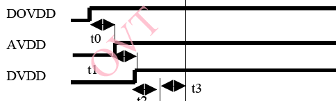


比如SC031GS 芯片分三路电源供电：DOVDD 外接 1.8V,AVDD 外接 2.8V，DVDD 外接 1.5V：

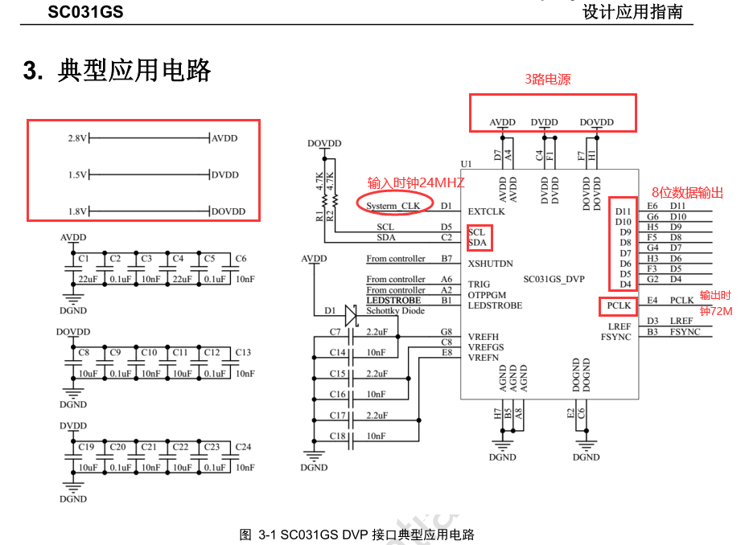


### 1.2 mipi


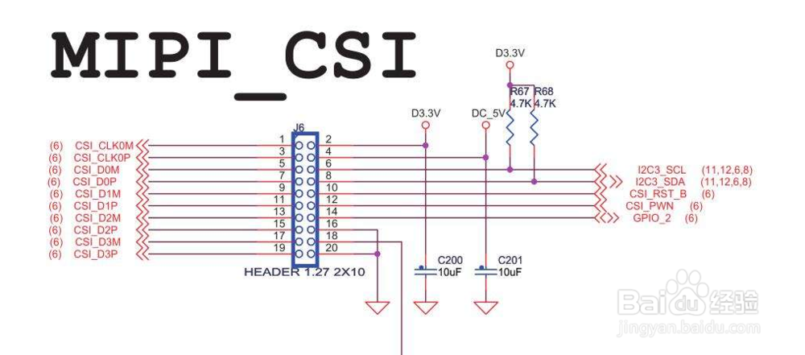


### 1.3  IIC上拉电阻

这个就要看你使用的单片机**是否有标准的IIC标准接口了**，如果你使用了标准的IIC接口，这个接口在使能的时候，引脚进入漏极开路模式，不过有一些单片机内部的上拉电阻可以使能，这样就省去了外部的上拉电阻，我用过AVR的，就是使能的内部的上拉电阻。但是如果是使用单片机的引脚模拟IIC协议的话，这个就得另说了，得看你的单片机引脚是否支持漏极开路模式或者上拉模式，不过一般推拉模式的输出引脚用在IIC里可能会有问题具体也没用过。

如下图RK2206上的DVP摄像头上面，I2C两根线都接了4.7k的电阻

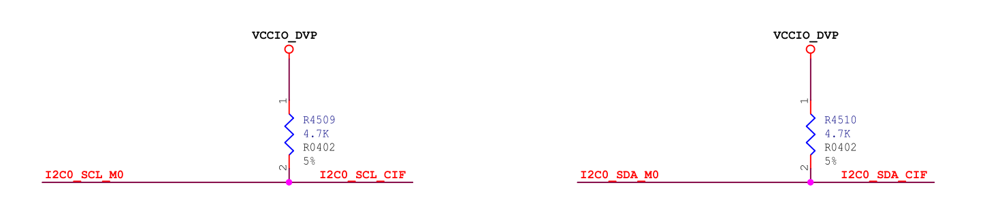

I2C的上拉电阻可以是1.5K，2.2K，4.7K， 电阻的大小对时序有一定影响，对信号的上升时间和下降时间也有影响，一般接1.5K或2.2K

I2C上拉电阻确定有一个计算公式：
Rmin＝{Vdd(min)-o.4V}/3mA
Rmax=(T/0.874) *c,  T=1us 100KHz, T=0.3us 400KHz
C是Bus capacitance

Rp最大值由总线最大容限（Cbmax)决定,Rp最小值由Vio与上拉驱动电流（最大取3mA)决定；
于是 Rpmin=5V/3mA≈1.7K(@Vio=5V)或者2.8V/3mA≈1K(@Vio=2.8V)
Rpmax的取值：参考周公的I2C总线规范中文版P33图39与P35图44
总的来说：电源电压限制了上拉电阻的最小值 ； 负载电容（总线电容）限制了上拉电阻的最大值

补充：在I2c总线可以串连300欧姆电阻RS可以用于防止SDA和SCL线的高电压毛刺

   : I2c从设备的数量受总线电容,<=400pF的限制

**做过I2C碰到过各种问题，多**半是上拉电阻或者控制器时钟的问题。没上拉电阻或者上拉电阻过大，都会导致不稳定而出现寻址不到的问题。控制器时钟主频的话，主频667M八分频就可以

>  I2C时钟线和数据线为什么要接上拉电阻？

因为 I2C 的 IO 是开漏的，所以需要上拉电

因为允许把多个I2C总线器件连接到总线上，连接到I2C总线上的器件是漏极开路或集电极开路的，可以实现线与功能。同时，因为接了上拉电阻，在总线空闲期间，SDA和SCL都是高电平，可以防止外部干扰造成误启动I2C总线。
按照I2C的规范来讲，SDA和SCL都是需要上拉电阻的。当然如果你主控芯片的两个管脚具有内部上拉并且满足你的速率要求，也是可以省略外部上拉的。
“如果加上拉电阻，阻值根据什么来确定”
根据主控的管脚驱动能力、负载数量、走线长度、传输速率等因素共同决定。对于产品设计而言可以先选取经验参数、而后通过小批量实测波形来确定的。

## 2. 摄像头

### 2. 1 摄像头技术指标

**图像解析度/分辨率(Resolution)**

● SXGA(1280x1024)又称130万像素
● XGA(1024x768)又称80万像素
●SVGA(800x600)又称50万像素
●VGA(640x480)又称30万像素(35万是指648X488)  **常用**
●CIF(352x288)又称10万像素
●SIF/QVGA(320x240) **常用**
●QCIF(176x144)
●QSIF/QQVGA(160x120)

**图像格式(imageFormat/Colorspace)**

RGB24，420是最常用的两种图像格式。
●RGB24：表示R、G、B三种颜色各8bit，最多可表现256级浓淡，从而可以再现256*256*256种颜色。
●I420：YUV格式之一。
●其它格式有:RGB565，RGB444，YUV4:2:2等。

**图像深度与像素深度**

量度图像的色彩分辨率。指存储每个像素所用的位数。确定彩色图像颜色数。

数字化图像的每个像素是用一组二进制数进行描述，其中包含表示图像颜色的位，图中**每个像素颜色所占的二进制位位数**，称为图像深度。图像深度是指像素深度中实际用于存储图像的灰度或色彩所需要的比特位数。假定图像的像素深度为16bit，但用于表示图像的[灰度](https://baike.baidu.com/item/灰度/4615393)或色彩的位数只有15位，则图像的图像深度为15。图像深度决定了图像的每个像素可能的颜色数，或可能的灰度级数。例如，彩色图像每个像素用R,G,B三个分量表示,每个分量用8位，像素深度为24位 。

图像深度是指存储每个像素所用的位数，他也是用来度量图像的色彩分辨率的。他确定了彩色图像的每个像素可能有的色彩数，或者确定灰度图像的每个像素可能有的灰度级数。他决定了色彩图像中可能出现的最多的色彩数，或者灰度图像中的最大灰度等级。

若每个像素有4个颜色位，位图则支持2∧4=16种颜色；

若每个像素有8个颜色位，则位图可支持256种不同的颜色

**自动白平衡调整(AWB)**
定义：要求在不同色温环境下，照白色的物体，屏幕中的图像应也是白色的。色温表示光谱成份，光的颜色。色温低表示长波光成分多。当色温改变时，光源中三基色(红、绿、蓝)的比例会发生变化，需要调节三基色的比例来达到彩色的平衡，这就是白平衡调节的实际。

**图像压缩方式**
  JPEG：(jointphotographicexpertgroup)静态图像压缩方式。一种有损图像的压缩方式。压缩比越大，图像质量也就越差。当图像精度要求不高存储空间有限时，可以选择这种格式。大部分数码相机都使用JPEG格式。

**彩色深度(色彩位数)**
  反映对色彩的识别能力和成像的色彩表现能力，实际就是A/D转换器的量化精度，是指将信号分成多少个等级。常用色彩位数(bit)表示。彩色深度越高，获得的影像色彩就越艳丽动人。市场上的摄像头均已达到24位，有的甚至是32位。

**图像噪音**
  指的是图像中的杂点干扰。表现为图像中有固定的彩色杂点。摄像头运行时间长，也会产生热噪生。

**视角**
  与人的眼睛成像是相同原理，简单说就是成像范围。跟使用的镜头有关。

**输出/输入接口**
  串行接口(RS232/422):传输速率慢，为115kbit/s
  并行接口(PP)：速率可以达到1Mbit/s
  红外接口(IrDA)：速率也是115kbit/s，一般笔记本电脑有此接口。
  通用串行总线USB：即插即用的接口标准，支持热插拔。USB1.1速率可达12Mbit/s,USB2.0可达480Mbit/s
  IEEE1394(火线)接口(亦称ilink):其传输速率可达100M~400Mbit/s。

**坏点**

坏点（Dead Pixel）：数码相机是通过，数码相机的成像元件（一般指CCD或者是CMOS（较少））上的几百万个感光单元感光成像的，其中某个感光单元受到损坏，或工作不正常，不能成像，就成为一个坏点。坏点一般是不可修复的。强调新购机进行测试如果有坏点，必须要求更换。


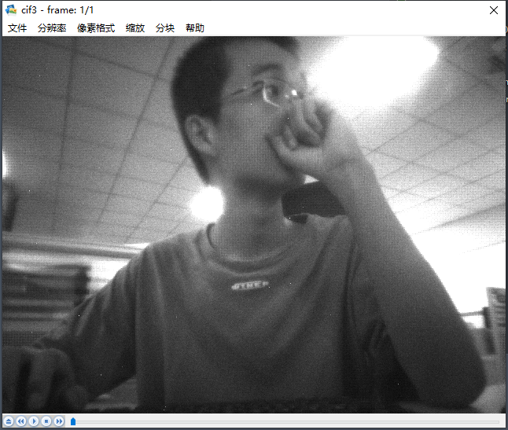

**曝光与噪点**

曝光是用来计算从景物到达相机的光通量大小的物理量。图像传感器只有获得正确的曝光，才能得到高质量的照片。曝光过度，图像看起来太亮曝光不足，则图像看起来太暗。到达传感器的光通量的大小主要由两方面因素决定：曝光时间的长短以及光圈的大小。噪点严重的原图与进行降噪处理后的对比，可以通过长时间曝光降低噪点。长时间曝光也会产生噪点，是因为感光元件的温度升。**曝光时间过长，会导致每一帧所用的时间过长，造成图像卡顿**。因此曝光时间越长，一帧图像上的跑步者运动的过程就越长，因此被拍摄的跑步者就会变模糊。如果曝光时间很短，一帧图像中的跑步者在这个曝光时间内运动的过程也会很短，图像也就越清晰。高速摄影也是这个原理。


燥点（hot pixel）：CCD和CMOS感光元件都存在有热稳定性的问题，就是对成象的质量和温度有关，如果机机的温度升高，噪音信号过强，会在画面上不应该有的地方形成杂色的斑点，这这些点就是我们所讲的燥点。各个品牌各种型号的相机对燥点的控制能力也不尽相同，同一型号怕相机也有一定的个体差异，也有些相机有降燥功能。但燥点问题是现在所有DC都没能完全克服的问题（调高感光度(ISO)，特别是长时间曝光、或相机温度升高时）。 


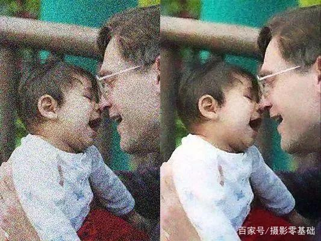

**白平衡**

白平衡与色温，并不是一件事情。先说色温，任何发光物体都具有色温，说白了色温就是衡量物体发光的颜色。与一般认知不同，红色黄色是低色温，一般只有3000K以下，白色是6000K左右，而蓝色是高色温，实际色温是10000K以上。

相机记录颜色，虽然依靠的是亮度信息，但是相机也需要对色彩进行判断，从而获得一个色彩基准，来还原准确的拍摄环境。这其中最重要的，就是我们常说的白平衡。

白平衡与色温，并不是一件事情。先说色温，任何发光物体都具有色温，说白了色温就是衡量物体发光的颜色。与一般认知不同，红色黄色是低色温，一般只有3000K以下，白色是6000K左右，而蓝色是高色温，实际色温是10000K以上。

- 冷光，色温高，偏蓝
- 暖光，色温低，偏红

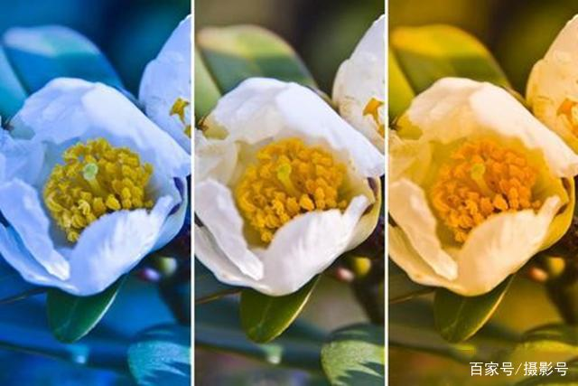


**增益**

增益是摄像机传感器接收到原始景物的光后，在光电转换过程中，对原始的光进行调大或调小的过程。如果这时是增益调大了，**我们的图象就会比实际的亮，相反就会更暗**。如果传感器很小或质量不是很好，增益后就有很多的噪点。

**AEC/AGC**

AEC/AGC 都是基于亮度进行调节的。AEC(auto exposure control) 调节曝光时间，AGC (auto gain control)调节增益值，最终使图像亮度落在设定亮度阈值范围内。

**Pixel Array**

 gc0308物理上的阵列是648H*492V，实际采样阵列是648H*488V，也是有效阵列。实际取像的阵列是640H*480V。如下图所示：

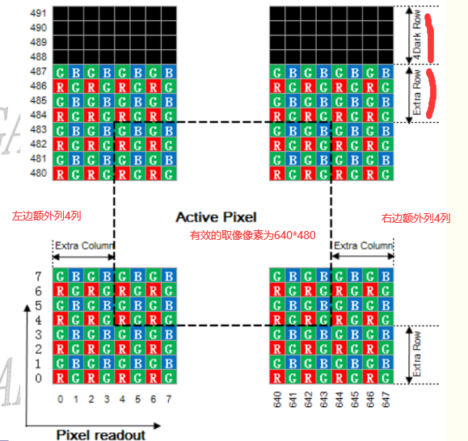

vsync: vertical synchronization,  指与显示器的帧数同步. 简单来说就是启用了vsync的渲染过程,帧数不会超过显示器的帧数, 一个同步会被执行. 同步的地方就是显示器扫描线结束最后一行扫描准备开始第一行扫描的地方.

hsync: horizonal synchronization, 相比于vsync来说, 同步的单位从帧降到行,即是保证操作不是在扫描一行的中间出现,而是同步到下一行.

VBLANK: 显示器扫描线完成最后一行后,需要重返左上角,这个过程叫做: vblank,也叫VBI(vertical blank interval) ,因为扫描线变得blank,以防止看到一个斜线显示在屏幕上.

 **空白无效行时间**（Vblank/Dummy line）=Bt+St+Et。

 首先要明白，物理上492行，但是实际感应光线的只有488行，4行是Dark Row，黑暗行；但是这488有数据的行中只有480行是有效行。

**3A成像控制技术**

3A技术即自动对bai焦（AF）、自动曝光（duAE）和自动白平衡（AWB）。3A数字zhi成像技术利用了AF自动对焦算法dao、AE自动曝光算法及AWB自动白平衡算法来实现图像对比度最大、改善主体拍摄物过曝光或曝光不足情况、使画面在不同光线照射下的色差得到补偿，从而呈现较高画质的图像信息。采用了3A数字成像技术的摄像机能够很好的保障图像精准的色彩还原度，呈现完美的日夜监控效果。

**HDR模式**

首先先来解读一下“HDR”这个词，英文全称“High-Dynamic Range”，翻译过来就是「高动态范围」，动态范围就是相机能够在按下快门之后记录下拍摄对象在最暗、最亮环境下的差异范围，连拍多种场景下的照片，通过算法将多张图片中每一场景下最好的部分合成一张照片输出，达到最佳的拍摄效果

**raw图中的黑点**

对于raw图片。软件显示也没做插值 ,就会出现以下的黑点。本身raw图片就是不如yuyv的这种经过isp处理过过得图片。

图像插值就是利用已知邻近像素点的灰度值（或rgb图像中的三色值）来产生未知像素点的灰度值，以便由原始图像再生出具有更高分辨率的图像。

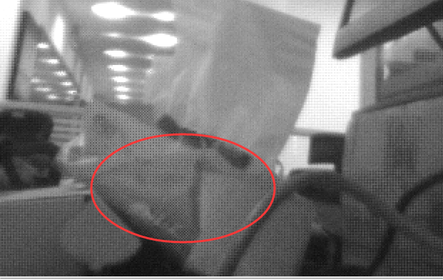

**Bayer格式**

Bayer格式是相机内部的原始图片, 一般后缀名为.raw。很多软件都可以查看, 比如PS。我们相机拍照下来存储在存储卡上的.jpeg或其它格式的图片, 都是从.raw格式转化过来的。如下图，为bayer色彩滤波阵列，由一半的G，1/4的R，1/4的B组成。

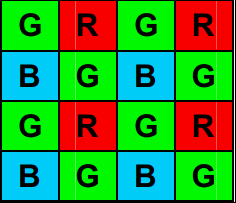


- raw定义

RAW图像（*RAW* Image Format。）就是CMOS或者CCD图像感应器将捕捉到的光源信号转化为数字信号的原始数据。Raw格式是sensor的输出格式，是未经处理过的数据，表示sensor接受 到的各种光的强度。 RAW文件是一种记录了数码相机传感器的原始信息，同时记录了由相机拍摄所产生的一些元数据（Metadata，如ISO的设置、快门速度、光圈值、白平衡等）的文件。RAW是未经处理、也未经压缩的格式，可以把RAW概念化为“原始图像编码数据”或更形象的称为“数字底片”。sensor的每一像素对应一个彩色滤光片，滤光片按Bayer pattern分布。将每一个像素的数据直接输出，即RAW RGB data

 Raw data是指原始的数据，单个pixle只能感应一种颜色。 

 Bayer RGB与RGB Raw的主要区别在于两者输出前经过的处理不同，Bayer RGB从ADC输出，只经过了LENS SHADING，GAMMA等模块处理而后就直接输出，而RGB Raw则经过了整个ISP模块的处理，最终是经过YUV422的数据转化而来的。


- raw数据顺序

Raw数据在输出的时候是有一定的顺序的，一般为以下四种: 
00： GR/BG 
01:   RG/GB 
10: BG/GR 
11:   GB/RG 
为什么每种情况里有两个G分量呢？这时因为人的眼睛对绿色比较敏感，所以增加了对绿色的采样。其中每个分量代表一个piexl。所以GR/BG就代表四个piexl，在物理sensor上就表示4个晶体管，用一个晶体管只采样一个颜色分量，然后通过插值计算得到每个piexl，这样做的主要目的是降低功耗。 sensor输出的数据一般要送到ISP中处理才会得到一个好的效果，这就需要ISP知道sensor输出的raw数据的顺序与大小，其中顺序一般通过配置ISP的pattern寄存器来实现，大小一般配置在ISP的输入格式控制寄存器中

Raw格式是sensor的输出格式，是未经处理过的数据，表示sensor接受 到的各种光的强度。
Raw数据在输出的时候是有一定的顺序的，一般为以下四种:。 

- raw数据几种常用的格式:

```
RAW8:
Raw8即是用8bits表示G/R/B/G中的一个分量,而不是使用8bits表示RG/GB四个分量。在sensor中，为了降低功耗，使用一个晶体来表示一种颜色，然后利用差值计算出相邻像素的值。
Raw10:
Raw10就是使用10bit表示上述的一个G/R/B/G，但是数据中是16bit的，高6位没用。

Raw12:
Raw12: 就是使用12bit表示上述的一个G/R/B/G，但是数据中是16bit的，高4位没用。
```

### 2. 2 摄像头技术原理

摄像头的数据输出格式一般分为**CCIR601、CCIR656、RAW RGB**等格式。

大嘴评述：这里的摄像头严格来说应该是传感器(sensor)，个人觉得**CCIR601和CCIR656更应该看做是一种标准和计算方式，而不应该是数据格式**，这里我觉得有些误导，不必深究，具体关于CCIR601和CCIR656感兴趣的朋友请自行查阅资料，这里只做简单介绍。

**RGB RAW格式**

RGB RAW格式的Sensor是将每个感光点感应到的RGB数值直接传送给Host，由Host来进行**插值**和特效处理。由此可见RGB RAW DATA才是真正的原始数据。RGB RAW DATA是指原始的数据，单个pixle只能感应一种颜色（RGB中的一种）。

Sensor的感光原理

​     **Sensor的感光原理是通过一个一个的感光点对光进行采样和量化，但在Sensor中，每一个感光点只能感光RGB三基色中的一种颜色（这个颜色可以理解为像素的一个颜色分量，并不是最终的图像显示的颜色，最终图像显示的颜色是由RGB三个颜色分量组合构成，根据RGB三个颜色分量的值不同，组合成不同的颜色）。所以，通常所说的30万像素或130万像素等，指的是有30万或130万个感光点，每一个感光点只能感光一种颜色**。

CCIR601或656的格式

​    **要还原一个真正图像，需要每一个点都有RGB三种颜色**，所以，对于CCIR601或656的格式，在Sensor模组的内部会有一个ISP模块，会将Sensor采集到的数据进行插值和特效处理，例如：**如果一个感光点感应的颜色是R，那么，ISP模块就会根据这个感光点周围的G、B感光点的数值来计算出此点的G、B值，那么，这一点的RGB值就被还原了**，然后在编码成601或656的格式传送给Host。


ISP(Image Signal Processor)，即图像信号处理器。

DSP（Data Signal Processor），即数字信号处理器

ISP的主要作用是对**前端图像传感器输出**的信号做后期处理，主要功能有线性纠正、噪声去除、坏点去除、内插、白平衡、自动曝光控制等。ISP一般用来处理Image Sensor（图像传感器）的输出数据，如做AEC（自动曝光控制）、AGC（自动增益控制）、AWB（自动白平衡）、色彩校正、Lens Shading、Gamma 校正、祛除坏点、Auto Black Level、Auto White Level等等功能的处理。ISP是一类特殊的处理图像信号的DSP


## 3 rk2206拍照命令

raw8的其中格式。下图前4中是8位采集格式

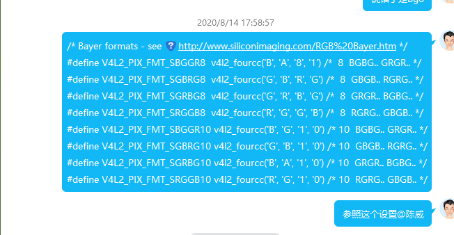


如下命令创建文件cif.out,cif.jpeg，并抓图数据保存到cif.out,cif.jpeg。

````shell
file.setpath A:
file.mf cif.out
file.mf cif.jpeg
vicap_test dev_create
vicap_test dev_set --set-dev=vicap_0 --set-workmode=block --set-blocks=6 --set-format=fourcc=NV12,width=640,height=480 --stream-buf=8 --stream-count=1 --stream-mode=photo --skip-count=20
vicap_test dev_streamon
````

用rggb采集8位数据

```shell

file.setpath A:
file.mf cif.out
file.mf cif.jpeg
vicap_test dev_create
vicap_test dev_set --set-dev=vicap_0 --set-workmode=block --set-blocks=6 --set-format=fourcc=RGGB,width=640,height=480 --stream-buf=8 --stream-count=1 --stream-mode=photo --skip-count=20
vicap_test dev_streamon
```


```
file.setpath A:
file.mf cif.out
file.mf cif.jpeg
vicap_test dev_create
vicap_test dev_set --set-dev=vicap_0 --set-workmode=block --set-blocks=6 --set-format=fourcc=BGGR,width=640,height=480 --stream-buf=8 --stream-count=1 --stream-mode=photo --skip-count=20
vicap_test dev_streamon
```


如果要修改照片的输出格式，比如修改为BG8

```shell
vicap_test dev_set --set-dev=vicap_0 --set-workmode=block --set-blocks=6 --set-format=fourcc=RAW8,width=640,height=480 --stream-buf=8 --stream-mode=photo --skip-count=20


vicap_test dev_set --set-dev=vicap_0 --set-workmode=block --set-blocks=6 --set-format=fourcc=RGGB,width=640,height=480 --stream-buf=8 --stream-mode=photo --skip-count=20
```

```shell
YUYV

vicap_test dev_set --set-dev=vicap_0 --set-workmode=block --set-blocks=6 --set-format=fourcc=YUYV,width=640,height=480 --stream-buf=8 --stream-mode=photo --skip-count=20


vicap_test dev_set --set-dev=vicap_0 --set-workmode=block --set-blocks=6 --set-format=fourcc=GREY,width=640,height=480 --stream-buf=8 --stream-mode=photo --skip-count=20

vicap_test dev_set --set-dev=vicap_0 --set-workmode=block --set-blocks=6 --set-format=fourcc=RGGB,width=640,height=480 --stream-buf=8 --stream-mode=photo --skip-count=20


vicap_test dev_set --set-dev=vicap_0 --set-workmode=block --set-blocks=6 --set-format=fourcc=GRBG,width=640,height=480 --stream-buf=8 --stream-mode=photo --skip-count=20


vicap_test dev_set --set-dev=vicap_0 --set-workmode=block --set-blocks=6 --set-format=fourcc=BA81,width=640,height=480 --stream-buf=8 --stream-mode=photo --skip-count=18
vicap_test dev_streamon


vicap_test dev_set --set-dev=vicap_0 --set-workmode=block --set-blocks=6 --set-format=fourcc=GRBG,width=640,height=480 --stream-buf=8 --stream-mode=photo --skip-count=18
vicap_test dev_streamon
```


查看BG8下的帧率

```shell
vicap_test dev_set --set-dev=vicap_0 --set-workmode=block --set-blocks=6 --set-format=fourcc=BG8,width=640,height=480 --stream-buf=8 --stream-mode=photo --skip-count=20
```


```
嗯 可能刚才没说清楚：
1、如果sensor物理上输出的是UYVY，那sensor驱动里，pixelcode是要配置成raw8的mediabus，vicap，也要设置成raw8的mediabus；
2、如果sensor物理上输出的是NV12/NV16，那sensor驱动里，pixelcode要配置成对应的yuv的mediabus，vicap也是；
3、如果sensor物理上输出的是raw8，那sensor驱动和vicap也是要对应的raw8的mediabus

```


## 4. 摄像头调式步骤

查看RK2206 EVB11焊盘

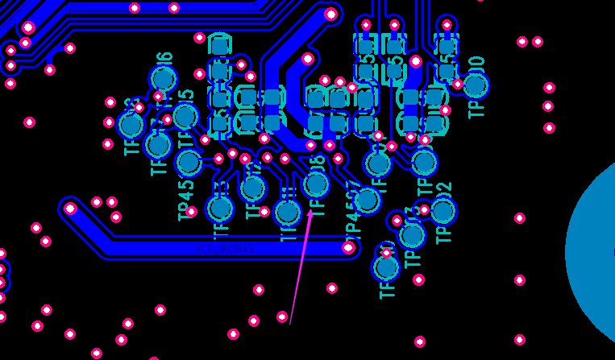

按z切换图层 再输入4。查看焊盘摄像头调式是核心思想，是你的软件运行到什么步骤，摄像头的硬件输出波形是否正常。

软件第一步：初始化IIC

比如使能摄像头的pwdn进入工作模式。检查pwdn

摄像头调试前需要确认的信息：先确保硬件供电范围正常。（也就是软件上你要是能pwn）

````
确认硬件接口，摄像头封装。是dvp还是mipi或者是lvds，同一个摄像头的不同的硬件接口初始化的配置数组是不一样的。而且dvp接口是D0-D11,你是用到高8位还是全部的12位，这也有所不同，图片格式不同，raw8或者是raw12。
其中常用dvp接口，数据线有D0-D11。摄像头模组内部封装。sc031dvp csp封装只有8位，dvp接高8bit就可以。

摄像头IIC的地址，读写的IIC标志位， 寄存器地址是16位还是8位，如果是16位的话是先发高8位还是先发低8位。

确认摄像头输出图像的格式，是yuv还是raw还是其他，图像的大小是多少，640H*480V,是水平640像素，高480像素，
这里的宽高定义看自己的软件定义，比如rk2206平台这里认为宽640高480。

硬件调试，确认在写入寄存器之前，powerdown也就是PDN引脚是不是使能（确认高使能还是低使能）。软件的步骤，第一步是读取摄像头ID，这一步判断IIC是否读正常。第二步，写入寄存器初始化数组初始化寄存器。第三步：写stream on寄存器，启动像素时钟开始拍照。（这时候检查摄像头的PCLK引脚正常的话应该有波形）。如果PCLK没有波形，检查输出时钟MCLK是否有24MHZ。再检查摄像头的供电电压是否正常。

软件进行调试之前，建议PWN一直处于使能状态，stream off函数注释掉，这样方便观察到波形。
````

### 1 IIC读取摄像头ID失败

摄像头初始化前的，第一步是读取摄像头型号的ID，如果IIC没有读取到信息，软件上就会显示IIC读失败日志。

IIC读取失败的调试方法,

1. **检查IIC软件配置**

IIC 一共两根线，一根数据线和一根时钟线clk。IIC是半双工，IIC走线最长40CM。

IIC Slave address 设备地址一般是7位也有10位的。7位的情况下，比如0x30，这时候低位补0是写，低位补1是读。

IIC 确认读写的寄存器地址位数。如果是16位寄存器地址，要检查主机需要先发高8位，然后再发8位，或者反过来。


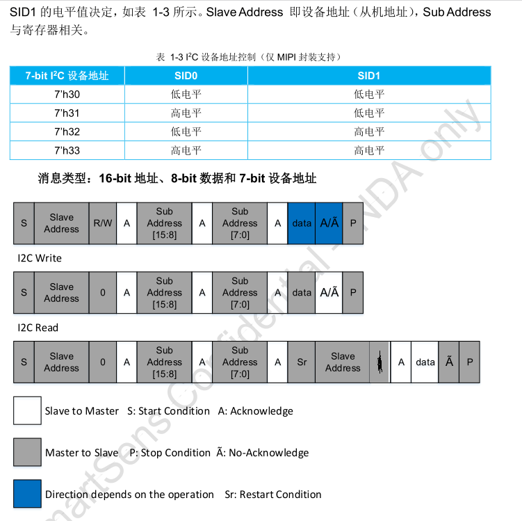

上图是sc031gs的时序图。

```
iic读：
第一个图是读写的框图：
主机发一个START开始位，再发7位从机设备地址，再发一位R/W标志（0是写，1是读）==》 从机回复ACK应答 ==》 再发寄存器的高8位地址 ==》 从机回复ACK应答  ==》 再发寄存器的低8位地址 ==》 从机回复ACK应答和数据和应答位或停止位。 ==》 主机发送Pasue 停止位

第二个图是写框图：
主机发一个START开始位，再发7位从机设备地址，再发一位W标志0 ==》 从机回复ACK应答 ==》 再发寄存器的高8位地址 ==》 从机回复ACK应答  ==》 再发寄存器的低8位地址 ==》 从机回复ACK ==》 主机发送数据 ==》 从机回复应答或者无应答 ==》 主机发送一个停止位


第二个图是读框图：
主机发一个START开始位，再发7位从机设备地址，再发一位W标志0 ==》 从机回复ACK应答 ==》 再发寄存器的高8位地址 ==》 从机回复ACK应答  ==》 再发寄存器的低8位地址 ==》 从机回复ACK ==》 主机发送数据 ==》 从机回复应答或者无应答 ==》 主机发送一个停止位
```

### 2 示波器检查IIC读取摄像头ID的波形

检查配置后，确认无误后，还是读取摄像头ID失败了。

由于软件上第一步就是读取摄像头ID，读取失败了就终止运行了

```
20200811_17：43:28RK2206>factory.camera
20200811_17：43:28(rk_camera_init) enter
20200811_17：43:28[A.14.00][000042.535975]find device class_id:DEV_CLASS_I2C
20200811_17：43:28[A.14.00][000042.542805][SC031GS]:(0 &I&I&I&[sensor_0]:enable cif clk
20200811_17：43:28[A.14.00][000042.544557][sensor_0]:Info:get the clk gate id:0x7e
20200811_17：43:28[A.14.00][000042.550185][SC031GS]:(rt_gc2145_detect_sensor) enter
20200811_17：43:28[A.14.00][000042.555982]Err: SC031GS i2c read err!
20200811_17：43:28[A.14.00][000042.560431][sensor_0]:ERROR: SC031GS i2c read failed !!!
20200811_17：43:28[A.14.00][000042.571702][SC031GS]:(rk_camera_init) probe failed !!!
20200811_17：43:28[A.14.00][000042.577663][ERR] app-camera: camera init failed!
20200811_17：43:28[A.14.00][000042.582706][fac]
20200811_17：43:28[A.14.00][000042.582748]camera_open is start!
20200811_17：43:28[A.14.00][000042.588501]
20200811_17：43:28[A.14.00][000042.588518]find device class_id:DEV_CLASS_VICAP
20200811_17：43:28[A.14.00][000042.597069][ERR] app-camera: the device:vicap_0 is not found.
20200811_17：43:28[A.14.00][000042.602363][ERR] app-camera: open vicap failed!
20200811_17：43:28[A.14.00][000042.608827][fac]
20200811_17：43:28[A.14.00][000042.608881]
```


     起始信号：当 SCL 线是高电平时 SDA 线从高电平向低电平切换。
  停止信号：当 SCL 线是高电平时 SDA 线由低电平向高电平切换。

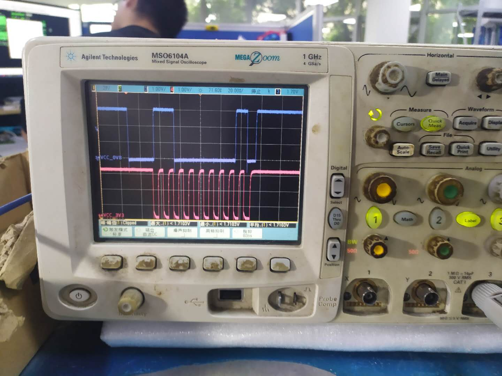

```shell

#define SC031GS_7BIT_ADDRESS         (0x30)
#define SC031GS_REG_ID_H_ADDRESS     (0x3107)
#define SC031GS_REG_ID_L_ADDRESS     (0x3108)
11000000 00
```

```shell
[A.14.00][000008.738480]find device class_id:DEV_CLASS_I2C
[A.14.00][000008.745306]find device class_id:DEV_CLASS_I2C
[A.14.00][000008.750421][gc2145]:(i2c_0):find i2c:
[A.14.00][000008.750533][sensor_0]:enable cif clk
[A.14.00][000008.754022][sensor_0]:Info:get the clk gate id:0x7e
[A.14.00][000008.759651][gc2145]:(rt_gc2145_detect_sensor) enter
[A.14.00][000008.765361]I2cDev_ReadData ret1[sensor_0]:Info: GC2145 pid:0x0!
[A.14.00][000008.771997]I2cDev_ReadData ret1[sensor_0]:Info: GC2145 pid:0x0,ver:0x31!
[A.14.00][000008.779389][sensor_0]:Info: GC2145 detected successfully !!!
```

### 3  第二步不出图情况

通过上面的步骤 说明软件的第一步读出摄像头ID已经成功；

软件第二步写入初始化数组。找摄像头模组厂的FAE索要初始化数组。

软件第二步写stream on寄存器启动摄像头的像素时钟PCLK;

摄像头寄存器

- 摄像头ID寄存器用于识别摄像头
- 初始化寄存器数组（设置了曝光、输出尺寸、图像模式、测试模式等、不同硬件接口不同的配置）
- stream on寄存器启动时钟(PCLK才有波形)
- stream off寄存器关闭时钟(PCLK无波形)

```shell
RK2206>I2cDev_ReadData ret1[sensor_0]:Info: GC2145 pid:0x0!
[A.VICAP][000043.822324]I2cDev_ReadData ret1[sensor_0]:Info: GC2145 pid:0x0,ver:0x31!
[A.VICAP][000043.829716][sensor_0]:Info: GC2145 detected successfully !!!
[A.VICAP][000043.840986][gc2145]:(rt_gc2145_detect_sensor) exit
[A.VICAP][000043.841728][gc2145]:(rk_gc2145_init) exit
[A.VICAP][000043.846600][gc2145]:(rk_gc2145_control) exit
[A.VICAP][000043.851724][vicap_0]:init subdev succe!
[A.VICAP][000043.856343][vicap_0]:len of input fmts:20
[A.VICAP][000043.861130][vicap_0]:input pixelcode:0x2006,mbus_code:0x2008
[A.VICAP][000043.872317][vicap_0]:input pixelcode:0x2006,mbus_code:0x2009
[A.VICAP][000043.878700][vicap_0]:input pixelcode:0x2006,mbus_code:0x2006
[A.VICAP][000043.885084][vicap_0]:the input format is:0x2006
[A.VICAP][000043.885576][vicap_0]:y len per block:0xc800
[A.VICAP][000043.890532][vicap_0]:the plane[0] size:0xc800, the total size of buf:0xc800
[A.VICAP][000043.901718][vicap_0]:the plane[1] size:0x6400, the total size of buf:0x12c00
[A.VICAP][000043.909363][vicap_0]:dma status: 0
[A.VICAP][000043.910104][gc2145]:(rk_gc2145_control) enter
[A.VICAP][000043.915312][gc2145]:(rk_gc2145_control) exit
[A.VICAP][000043.937699][vicap_0]:Err: take dqbuf sem failed, ret:0xffffffff!
[A.VICAP][000044.933554][VICAP-TEST]:dqueue buf failed,retry it,1!
[A.VICAP][000044.934878][vicap_0]:Err: take dqbuf sem failed, ret:0xffffffff!
```

- MCLK 给摄像头提供输入时钟

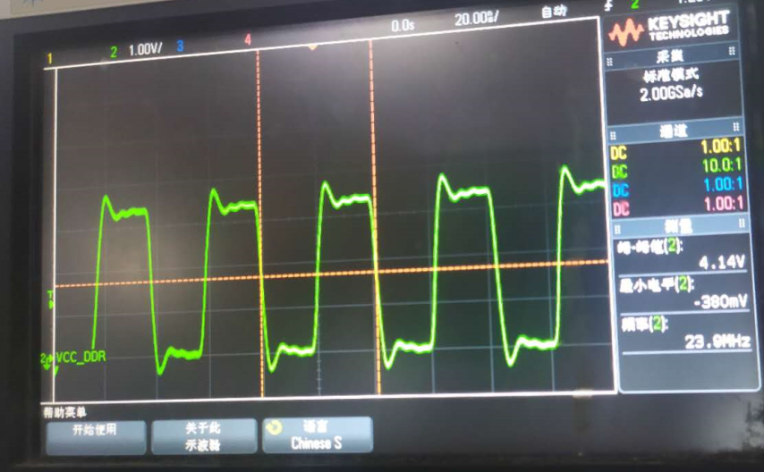

- XCLK摄像头输出时钟

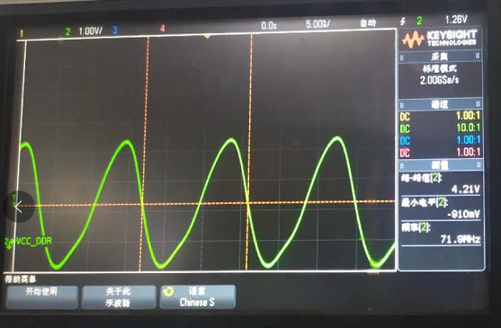

## 

## 6 参数说明

### 6.1  摄像头IIC设备地址

- 摄像头IIC设备地址是7位。

摄像头手册对于IIC设备地址不同厂家有些写8位，有些写7位。对于这些8位的，你需要手动右移动一位，也就是只取高7位。最后一位是读或写。

一般来说IIC的读写地址是7位的，再加1位读写标志位（写0读1）。一共8位，组成写地址和读地址。

下面举例不同的摄像头

GC032A

```
GC032A Device Address:
serial bus write address = 0x42, serial bus read address = 0x43

0x42 = 01000010   右移一位   00100001 = 0x21
0x43 = 01000011   右移一位   00100001 = 0x21
#define GC032A_7BIT_ADDRESS  (0x21)
```

GC0308

```
GC0308 Device Address:
serial bus write address = 0x42, serial bus read address = 0x43

0x42 = 01000010 右移一位。 00100001 = 0x21
0x43 = 01000011 右移一位。 00100001 = 0x21
#define GC032A_7BIT_ADDRESS  (0x21)
```

SCO31GS

```
SCO31GS  serial bus write address = 0X60, serial bus read address = 0X61
0x60= 0110 0000  右移动一位 0011 0000=0x30
0x61= 0110 0001  右移动一位 0011 0000=0x30
#define SC031GS_7BIT_ADDRESS         (0x30)
```

SCO329调试中

```
SCO329 读0x62 写0x63
写0x63= 0110 0011  右移动一位 0011 0001=0x31
读0x62= 0110 0010  右移动一位 0011 0001=0x31

#define SC0329_7BIT_ADDRESS         (0x31)
```

BF20A6调试中

````
SCO329 读0xdc 写0xdd
write address = 0xdc = 11011100b  右移动一位 0110 1110b= 0x6E
read address = 0xdd = 11011101b   右移动一位 0110 1110b= 0x6E

Note: Two-wire serial interface device address of BF20A6 is 7’b1101110 (0X6e), it doesn’t include W/R
bit.
````

###  6.3  MCLK

 mclk配置错会怎么样,以比亚迪BF20A6摄像头为例，工作时MCLK单片机提供12MHZ。如果我抬高MCLK到24MHZ的图片也许会出现错位的情况。 原因应该是mclk抬高了，行场信号有错位。

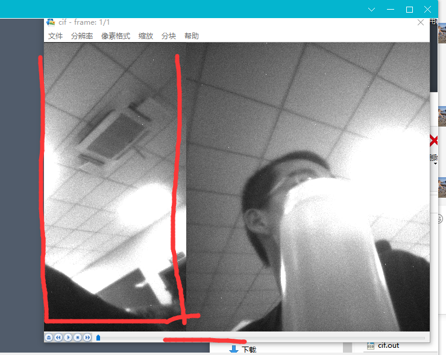

```c
RK2206>[INFO]: BF20A6: Info: BF20A6 detected successfully !!!  chip id:0x20a6 
[A.VICAP][000022.420940][  36C][DBG]: BF20A6:(rt_bf20a6_detect_sensor) exit 
[A.VICAP][000022.427070][  35C][DBG]: BF20A6:(rk_bf20a6_init) exit 
[A.VICAP][000022.433705][  35C][DBG]: BF20A6:(rk_bf20a6_control) exit 
[A.VICAP][000022.439585][  36C][vicap_0]:init subdev succe!
[A.VICAP][000022.442902][  35C][vicap_0]:len of input fmts:20
[A.VICAP][000022.448117][  36C][vicap_0]:input pixelcode:0x3001,mbus_code:0x2008
[A.VICAP][000022.457141][  36C][vicap_0]:input pixelcode:0x3001,mbus_code:0x2009
[A.VICAP][000022.464113][  35C][vicap_0]:input pixelcode:0x3001,mbus_code:0x2006
[A.VICAP][000022.471088][  35C][vicap_0]:input pixelcode:0x3001,mbus_code:0x2007
[A.VICAP][000022.478057][  34C][vicap_0]:input pixelcode:0x3001,mbus_code:0x3001
[A.VICAP][000022.485029][  36C][vicap_0]:the input format is:0x3001
[A.VICAP][000022.488355][  36C][vicap_0]:y len per block:0xc800
[A.VICAP][000022.494308][  35C][vicap_0]:the plane[0] size:0xc800, the total size of buf:0xc800
[A.VICAP][000022.503429][  36C][vicap_0]:the plane[1] size:0x6400, the total size of buf:0x12c00
[A.VICAP][000022.511660][  35C][vicap_0]:dma status: 0
[A.VICAP][000022.516578][  36C]ratio:1,bpp:8
[A.VICAP][000022.521245][  36C][DBG]: BF20A6:(rk_bf20a6_control) enter 
[A.VICAP][000022.527911][  35C][DBG]: BF20A6:(bf20a6_stream_on) enter 
[A.VICAP][000022.534127][  36C][vicap_0]:vicap was triggered err,intstat:0x206
[a][000022.581071][DBG]: BF20A6:Success: bf20a6 init table has ok witre [DBG]: BF20A6:(bf20a6_stream_on) exit 
[A.VICAP][000022.593827][  36C][DBG]: BF20A6:(rk_bf20a6_control) exit 
[A.VICAP][000022.599873][  37C][vicap_0]:vicap was triggered err,intstat:0xa
[a][000022.786970][vicap_0]:vicap was triggered err,intstat:0x4000
[a][000022.792181][VICAP-TEST]:has skipped 18 frames
[A.VICAP][000025.209390][  35C][vicap_0]:dma status: 0
[a][000025.500189][DBG]: BF20A6:(rk_bf20a6_control) enter 
[A.VICAP][000025.506428][  36C][DBG]: BF20A6:(bf20a6_stream_off) enter 
[A.VICAP][000025.512619][  35C][DBG]: BF20A6:(bf20a6_stream_off) exit 
[A.VICAP][000025.518835][  35C][DBG]: BF20A6:(rk_bf20a6_control) exit 
[A.VICAP][000025.524963][  36C]create file clus = 0clus = 0, i = 16, name = CIF     YUV
[A.VICAP][000027.444931][  36C]delete thread classId = -1, objectid = 7, name = VICAPTestTask, remain = 5507776.
[A.VICAP][000027.452969][  36C]
RK2206>
```

## 7 vicap


601/5000

The Video Capture视频捕获，通过DVP从Camera接收数据，并将数据传输到
系统主存通过AXI总线。
VICAP的功能如下：
支持BT601 YCbCr 422 8bit输入
支持BT656 YCbCr 422 8位输入
支持UYVY / VYUY / YUYV / YVYU可配置
支持RAW 8/10/12位输入
支持JPEG输入
支持窗口裁剪
写入内存时支持虚拟步幅
支持Y和UV的不同存储地址
支持422/420/400输出
支持一帧/一帧乒乓/块乒乓模式
支持pixel_clk，hsync，vsync极性可配置

本章用于说明VICAP如何工作的操作行为。 如果是YUV422或从外部设备接收到ccir656信号，VICAP将其转换为YUV422 / 420数据，
并将数据分离为Y和UV数据，然后通过AXI总线将其存储到不同的内存中分别。

### 7.1 框图

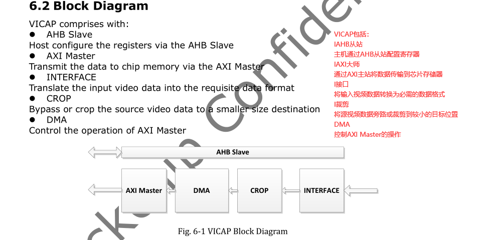

### 7.2 帧信号与行信号的触发模式

- 支持Vsync高触发或低触发

- 支持href高触发或低触发

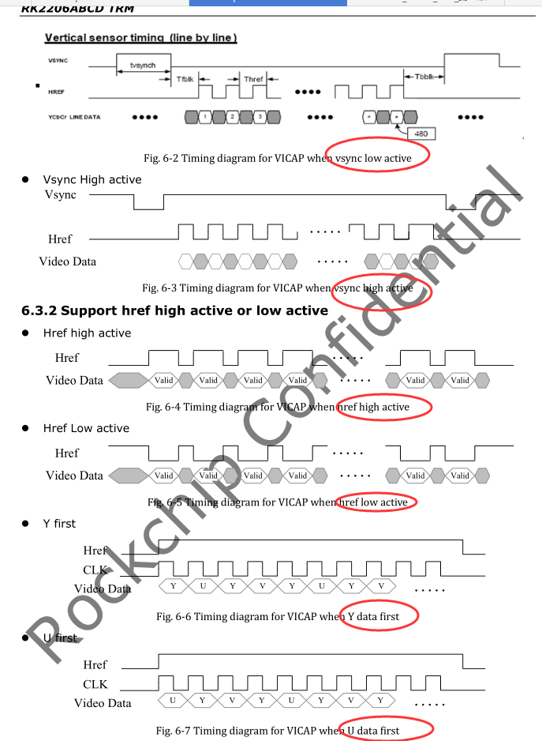


- 支持565和raw data

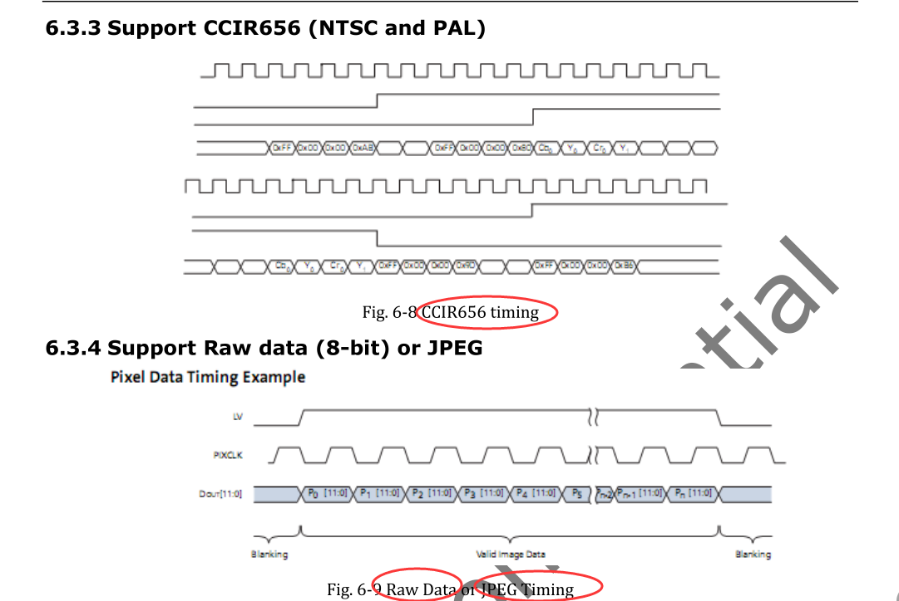

### 7.3 工作模式

VICAP模块可以在三种模式下工作：一帧停止模式，帧乒乓模式，帧阻塞模式。

- One frame stop mode一帧停止模式
  在此模式下，将参数WORK_MODE配置为一帧停止模式。一经捕获帧后，VICAP将自动停止并设置FRAME_STATUS的状态。 VICAP将
  在用户清除FRAME_STATUS之前，不要捕获传感器数据。 Y / UV的地址是依次为FRAME0_ADDR或FRAME1_ADDR。

  

- Frame Ping-Pong mode帧乒乓模式

捕获一帧（F1）后，VICAP将开始自动捕获下一帧（F2），并且主机必须分配frame1的新地址指针并清除frame1状态，因此
VICAP将自动捕获第三帧（通过新的F1地址），并且不停止并对于以下帧，依此类推。但是，如果主机未更新帧缓冲区地址，则
VICAP将使用以下帧数据覆盖存储在存储器中的帧前数据。


-  Block Ping-Pong mode阻塞乒乓模式
在此模式下，VICAP将以块为单位工作。块的行数取决于BLOCK_LINE_NUM的配置。依次接收块0和块1。什么时候block0 / 1完成后，将设置BLOCK_STATUS，用户应清除及时BLOCK_STATUS。当下一个块0/1开始接收时，如果BLOCK_STATUS_0 / 1未清除，当前帧的其余部分将被丢弃。

- Storage存储

YUV模式和RAW模式之间的区别在于YUV模式或CCIR656中的区别模式，则数据将存储在Y数据缓冲区和UV数据缓冲区中，并且如果the only y mode模式是选择的UV数据不会被存储。

在RAW或JPEG模式下，RGB数据将为存储在同一缓冲区中。
在YUV模式或RAW8模式下，Y，U或V在内存中的都是1个字节表示；
在Raw10 / 12或JPEG模式下，宽度为半字。

- CROP 裁剪

参数START_Y和START_X定义了作物起点的坐标。 裁切后的帧大小遵循SET_WIDTH和SET_HEIGHT的值。

## 8 举例错误情况


### 关于sensor驱动里的格式配置 与 vicap命令的输出格式配置

```
黄江龙 17:28:53
嗯 可能刚才没说清楚：
1、如果sensor物理上输出的是UYVY，那sensor驱动里，pixelcode是要配置成raw8的mediabus，vicap，也要设置成raw8的mediabus；
2、如果sensor物理上输出的是NV12/NV16，那sensor驱动里，pixelcode要配置成对应的yuv的mediabus，vicap也是；
3、如果sensor物理上输出的是raw8，那sensor驱动和vicap也是要对应的raw8的mediabus

黄江龙 17:30:05
所以 你现在要采集UYVY的话，sensor和vicap命令都要设置为raw8的mediabus；
sensor驱动的media pixelcode运行起来，vicap是不会去改的，

檵 17:34:12
现在摄像头物理是YUYV，我senseor驱动 BGGR/GBRG8/GRBG/RGGB任一中，如MEDIA_BUS_FMT_SBGGR8_1X8;   然后vicap命令必须对应是 --set-format=fourcc=BGGR
```

[a][000040.399630]DVP_LAST_LINE[0x43000068]:0x1e0
[a][000040.393914]DVP_LAST_PIX[0x4300006c]:0x500

0x1e0:      0xeo = 224

0x500:    


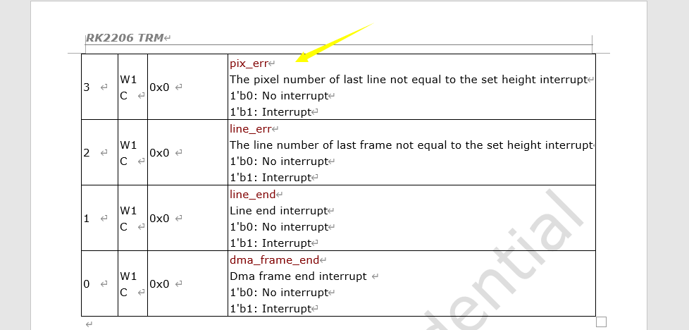

**YUVY格式（属于YUV422）**


    YUYV为YUV422采样的存储格式中的一种，相邻的两个Y共用其相邻的两个Cb、Cr，分析，对于像素点Y'00、Y'01 而言，其Cb、Cr的值均为 Cb00、Cr00，其
他的像素点的YUV取值依次类推。

**（2） UYVY 格式 （属于YUV422）**

UYVY格式也是YUV422采样的存储格式中的一种，只不过与YUYV不同的是UV的排列顺序不一样而已，还原其每个像素点的YUV值的方法与上面一样。

 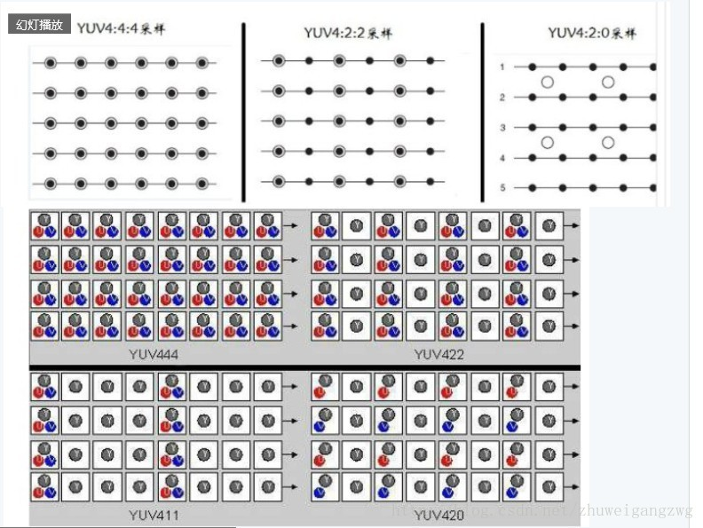

YUV与像素的关系：

YUV是利用一个亮度（Y）、两个色差(U,V)来代替传统的RGB三原色来压缩图像。

传统的RGB三原色使用红绿蓝三原色表示一个像素，每种原色占用一个字节（8bit），因此一个像素用RGB表示则需要8x3=24bit。

如果使用YUV表示这个像素，假设YUV的采样率为：4：2：0，即每一个像素对于亮度Y的采样频率为1，对于色差U和V，则是每相邻的两个像素各取一个U和V。对于单个的像素来说，色差U和V的采样频率为亮度的一半。如有三个相邻的像素，如果用RGB三原色表示，则共需要占用：8btytex3 原色x3像素=72bits；如果采用YUV（4：2：0）表示，则只需要占用：8x3（Y）+ 8x3x0.5（U）+8x3x0.5（V）= 36bits。只需原来一半的空间，就可以表示原来的图像，数据率压缩了一倍，而图像的效果基本没发生变化。


一般描述一幅图像的参数时我们会考虑以下几点：

1、宽：一行有多少个像素点。

2、高：一列有多少个像素点。

3、YUV格式还是RGB格式？

4、一行多少个字节？5、图像大小是多少？6、图像的分辨率是多少？

1920x1080像素的YUV422的图像，大小是1920X1080X2=4147200（十进制），也就是3.95M大小。

在内存种中这样排列：Y0U0Y1V0 Y2U1Y3V1…

第一个像素的YUV值为：Y0 U0 V0

第二个像素的YUV值为： Y1 U0 V0

第三个像素的YUV值为： Y2 U1 V1

（1） YUV 4:4:4

YUV三个信道的抽样率相同，因此在生成的图像里，每个象素的三个分量信息完整（每个分量通常8比特），经过8比特量化之后，未经压缩的每个像素占用3个字节。

下面的四个像素为: [Y0 U0 V0] [Y1 U1 V1] [Y2 U2 V2] [Y3 U3 V3]

存放的码流为: Y0 U0 V0 Y1 U1 V1 Y2 U2 V2 Y3 U3 V3

（2） YUV 4:2:2

每个色差信道的抽样率是亮度信道的一半，所以水平方向的色度抽样率只是4:4:4的一半。对非压缩的8比特量化的图像来说，每个由两个水平方向相邻的像素组成的宏像素需要占用4字节内存（亮度2个字节,两个色度各1个字节）。。

下面的四个像素为: [Y0 U0 V0] [Y1 U1 V1] [Y2 U2 V2] [Y3 U3 V3]

存放的码流为: Y0 U0 Y1 V1 Y2 U2 Y3 V3

映射出像素点为：[Y0 U0 V1] [Y1 U0 V1] [Y2 U2 V3] [Y3 U2 V3]

（3） YUV 4:1:1

4:1:1的色度抽样，是在水平方向上对色度进行4:1抽样。对于低端用户和消费类产品这仍然是可以接受的。对非压缩的8比特量化的视频来说，每个由4个水平方向相邻的像素组成的宏像素需要占用6字节内存（亮度4个字节,两个色度各1个字节）。

下面的四个像素为: [Y0 U0 V0] [Y1 U1 V1] [Y2 U2 V2] [Y3 U3 V3]

存放的码流为: Y0 U0 Y1 Y2 V2 Y3

映射出像素点为：[Y0 U0 V2] [Y1 U0 V2] [Y2 U0 V2] [Y3 U0 V2]

（4）YUV4:2:0

4:2:0并不意味着只有Y,Cb而没有Cr分量。它指得是对每行扫描线来说，只有一种色度分量以2:1的抽样率存储。相邻的扫描行存储不同的色度分量， 也就是说，如果一行是4:2:0的话，下一行就是4:0:2，再下一行是4:2:0…以此类推。对每个色度分量来说，水平方向和竖直方向的抽样率都是 2:1，所以可以说色度的抽样率是4:1。对非压缩的8比特量化的视频来说，每个由2x2个2行2列相邻的像素组成的宏像素需要占用6字节内存（亮度4个字节,两个色度各1个字节）。

下面八个像素为：[Y0 U0 V0] [Y1 U1 V1] [Y2 U2 V2][Y3 U3 V3][Y5U5 V5] [Y6 U6 V6] [Y7U7 V7] [Y8 U8 V8]

存放的码流为：Y0 U0 Y1 Y2 U2 Y3

Y5V5 Y6 Y7 V7 Y8

映射出的像素点为：[Y0 U0 V5] [Y1 U0 V5] [Y2 U2 V7] [Y3 U2 V7]

[Y5U0 V5] [Y6 U0 V5] [Y7U2 V7] [Y8 U2 V7]

