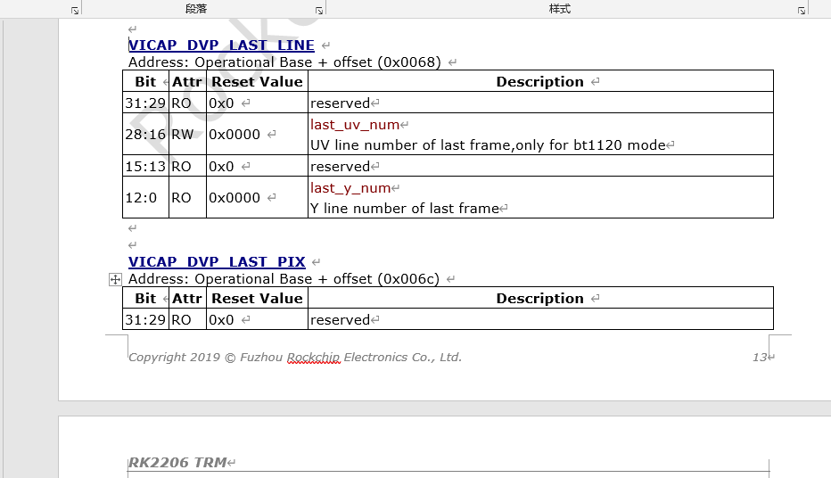

## 1. 硬件接口

使用前，请获得摄像头模组资料，查看摄像头内部芯片电路与外部的接口连接情况

### 1.1 DVP


**输入**

| 引脚                     |                                                              |
| ------------------------ | ------------------------------------------------------------ |
| RESET                    | 复位管脚。有些摄像头没有这个硬件复位脚。此方式为硬复位模式，camera的各个IO口恢复到出厂默认状态。只有在XCLK开启后，将RESET置为低，硬复位才有效，否则复位无效。 |
| XCLK（或EXTCLK）(或mclk) | camera的工作时钟管脚（如12MHz master clock 单片机提供给摄像头的时钟），此管脚为主机提供camera的工作时钟。 |
| PWDN                     | 使能管脚。两种配置方式，一种为standby，一种是normal work，设置为standby的时候，一切对camera的操作都是无效的，包括复位。所以在RESET之前，一定要将PWDN管脚设置为normal模式，否则RESET无效。 |
| IIC（SCK,SDA）           | 主机和camera通信总线. 读和写操作                             |

**输出**

| 引脚             |                                                              |
| ---------------- | ------------------------------------------------------------ |
| data             | 数据管脚。此数据脚可以输出的格式有YUV、RGB、JPEG等。         |
| VSYNC（或FSYNC） | 帧同步信号管脚。一个VYSNC信号结束表示一帧（即一个画面）的数据已经输出完毕 |
| HSYNC(或LREF)    | 行同步信号管脚。一个HSYNC信号结束表示一行的数据已经输出完毕。 |
| PCLK             | 像素时钟同步信号管脚。一个PCLK信号结束表示一个像素点的数据已经输出完毕。软件上执行stream on开始输出流，才会有PCLK时钟 |

**电源总线** sensor一般是有三路电源

| 引脚  |                                       |
| ----- | ------------------------------------- |
| AVDD  | camera的模拟电源 （模拟电路供电AVCC） |
| DOVDD | camera的GPIO口数字电压（I/O 电源）    |
| DVDD  | camera的数字电源（数字电路供电VCC）   |

一般来说，要求先提供sensor的GPIO口电压，接着提供模拟电压，最后提供工作电压。时序如下图：


比如SC031GS 芯片分三路电源供电：DOVDD 外接 1.8V,AVDD 外接 2.8V，DVDD 外接 1.5V：


### 1.2 mipi


### 1.3  IIC上拉电阻

这个就要看你使用的单片机**是否有标准的IIC标准接口了**，如果你使用了标准的IIC接口，这个接口在使能的时候，引脚进入漏极开路模式，不过有一些单片机内部的上拉电阻可以使能，这样就省去了外部的上拉电阻，我用过AVR的，就是使能的内部的上拉电阻。但是如果是使用单片机的引脚模拟IIC协议的话，这个就得另说了，得看你的单片机引脚是否支持漏极开路模式或者上拉模式，不过一般推拉模式的输出引脚用在IIC里可能会有问题具体也没用过。

如下图RK2206上的DVP摄像头上面，I2C两根线都接了4.7k的电阻


I2C的上拉电阻可以是1.5K，2.2K，4.7K， 电阻的大小对时序有一定影响，对信号的上升时间和下降时间也有影响，一般接1.5K或2.2K

I2C上拉电阻确定有一个计算公式：
Rmin＝{Vdd(min)-o.4V}/3mA
Rmax=(T/0.874) *c,  T=1us 100KHz, T=0.3us 400KHz
C是Bus capacitance

Rp最大值由总线最大容限（Cbmax)决定,Rp最小值由Vio与上拉驱动电流（最大取3mA)决定；
于是 Rpmin=5V/3mA≈1.7K(@Vio=5V)或者2.8V/3mA≈1K(@Vio=2.8V)
Rpmax的取值：参考周公的I2C总线规范中文版P33图39与P35图44
总的来说：电源电压限制了上拉电阻的最小值 ； 负载电容（总线电容）限制了上拉电阻的最大值

补充：在I2c总线可以串连300欧姆电阻RS可以用于防止SDA和SCL线的高电压毛刺

   : I2c从设备的数量受总线电容,<=400pF的限制

**做过I2C碰到过各种问题，多**半是上拉电阻或者控制器时钟的问题。没上拉电阻或者上拉电阻过大，都会导致不稳定而出现寻址不到的问题。控制器时钟主频的话，主频667M八分频就可以

>  I2C时钟线和数据线为什么要接上拉电阻？

因为 I2C 的 IO 是开漏的，所以需要上拉电

因为允许把多个I2C总线器件连接到总线上，连接到I2C总线上的器件是漏极开路或集电极开路的，可以实现线与功能。同时，因为接了上拉电阻，在总线空闲期间，SDA和SCL都是高电平，可以防止外部干扰造成误启动I2C总线。
按照I2C的规范来讲，SDA和SCL都是需要上拉电阻的。当然如果你主控芯片的两个管脚具有内部上拉并且满足你的速率要求，也是可以省略外部上拉的。
“如果加上拉电阻，阻值根据什么来确定”
根据主控的管脚驱动能力、负载数量、走线长度、传输速率等因素共同决定。对于产品设计而言可以先选取经验参数、而后通过小批量实测波形来确定的。


#### 瑞芯微isp

RK ISP2.0 Components and Pipeline Introduce
Default Pixel Correction (DPC)
Video HDR Process (HDR)
Bayer image noise reduction (BNR)
Green Imbalance Correction (GIC)
Color Correction (CCM)
Contrast Enhance (Dehaze)
Lens Distortion Correction (LDC)
Temporal noise reduction (TNR)
Luminance noise reduction (YNR)
Chroma noise reduction (UVNR)
Image Edge Enhance (Sharpen)
Q&A

374/5000

RK ISP2.0组件和管道介绍
默认像素校正（DPC）
视频HDR流程（HDR）
拜耳图像降噪（BNR）
绿色失衡校正（GIC）
色彩校正（CCM）
对比度增强（除雾）
镜头畸变校正（LDC）
暂时降噪（TNR）
亮度降噪（YNR）
降低色度噪声（UVNR）
图像边缘增强（锐化）

### 2.2 ★调试原理

- camera 电源波纹过大

改善电源措施： 在模组端加大电容，改善电源线比如飞线和加粗电源线，或者更换更好的连接线。

-  调试CIS驱动，I2C失败原因排查？

1. sensor的7位 c地址是否正确，是否错误写为8位
2. mclk是否有输出，电压幅度是否正确
3. sensor的上电时序是否满足要求，主要包括avdd，dovdd，dvdd，power down，reset等

-   filcker 水波纹

交流电照明灯发出的光会一定频率的抖动导致sensor图像出现行方向的水波纹，称之为filcker。目前主要的交流电频率有50HZ和60HZ两种。为了避免出现flicker，要求曝光时间大于base值时必须是base的整数倍。

- 工频干扰消除(AFC)水波纹

  CMOS是行暴光，也就是在每行暴光时间决定了画面的亮度，举例：一个50HZ的光源，电压曲线为正弦曲线，那能量曲线定性分析可以认为是取了绝对值的电压曲线。那就是能量做1/100秒的周期变化。那就要求暴光的时间必须是1/100秒的整数倍。如果没有把暴光时间调整到1/100秒的整数倍，就有可能会有每行的暴光值不一样，造成同一个image上有水波纹现象。CCD是整帧同时暴光，所以，工频干扰表现的就是图像有轻微的闪烁。产生的原理与CMOS sensor的原理相似。

遇到画面亮度闪烁，可能的原因？如何解决

1. 工频闪烁，一般伴随水波纹上下移动，并且曝光时间不是1/(2\*工频)的整倍数，未开启抗闪需开启抗闪；已开启抗闪烁且曝光时间低于1/(2\*工频) 的场景，则考虑修改帧间隔位 1/(2*工频)的整数倍，以减轻闪烁固定水波纹

2. 无规律无特定场景的亮度闪烁，可检查CIS曝光参数是否正确，驱动与CIS曝光配置参数是否适配，可以打开AE LOG,进行debug

3. 按照一定周期有规律的亮暗来回切换，可能是曝光导致，建议开启爱尔log，进行debug。


### 2.3 摄像头技术原理

摄像头的数据输出格式一般分为**CCIR601、CCIR656、RAW RGB**等格式。

大嘴评述：这里的摄像头严格来说应该是传感器(sensor)，个人觉得**CCIR601和CCIR656更应该看做是一种标准和计算方式，而不应该是数据格式**，这里我觉得有些误导，不必深究，具体关于CCIR601和CCIR656感兴趣的朋友请自行查阅资料，这里只做简单介绍。

**RGB RAW格式**

RGB RAW格式的Sensor是将每个感光点感应到的RGB数值直接传送给Host，由Host来进行**插值**和特效处理。由此可见RGB RAW DATA才是真正的原始数据。RGB RAW DATA是指原始的数据，单个pixle只能感应一种颜色（RGB中的一种）。

Sensor的感光原理

​     **Sensor的感光原理是通过一个一个的感光点对光进行采样和量化，但在Sensor中，每一个感光点只能感光RGB三基色中的一种颜色（这个颜色可以理解为像素的一个颜色分量，并不是最终的图像显示的颜色，最终图像显示的颜色是由RGB三个颜色分量组合构成，根据RGB三个颜色分量的值不同，组合成不同的颜色）。所以，通常所说的30万像素或130万像素等，指的是有30万或130万个感光点，每一个感光点只能感光一种颜色**。

CCIR601或656的格式

​    **要还原一个真正图像，需要每一个点都有RGB三种颜色**，所以，对于CCIR601或656的格式，在Sensor模组的内部会有一个ISP模块，会将Sensor采集到的数据进行插值和特效处理，例如：**如果一个感光点感应的颜色是R，那么，ISP模块就会根据这个感光点周围的G、B感光点的数值来计算出此点的G、B值，那么，这一点的RGB值就被还原了**，然后在编码成601或656的格式传送给Host。

ISP(Image Signal Processor)，即图像信号处理器。

DSP（Data Signal Processor），即数字信号处理器

ISP的主要作用是对**前端图像传感器输出**的信号做后期处理，主要功能有线性纠正、噪声去除、坏点去除、内插、白平衡、自动曝光控制等。ISP一般用来处理Image Sensor（图像传感器）的输出数据，如做AEC（自动曝光控制）、AGC（自动增益控制）、AWB（自动白平衡）、色彩校正、Lens Shading、Gamma 校正、祛除坏点、Auto Black Level、Auto White Level等等功能的处理。ISP是一类特殊的处理图像信号的DSP

## 3 rk2206拍照命令

raw8的其中格式。下图前4中是8位采集格式


如下命令创建文件cif.out,cif.jpeg，并抓图数据保存到cif.out,cif.jpeg。

````shell
file.setpath A:
file.mf cif.out
file.mf cif.jpeg
vicap_test dev_create
vicap_test dev_set --set-dev=vicap_0 --set-workmode=block --set-blocks=6 --set-format=fourcc=NV12,width=640,height=480 --stream-buf=8 --stream-count=1 --stream-mode=photo --skip-count=20
vicap_test dev_streamon
````

用rggb采集8位数据

```shell
file.setpath A:
file.mf cif.out
file.mf cif.jpeg
vicap_test dev_create
vicap_test dev_set --set-dev=vicap_0 --set-workmode=block --set-blocks=6 --set-format=fourcc=RGGB,width=640,height=480 --stream-buf=8 --stream-count=1 --stream-mode=photo --skip-count=20
vicap_test dev_streamon

uart_xmodem w A:\CIF.YUV
```

```
file.setpath A:
file.mf cif.out
file.mf cif.jpeg
vicap_test dev_create
vicap_test dev_set --set-dev=vicap_0 --set-workmode=block --set-blocks=6 --set-format=fourcc=BGGR,width=640,height=480 --stream-buf=8 --stream-count=1 --stream-mode=photo --skip-count=20
vicap_test dev_streamon

uart_xmodem w A:\CIF.YUV
```

如果要修改照片的输出格式，比如修改为BG8

```shell
vicap_test dev_set --set-dev=vicap_0 --set-workmode=block --set-blocks=6 --set-format=fourcc=RAW8,width=640,height=480 --stream-buf=8 --stream-mode=photo --skip-count=20

vicap_test dev_set --set-dev=vicap_0 --set-workmode=block --set-blocks=6 --set-format=fourcc=RGGB,width=640,height=480 --stream-buf=8 --stream-mode=photo --skip-count=20
```

```shell
YUYV

vicap_test dev_set --set-dev=vicap_0 --set-workmode=block --set-blocks=6 --set-format=fourcc=YUYV,width=640,height=480 --stream-buf=8 --stream-mode=photo --skip-count=20


vicap_test dev_set --set-dev=vicap_0 --set-workmode=block --set-blocks=6 --set-format=fourcc=GREY,width=640,height=480 --stream-buf=8 --stream-mode=photo --skip-count=20

vicap_test dev_set --set-dev=vicap_0 --set-workmode=block --set-blocks=6 --set-format=fourcc=RGGB,width=640,height=480 --stream-buf=8 --stream-mode=photo --skip-count=20


vicap_test dev_set --set-dev=vicap_0 --set-workmode=block --set-blocks=6 --set-format=fourcc=GRBG,width=640,height=480 --stream-buf=8 --stream-mode=photo --skip-count=20


vicap_test dev_set --set-dev=vicap_0 --set-workmode=block --set-blocks=6 --set-format=fourcc=BA81,width=640,height=480 --stream-buf=8 --stream-mode=photo --skip-count=18
vicap_test dev_streamon


vicap_test dev_set --set-dev=vicap_0 --set-workmode=block --set-blocks=6 --set-format=fourcc=GRBG,width=640,height=480 --stream-buf=8 --stream-mode=photo --skip-count=18
vicap_test dev_streamon
```

查看BG8下的帧率

```shell
vicap_test dev_set --set-dev=vicap_0 --set-workmode=block --set-blocks=6 --set-format=fourcc=BG8,width=640,height=480 --stream-buf=8 --stream-mode=photo --skip-count=20
```

```
嗯 可能刚才没说清楚：
1、如果sensor物理上输出的是UYVY，那sensor驱动里，pixelcode是要配置成raw8的mediabus，vicap，也要设置成raw8的mediabus；
2、如果sensor物理上输出的是NV12/NV16，那sensor驱动里，pixelcode要配置成对应的yuv的mediabus，vicap也是；
3、如果sensor物理上输出的是raw8，那sensor驱动和vicap也是要对应的raw8的mediabus
```

## 4. 摄像头调式步骤

查看RK2206 EVB11焊盘


按z切换图层 再输入4。查看焊盘摄像头调式是核心思想，是你的软件运行到什么步骤，摄像头的硬件输出波形是否正常。

软件第一步：初始化IIC

比如使能摄像头的pwdn进入工作模式。检查pwdn

摄像头调试前需要确认的信息：先确保硬件供电范围正常。（也就是软件上你要是能pwn）

````
确认硬件接口，摄像头封装。是dvp还是mipi或者是lvds，同一个摄像头的不同的硬件接口初始化的配置数组是不一样的。而且dvp接口是D0-D11,你是用到高8位还是全部的12位，这也有所不同，图片格式不同，raw8或者是raw12。
其中常用dvp接口，数据线有D0-D11。摄像头模组内部封装。sc031dvp csp封装只有8位，dvp接高8bit就可以。

摄像头IIC的地址，读写的IIC标志位， 寄存器地址是16位还是8位，如果是16位的话是先发高8位还是先发低8位。

确认摄像头输出图像的格式，是yuv还是raw还是其他，图像的大小是多少，640H*480V,是水平640像素，高480像素，
这里的宽高定义看自己的软件定义，比如rk2206平台这里认为宽640高480。

硬件调试，确认在写入寄存器之前，powerdown也就是PDN引脚是不是使能（确认高使能还是低使能）。软件的步骤，第一步是读取摄像头ID，这一步判断IIC是否读正常。第二步，写入寄存器初始化数组初始化寄存器。第三步：写stream on寄存器，启动像素时钟开始拍照。（这时候检查摄像头的PCLK引脚正常的话应该有波形）。如果PCLK没有波形，检查输出时钟MCLK是否有24MHZ。再检查摄像头的供电电压是否正常。

软件进行调试之前，建议PWN一直处于使能状态，stream off函数注释掉，这样方便观察到波形。
````

### 1 IIC读取摄像头ID失败

摄像头初始化前的，第一步是读取摄像头型号的ID，如果IIC没有读取到信息，软件上就会显示IIC读失败日志。

IIC读取失败的调试方法,

1. **检查IIC软件配置**

IIC 一共两根线，一根数据线和一根时钟线clk。IIC是半双工，IIC走线最长40CM。

IIC Slave address 设备地址一般是7位也有10位的。7位的情况下，比如0x30，这时候低位补0是写，低位补1是读。

IIC 确认读写的寄存器地址位数。如果是16位寄存器地址，要检查主机需要先发高8位，然后再发8位，或者反过来。


上图是sc031gs的时序图。

```
iic读：
第一个图是读写的框图：
主机发一个START开始位，再发7位从机设备地址，再发一位R/W标志（0是写，1是读）==》 从机回复ACK应答 ==》 再发寄存器的高8位地址 ==》 从机回复ACK应答  ==》 再发寄存器的低8位地址 ==》 从机回复ACK应答和数据和应答位或停止位。 ==》 主机发送Pasue 停止位

第二个图是写框图：
主机发一个START开始位，再发7位从机设备地址，再发一位W标志0 ==》 从机回复ACK应答 ==》 再发寄存器的高8位地址 ==》 从机回复ACK应答  ==》 再发寄存器的低8位地址 ==》 从机回复ACK ==》 主机发送数据 ==》 从机回复应答或者无应答 ==》 主机发送一个停止位


第二个图是读框图：
主机发一个START开始位，再发7位从机设备地址，再发一位W标志0 ==》 从机回复ACK应答 ==》 再发寄存器的高8位地址 ==》 从机回复ACK应答  ==》 再发寄存器的低8位地址 ==》 从机回复ACK ==》 主机发送数据 ==》 从机回复应答或者无应答 ==》 主机发送一个停止位
```

### 2 示波器检查IIC读取摄像头ID的波形

检查配置后，确认无误后，还是读取摄像头ID失败了。

由于软件上第一步就是读取摄像头ID，读取失败了就终止运行了

```
20200811_17：43:28RK2206>factory.camera
20200811_17：43:28(rk_camera_init) enter
20200811_17：43:28[A.14.00][000042.535975]find device class_id:DEV_CLASS_I2C
20200811_17：43:28[A.14.00][000042.542805][SC031GS]:(0 &I&I&I&[sensor_0]:enable cif clk
20200811_17：43:28[A.14.00][000042.544557][sensor_0]:Info:get the clk gate id:0x7e
20200811_17：43:28[A.14.00][000042.550185][SC031GS]:(rt_gc2145_detect_sensor) enter
20200811_17：43:28[A.14.00][000042.555982]Err: SC031GS i2c read err!
20200811_17：43:28[A.14.00][000042.560431][sensor_0]:ERROR: SC031GS i2c read failed !!!
20200811_17：43:28[A.14.00][000042.571702][SC031GS]:(rk_camera_init) probe failed !!!
20200811_17：43:28[A.14.00][000042.577663][ERR] app-camera: camera init failed!
20200811_17：43:28[A.14.00][000042.582706][fac]
20200811_17：43:28[A.14.00][000042.582748]camera_open is start!
20200811_17：43:28[A.14.00][000042.588501]
20200811_17：43:28[A.14.00][000042.588518]find device class_id:DEV_CLASS_VICAP
20200811_17：43:28[A.14.00][000042.597069][ERR] app-camera: the device:vicap_0 is not found.
20200811_17：43:28[A.14.00][000042.602363][ERR] app-camera: open vicap failed!
20200811_17：43:28[A.14.00][000042.608827][fac]
20200811_17：43:28[A.14.00][000042.608881]
```

     起始信号：当 SCL 线是高电平时 SDA 线从高电平向低电平切换。
  停止信号：当 SCL 线是高电平时 SDA 线由低电平向高电平切换。


```shell
#define SC031GS_7BIT_ADDRESS         (0x30)
#define SC031GS_REG_ID_H_ADDRESS     (0x3107)
#define SC031GS_REG_ID_L_ADDRESS     (0x3108)
11000000 00
```

```shell
[A.14.00][000008.738480]find device class_id:DEV_CLASS_I2C
[A.14.00][000008.745306]find device class_id:DEV_CLASS_I2C
[A.14.00][000008.750421][gc2145]:(i2c_0):find i2c:
[A.14.00][000008.750533][sensor_0]:enable cif clk
[A.14.00][000008.754022][sensor_0]:Info:get the clk gate id:0x7e
[A.14.00][000008.759651][gc2145]:(rt_gc2145_detect_sensor) enter
[A.14.00][000008.765361]I2cDev_ReadData ret1[sensor_0]:Info: GC2145 pid:0x0!
[A.14.00][000008.771997]I2cDev_ReadData ret1[sensor_0]:Info: GC2145 pid:0x0,ver:0x31!
[A.14.00][000008.779389][sensor_0]:Info: GC2145 detected successfully !!!
```

### 3  第二步不出图情况

通过上面的步骤 说明软件的第一步读出摄像头ID已经成功；

软件第二步写入初始化数组。找摄像头模组厂的FAE索要初始化数组。

软件第二步写stream on寄存器启动摄像头的像素时钟PCLK;

摄像头寄存器

- 摄像头ID寄存器用于识别摄像头
- 初始化寄存器数组（设置了曝光、输出尺寸、图像模式、测试模式等、不同硬件接口不同的配置）
- stream on寄存器启动时钟(PCLK才有波形)
- stream off寄存器关闭时钟(PCLK无波形)

```shell
RK2206>I2cDev_ReadData ret1[sensor_0]:Info: GC2145 pid:0x0!
[A.VICAP][000043.822324]I2cDev_ReadData ret1[sensor_0]:Info: GC2145 pid:0x0,ver:0x31!
[A.VICAP][000043.829716][sensor_0]:Info: GC2145 detected successfully !!!
[A.VICAP][000043.840986][gc2145]:(rt_gc2145_detect_sensor) exit
[A.VICAP][000043.841728][gc2145]:(rk_gc2145_init) exit
[A.VICAP][000043.846600][gc2145]:(rk_gc2145_control) exit
[A.VICAP][000043.851724][vicap_0]:init subdev succe!
[A.VICAP][000043.856343][vicap_0]:len of input fmts:20
[A.VICAP][000043.861130][vicap_0]:input pixelcode:0x2006,mbus_code:0x2008
[A.VICAP][000043.872317][vicap_0]:input pixelcode:0x2006,mbus_code:0x2009
[A.VICAP][000043.878700][vicap_0]:input pixelcode:0x2006,mbus_code:0x2006
[A.VICAP][000043.885084][vicap_0]:the input format is:0x2006
[A.VICAP][000043.885576][vicap_0]:y len per block:0xc800
[A.VICAP][000043.890532][vicap_0]:the plane[0] size:0xc800, the total size of buf:0xc800
[A.VICAP][000043.901718][vicap_0]:the plane[1] size:0x6400, the total size of buf:0x12c00
[A.VICAP][000043.909363][vicap_0]:dma status: 0
[A.VICAP][000043.910104][gc2145]:(rk_gc2145_control) enter
[A.VICAP][000043.915312][gc2145]:(rk_gc2145_control) exit
[A.VICAP][000043.937699][vicap_0]:Err: take dqbuf sem failed, ret:0xffffffff!
[A.VICAP][000044.933554][VICAP-TEST]:dqueue buf failed,retry it,1!
[A.VICAP][000044.934878][vicap_0]:Err: take dqbuf sem failed, ret:0xffffffff!
```

- MCLK 给摄像头提供输入时钟


- XCLK摄像头输出时钟


#

## 6 参数说明

### 6.1  摄像头IIC设备地址

- 摄像头IIC设备地址是7位。

摄像头手册对于IIC设备地址不同厂家有些写8位，有些写7位。对于这些8位的，你需要手动右移动一位，也就是只取高7位。最后一位是读或写。

一般来说IIC的读写地址是7位的，再加1位读写标志位（写0读1）。一共8位，组成写地址和读地址。

下面举例不同的摄像头

GC032A

```
GC032A Device Address:
serial bus write address = 0x42, serial bus read address = 0x43

0x42 = 01000010   右移一位   00100001 = 0x21
0x43 = 01000011   右移一位   00100001 = 0x21
#define GC032A_7BIT_ADDRESS  (0x21)
```

GC0308

```
GC0308 Device Address:
serial bus write address = 0x42, serial bus read address = 0x43

0x42 = 01000010 右移一位。 00100001 = 0x21
0x43 = 01000011 右移一位。 00100001 = 0x21
#define GC032A_7BIT_ADDRESS  (0x21)
```

SCO31GS

```
SCO31GS  serial bus write address = 0X60, serial bus read address = 0X61
0x60= 0110 0000  右移动一位 0011 0000=0x30
0x61= 0110 0001  右移动一位 0011 0000=0x30
#define SC031GS_7BIT_ADDRESS         (0x30)
```

SCO329调试中

```
SCO329 读0x62 写0x63
写0x63= 0110 0011  右移动一位 0011 0001=0x31
读0x62= 0110 0010  右移动一位 0011 0001=0x31

#define SC0329_7BIT_ADDRESS         (0x31)
```

BF20A6调试中

````
SCO329 读0xdc 写0xdd
write address = 0xdc = 11011100b  右移动一位 0110 1110b= 0x6E
read address = 0xdd = 11011101b   右移动一位 0110 1110b= 0x6E

Note: Two-wire serial interface device address of BF20A6 is 7’b1101110 (0X6e), it doesn’t include W/R
bit.
````

###  6.3  MCLK

 mclk配置错会怎么样,以比亚迪BF20A6摄像头为例，工作时MCLK单片机提供12MHZ。如果我抬高MCLK到24MHZ的图片也许会出现错位的情况。 原因应该是mclk抬高了，行场信号有错位。


```c
RK2206>[INFO]: BF20A6: Info: BF20A6 detected successfully !!!  chip id:0x20a6
[A.VICAP][000022.420940][  36C][DBG]: BF20A6:(rt_bf20a6_detect_sensor) exit
[A.VICAP][000022.427070][  35C][DBG]: BF20A6:(rk_bf20a6_init) exit
[A.VICAP][000022.433705][  35C][DBG]: BF20A6:(rk_bf20a6_control) exit
[A.VICAP][000022.439585][  36C][vicap_0]:init subdev succe!
[A.VICAP][000022.442902][  35C][vicap_0]:len of input fmts:20
[A.VICAP][000022.448117][  36C][vicap_0]:input pixelcode:0x3001,mbus_code:0x2008
[A.VICAP][000022.457141][  36C][vicap_0]:input pixelcode:0x3001,mbus_code:0x2009
[A.VICAP][000022.464113][  35C][vicap_0]:input pixelcode:0x3001,mbus_code:0x2006
[A.VICAP][000022.471088][  35C][vicap_0]:input pixelcode:0x3001,mbus_code:0x2007
[A.VICAP][000022.478057][  34C][vicap_0]:input pixelcode:0x3001,mbus_code:0x3001
[A.VICAP][000022.485029][  36C][vicap_0]:the input format is:0x3001
[A.VICAP][000022.488355][  36C][vicap_0]:y len per block:0xc800
[A.VICAP][000022.494308][  35C][vicap_0]:the plane[0] size:0xc800, the total size of buf:0xc800
[A.VICAP][000022.503429][  36C][vicap_0]:the plane[1] size:0x6400, the total size of buf:0x12c00
[A.VICAP][000022.511660][  35C][vicap_0]:dma status: 0
[A.VICAP][000022.516578][  36C]ratio:1,bpp:8
[A.VICAP][000022.521245][  36C][DBG]: BF20A6:(rk_bf20a6_control) enter
[A.VICAP][000022.527911][  35C][DBG]: BF20A6:(bf20a6_stream_on) enter
[A.VICAP][000022.534127][  36C][vicap_0]:vicap was triggered err,intstat:0x206
[a][000022.581071][DBG]: BF20A6:Success: bf20a6 init table has ok witre [DBG]: BF20A6:(bf20a6_stream_on) exit
[A.VICAP][000022.593827][  36C][DBG]: BF20A6:(rk_bf20a6_control) exit
[A.VICAP][000022.599873][  37C][vicap_0]:vicap was triggered err,intstat:0xa
[a][000022.786970][vicap_0]:vicap was triggered err,intstat:0x4000
[a][000022.792181][VICAP-TEST]:has skipped 18 frames
[A.VICAP][000025.209390][  35C][vicap_0]:dma status: 0
[a][000025.500189][DBG]: BF20A6:(rk_bf20a6_control) enter
[A.VICAP][000025.506428][  36C][DBG]: BF20A6:(bf20a6_stream_off) enter
[A.VICAP][000025.512619][  35C][DBG]: BF20A6:(bf20a6_stream_off) exit
[A.VICAP][000025.518835][  35C][DBG]: BF20A6:(rk_bf20a6_control) exit
[A.VICAP][000025.524963][  36C]create file clus = 0clus = 0, i = 16, name = CIF     YUV
[A.VICAP][000027.444931][  36C]delete thread classId = -1, objectid = 7, name = VICAPTestTask, remain = 5507776.
[A.VICAP][000027.452969][  36C]
RK2206>
```

## 7 vicap

601/5000

The Video Capture视频捕获，通过DVP从Camera接收数据，并将数据传输到
系统主存通过AXI总线。
VICAP的功能如下：
支持BT601 YCbCr 422 8bit输入
支持BT656 YCbCr 422 8位输入
支持UYVY / VYUY / YUYV / YVYU可配置
支持RAW 8/10/12位输入
支持JPEG输入
支持窗口裁剪
写入内存时支持虚拟步幅
支持Y和UV的不同存储地址
支持422/420/400输出
支持一帧/一帧乒乓/块乒乓模式
支持pixel_clk，hsync，vsync极性可配置

本章用于说明VICAP如何工作的操作行为。 如果是YUV422或从外部设备接收到ccir656信号，VICAP将其转换为YUV422 / 420数据，
并将数据分离为Y和UV数据，然后通过AXI总线将其存储到不同的内存中分别。

### 7.1 框图


### 7.2 帧信号与行信号的触发模式

- 支持Vsync高触发或低触发

- 支持href高触发或低触发


- 支持565和raw data


### 7.3 工作模式

VICAP模块可以在三种模式下工作：一帧停止模式，帧乒乓模式，帧阻塞模式。

- One frame stop mode一帧停止模式
  在此模式下，将参数WORK_MODE配置为一帧停止模式。一经捕获帧后，VICAP将自动停止并设置FRAME_STATUS的状态。 VICAP将
  在用户清除FRAME_STATUS之前，不要捕获传感器数据。 Y / UV的地址是依次为FRAME0_ADDR或FRAME1_ADDR。


- Frame Ping-Pong mode帧乒乓模式

捕获一帧（F1）后，VICAP将开始自动捕获下一帧（F2），并且主机必须分配frame1的新地址指针并清除frame1状态，因此
VICAP将自动捕获第三帧（通过新的F1地址），并且不停止并对于以下帧，依此类推。但是，如果主机未更新帧缓冲区地址，则
VICAP将使用以下帧数据覆盖存储在存储器中的帧前数据。


-  Block Ping-Pong mode阻塞乒乓模式
   在此模式下，VICAP将以块为单位工作。块的行数取决于BLOCK_LINE_NUM的配置。依次接收块0和块1。什么时候block0 / 1完成后，将设置BLOCK_STATUS，用户应清除及时BLOCK_STATUS。当下一个块0/1开始接收时，如果BLOCK_STATUS_0 / 1未清除，当前帧的其余部分将被丢弃。

-  Storage存储

YUV模式和RAW模式之间的区别在于YUV模式或CCIR656中的区别模式，则数据将存储在Y数据缓冲区和UV数据缓冲区中，并且如果the only y mode模式是选择的UV数据不会被存储。

在RAW或JPEG模式下，RGB数据将为存储在同一缓冲区中。
在YUV模式或RAW8模式下，Y，U或V在内存中的都是1个字节表示；
在Raw10 / 12或JPEG模式下，宽度为半字。

- CROP 裁剪

参数START_Y和START_X定义了作物起点的坐标。 裁切后的帧大小遵循SET_WIDTH和SET_HEIGHT的值。

## 8 举例错误情况

### 关于sensor驱动里的格式配置 与 vicap命令的输出格式配置

```
黄江龙 17:28:53
嗯 可能刚才没说清楚：
1、如果sensor物理上输出的是UYVY，那sensor驱动里，pixelcode是要配置成raw8的mediabus，vicap，也要设置成raw8的mediabus；
2、如果sensor物理上输出的是NV12/NV16，那sensor驱动里，pixelcode要配置成对应的yuv的mediabus，vicap也是；
3、如果sensor物理上输出的是raw8，那sensor驱动和vicap也是要对应的raw8的mediabus

黄江龙 17:30:05
所以 你现在要采集UYVY的话，sensor和vicap命令都要设置为raw8的mediabus；
sensor驱动的media pixelcode运行起来，vicap是不会去改的，

檵 17:34:12
现在摄像头物理是YUYV，我senseor驱动 BGGR/GBRG8/GRBG/RGGB任一中，如MEDIA_BUS_FMT_SBGGR8_1X8;   然后vicap命令必须对应是 --set-format=fourcc=BGGR
```

[a][000040.399630]DVP_LAST_LINE[0x43000068]:0x1e0
[a][000040.393914]DVP_LAST_PIX[0x4300006c]:0x500

0x1e0:      0xeo = 224

0x500:




**YUVY格式（属于YUV422）**


    YUYV为YUV422采样的存储格式中的一种，相邻的两个Y共用其相邻的两个Cb、Cr，分析，对于像素点Y'00、Y'01 而言，其Cb、Cr的值均为 Cb00、Cr00，其
他的像素点的YUV取值依次类推。

**（2） UYVY 格式 （属于YUV422）**

UYVY格式也是YUV422采样的存储格式中的一种，只不过与YUYV不同的是UV的排列顺序不一样而已，还原其每个像素点的YUV值的方法与上面一样。

 

YUV与像素的关系：

YUV是利用一个亮度（Y）、两个色差(U,V)来代替传统的RGB三原色来压缩图像。

传统的RGB三原色使用红绿蓝三原色表示一个像素，每种原色占用一个字节（8bit），因此一个像素用RGB表示则需要8x3=24bit。

如果使用YUV表示这个像素，假设YUV的采样率为：4：2：0，即每一个像素对于亮度Y的采样频率为1，对于色差U和V，则是每相邻的两个像素各取一个U和V。对于单个的像素来说，色差U和V的采样频率为亮度的一半。如有三个相邻的像素，如果用RGB三原色表示，则共需要占用：8btytex3 原色x3像素=72bits；如果采用YUV（4：2：0）表示，则只需要占用：8x3（Y）+ 8x3x0.5（U）+8x3x0.5（V）= 36bits。只需原来一半的空间，就可以表示原来的图像，数据率压缩了一倍，而图像的效果基本没发生变化。

一般描述一幅图像的参数时我们会考虑以下几点：

1、宽：一行有多少个像素点。

2、高：一列有多少个像素点。

3、YUV格式还是RGB格式？

4、一行多少个字节？5、图像大小是多少？6、图像的分辨率是多少？

1920x1080像素的YUV422的图像，大小是1920X1080X2=4147200（十进制），也就是3.95M大小。

在内存种中这样排列：Y0U0Y1V0 Y2U1Y3V1…

第一个像素的YUV值为：Y0 U0 V0

第二个像素的YUV值为： Y1 U0 V0

第三个像素的YUV值为： Y2 U1 V1

（1） YUV 4:4:4

YUV三个信道的抽样率相同，因此在生成的图像里，每个象素的三个分量信息完整（每个分量通常8比特），经过8比特量化之后，未经压缩的每个像素占用3个字节。

下面的四个像素为: [Y0 U0 V0] [Y1 U1 V1] [Y2 U2 V2] [Y3 U3 V3]

存放的码流为: Y0 U0 V0 Y1 U1 V1 Y2 U2 V2 Y3 U3 V3

（2） YUV 4:2:2

每个色差信道的抽样率是亮度信道的一半，所以水平方向的色度抽样率只是4:4:4的一半。对非压缩的8比特量化的图像来说，每个由两个水平方向相邻的像素组成的宏像素需要占用4字节内存（亮度2个字节,两个色度各1个字节）。。

下面的四个像素为: [Y0 U0 V0] [Y1 U1 V1] [Y2 U2 V2] [Y3 U3 V3]

存放的码流为: Y0 U0 Y1 V1 Y2 U2 Y3 V3

映射出像素点为：[Y0 U0 V1] [Y1 U0 V1] [Y2 U2 V3] [Y3 U2 V3]

（3） YUV 4:1:1

4:1:1的色度抽样，是在水平方向上对色度进行4:1抽样。对于低端用户和消费类产品这仍然是可以接受的。对非压缩的8比特量化的视频来说，每个由4个水平方向相邻的像素组成的宏像素需要占用6字节内存（亮度4个字节,两个色度各1个字节）。

下面的四个像素为: [Y0 U0 V0] [Y1 U1 V1] [Y2 U2 V2] [Y3 U3 V3]

存放的码流为: Y0 U0 Y1 Y2 V2 Y3

映射出像素点为：[Y0 U0 V2] [Y1 U0 V2] [Y2 U0 V2] [Y3 U0 V2]

（4）YUV4:2:0

4:2:0并不意味着只有Y,Cb而没有Cr分量。它指得是对每行扫描线来说，只有一种色度分量以2:1的抽样率存储。相邻的扫描行存储不同的色度分量， 也就是说，如果一行是4:2:0的话，下一行就是4:0:2，再下一行是4:2:0…以此类推。对每个色度分量来说，水平方向和竖直方向的抽样率都是 2:1，所以可以说色度的抽样率是4:1。对非压缩的8比特量化的视频来说，每个由2x2个2行2列相邻的像素组成的宏像素需要占用6字节内存（亮度4个字节,两个色度各1个字节）。

下面八个像素为：[Y0 U0 V0] [Y1 U1 V1] [Y2 U2 V2][Y3 U3 V3][Y5U5 V5] [Y6 U6 V6] [Y7U7 V7] [Y8 U8 V8]

存放的码流为：Y0 U0 Y1 Y2 U2 Y3

Y5V5 Y6 Y7 V7 Y8

映射出的像素点为：[Y0 U0 V5] [Y1 U0 V5] [Y2 U2 V7] [Y3 U2 V7]

[Y5U0 V5] [Y6 U0 V5] [Y7U2 V7] [Y8 U2 V7]


```
[A.VICAP][000025.987876][  29C][vicap_0]:len of input fmts:20
[A.VICAP][000025.990974][  29C][vicap_0]:input pixelcode:0x2001,mbus_code:0x2008
[A.VICAP][000025.999993][  29C][vicap_0]:input pixelcode:0x2001,mbus_code:0x2009
[A.VICAP][000026.006960][  28C][vicap_0]:input pixelcode:0x2001,mbus_code:0x2006
[A.VICAP][000026.013927][  29C][vicap_0]:input pixelcode:0x2001,mbus_code:0x2007
[A.VICAP][000026.020913][  29C][vicap_0]:input pixelcode:0x2001,mbus_code:0x3001
[A.VICAP][000026.027885][  29C][vicap_0]:input pixelcode:0x2001,mbus_code:0x3013
[A.VICAP][000026.034852][  27C][vicap_0]:input pixelcode:0x2001,mbus_code:0x3002
[A.VICAP][000026.041818][  28C][vicap_0]:input pixelcode:0x2001,mbus_code:0x3014
[A.VICAP][000026.048780][  28C][vicap_0]:input pixelcode:0x2001,mbus_code:0x3007
[A.VICAP][000026.055749][  29C][vicap_0]:input pixelcode:0x2001,mbus_code:0x300e
[A.VICAP][000026.062724][  28C][vicap_0]:input pixelcode:0x2001,mbus_code:0x300a
[A.VICAP][000026.069693][  29C][vicap_0]:input pixelcode:0x2001,mbus_code:0x300f
[A.VICAP][000026.076665][  28C][vicap_0]:input pixelcode:0x2001,mbus_code:0x3008
[A.VICAP][000026.083640][  28C][vicap_0]:input pixelcode:0x2001,mbus_code:0x3010
[A.VICAP][000026.090612][  28C][vicap_0]:input pixelcode:0x2001,mbus_code:0x3011
[A.VICAP][000026.097581][  28C][vicap_0]:input pixelcode:0x2001,mbus_code:0x3012
[A.VICAP][000026.104553][  29C][vicap_0]:input pixelcode:0x2001,mbus_code:0x100a
[A.VICAP][000026.111528][  29C][vicap_0]:input pixelcode:0x2001,mbus_code:0x2001
[A.VICAP][000026.118497][  28C][vicap_0]:the input format is:0x2001
[A.VICAP][000026.121823][  29C][VICAP]:(rk_vicap_init) exit 
```


rk_vicap_init 初始化函数很重要，通过你配置的输入图像的像素格式 ，查表得知对应的 数据输入类型是yuv还是raw，


```
ret_err_t rk_vicap_init(struct rk_vicap_device *dev)
{
    uint8_t i;
    uint32_t width, height, bpp, bpl, lines_per_block;
    struct rk_vicap_dev *vicapdev = rk_get_vicap_dev(dev);
    struct rk_camera_device *subdev = vicapdev->subdev;
    struct rk_camera_mbus_framefmt *mbus_fmt;
    const struct vicap_input_fmt *fmt;

    MACRO_ASSERT(dev != RK_NULL);

    rk_vicap_function_enter();

    if (!subdev)
    {
        subdev = rk_vicap_ctrl_get_subdev(vicapdev);
        if (!subdev)
        {
            VICAP_INFO(vicapdev, "Can't find vicap subdev, please check it!\n");
            return RK_NULL;
        }
        else
        {
            vicapdev->subdev = subdev;
            VICAP_INFO(vicapdev, "The %s subdev instance is:%s\n",
                       RK_VICAP_SUBDEV_NAME,
                       vicapdev->subdev->name);
            rk_vicap_init_subdev(vicapdev);
        }
    }

    mbus_fmt = &subdev->info.mbus_fmt;
    fmt = RK_NULL;
    VICAP_INFO(vicapdev, "len of input fmts:%d\n", ARRAY_SIZE(g_input_fmts));
    for (i = 0; i < ARRAY_SIZE(g_input_fmts); i++)
    {
        VICAP_INFO(vicapdev, "input pixelcode:0x%x,mbus_code:0x%x\n",
                   mbus_fmt->pixelcode, g_input_fmts[i].mbus_code);

        if (mbus_fmt->pixelcode == g_input_fmts[i].mbus_code)
        {
            fmt = &g_input_fmts[i];
            break;
        }
    }
    if (!fmt)
```


Z:\cw\sdk\8_2206\src\bsp\RK2206\board\rk2206_iomux_base.c

```
__WEAK void  iomux_config_vicap(void)
{
    HAL_PINCTRL_SetIOMUX(GPIO_BANK0,
                         GPIO_PIN_A0 |  // VICAP_D0
                         GPIO_PIN_A1 |  // VICAP_D1
                         GPIO_PIN_A2 |  // VICAP_HREF
                         GPIO_PIN_A3 |  // VICAP_VSYNC
                         GPIO_PIN_A4 |  // VICAP_CLKOUT
                         GPIO_PIN_A5 |  // VICAP_CLKIN
                         GPIO_PIN_A6 |  // VICAP_D2
                         GPIO_PIN_A7,   // VICAP_D3
                         PIN_CONFIG_MUX_FUNC2);
    HAL_PINCTRL_SetIOMUX(GPIO_BANK0,
                         GPIO_PIN_B0 |  // VICAP_D4
                         GPIO_PIN_B1 |  // VICAP_D5
                         GPIO_PIN_B2 |  // VICAP_D6
                         GPIO_PIN_B3,   // VICAP_D7
                         PIN_CONFIG_MUX_FUNC2);
}
```


```c
struct rk_vicap_dev
{
    struct rk_vicap_device parent; //vicap设备的操作动作结构体
    char name[RK_VICAP_DEVICE_NAME_SIZE];//名字
    struct VICAP_REG *vicap_reg; //vicap寄存器
    struct CRU_REG *cru_reg; //CRU 在文本消息中用作首字母缩略词来表示 通讯寄存器单元。此
    struct vicap_clock_info vicap_clk;
    struct rk_camera_device *subdev;

    struct vicap_videobuf_queue buf_queue;//缓存队列结构体，还有流busy标志位用于入队出队判断
    /* used to config block0/frame0 yuv addr */
    struct vicap_video_buf *buf_addr0;
    /* used to config block1/frame1 yuv addr */
    struct vicap_video_buf *buf_addr1;

    struct vicap_input_info input; //输入配置缓存
    struct vicap_output_info output;//输出配置，包括裁剪配置
    struct vicap_block_info block_info;

    int irq;                    // 中断号
    NVIC_IRQHandler irqhandler; // 中断处理函数
#if VICAP_WORK_QUEUE_ENABLE  这个没开
    struct rt_workqueue *vicap_workqueue;
    struct rk_vicap_work vicap_work;
#endif
    eVICAP_workMode work_mode; //工作模式一般是VICAP_WORKMODE_BLOCK_PINGPONG
    rk_semaphore_t streamoff_sem;//rk_vicap_open时创建信号量，rk_vicap_ctrl_stream_off获得，rk_vicap_close删除信号量， rk_vicap_sample_block_irq 释放信号量
    bool is_streamoff;

};
```


```c
struct vicap_videobuf_queue
{
    struct vicap_video_buf *bufs[VICAP_VIDEO_BUF_NUM_MAX];//指针数组
    rk_mutex_t qmutex_lock;//互斥信号量
    rk_semaphore_t qsem;//信号量
    rk_mutex_t done_lock;//互斥信号量
    rk_queue_list queued_list;
    rk_queue_list done_list;
    rk_queue_list actived_list;
    uint8_t num_buffers; //
    uint8_t min_buffers_needed;
    uint8_t queued_count;
    // count=0 rk_vicap_open
    //rk_vicap_ctrl_qbuf 入队++
    //rk_vicap_ctrl_dqbuf 出队—--
        
    uint8_t done_count;
    uint8_t streaming: 1;
    /* atomic_t owned_by_drv_count; */
    uint8_t owned_by_drv_count;rk_vicap_release_buf;
};
```


最经常报错的地方

```
static void rk_vicap_sample_block_irq(struct rk_vicap_dev *dev)
{
    uint32_t intstat;
    struct vicap_video_buf *buf = RK_NULL;

    intstat = HAL_VICAP_GetIrqStatus(dev->vicap_reg);

    if (intstat & VICAP_INT_ERR_MASK)
    {
        VICAP_INFO(dev, "vicap was triggered err,intstat:0x%x\n", intstat);
    }

    if (intstat & VICAP_INT_OVERFLOW_MASK)
    {
        VICAP_INFO(dev, "vicap occurs overflow,intstat:0x%x\n", intstat);
    }

```


## VICAP

#### 描述

vicap 通过DVP接口接收数据，并且通过AXI总线将数据存到系统内存里面。
1、AHB从机配置寄存器
2、AHB主机传输芯片内存
3、传输输入图像数据为一个请求的格式
4、可选择裁小图像
5、DMA控制AXI主机

656输出的是串行数据，行场同步信号嵌入在数据流中；
601是并行数据，行场同步有单独输出;
656只是数据传输接口而已，可以说是作为601的一个传输方式。

帧低有效和高有效： 有效时候传递行信号
行低有效和高有效:  有效时候传递一行里面的有效数据信号
Y在先： 行有效的时候，一随着clk YUYVYUYV
UV在先： 行有效的时候，一随着clk UYVY


Block Ping-Pong mode阻塞乒乓模式

block的行数由BLOCK_LINE_NUM配置。逐一接收从块0到块1，0和1块接收后BLOCK_STATUS 置1， 用户应及时清0。
如果没有清0，当前帧的剩余部分就会被丢弃。

#### 引脚初始化。 注册中断

```shell
Z:\cw\sdk\8_2206\src\driver\vicap\drv_vicap.c
static void rk_vicap_hw_iomux(void)
{
#if defined(__RK_OS__)
    iomux_config_vicap();
#endif
}
static ret_err_t rk_vicap_register(struct rk_vicap_dev *dev, char *name)
{
    struct rk_vicap_device *vicap;

    rk_vicap_function_enter();

    MACRO_ASSERT(dev != RK_NULL);
    MACRO_ASSERT(name != RK_NULL);

    vicap = &dev->parent;
    vicap->ops = &rk_vicap_ops;

#if VICAP_WORK_QUEUE_ENABLE
    dev->vicap_workqueue = rt_workqueue_create("vicap_wq",
                                               VICAP_WORKQUEUE_STACK_SIZE,
                                               VICAP_WORKQUEUE_PRIORITY);
    if (!dev->vicap_workqueue)
    {
        VICAP_INFO(dev, "workqueue created failed!\n");
        return RET_SYS_ERROR;
    }
#endif

    HAL_NVIC_SetIRQHandler(dev->irq, dev->irqhandler);
    HAL_NVIC_EnableIRQ(dev->irq);
    rk_vicap_hw_iomux();

    rk_vicap_function_exit();

    return rk_vicap_controller_register(vicap, name, dev);
}
/**
Z:\cw\sdk\8_2206\src\bsp\RK2206\board\rk2206_iomux_base.c
__WEAK void  iomux_config_vicap(void)
{
    HAL_PINCTRL_SetIOMUX(GPIO_BANK0,
                         GPIO_PIN_A0 |  // VICAP_D0
                         GPIO_PIN_A1 |  // VICAP_D1
                         GPIO_PIN_A2 |  // VICAP_HREF
                         GPIO_PIN_A3 |  // VICAP_VSYNC
                         GPIO_PIN_A4 |  // VICAP_CLKOUT
                         GPIO_PIN_A5 |  // VICAP_CLKIN
                         GPIO_PIN_A6 |  // VICAP_D2
                         GPIO_PIN_A7,   // VICAP_D3
                         PIN_CONFIG_MUX_FUNC2);
    HAL_PINCTRL_SetIOMUX(GPIO_BANK0,
                         GPIO_PIN_B0 |  // VICAP_D4
                         GPIO_PIN_B1 |  // VICAP_D5
                         GPIO_PIN_B2 |  // VICAP_D6
                         GPIO_PIN_B3,   // VICAP_D7
                         PIN_CONFIG_MUX_FUNC2);
}
```


Z:\cw\sdk\8_2206\src\bsp\hal\lib\hal\src\hal_vicap.c

实际寄存器配置还是这里


#### 帧格式

​        camera->info.mbus_fmt.pixelcode = MEDIA_BUS_FMT_Y8_1X8;//0x0c uyvy;0x08 vyuy;0x04 yvyu;0x00 yuyv

设置像素驱动的时候，底层还是查表。由mbus_code 得输入数据的宽度，得图像宽度yuv、raw、jpeg


初始化block0接收的行数

```c
static inline void rk_vicap_hw_init_block_line_num(struct rk_vicap_dev *dev,
                                                   uint32_t num)
{
    MACRO_ASSERT(dev != RK_NULL);

    HAL_VICAP_SetBlockLineNum(dev->vicap_reg, num);
}
```


 


rk_vicap_init  初始化时候，查g_input_fmts  

 pixelcode与表格里的mbus_code对应关系。找不到就报Warning: the input format is not found\n"


- 输入图像参数数组（物理总线上的传输格式 rk_vicap_init 时候）

```c
static const struct vicap_input_fmt g_input_fmts[] =
{
    {
        .mbus_code = MEDIA_BUS_FMT_YUYV8_2X8,
        .data.yuv_input_order = VICAP_YUV_IN_ORDER_YUYV,
        .fmt_type = VICAP_DEVICE_FORMAT_YUV,
    },
```


- 输出图像参数数组（图像在内存里的格式 rk_vicap_ctrl_set_format时候）


```c
static const struct vicap_output_fmt g_output_fmts[] =
{
    {
        .fourcc = V4L2_PIX_FMT_NV16,
        .cplanes = 2,
        .mplanes = 1,
        .format = VICAP_OUTPUT_YUV_422 | VICAP_UV_STORED_ORDER_UVUV,
        .bpp = { 8, 16 },
    }, {
        
       
FourCC，全称 Four Character Codes，它用 4 个字符（即 32bit）来命名图像格式。在 Linux
Kernel 中，它是一个宏，定义如下：
#define v4l2_fourcc(a,b,c,d) \
(((__u32)(a)<<0)|((__u32)(b)<<8)|((__u32)(c)<<16)|((__u32)(d)<<24))
```

如下设置总线传输模式只有yuv、raw、jpeg三种


rk_vicap_hw_set_output_format 设置输出函数，要么fmt->fourcc 如果是只y就设置only y

fmt->format 确定了yuv420还是yuv422，以及UV的存储顺序

图像内存里的格式有V4L2_PIX_FMT_Y16、V4L2_PIX_FMT_GREY 设置只采集only y

或者是yuv420、或者yuv422、或者VICAP_UV_STORE_ORDER_VUVU、

VICAP_UV_STORE_ORDER_UVUV

```

/**
 * @brief  Set the format of input data.
 * @param dev : The vicap device.
 */
static ret_err_t rk_vicap_hw_set_input_format(struct rk_vicap_dev *dev)
{
    ret_err_t ret = RET_SYS_EOK;
    struct vicap_input_fmt *fmt;

    /*set input format*/
    fmt = &dev->input.input_fmt;

    _rk_vicap_hw_set_path_sel_(dev);
    if (fmt->fmt_type == VICAP_DEVICE_FORMAT_YUV)
    {
        _rk_vicap_hw_set_yuv_inorder_(dev);
    }
    else
    {
        _rk_vicap_hw_set_raw_width_(dev);
        /* TODO: set raw end type */
    }

    _rk_vicap_hw_set_input_mode_(dev);

    return ret;
}

/**
 * @brief  Set the format of output data.
 * @param dev : The vicap device.
 */
static ret_err_t rk_vicap_hw_set_output_format(struct rk_vicap_dev *dev)
{
    ret_err_t ret = RET_SYS_EOK;
    const struct vicap_output_fmt *fmt;

    MACRO_ASSERT(dev != RK_NULL);

    fmt = dev->output.output_fmt;
    if (fmt)
    {
        /* set receive only y */
        if (fmt->fourcc == V4L2_PIX_FMT_Y16 || fmt->fourcc == V4L2_PIX_FMT_GREY)
            HAL_VICAP_SetYmodeOnly(dev->vicap_reg, true);
        else
            HAL_VICAP_SetYmodeOnly(dev->vicap_reg, false);

        if (fmt->format & VICAP_OUTPUT_422_420_MASK)
            HAL_VICAP_SetOutFormat(dev->vicap_reg, VICAP_OUTPUT_IS_420);
        else
            HAL_VICAP_SetOutFormat(dev->vicap_reg, VICAP_OUTPUT_IS_422);

        if (fmt->format & VICAP_UV_STORED_ORDER_MASK)
            HAL_VICAP_SetUvStoreOrder(dev->vicap_reg, VICAP_UV_STORE_ORDER_VUVU);
        else
            HAL_VICAP_SetUvStoreOrder(dev->vicap_reg, VICAP_UV_STORE_ORDER_UVUV);
    }
    else
    {
        ret = RET_SYS_EEMPTY;
        VICAP_INFO(dev, "Err: the output format is not found !\n");
    }

    return ret;
}

```


- 
