## 2. 摄像头

### 2. 1 摄像头技术指标

**图像解析度/分辨率(Resolution)**

● SXGA(1280x1024)又称130万像素
● XGA(1024x768)又称80万像素
●SVGA(800x600)又称50万像素
●VGA(640x480)又称30万像素(35万是指648X488)  **常用**
●CIF(352x288)又称10万像素
●SIF/QVGA(320x240) **常用**
●QCIF(176x144)
●QSIF/QQVGA(160x120)

**图像格式(imageFormat/Colorspace)**

RGB24，420是最常用的两种图像格式。
●RGB24：表示R、G、B三种颜色各8bit，最多可表现256级浓淡，从而可以再现256*256*256种颜色。
●I420：YUV格式之一。
●其它格式有:RGB565，RGB444，YUV4:2:2等。

**图像深度与像素深度**

量度图像的色彩分辨率。指存储每个像素所用的位数。确定彩色图像颜色数。

数字化图像的每个像素是用一组二进制数进行描述，其中包含表示图像颜色的位，图中**每个像素颜色所占的二进制位位数**，称为图像深度。图像深度是指像素深度中实际用于存储图像的灰度或色彩所需要的比特位数。假定图像的像素深度为16bit，但用于表示图像的[灰度](https://baike.baidu.com/item/灰度/4615393)或色彩的位数只有15位，则图像的图像深度为15。图像深度决定了图像的每个像素可能的颜色数，或可能的灰度级数。例如，彩色图像每个像素用R,G,B三个分量表示,每个分量用8位，像素深度为24位 。

图像深度是指存储每个像素所用的位数，他也是用来度量图像的色彩分辨率的。他确定了彩色图像的每个像素可能有的色彩数，或者确定灰度图像的每个像素可能有的灰度级数。他决定了色彩图像中可能出现的最多的色彩数，或者灰度图像中的最大灰度等级。

若每个像素有4个颜色位，位图则支持2∧4=16种颜色；

若每个像素有8个颜色位，则位图可支持256种不同的颜色

**自动白平衡调整(AWB)**
定义：要求在不同色温环境下，照白色的物体，屏幕中的图像应也是白色的。色温表示光谱成份，光的颜色。色温低表示长波光成分多。当色温改变时，光源中三基色(红、绿、蓝)的比例会发生变化，需要调节三基色的比例来达到彩色的平衡，这就是白平衡调节的实际。

**图像压缩方式**
  JPEG：(jointphotographicexpertgroup)静态图像压缩方式。一种有损图像的压缩方式。压缩比越大，图像质量也就越差。当图像精度要求不高存储空间有限时，可以选择这种格式。大部分数码相机都使用JPEG格式。

**彩色深度(色彩位数)**
  反映对色彩的识别能力和成像的色彩表现能力，实际就是A/D转换器的量化精度，是指将信号分成多少个等级。常用色彩位数(bit)表示。彩色深度越高，获得的影像色彩就越艳丽动人。市场上的摄像头均已达到24位，有的甚至是32位。

**图像噪音**
  指的是图像中的杂点干扰。表现为图像中有固定的彩色杂点。摄像头运行时间长，也会产生热噪生。

**视角**
  与人的眼睛成像是相同原理，简单说就是成像范围。跟使用的镜头有关。

**输出/输入接口**
  串行接口(RS232/422):传输速率慢，为115kbit/s
  并行接口(PP)：速率可以达到1Mbit/s
  红外接口(IrDA)：速率也是115kbit/s，一般笔记本电脑有此接口。
  通用串行总线USB：即插即用的接口标准，支持热插拔。USB1.1速率可达12Mbit/s,USB2.0可达480Mbit/s
  IEEE1394(火线)接口(亦称ilink):其传输速率可达100M~400Mbit/s。

#### **坏点**

坏点（Dead Pixel）：数码相机是通过，数码相机的成像元件（一般指CCD或者是CMOS（较少））上的几百万个感光单元感光成像的，其中某个感光单元受到损坏，或工作不正常，不能成像，就成为一个坏点。坏点一般是不可修复的。强调新购机进行测试如果有坏点，必须要求更换。


#### **曝光与噪点**

曝光是用来计算从景物到达相机的光通量大小的物理量。图像传感器只有获得正确的曝光，才能得到高质量的照片。曝光过度，图像看起来太亮曝光不足，则图像看起来太暗。到达传感器的光通量的大小主要由两方面因素决定：曝光时间的长短以及光圈的大小。噪点严重的原图与进行降噪处理后的对比，可以通过长时间曝光降低噪点。长时间曝光也会产生噪点，是因为感光元件的温度升。**曝光时间过长，会导致每一帧所用的时间过长，造成图像卡顿**。因此曝光时间越长，一帧图像上的跑步者运动的过程就越长，因此被拍摄的跑步者就会变模糊。如果曝光时间很短，一帧图像中的跑步者在这个曝光时间内运动的过程也会很短，图像也就越清晰。高速摄影也是这个原理。


燥点（hot pixel）：CCD和CMOS感光元件都存在有热稳定性的问题，就是对成象的质量和温度有关，如果机机的温度升高，噪音信号过强，会在画面上不应该有的地方形成杂色的斑点，这这些点就是我们所讲的燥点。各个品牌各种型号的相机对燥点的控制能力也不尽相同，同一型号怕相机也有一定的个体差异，也有些相机有降燥功能。但燥点问题是现在所有DC都没能完全克服的问题（调高感光度(ISO)，特别是长时间曝光、或相机温度升高时）。


#### AWB 白平衡

白平衡与色温，并不是一件事情。先说色温，任何发光物体都具有色温，说白了色温就是衡量物体发光的颜色。与一般认知不同，红色黄色是低色温，一般只有3000K以下，白色是6000K左右，而蓝色是高色温，实际色温是10000K以上。

相机记录颜色，虽然依靠的是亮度信息，但是相机也需要对色彩进行判断，从而获得一个色彩基准，来还原准确的拍摄环境。这其中最重要的，就是我们常说的白平衡。

目前绝大部分摄像机都内置了自动白平衡（AWB）算法，可以满足一般场景的需求，当自动白平衡无法满足是则需要手动配置相关寄存器完成白平衡调整，即手动白平衡（MWB）。

白平衡与色温，并不是一件事情。先说色温，任何发光物体都具有色温，说白了色温就是衡量物体发光的颜色。与一般认知不同，红色黄色是低色温，一般只有3000K以下，白色是6000K左右，而蓝色是高色温，实际色温是10000K以上。

- 冷光，色温高，偏蓝
- 暖光，色温低，偏红


#### 绿平衡

感光器件制造工艺和电路问题，Gr,Gb数值存在差异,将出现格子迷宫现象可使用均值算法处理Gr,Gb通道存在的差异,同时保留高频信息。

某些传感器的Gb和Gr通道可能会出现严重的失衡，因此失衡导致的伪像可能无法完全由bayer域中的ABF降噪模块校正。绿平衡校正可以消除因传感器对Gr和Gb通道的不同灵敏度而造成的带状伪像。

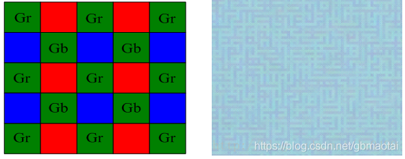

绿平衡模块gic是否可以在debayer 后进行纠正，说明原因？

不可以。 gr和gb的不平衡只能在bayer 域观察到。


#### **增益**

增益是摄像机传感器接收到原始景物的光后，在光电转换过程中，对原始的光进行调大或调小的过程。如果这时是增益调大了，**我们的图象就会比实际的亮，相反就会更暗**。如果传感器很小或质量不是很好，增益后就有很多的噪点。

#### **AEC/AGC**

AEC/AGC 都是基于亮度进行调节的。AEC(auto exposure control) 调节曝光时间，AGC (auto gain control)调节增益值，最终使图像亮度落在设定亮度阈值范围内。

#### **Pixel Array**

 gc0308物理上的阵列是648H*492V，实际采样阵列是648H*488V，也是有效阵列。实际取像的阵列是640H*480V。如下图所示：


vsync: vertical synchronization,  指与显示器的帧数同步. 简单来说就是启用了vsync的渲染过程,帧数不会超过显示器的帧数, 一个同步会被执行. 同步的地方就是显示器扫描线结束最后一行扫描准备开始第一行扫描的地方.

hsync: horizonal synchronization, 相比于vsync来说, 同步的单位从帧降到行,即是保证操作不是在扫描一行的中间出现,而是同步到下一行.

VBLANK: 显示器扫描线完成最后一行后,需要重返左上角,这个过程叫做: vblank,也叫VBI(vertical blank interval) ,因为扫描线变得blank,以防止看到一个斜线显示在屏幕上.

 **空白无效行时间**（Vblank/Dummy line）=Bt+St+Et。

 首先要明白，物理上492行，但是实际感应光线的只有488行，4行是Dark Row，黑暗行；但是这488有数据的行中只有480行是有效行。

#### **3A成像控制技术**

3A技术即自动对bai焦（AF）、自动曝光（duAE）和自动白平衡（AWB）。3A数字zhi成像技术利用了AF自动对焦算法dao、AE自动曝光算法及AWB自动白平衡算法来实现图像对比度最大、改善主体拍摄物过曝光或曝光不足情况、使画面在不同光线照射下的色差得到补偿，从而呈现较高画质的图像信息。采用了3A数字成像技术的摄像机能够很好的保障图像精准的色彩还原度，呈现完美的日夜监控效果。

#### 增益

摄像机的增益,等同于照相机的曝光补偿。 

就是说,在光线不够的环境下拍摄,摄像机进光量不够,达不到明亮的画面效果。这时候,打开增益开关,摄像机里面的处理系统,会自动把画面的亮度提高到一定标准。 

当然,增益带来的是画质的损失,也就是会或多或少增加噪点。 

光线足够的环境,千万别开增益!

####  DCG转换增益通过高性能相位检测自动对焦技术

1. 什么是 conversion gain （CG）？
CG是pixel 的一个属性，在sensor specification 或者cmos sensor测试测量报告里，经常会列举出来CG的数值，Conversion Gain的单位一般是 (µV/electron)，它描述的是光电转换后产生的单位电子经过放大达到多大的电压，很显然达到的电压越高，CG越大。

2. 如下图所示，一个典型的4T pixel电路图。CG是由FD（floating diffusion）电容的大小决定的。一定情况下可以说，FD capacity就是FWC。FD capacity 越大，FWC越大，CG反之越小。从公式上说，CG与FWC的关系如下：
                 ln(Conversion Gain) = 9.3329 - 0.539*ln(Full Well Capacity)

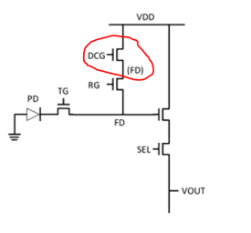

3:  什么是dual conversion gain（DCG）
与普通pixel的区别在于DCG额外加入了一个FD电容，以及一个DCG开关

#### **HDR模式**

首先先来解读一下“HDR”这个词，英文全称“High-Dynamic Range”，翻译过来就是「高动态范围」，动态范围就是相机能够在按下快门之后记录下拍摄对象在最暗、最亮环境下的差异范围，连拍多种场景下的照片，通过算法将多张图片中每一场景下最好的部分合成一张照片输出，达到最佳的拍摄效果

** raw图中的黑点 **

对于raw图片。软件显示也没做插值 ,就会出现以下的黑点。本身raw图片就是不如yuyv的这种经过isp处理过过得图片。

图像插值就是利用已知邻近像素点的灰度值（或rgb图像中的三色值）来产生未知像素点的灰度值，以便由原始图像再生出具有更高分辨率的图像。


#### HDR -TMO视频色调映射算法Adaptive temporal TMO

 我们已经知道，HDR渲染包含两个步骤，

一是曝光控制，即将高动态范围的图像映射到一个固定的低范围中，既屏幕能够显示的(0,1)的范围内。

二是对于特别亮的部分实现光晕的效果。其中曝光控制是HDR渲染的核心环节，光晕效果对表现高亮的像素起了重要的作用。

这里先分别介绍两个步骤的原理和方法，再介绍如何实现一个完整的HDR渲染器。

  在所有步骤开始之前，你必须已经通过某种方法得到了一个高动态范围的图像。高动态范围的图像每一个像素都由浮点型的R,G,B分量表示，这样每个分量都可以任意大。对于渲染器而言，这意味着一个浮点纹理。那么，如何将一个场景渲染到一个高动态范围的浮点纹理中呢？你可以为场景中的每个表面创建一张浮点格式的光照贴图，这张光照贴图的每个象素代表了表面上相应位置的光强。然后使用OpenGL的FBO（帧缓冲对象）将绑定了浮点光照贴图的场景渲染到一个同屏幕大小一致的浮点纹理中。关于FBO和浮点纹理的使用请参考[《OpenGL中的浮点纹理和帧缓冲对象》](http://www.graphixer.com.cn/showworks.asp?type=1&id=46) 。

  好的，先来看看所谓得、的曝光控制。这个步骤在HDR渲染中被称为Tone Mapping。翻译成中文即“调和映射”。Tone Mapping有很多具体的方法，每个方法都是一个从高动态范围到低范围的一个映射，我们把这些方法统称为 Tone Mapping Operator(TMO)，可见，TMO的好坏直接决定了图像的最终质量。例如，

#### IR-CUT（滤除红外光）

　　sensor不仅对可见光谱感光,而且对红外光谱感光. IR就是infrared红外光, 如果没有IR-Cut Filter,图象就会明显偏红,这种色差是没法来用软件来调整的,一般IR-Cut在650+/-10nm,而UV,紫外光的能量很小,一般就忽略了.
　　未加IR cut 拍摄的照片,可见影响最大的是图像的色彩. 偏红！！！

  a,红外光对（650+/-10nm）sensor 有伤害，影响sensor 寿命。

  b.若不滤除红外光，对R.G.B三基色重合白光有影响，即对AWB有影响。

  C.CUBIC 底部PCB太薄，会漏光，导致sensor 感应到鬼影，可以在底部涂亚光黑油消除。

  d. CUBIC 底部PCB（材质是纤维）四周漏光，可以通过手机端在摄像模组周围加屏蔽罩，或者隔离手机闪光灯的方法解决。


* 对于带IRCUT的镜头，怎么判断红外光是否进入镜头？

对比两种工作模式的图像，红外光进入时，图像会偏红。

#### Bayer格式

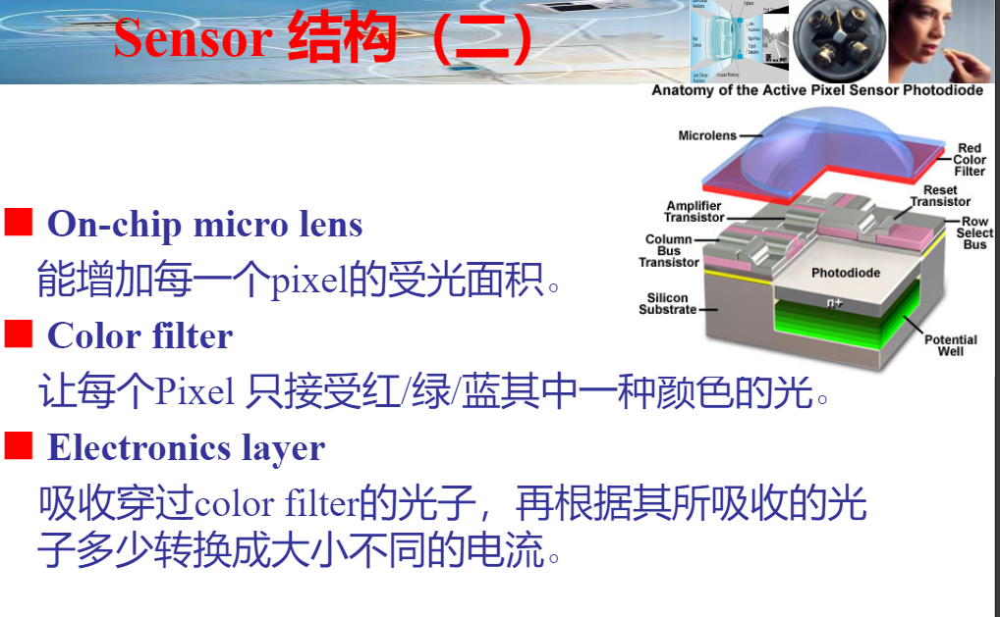

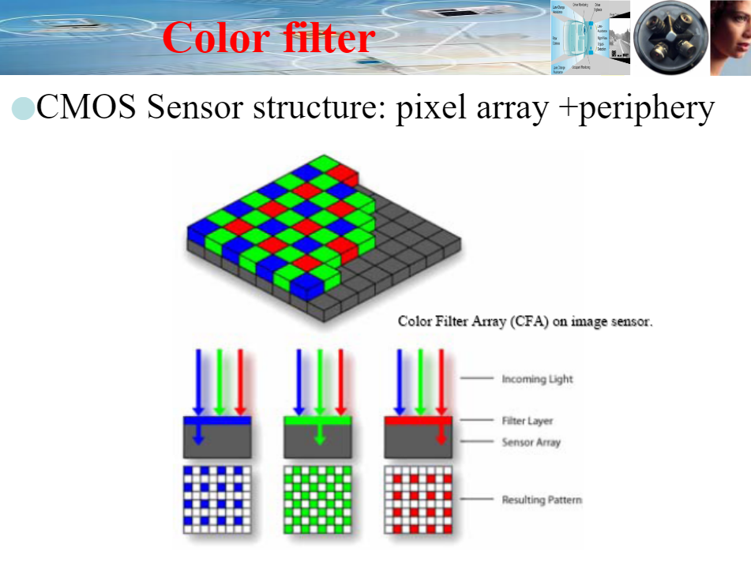

Bayer格式是相机内部的原始图片, 一般后缀名为.raw。很多软件都可以查看, 比如PS。我们相机拍照下来存储在存储卡上的.jpeg或其它格式的图片, 都是从.raw格式转化过来的。如下图，为bayer色彩滤波阵列，由一半的G，1/4的R，1/4的B组成。


- raw定义

RAW图像（*RAW* Image Format。）就是CMOS或者CCD图像感应器将捕捉到的光源信号转化为数字信号的原始数据。Raw格式是sensor的输出格式，是未经处理过的数据，表示sensor接受 到的各种光的强度。 RAW文件是一种记录了数码相机传感器的原始信息，同时记录了由相机拍摄所产生的一些元数据（Metadata，如ISO的设置、快门速度、光圈值、白平衡等）的文件。RAW是未经处理、也未经压缩的格式，可以把RAW概念化为“原始图像编码数据”或更形象的称为“数字底片”。sensor的每一像素对应一个彩色滤光片，滤光片按Bayer pattern分布。将每一个像素的数据直接输出，即RAW RGB data

Raw data是指原始的数据，单个pixle只能感应一种颜色。

Bayer RGB与RGB Raw的主要区别在于两者输出前经过的处理不同，Bayer RGB从ADC输出，只经过了LENS SHADING，GAMMA等模块处理而后就直接输出，而RGB Raw则经过了整个ISP模块的处理，最终是经过YUV422的数据转化而来的。

- raw数据顺序

Raw数据在输出的时候是有一定的顺序的，一般为以下四种:
00： GR/BG
01:   RG/GB
10: BG/GR
11:   GB/RG
为什么每种情况里有两个G分量呢？这时因为人的眼睛对绿色比较敏感，所以增加了对绿色的采样。其中每个分量代表一个piexl。所以GR/BG就代表四个piexl，在物理sensor上就表示4个晶体管，用一个晶体管只采样一个颜色分量，然后通过插值计算得到每个piexl，这样做的主要目的是降低功耗。 sensor输出的数据一般要送到ISP中处理才会得到一个好的效果，这就需要ISP知道sensor输出的raw数据的顺序与大小，其中顺序一般通过配置ISP的pattern寄存器来实现，大小一般配置在ISP的输入格式控制寄存器中

Raw格式是sensor的输出格式，是未经处理过的数据，表示sensor接受 到的各种光的强度。
Raw数据在输出的时候是有一定的顺序的，一般为以下四种:。

- raw数据几种常用的格式:

```
RAW8:
Raw8即是用8bits表示G/R/B/G中的一个分量,而不是使用8bits表示RG/GB四个分量。在sensor中，为了降低功耗，使用一个晶体来表示一种颜色，然后利用差值计算出相邻像素的值。
Raw10:
Raw10就是使用10bit表示上述的一个G/R/B/G，但是数据中是16bit的，高6位没用。

Raw12:
Raw12: 就是使用12bit表示上述的一个G/R/B/G，但是数据中是16bit的，高4位没用。
```

#### CCM 颜色纠正矩阵Color Correction Matrix (CCM) 

ccm出现的根本原因是，人眼的视觉响应曲线，相机响应曲线以及显示器激励响应都应该存在较大差距，这些差别可会对摄像机的色彩还原造成较大的影响。

上面列的一堆原因，最重要的因素是我们肉眼的对光谱的RGB响应曲线和sensor的响应曲线是不同的；

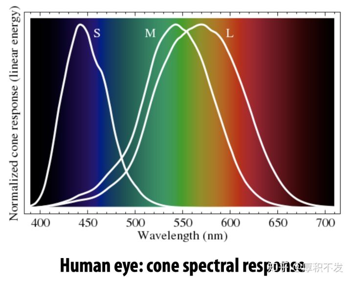

#### 镜头畸变Lens distortion

但因为这是透镜的固有特性（凸透镜汇聚光线、凹透镜发散光线），所以无法消除，只能改善。

- 径向畸变顾名思义，径向畸变就是沿着透镜半径方向分布的畸变，产生原因是光线在原理透镜中心的地方比靠近中心的地方更加弯曲，这种畸变在短焦镜头中表现更加明显，径向畸变主要包括桶形畸变和枕形畸变两种。以下分别是枕形和桶形畸变示意图：

1. 枕形畸变（Pincushion Distortion），又称枕形失真，它是由镜头引起的画面向中间“收缩”的现象。

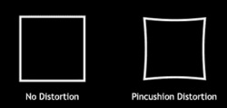

2. 桶形畸变（Barrel Distortion），又称桶形失真，是由镜头中透镜物理性能以及镜片组结构引起的成像画面呈桶形膨胀状的失真现象。

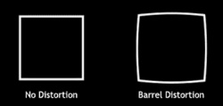

- 切向畸变切向畸变是由于透镜本身与相机传感器平面（成像平面）或图像平面不平行而产生的，这种情况多是由于透镜被粘贴到镜头模组上的安装偏差导致。

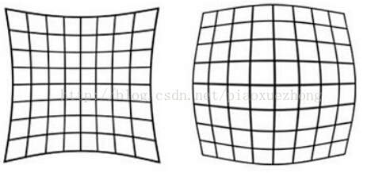

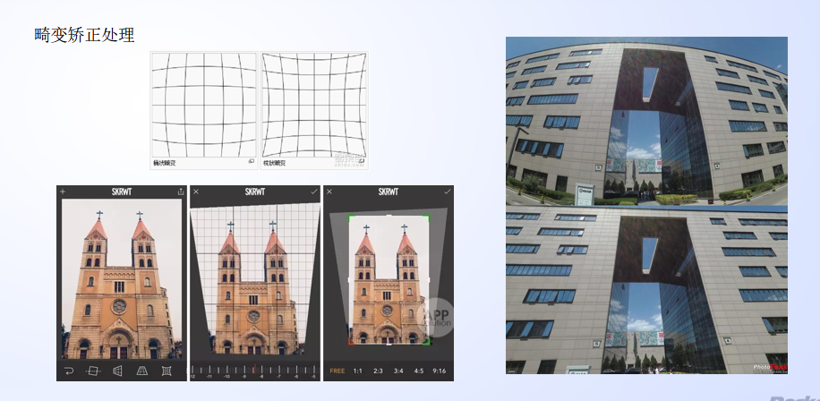

#### 去雾dehaze

光在雾、霾等介质中传播时，由于粒子的散射作用导致成像传感器采集的图像信息严重降质，在很大程度上限制了图像的应用价值。图像去雾的目的是消除雾霾环境对图像质量的影响，增加图像的可视度，是图像处理和计算机视觉领域共同关切的前沿课题，吸引了国内外研究人员的广泛关注。

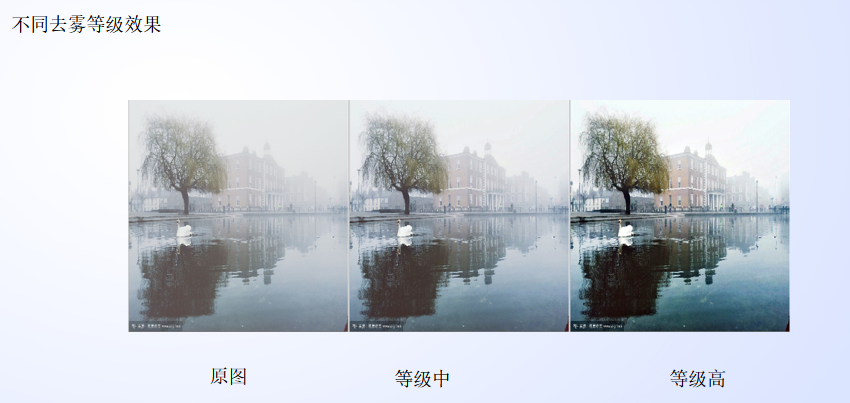

#### Lens Shading暗角或渐晕效应

Lens Shading 一般被称为暗角或渐晕效应，可细分为 Luma Shading（亮度均匀性）和 ColorShading（色彩均匀性）两种。
Luma Shading 是由镜头的光学特性引起的。对于整个镜头，可将其视为一个凸透镜。由于凸透镜中心的聚光能力远大于其边缘，从而导致 Sensor 中心的光线强度大于四周。此种现象也称之为边缘光照度衰减。对于一个没有畸变的摄像头，图像四周的光照度衰减遵循 cos西塔的四次方 的衰减规律。Color Shading 的成因则相对复杂一些。不同类型的 IR-Cut（红外截止滤光片）的透过率各有不同，且当入射角  变化时不同波段的透过率也会有变化，所以会出现中心和四周颜色不统一的现象。另外一方面则是 Micro Lens（微透镜）的 CRA（主光线入射角）与镜头的 CRA 不匹配也会导致 Color Shading 现象。

- LSC （镜头阴影校正）

镜头阴影校正（Lens Shading Correction）  由于Lens的不同区域透光性能不一致，导致图像中心区域较亮，图像四周较暗。简单的处理方法是拍摄一张均匀光照的白纸，计算距离中心不同半径范围的亮度与中心亮度比值，作为矫正系数。


- Color shading（颜色阴影纠正）

由于LENS在周边入射角度不足，导致顏色偏差的偏差的现象，一般表现中心和四周偏角不一致。

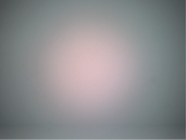

#### Demosaic 插值

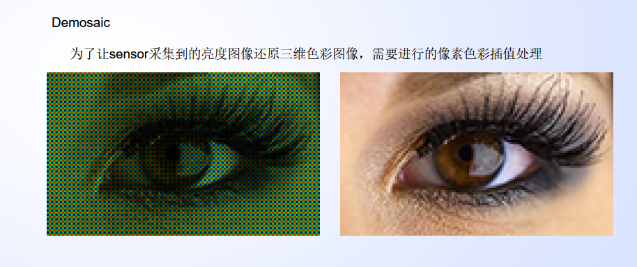

#### 锐化 Image Edge Enhance (Sharpen)

Image Edge Enhance (Sharpen)

锐化处理：通过增强图像的高频部分的内容，图像的视觉效果可以极大的得到改观。

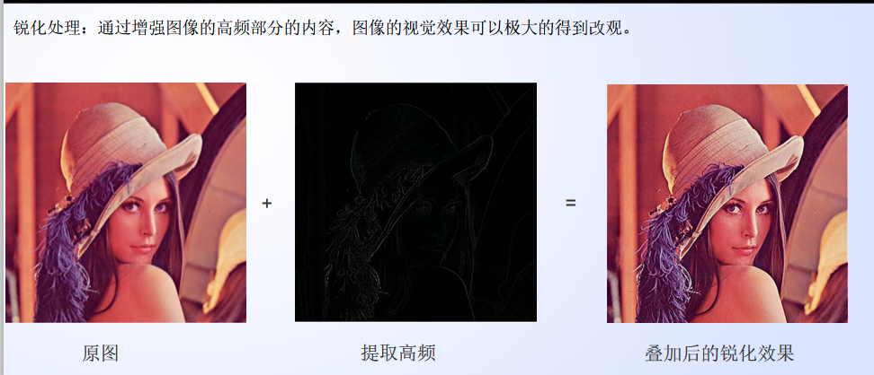

#### 降噪处理

2D 降噪：  只在空域上进行降噪。

3D 降噪：  在空域的基础上加入时域降噪，即在2D降噪的基础上加入帧与帧之间的时域关系。

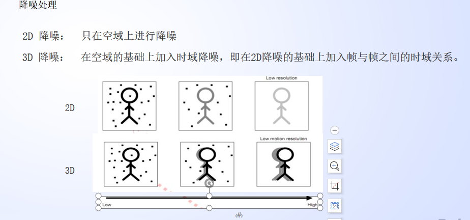

#### AF （auto Focus）对焦

  在一个光学成像系统中，通过移动物体或者是镜头可以使得物体在成像面上对焦成功，称为对焦。

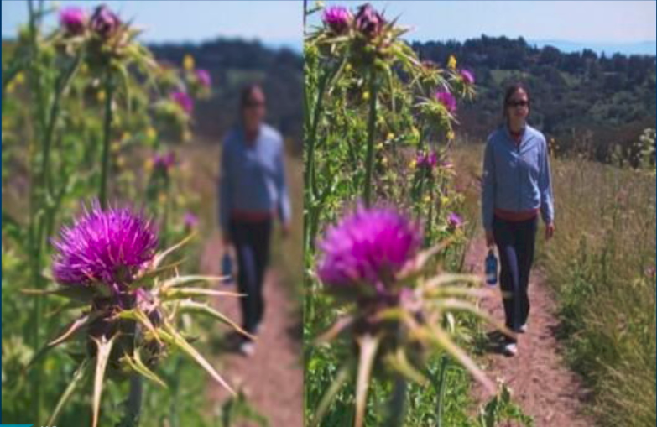

AF 驱动主要实现功能:

1. 获取和设置马达的位置

2. 获取马达移动的时间戳

####  Gamma矫正

Gamma矫正是进行图像的存储显示进行标准化的一个处理过程，在不同的处理平台及显示设备，需要将图像数据进行gamma匹配才能得到原图希望表达的效果。(使用Gamma技术，有利于对图像的数据动态范围进行压缩减小图像数据量，该处理不会牺牲太多图像质量)

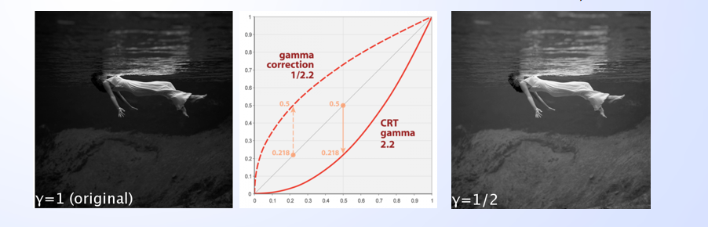


#### 鱼眼纠正

鱼眼镜头拍摄的照片的校正。

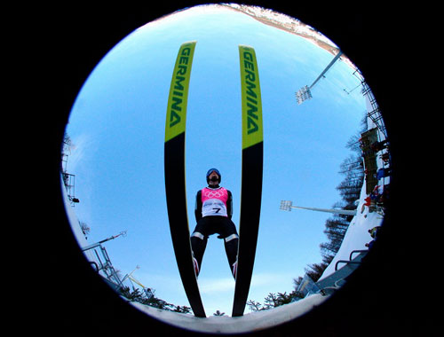


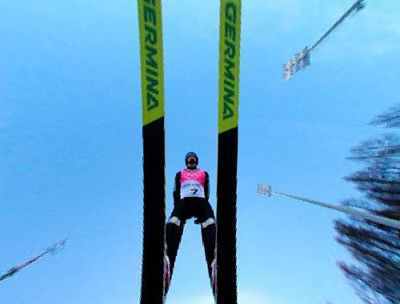

#### 暗电流 BLC

暗电流：在没有光照射的状态下,在[太阳电池](https://baike.baidu.com/item/太阳电池/6281789)、[光敏二极管](https://baike.baidu.com/item/光敏二极管/1923309)、光导电元件、[光电管](https://baike.baidu.com/item/光电管/9005290)等的受光元件中流动的电流叫做暗电流。

Sensor 电路中存在暗电流，导致在没有光线照射的时候，像素单位也有一定的输出电压，导致 A/D输出的数字信号不为 0。暗电流主要受到增益和温度影响，因此需要在不同 ISO 下分别进行标定。由于 BLC 是一个偏移量，其他模块在标定时都需要扣除该偏移量，否则无法得到正确的标定参数

​    我们知道图像数据一般为0--255，但sensor在出厂的时候，厂家一般会设置图像数据输出范围如5-250等，反正最低电平不为零。因此我们就需要对图像数据范围进行调整，使其最小值为零，这就是黑电平校正。黑电平校正有两种方法：一种是直接在RAW data数据上减去一个值，可以RGB减的值一样，也可以不一样，目前大多数厂家如，安霸，海思等基本都是采用这一做法。一种是利用一次函数，这个比较麻烦，就不介绍了。

#### Black Level黑电平

前面科普文提到过，感光芯片感应到光线信号，进而转换为模拟信号，再通过A/D转换成数字信号。以10bit数据为例，转换成的数字信号通常为0~1023的范围，然而A/D转换器的精度无法将电压值很小的一部分转换出来，从而导致暗态细节损失。

芯片人为地给输出信号加一个固定的偏移量，使整体信号值放大，有效保留了电压值很小的暗部细节，当然也会损失部分亮度细节。然而我们平时较注重暗态拍照，保留暗部细节牺牲部分动态范围的操作是大众比较认可的。
