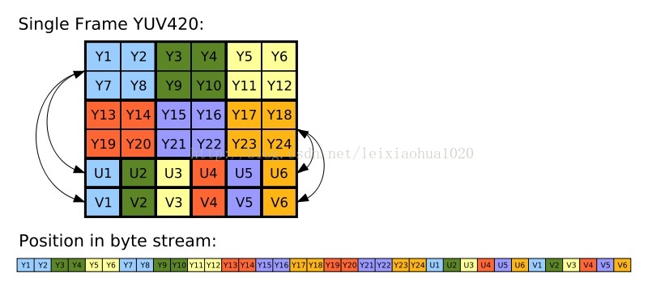

# FFmpeg初识

本文由《 FFmpeg从入门到精通》一书而来。目的一是介绍几个基本概念，对理解本书有帮助，二是介绍本书的大致内容，作为开发者以工具书的角度有个大致了解，三是对FFmpeg项目商业开发前应该了解的背景，通过简单几个命令，知道这个工具包含的功能有什么，并不给出具体的代码和参数介绍。

## 1 准备知识

先介绍《 FFmpeg从入门到精通》阅读前，需要了解基本音视频概念。

### 1.1 音频数字化

声音本质是波，声音三要素：频率、振幅、波形。

声音是一种连续的波动信号，要把这种模拟量变为数字量，通常采用PCM（脉冲编码调制）方式。它同样要经历取样、量化、编码三个步骤。

声音数字化：

1. 采样：在数轴上数字化声音信号，为了提高采样质量，需要按声音最高频率的2倍以上的频率对声音采样,
人耳朵听到的范围是20HZ-20KHZ，所有的典型采样值是44.1KHZ（1s采样44100次数据）
2. 量化: 每个具体的采样点的声音在振幅轴上的数字化标识。一个short表示范围，-32768，32767］，共有65536个可能取值。因此最终模拟的音频信号在幅度上也分为了65536层。
3. 编码 ：就是按照一定的格式记录采样和量化后的数字数据，比如顺序存储或压缩存储，等等。
通常说的音频裸数据就是PCM,(pluse codec modulation脉冲编码调制)

PCM知识点

1. 采样格式sampleFormat可理解为多少字节存储声音，典型的是16bit。
2. 采样率sampleRate，典型采样率44.1KHZ,一秒钟采样44100次。
3. 声道数量：为了立体声的效果，分为左声道和右声道。
4. 比特流：对于数字音频而言，比特流为一秒的比特数量。衡量音频数据的大小。

编码的必要性：
CD:采样格式16bit,采样率44.1KHZ,声道数为2。一分钟的数据大小： 44100x16x2x60/8/1024 == 10.09MB 数据量太大，所以编码是必要的。

### 1.2 图像数字化

红蓝绿无法分解，为三原色。1280*720的屏幕，水平方向有1280个像素，垂直有720个像素。每个像素有3个子像素构成，分别表示RGB，显示图片时，将每个像素的RGB通道分别对应的屏幕的子像素点，从而显示出图片。

图像的数字化方式举例

数字表示方式一：RGB 
每个像素的子像素由两种方式表示

- 浮点取值范围为0.0到1.0，常见于openGL的子像素表示。

- 整数表示：取0-255或00-ff，8个bit表示一个子像素，常见RGBA-888\RGB-565

数字表示方式二：YUV 
Y代表亮度，U和V表示色度。只有亮度的话，就是黑白电视的界面。对于视频，其裸数据格式更多使用的是YUV格式表示，和RGB比较，YUV占用较少的带宽，RGB要求对三个独立的视频数据分量同时传输。

图片大小=长 x 宽 x 图片位深：
一张原始图像(1920x1080)，如果每个像素 32bit 表示(RGBA为例)，那么图像需要的存储大小 1920x1080x4 = 8294400Byte，大约 8M。可见图片压缩的必要性。

### 1.3 编码、封装、流媒体


在网页上看电影，我们知道网页一般为HTTP协议，在线看电影的时候，以流媒体方式，以HTTP协议为例，下载了一部分数据，解协议就是按照流媒体协议获得数据中有效数据部分。最终获取一个格式文件，这个格式文件就是音频和视频按一定排列存放的数据，称为封装文件，如MP4，解封装就是把该压缩文件解压到为一部分音频和一部分视频。这两部分其实还是有自己的编码格式，如图像有YUV420P，RGB，音频有AAC，MP3。你就需要解码成为非压缩的视频/音频原始数据,这就是解码，再通过屏幕和声卡变现出来。

总结:

- 编码就是codec，主要目的是压缩原始数据的体积，如视频编码H.254,H.265，音频MP3、ACC
- 封装格式，是用来存储/传输数据，并按照一定规则把音视频、字幕组织起来，里面会有一些信息，比如包含哪些编码类型。封装也叫多媒体容器，将处理好的视频、音频、字幕包装到一个文件内呈现给观众，这个包装的过程就叫封装。分装格式如MP4\MKV
- 流媒体协议：目的是在以数据流形式在网络上播放，主流的流媒体协议如HTTP\RTSP\RTMP。

一个完整的视频文件是由音频和视频2部分组成的。H264、Xvid等就是视频编码格式，MP3、AAC等就是音频编码格式。

| 封装容器                | 视频流编码格式 | 音频流编码格式 |
| ----------------------- | -------------- | -------------- |
| AVI                     | Xvid           | MP3            |
| AVI                     | Divx           | MP3            |
| MP4                     | Xvid           | MP3            |
| MP4                     | H264           | AAC            |
| 3GP                     | H263           | AAC            |
| Matroska（后缀就是MKV） | H264           | AAC            |
| Matroska（后缀就是MKV） | Xvid           | MP3            |
| Matroska（后缀就是MKV） | Xvid           | AAC            |

FFmpeg随处可以看到专业术语，如demuxer解封装、muxer封装、encoders编码器、decoder解码器等。

## 2《 FFmpeg从入门到精通》内容介绍

阅读本书后，本书一共10章。前两章，介绍了FFmpeg源码的编译，基本组成如：编解码工具ffmpeg、播放器ffplay、多媒体分析器ffprobe。并且告诉如何通过ffmpeg --help、ffprobe --help、ffplay --help找到对应的命令。我们可以直接把这本书当工具书使用，随用随查。从第二章到第五章，转封装、转码、流媒体各自独立一章节，介绍对应的格式和命令处理方式，还有一些辅助软件工具的使用。第六章是滤镜使用。第7章是采集设备介绍，比如说嵌入式Linux设备。从第8章到第10章，介绍音视频开发中的API。

## 3 FFmpeg使用前需知

### 3.1  什么是FFmpeg

FFmpeg是一套可以用来记录、转换R数字音频、视频，并能将其转化为流的开源计算机程序。

开源项目地址： https://github.com/FFmpeg/FFmpeg

最新版本：2020年7月11号，FFmpeg 4.3.1 release。

开发语言：C/C++ 平台： Linux、Winodw、 OS  X

FFmpeg只是提供一个框架，各个部分以模块形式挂载在框架中。configure命令查看FFmpeg所支持的音视频编码格式、文件封装格式、流媒体传输协议。

### 3.2 版权

FFmpeg采用LGPL或GPL许可证（依据你选择的组件）。

FFmpeg里默认是LGPL的，不修改代码不需要开源，只有使用到类似libx264等GPL协议的代码时，FFmpeg才被感染为GPL协议。FFmpeg做库使用，开发者只用到了它的功能，没有对库本身修改，开发人员不必公布自己的商业源代码。
如果修改库的代码，修改的代码必须全部开源，并且协议也是LGPL，但除了库源码之外的商业代码，仍不必公布。违反开源协议后果：QQ影音违法开源协议被正式加入到FFmpeg耻辱名单之列。

### 3.3 裁剪和第三方组件

FFmpeg功能强大，支持相模块的enable和disable，但是还有些功能需要第三方外部库才能实现。这些可以通过`configure --help`命令查看。这些在《 FFmpeg从入门到精通》第一章详细介绍。

### 3.4 瑞芯微平台

基于FFmpeg的mediaplayer，可参考《Rockchip Box视频开发指南》。

## 4  FFmpeg 开发者工具角度介绍

### 4.1 安装

```
下载源码
git clone https://github.com/FFmpeg/FFmpeg.git
安装yasm 是x86平台的一个汇编优化器, 可以加快ffmpeg x264的编译
apt install yasm
查看帮助信息
./configure --help
配置和安装
./configure 
make && make install
```

### 4.2 组件介绍

```
libavutil Liboavutil是一个包含用于简化编程的函数的库，包括随机数生成器、数据结构、数学例程、核心多媒体实用程序等等
libavcodec  是一个包含音频/视频编码器的解码器和编码器的库
libavformat 是一个包含多媒体容器格式的 demuxers 和 muxers 的库
libavdevice 是一个包含输入和输出设备的库，用于从许多常见的多媒体输入/输出软件框架(包括 Video4Linux、 Video4Linux2、 VfW 和 ALSA)获取并呈现这些框架
libavfilter   是一个包含媒体过滤器的库
libswscale    是一个执行高度优化的图像缩放和颜色空间/像素格式转换操作的库
libswresample 是一个执行高度优化的音频重采样，重矩阵和样品格式转换操作的库
```

### 4.3 简单组件以及命令介绍

基本信息查询：


编码支持与定制：

```
例如希望支持H.264视频编码、AAC音频编码、封装为MP4，可以通过如下方式进行支持：
./configure --disable-filters --disable-encoders  --disable-decoders --disable-hwaccels --disable-muxers --disable-demuxers --disable-parsers --disable-bsfs --disable-protocols --disable-indevs --disable-devices --enable-libx264 --enable-libfdk-aac --enable-gpl --enable-nonfree --enable-muxer=mp4
```
查看支持：

```
查看编码器支持
./configure --list-decoders  如H.264\2.265\MPEG4\PCM\FLV1\AC3\AAC等
查看解码器支持
./configure --list-encoders   如H.264\2.265\MPEG4\MP3等
查看封装支持
./configure --list-muxers       如MP3\FLV\MP4\MOV\AVI\MP3等
查看解封装支持
./configure --list-demuxers      如MP3\FLV\MP4\MOV\AVI等
查看通信协议支持
./configure --list-protocols     如HTTP\RTMP\RTP\TCP\UDP\FTP\CRYPTO等
```

ffmpeg 主要用于音视频编解码：


```
ffmpeg --help      查看ffmpeg命令的基础信息
ffmpeg --help long 查看ffmpeg命令的高级参数
ffmpeg --help full 获得ffmpeg全部的帮助
ffmpeg -L          查看ffmpeg所支持的license协议
ffmpeg -version    查看ffmpeg及其子模块的版本
ffmpeg -formats    查看ffmpeg所支持的文件格式
ffmpeg -codecs     查看ffmpeg支持的编解码器
ffmpeg -encoders   查看ffmpeg所支持的编码
ffmpeg -decoders   查看ffmpeg所支持的解码

ffmpeg --help 可以查看ffmpeg所支持的封装、编解码、滤镜处理器。具体了解某个类型，可以通过ffmpeg -h 查看该类型的详细参数
ffmpeg -h muxer=flv      查看flv封装器的参数支持
ffmpeg -h demuxer=flv    查看flv解封装器的参数支持
ffmpeg -h encoder=h264   查看H.264编码参数支持
ffmpeg -h decoder=h264   查看H.264解码参数支持
```

ffprobe 主要用于音视频内容分析：


```
ffprobe多媒体信息查看工具
ffprobe --help 查看详细帮助
ffprobe -show_packets input.flv 查看多媒体数据包信息
ffprobe -show_data -show_packets input.flv 查看多媒体数据包中具体数据
ffprobe -show_format output.mp4 查看多媒体的封装格式
ffprobe -show_frames input.flv 查看视频文件中的帧信息
ffprobe -show_streams input.flv 查看多媒体文件中的流信息
ffprobe -of xml -show_streams input.flv 得到XML输出格式的数据
ffprobe -of ini -show_streams input.flv 得到INI输出格式的数据
ffprobe -of flat -show_streams input.flv 得到FLAT输出格式的数据
ffprobe -of json -show_streams input.flv 得到JSON输出格式的数据
ffprobe -of cvs -show_streams input.flv 得到CVS输出格式的数据
```

ffplay  主要用于音视频播放、可视化分析：

```
ffplay -ss 30 -t 10 input.mp4  从视频的30s开始播放，播放10s的文件
ffplay -window_title "HELL RockChip"  output.mp4                 设置播放器播放时候窗口显示标题为自定义标题
ffplay -window_title "播放测试"  rtmp://up.v.test.com/live/stream 设置播放器播放时候窗口显示标题为自定义标题
```

音视频合并：

```
ffmpeg -i out.h264 -i out.aac -vcodec copy -acodec copy out.mp4
```

分解/复用命令：

```
抽取音频流

ffmpeg -i input.mp4 -acodec copy -vn out.aac
acodec: 指定音频编码器
copy 指明只拷贝，不做编解码。
vn: v 代表视频，n 代表 no 也就是无视频

抽取视频流
ffmpeg -i input.mp4 -vcodec copy -an out.h264
vcodec: 指定视频编码器
copy: 指明只拷贝，不做编解码
an: a 代表音频，n 代表 no 也就是无音频
```

转格式：

```
fmpeg -i out.mp4 -vcodec copy -acodec copy out.flv
音频、视频都直接 copy，只是将 mp4 的封装格式转成了flv
```

录制命令：

```
查看电脑上都有哪些设备
ffmpeg -f avfoundation -list_devices true -i "" 

录屏
ffmpeg -f avfoundation -i 1 -r 30 out.yuv
-f 指定使用 avfoundation 采集数据。
-i 指定从哪儿采集数据，它是一个文件索引号（可以通过上面的命令查询设备索引号）。
-r 指定帧率。按ffmpeg官方文档说-r与-framerate作用相同，但实际测试时发现不同。-framerate 用于限制输入，而-r用于限制输出。

ffmpeg  -f avfoundation -i 1:0  -r 29.97 -c:v libx264 -crf 0 -c:a libfdk_aac -profile:a aac_he_v2 -b:a 32k  out.flv
-i 1:0 冒号前面的 “1” 代表的屏幕索引号。冒号后面的"0"代表的声音索相号。
-c:v 与参数 -vcodec 一样，表示视频编码器。c 是 codec 的缩写，v 是video的缩写。
-crf 是 x264 的参数。 0 表式无损压缩。
-c:a 与参数 -acodec 一样，表示音频编码器。
-profile 是 fdk_aac 的参数。 aac_he_v2 表式使用 AAC_HE v2 压缩数据。
-b:a 指定音频码率。 b 是 bitrate的缩写, a是 audio的缩与。

录视频
ffmpeg -framerate 30 -f avfoundation -i 0 out.mp4 
-framerate 限制视频的采集帧率。这个必须要根据提示要求进行设置，如果不设置就会报错。
-f 指定使用 avfoundation 采集数据。
-i 指定视频设备的索引号。

视频+音频
ffmpeg -framerate 30 -f avfoundation -i 0:0 out.mp4

录音
ffmpeg -f avfoundation -i :0 out.wav

录制音频裸数据
ffmpeg  -f avfoundation -i :0 -ar 44100 -f s16le out.pcm
```

除此之外还有复杂滤镜、水印、视频裁剪、倍速播放、画中画、直播推流相关等复杂命令，本文意在给ffmpeg功能有个大致了解，暂不给出。

# 5 命令详解

## 5.1 使用ffmpeg调整图像大小

```
指定长宽：
ffmpeg -i input.jpg -vf scale=320:240 output_320x240.png

指定长，高度按比例缩放：
ffmpeg -i input.jpg -vf scale=320:-1 output_320x240.png

缩放为之前的两倍：
ffmpeg -i input.jpg -vf scale=iw*2:ih input_double_width.png

缩放为之前的二分之一：
ffmpeg -i input.jpg -vf “scale=iw.5:ih.5” input_half_size.png
ffmpeg -i input.jpg -vf “scale=iw/2:ih/2” input_half_size.png
```

## 5.2 ffprobe

```
ffprobe shy.mp3
输出内容为：
复制代码
Input #0, mp3, from 'shy.mp3':
  Metadata:
    genre           : Blues
    encoder         : Lavf56.4.101
    comment         : 163 key(Don't modify):L64FU3W4YxX3ZFTmbZ+8/UO6KmVXLfTij3uZN/wCXE4a00XHtvOwccwFlS+8ednRD4MnrdUH+aUYZFVY8bObsrabtBM2Ps/UAWPJtsmW/3RXnn6eJcNUHrPALM0003fIpQnn6MOWbdXqog6WFDLpaZJhoPMnFy9u41HxCalUwMEc+mkHNn+nSLlioJfpv4wPBwUhxfLNmOScmXPzOary2k37A/brRx7QUlMD9rkaZ    album           : 社会摇
    title           : 社会摇
    artist          : 萧全
    track           : 1
  Duration: 00:04:09.34, start: 0.025056, bitrate: 323 kb/s
    Stream #0:0: Audio: mp3, 44100 Hz, stereo, s16p, 320 kb/s
    Stream #0:1: Video: mjpeg, yuvj444p(pc, bt470bg/unknown/unknown), 500x500 [SAR 72:72 DAR 1:1], 90k tbr, 90k tbn, 90k tbc
    Metadata:
      comment         : Media (e.g. label side of CD)
复制代码

首先我们看以下这行信息：

Duration: 00:04:09.34, start: 0.025056, bitrate: 323 kb/s
这行信息表示，该视频文件的时长是4分9秒340毫秒，开始播放时间是0.025056，整个文件的比特率是256Kbit/s，然后我们看下一行信息：

Stream #0:0: Audio: mp3, 44100 Hz, stereo, s16p, 320 kb/s
这行信息表示，第一个流是音频流，编码格式是MP3格式，采样率是44.1KHz，声道是立体声，采样表示格式是SInt16(short)的planner(平铺格式)，这路流的比特率320Kbit/s。

四、使用ffprobe查看mp4格式的文件
本文使用的是视频《泡沫》，执行的命令为：

ffprobe pm.mp4
输出内容为：

复制代码

Input #0, mov,mp4,m4a,3gp,3g2,mj2, from 'pm.mp4':
  Metadata:
    major_brand     : isom
    minor_version   : 1
    compatible_brands: isomavc1
    creation_time   : 2016-12-17T16:02:05.000000Z
    album           : Yinyuetai
    artist          : yinyuetai.com
    comment         : Yinyuetai-1TR1151    date            : 12/18/16 00:02:05
  Duration: 00:04:33.51, start: 0.000000, bitrate: 1104 kb/s
    Stream #0:0(und): Video: h264 (Main) (avc1 / 0x31637661), yuv420p, 960x540, 1008 kb/s, 25 fps, 25 tbr, 25k tbn, 50 tbc (default)
    Metadata:
      creation_time   : 2016-12-17T16:02:05.000000Z
      handler_name    : 264@GPAC0.5.1-DEV-rev5472
    Stream #0:1(und): Audio: aac (LC) (mp4a / 0x6134706D), 44100 Hz, stereo, fltp, 92 kb/s (default)
    Metadata:
      creation_time   : 2016-12-17T15:50:54.000000Z
      handler_name    : Sound Media Handler
复制代码

首先我们看以下这行信息：

Duration: 00:04:33.51, start: 0.000000, bitrate: 1104 kb/s
这行信息表示，该视频文件的时长是4分33秒510毫秒，开始播放时间是0，整个文件的比特率是1104Kbit/s，然后我们看下一行信息：

Stream #0:0(und): Video: h264 (Main) (avc1 / 0x31637661), yuv420p, 960x540, 1008 kb/s, 25 fps, 25 tbr, 25k tbn, 50 tbc (default)
这行信息表示，第一个流是视频流，编码格式是H264格式(封装格式为AVC1)，每一帧的数据表示为yuv420p，分辨率为960x540，这路流的比特率为1108Kbit/s，帧率为每秒钟25帧。

接下来我们看下一行：

Stream #0:1(und): Audio: aac (LC) (mp4a / 0x6134706D), 44100 Hz, stereo, fltp, 92 kb/s (default)
这行信息表示第二个流是音频流，编码方式为ACC（封装格式为MP4A），并且采用的Profile是LC规格，采样率是44.1KHz，声道是立体声，这路流的比特率92Kbit/s。

到此为止，我们就掌握了使用ffprobe提取媒体的头文件信息的方式，并了解了提取出来的信息的含义

F:\desk\摄像头>ffprobe  input.jpg
ffprobe version 4.2.1 Copyright (c) 2007-2019 the FFmpeg developers
  built with gcc 9.1.1 (GCC) 20190807
  configuration: --disable-static --enable-shared --enable-gpl --enable-version3 --enable-sdl2 --enable-fontconfig --enable-gnutls --enable-iconv --enable-libass --enable-libdav1d --enable-libbluray --enable-libfreetype --enable-libmp3lame --enable-libopencore-amrnb --enable-libopencore-amrwb --enable-libopenjpeg --enable-libopus --enable-libshine --enable-libsnappy --enable-libsoxr --enable-libtheora --enable-libtwolame --enable-libvpx --enable-libwavpack --enable-libwebp --enable-libx264 --enable-libx265 --enable-libxml2 --enable-libzimg --enable-lzma --enable-zlib --enable-gmp --enable-libvidstab --enable-libvorbis --enable-libvo-amrwbenc --enable-libmysofa --enable-libspeex --enable-libxvid --enable-libaom --enable-libmfx --enable-amf --enable-ffnvcodec --enable-cuvid --enable-d3d11va --enable-nvenc --enable-nvdec --enable-dxva2 --enable-avisynth --enable-libopenmpt
  libavutil      56. 31.100 / 56. 31.100
  libavcodec     58. 54.100 / 58. 54.100
  libavformat    58. 29.100 / 58. 29.100
  libavdevice    58.  8.100 / 58.  8.100
  libavfilter     7. 57.100 /  7. 57.100
  libswscale      5.  5.100 /  5.  5.100
  libswresample   3.  5.100 /  3.  5.100
  libpostproc    55.  5.100 / 55.  5.100
Input #0, image2, from 'input.jpg':
  Duration: 00:00:00.04, start: 0.000000, bitrate: 27365 kb/s
    Stream #0:0: Video: mjpeg (Baseline), yuvj420p(pc, bt470bg/unknown/unknown), 2000x1333 [SAR 72:72 DAR 2000:1333], 25 tbr, 25 tbn, 25 tbc
```

# 6 YUV

## 6.1 yuv420

YV12和I420的区别

一般来说，直接采集到的视频数据是RGB24的格式，

RGB24一帧的大小size＝width×heigth×3 Byte，

RGB32的size＝width×heigth×4，

如果是I420（即YUV标准格式4：2：0）的数据量是 size＝width×heigth×1.5 Byte。

在采集到RGB24数据后，需要对这个格式的数据进行第一次压缩。即将图像的颜色空间由RGB2YUV。因为，X264在进行编码的时候需要标准的YUV（4：2：0）。但是这里需要注意的是，虽然YV12也是（4：2：0），但是YV12和I420的却是不同的，在存储空间上面有些区别。如下：
YV12 ： 亮度（行×列） ＋ V（行×列/4) + U（行×列/4）
I420 ： 亮度（行×列） ＋ U（行×列/4) + V（行×列/4）
可以看出，YV12和I420基本上是一样的，就是UV的顺序不同。
继续我们的话题，经过第一次数据压缩后RGB24－>YUV（I420）。这样，数据量将减少一半，为什么呢？呵呵，这个就太基础了，我就不多写了。同样，如果是RGB24－>YUV（YV12），也是减少一半。但是，虽然都是一半，如果是YV12的话效果就有很大损失。然后，经过X264编码后，数据量将大大减少。将编码后的数据打包，通过RTP实时传送。到达目的地后，将数据取出，进行解码。完成解码后，数据仍然是YUV格式的，所以，还需要一次转换，这样windows的驱动才可以处理，就是YUV2RGB24。




