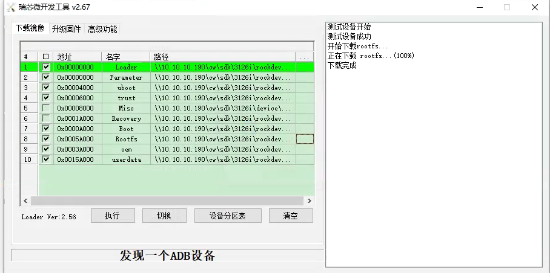
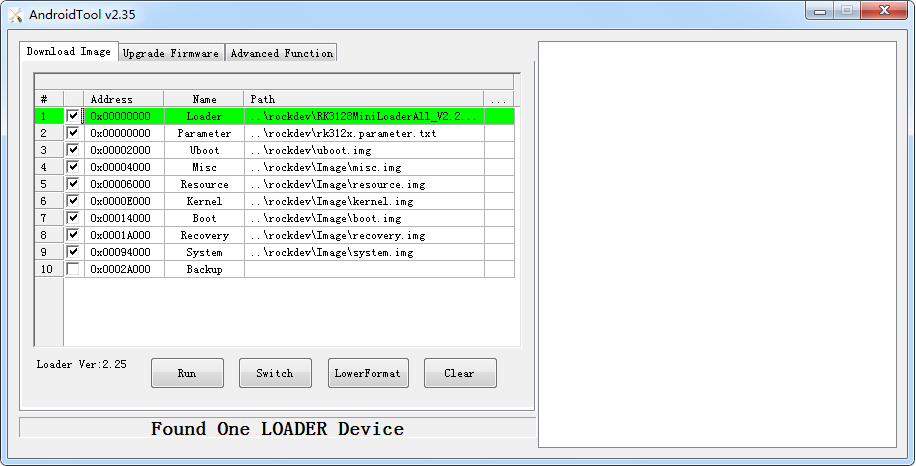

# RK Linux编译

## 1、 下载SDK并编译，生成固件

## 1.1 固件
```
1、同步代码
$.repo/repo/repo sync --no-tags

2、选择单板
$ source buildroot/build/envsetup.sh
You're building on Linux
Lunch menu...pick a combo:
1. rockchip_rk3308_release
2. rockchip_rk3308_debug
3. rockchip_rk3308_robot_release
Which would you like? [1]
如选择 rockchip_rk3308_release，输入对应序号 （你的单板序号）。  

3、编译
$ make

4、完成编译后生成固件
$ ./mkfirmware.sh  执行 SDK 根目录下的 mkfirmware.sh 脚本

5、完成编译后
所有烧写所需的镜像将都会拷贝于 rockdev 目录。
rockdev
├── boot.img
├── misc.img
├── parameter.txt
├── recovery.img
├── MiniLoaderAll.bin（即 rk3308_loader_v1.17.101.bin）
├── oem.img
├── userdata.img
├── rootfs.img
├── trust.img
└── uboot.img
```
## 1.2 烧写工具
请用SDK里面AndroidTool.exe ，不建议复制出来，SDK里面已经配置好了各子项名称路径，你可以直接选用。如

Windows工具：[AndroidTool](http://www.t-firefly.com/doc/download/page/id/4.html#windows_22)

```
    提示：AndroidTool_v2.35版本：升级MBR分区的Ubuntu固件    
         AndroidTool_v2.58版本：升级GPT分区的Ubuntu固件
```



### 1.2.1 启动模式

烧录有两种模式maskrom和loader, 对于模式的检测是在bootloader/uboot里面进行的。 

Firefly-RK3128 有三种启动模式：Normal 模式、Loader 模式、MaskRom 模式

- Normal 模式

Normal 模式就是正常的启动过程，各个组件依次加载，正常进入系统。

- maskrom（不推荐，第一次烧录时候）

```
如果芯片没烧写过，上电就是maskrom模式。这种模式用于拯救砖头机器。比如bootloader无法启动。无法进入loader正常下载。需要通过在板子上找对应的T13 C155 焊点，短接后通电，进入MASKROM模式，这些点需要问板子的生产商。
MaskRom 模式是设备变砖的最后一条防线。强行进入 MaskRom 涉及硬件操作，有一定风险， 因此仅在设备进入不了 Loader 模式情况下，方可尝试 MaskRom 模式。
```

- loder模式（推荐）

  ```
  是刷固件模式。这个模式可以刷各种镜像image，。按住recover按键再通电，通过uboot的检测进入这个模式
  ```

### 1.2.2 烧写方法

- 烧写方式-Maskrom模式

```
1、 进入Maskrom
如果没有烧录过系统的芯片，上电就是maskrom模式
reboot #重启
开机马上按'Ctrl+C'进入uboot命令选择界面
help查看帮助
rbrom进入Maskrom

2、按上图图片，直接烧写
```

- 烧写方式-Loader模式：

```
采用loader烧写，说明芯片已经烧写过固件有loader和parameter在上面，所以可以单模块烧写，比如值烧写rootfs

1、 进入loader
方法一
reboot loader就会进入loader模式
方法二
reboot重启
Ctrl+C进入uboot命令行
输入  rockusb 0 mmc 0就会进入loder模式
2、烧写
采用loader烧写，说明芯片已经烧写过固件有loader和parameter在机器，所以可以单模块烧写，比如值烧写rootfs
```

单模块烧写

```
 
在Maskrom下单模块烧写，并且你烧写过paramenter，那么这时候，单模块烧写，你就要选上loader+单模块，比如说，你编译了builroot这时候生成的是rootfs，这时候loader+rootfs。这两项选上再烧写。

在loader模式下单模块烧写,你烧写过paramenter，那么会有分区信息，这时候就可以单模块烧写。在loader模式下，你只编译了buildroot生成的rootfs，那么只需要烧写 勾选上rootfs，其他不用选，烧写。
```

### 1.2.3 固件文件

固件文件一般有两种：

- 单个统一固件 update.img, 将启动加载器、参数和所有分区镜像都打包到一起，用于固件发布。
- 多个分区镜像,如 kernel.img, boot.img, recovery.img 等，在开发阶段生成。

#### 1.2.3.1 烧写统一固件 update.img

烧写统一固件 update.img 的步骤如下:

- 切换至”升级固件”页。
- 按”固件”按钮，打开要升级的固件文件。升级工具会显示详细的固件信息。
- 按”升级”按钮开始升级。
- 如果升级失败，可以尝试先按”擦除Flash”按钮来擦除 Flash，然后再升级。

***注意：如果你烧写的固件laoder版本与原来的机器的不一致，请在升级固件前先执行”擦除Flash”。***

 


#### 1.2.3.2 烧写分区映像

烧写分区映像的步骤如下：

- 切换至”下载镜像”页。
- 勾选需要烧录的分区，可以多选。
- 确保映像文件的路径正确，需要的话，点路径右边的空白表格单元格来重新选择。
- 点击”执行”按钮开始升级，升级结束后设备会自动重启。

  

## 2 编译

### 2.1 编译Buildroot

#### 2.1.1 source

```
source envsetup.sh  #选择开发板，如rk3128
```

生成连接指向配置

cw@SYS3:~/sdk/3126i/device/rockchip$ ls -al
lrwxrwxrwx  1 cw cw   21 Mar  5 15:41 .BoardConfig.mk -> rk3128/BoardConfig.mk

执行编译命令时，将会根据 `.mk` 文件进行编译。 对 Buildroot 相关配置进行说明 ：

```shell
cw@SYS3:~/sdk/3126i/device/rockchip$ vim .BoardConfig.mk
  
1 #!/bin/bash                                                                                                             
2 
3 # Target arch
4 export RK_ARCH=arm
5 # Uboot defconfig
6 export RK_UBOOT_DEFCONFIG=rk3128
7 # Kernel defconfig
8 export RK_KERNEL_DEFCONFIG=rockchip_linux_defconfig
9 # Kernel dts
10 export RK_KERNEL_DTS=rk3128-fireprime
11 # boot image type
12 export RK_BOOT_IMG=zboot.img
13 # kernel image path
14 export RK_KERNEL_IMG=kernel/arch/arm/boot/zImage
15 # parameter for GPT table
16 export RK_PARAMETER=parameter-buildroot.txt
17 # Buildroot config
18 export RK_CFG_BUILDROOT=rockchip_rk3128

# Buildroot 根文件系统配置文件
# 文件路径在 `buildroot/configs/rockchip_rk3128_defconfig`

19 # Recovery config
20 export RK_CFG_RECOVERY=rockchip_rk3128_recovery

# recovery 模式下根文件系统配置文件（可省略）
# 文件路径在 `buildroot/configs/rockchip_rk3288_recovery_defconfig`

21 # Pcba config
22 export RK_CFG_PCBA=rockchip_rk3128_pcba
23 # Build jobs
24 export RK_JOBS=12
25 # target chip
26 export RK_TARGET_PRODUCT=rk3128
27 # Set rootfs type, including ext2 ext4 squashfs
28 export RK_ROOTFS_TYPE=ext4
29 # rootfs image path
30 export RK_ROOTFS_IMG=rockdev/rootfs.${RK_ROOTFS_TYPE}

# Buildroot 根文件系统镜像路径
# 本例中，文件路径在 `buildroot/output/rockchip_rk3128/images/rootfs.ext4`
# 注：该文件路径将在首次编译根文件系统后生成

31 # Set oem partition type, including ext2 squashfs
32 export RK_OEM_FS_TYPE=ext2
33 # Set userdata partition type, including ext2, fat
34 export RK_USERDATA_FS_TYPE=ext2
35 #OEM config
36 export RK_OEM_DIR=oem_normal
37 #userdata config
38 export RK_USERDATA_DIR=userdata_normal
39 #misc image
40 export RK_MISC=wipe_all-misc.img
 
```

#### 2.1.2  make

怎么编译buildroot修改的模块

```
make menuconfig    //# 进入图形化配置界面，选择所需模块，保存退出。斜杆搜索，空格或者y选上
make savedeconfig   //保存到配置文件 'buildroot/configs/rockchip_rk3128_defconfig'

举个例子，你看到如下改变
cw@SYS3:~/sdk/3126i/buildroot$ git diff
diff --git a/configs/rockchip_rk3128_defconfig b/configs/rockchip_rk3128_defconfig
index 4232fac868..06a4728bc3 100644
--- a/configs/rockchip_rk3128_defconfig
+++ b/configs/rockchip_rk3128_defconfig
@@ -16,8 +16,13 @@
 #include "qt_app.config"
+#include "video_gst_rtsp.config"


make rkwifibt-dirclean //清除掉之前的
make rkwifibt-rebuild //重新编译
再make 即可（实际就是等价于与./build.sh rootfs）//#编译 Buildroot 根文件系统
make之后，要./build.sh rootfs要打包rootfs，还要./mkfirmware.sh
```

### 2.2 编译Linux

```
cd kernel

1、使用默认配置
make rk3126_linux_defconfig

2、自定义配置
make menuconfig

3、保存配置
make savedefconfig 保存为defconfig
cp defconfig kernel/arch/arm/configs/rockchip_xxxx_defconfig

4、保存为镜像
make rk3308-evb-dmic-i2s-v10.img
```

### 2.3 自动编译

#### 2.3.1 全自动编译

./build.sh   全自动编译会编译并打包固件 `update.img`，生成固件目录 `rockdev/`：

#### 2.3.2 部分编译

- 编译 kernel:      ./build.sh kernel

- 编译 u-boot:      ./build.sh uboot

- 编译 rootfs:        编译 Buildroot 根文件系统，将会在 `buildroot/output` 生成编译输出目录：

  ./build.sh buildroot 注：确保作为普通用户编译 Buildroot 根文件系统，避免不必要的错误。编译过程中会自动下载所需软件包，请保持联网状态

#### 2.3.3 固件打包

- 更新链接

为确保 `rockdev/` 目录下文件链接正确，**更新各部分镜像链接**：

```
./mkfirmware.sh
```

- 打包固件

将 `rockdev` 目录的**各部分镜像打包成一个固件** `update.img`：

```
./build.sh updateimg
```

## 3 自动编译脚本build.sh

 全自动编译脚本，降低人工编译可能出现的误操作，该 SDK 中集成了全自动化编译脚本，方便固件编译、备份。

```

1）该全自动化编译脚本原始文件存放于：
device/rockchip/common/build.sh
2）在 repo sync 的时候，通过 manifest 中的 copy 选项拷贝至工程根目录下：
3）修改 device/rockchip/rkxx(芯片平台)/BoardConfig.mk 脚本中的特定变量以编出对应
产品固件。
如 RK3308 平台，可修改 device/rockchip/rk3308/BoardConfig.mk 文件：
#buildroot defconfig
LUNCH=rockchip_rk3308_release
#uboot defconfig
UBOOT_DEFCONFIG=evb-rk3308
#kernel defconfig
KERNEL_DEFCONFIG=rk3308_linux_defconfig
#kernel dts
KERNEL_DTS= rk3308-evb-dmic-pdm-v11
以下变量请按实际项目情况，对应修改：
LUNCH 变量指定 Buildroot 编译 defconfig。
KERNEL_DTS 变量指定编译 kernel 的产品板极配置。
4）执行自动编译脚本：
./build.sh
该脚本会自动配置环境变量，编译 U-Boot，编译 Kernel，编译 Buildroot，编译 Recovery
继而生成固件。
5）脚本生成内容:
脚本会将编译生成的固件拷贝至：
IMAGE/RK3308-EVB-DMIC-PDM-V11_****_RELEASE_TEST/IMAGES 目录下，具体路
径以实际生成为准。每次编译都会新建目录保存，自动备份调试开发过程的固件版本，并存放固件
版本的各类信息
```

build.sh可编译单独模块, 使用命令`./build.sh -h`查看帮助


```
$./build.sh -h
====USAGE: build.sh modules====
uboot -build uboot
kernel -build kernel
rootfs -build default rootfs, currently build buildroot as default
buildroot -build buildroot rootfs
yocto -build yocto rootfs, currently build ros as default
ros -build ros rootfs
debian -build debian rootfs
pcba -build pcba
recovery -build recovery
all -build uboot, kernel, rootfs, recovery image
cleanall -clean uboot, kernel, rootfs, recovery
firmware -pack all the image we need to boot up system
updateimg -pack update image
save -save images, patches, commands used to debug
default -build all modules
如单独编译 kernel，只需要执行以下命令：
./build.sh kernel
如单独编译 kernel，只需要执行以下命令：
./build.sh rootfs
```

###  3.1 source 的作用

如果你没有 source envsetup.sh 的话会怎么样:	会说你没有指定目标

```
c@c:~/linux/v1$ ./build.sh kernel
./build.sh: 行 9: /home/c/linux/v1/device/rockchip/.BoardConfig.mk: 没有那个文件或目录
processing option: kernel
============Start build kernel============
TARGET_ARCH          =
TARGET_KERNEL_CONFIG =
TARGET_KERNEL_DTS    =
==========================================
Makefile:660: arch//Makefile: 没有那个文件或目录
make: *** 没有规则可制作目标“arch//Makefile”。 停止。
====Build kernel failed!====
```

有 source envsetup.sh 的话会怎么样:

```
c@c:~/linux/v1$ source envsetup.sh 
Top of tree: /home/c/linux/v1

You're building on Linux
Lunch menu...pick a combo:

0. non-rockchip boards
22. rockchip_rk3036
23. rockchip_rk3036_recovery
24. rockchip_rk3126c
25. rockchip_rk3126c_dpf
26. rockchip_rk3126c_recovery
27. rockchip_rk3128
 
Which would you like? [0]: 27
-bash: /home/c/linux/v1/device/rockchip/.BoardConfig.mk: 没有那个文件或目录
===========================================

#TARGET_BOARD=rk3128
#OUTPUT_DIR=output/rockchip_rk3128
#CONFIG=rockchip_rk3128_defconfig

===========================================
make: 进入目录“/home/c/linux/v1/buildroot”
  GEN     /home/c/linux/v1/buildroot/output/rockchip_rk3128/Makefile
/home/c/linux/v1/buildroot/build/defconfig_hook.py -m /home/c/linux/v1/buildroot/configs/rockchip_rk3128_defconfig /home/c/linux/v1/buildroot/output/rockchip_rk3128/.rockchipconfig
BR2_DEFCONFIG='' KCONFIG_AUTOCONFIG=/home/c/linux/v1/buildroot/output/rockchip_rk3128/build/buildroot-config/auto.conf KCONFIG_AUTOHEADER=/home/c/linux/v1/buildroot/output/rockchip_rk3128/build/buildroot-config/autoconf.h KCONFIG_TRISTATE=/home/c/linux/v1/buildroot/output/rockchip_rk3128/build/buildroot-config/tristate.config BR2_CONFIG=/home/c/linux/v1/buildroot/output/rockchip_rk3128/.config HOST_GCC_VERSION="7" BUILD_DIR=/home/c/linux/v1/buildroot/output/rockchip_rk3128/build SKIP_LEGACY= BR2_DEFCONFIG=/home/c/linux/v1/buildroot/configs/rockchip_rk3128_defconfig /home/c/linux/v1/buildroot/output/rockchip_rk3128/build/buildroot-config/conf --defconfig=/home/c/linux/v1/buildroot/output/rockchip_rk3128/.rockchipconfig Config.in
/home/c/linux/v1/buildroot/output/rockchip_rk3128/.rockchipconfig:77:warning: override: reassigning to symbol BR2_PACKAGE_MPP
/home/c/linux/v1/buildroot/output/rockchip_rk3128/.rockchipconfig:78:warning: override: reassigning to symbol BR2_PACKAGE_MPP_ALLOCATOR_DRM
/home/c/linux/v1/buildroot/output/rockchip_rk3128/.rockchipconfig:80:warning: override: reassigning to symbol BR2_PACKAGE_LINUX_RGA
/home/c/linux/v1/buildroot/output/rockchip_rk3128/.rockchipconfig:266:warning: override: reassigning to symbol BR2_PACKAGE_RKWIFIBT
#
# configuration written to /home/c/linux/v1/buildroot/output/rockchip_rk3128/.config
#
make: 离开目录“/home/c/linux/v1/buildroot”
```

### 3.2 envsetup.sh编译的各个模块

如单独编译 kernel，只需要执行以下命令：./build.sh kernel  

 buildroot是一个开源项目，类似于busybox的一种集成包，其主要功能是提供了交叉编译工具链和rootfs的制作 。 Buildroot可以用来，制作自己的交叉编译器，制作自己的根文件系统，把uboot，Linux kernel集成到Buildroot中一起编译。 

$./build.sh -h
====USAGE: build.sh modules====

- uboot             编译uboot

- kernel            编译内核

- rootfs             编译default rootfs, currently build buildroot as default

- buildroot        编译buildroot rootfs

- yocto              编译yocto rootfs, currently build ros as default

- ros                  编译 ros rootfs  

- debian             编译 debian rootfs  

- pcba                编译pcba

- recovery          编译 recovery

- all -build uboot, kernel, rootfs, recovery image

- cleanall -clean uboot, kernel, rootfs, recovery  

- firmware -pack all the image we need to boot up system

- updateimg -pack update image   打包update镜像

- save -save images, patches, commands used to debug

- default -build all modules  默认编译所有的模块

### 3.3envsetup.sh脚本

 envsetup.sh

```shell
#!/bin/bash

unset RK_CFG_TOOLCHAIN

CMD=`realpath $0`
COMMON_DIR=`dirname $CMD`
TOP_DIR=$(realpath $COMMON_DIR/../../..)
BOARD_CONFIG=$TOP_DIR/device/rockchip/.BoardConfig.mk
source $BOARD_CONFIG
source $TOP_DIR/device/rockchip/common/Version.mk

//`./build.sh -h`命令时候，打印出帮助
function usage()
{
	echo "Usage: build.sh [OPTIONS]"
	echo "Available options:"
	echo "BoardConfig*.mk    -switch to specified board config"
	echo "uboot              -build uboot"
	echo "kernel             -build kernel"
	echo "modules            -build kernel modules"
	echo "toolchain          -build toolchain"
	echo "rootfs             -build default rootfs, currently build buildroot as default"
	echo "buildroot          -build buildroot rootfs"
	echo "ramboot            -build ramboot image"
	echo "multi-npu_boot     -build boot image for multi-npu board"
	echo "yocto              -build yocto rootfs"
	echo "debian             -build debian9 stretch rootfs"
	echo "distro             -build debian10 buster rootfs"
	echo "pcba               -build pcba"
	echo "recovery           -build recovery"
	echo "all                -build uboot, kernel, rootfs, recovery image"
	echo "cleanall           -clean uboot, kernel, rootfs, recovery"
	echo "firmware           -pack all the image we need to boot up system"
	echo "updateimg          -pack update image"
	echo "otapackage         -pack ab update otapackage image"
	echo "save               -save images, patches, commands used to debug"
	echo "allsave            -build all & firmware & updateimg & save"
	echo ""
	echo "Default option is 'allsave'."
}

#c@c:~/linux/v1$ ag -t "RK_UBOOT_DEFCONFIG"
#device/rockchip/common/build.sh
#43:     echo "TARGET_UBOOT_CONFIG=$RK_UBOOT_DEFCONFIG"
#48:     cd u-boot && ./make.sh $RK_UBOOT_DEFCONFIG && cd -
#271:    echo "TARGET_UBOOT_CONFIG=$RK_UBOOT_DEFCONFIG"
#376:    echo "UBOOT:  defconfig: $RK_UBOOT_DEFCONFIG" >> $STUB_PATH/build_cmd_info
#device/rockchip/rk3399/BoardConfig_debian.mk
#6:export RK_UBOOT_DEFCONFIG=rk3399
#device/rockchip/rk3399/BoardConfig.mk
#6:export RK_UBOOT_DEFCONFIG=rk3399
#device/rockchip/rk3326/BoardConfig.mk
#6:export RK_UBOOT_DEFCONFIG=evb-rk3326
#device/rockchip/rk3326/BoardConfig_32bit.mk
#6:export RK_UBOOT_DEFCONFIG=evb-rk3326
#device/rockchip/rk3326/BoardConfig_robot64.mk
#6:export RK_UBOOT_DEFCONFIG=evb-rk3326
#device/rockchip/rk3326/BoardConfig_robot64_no_gpu.mk
#6:export RK_UBOOT_DEFCONFIG=evb-rk3326
//编译uboot  ，RK_UBOOT_DEFCONFIG是source 的时候生成的环境变量，指定了uboot的默认芯片
function build_uboot(){
	echo "============Start build uboot============"
	echo "TARGET_UBOOT_CONFIG=$RK_UBOOT_DEFCONFIG"
	echo "========================================="
	if [ -f u-boot/*_loader_*.bin ]; then    #如果这个是文件件，就删除
		rm u-boot/*_loader_*.bin
	fi
	cd u-boot && ./make.sh $RK_UBOOT_DEFCONFIG && cd -
	# $? 是上一个程序执行是否成功的标志，如果执行成功则$? 为0，否则 不为0
	
	if [ $? -eq 0 ]; then
		echo "====Build uboot ok!===="
	else
		echo "====Build uboot failed!===="
		exit 1
	fi
}

//编译kernel,前面source声明了
# TARGET_ARCH 目标架构 
# RK_KERNEL_DEFCONFIG 内核默认配置
#TARGET_KERNEL_DTS 使用的dts
function build_kernel(){
	echo "============Start build kernel============"
	echo "TARGET_ARCH          =$RK_ARCH"
	echo "TARGET_KERNEL_CONFIG =$RK_KERNEL_DEFCONFIG"
	echo "TARGET_KERNEL_DTS    =$RK_KERNEL_DTS"
	echo "=========================================="
	cd $TOP_DIR/kernel && make ARCH=$RK_ARCH $RK_KERNEL_DEFCONFIG && make ARCH=$RK_ARCH $RK_KERNEL_DTS.img -j$RK_JOBS && cd -
	if [ $? -eq 0 ]; then
		echo "====Build kernel ok!===="
	else
		echo "====Build kernel failed!===="
		exit 1
	fi
}
//编译kernel模块
前面source声明了
# TARGET_ARCH 目标架构 
# RK_KERNEL_DEFCONFIG 内核默认配置
function build_modules(){
	echo "============Start build kernel modules============"
	echo "TARGET_ARCH          =$RK_ARCH"
	echo "TARGET_KERNEL_CONFIG =$RK_KERNEL_DEFCONFIG"
	echo "=================================================="
	cd $TOP_DIR/kernel && make ARCH=$RK_ARCH $RK_KERNEL_DEFCONFIG && make ARCH=$RK_ARCH modules -j$RK_JOBS && cd -
	if [ $? -eq 0 ]; then
		echo "====Build kernel ok!===="
	else
		echo "====Build kernel failed!===="
		exit 1
	fi
}

//编译toolchain交叉工具链,前面source声明了
# RK_CFG_TOOLCHAIN
function build_toolchain(){
	echo "==========Start build toolchain =========="
	echo "TARGET_TOOLCHAIN_CONFIG=$RK_CFG_TOOLCHAIN"
	echo "========================================="
	[[ $RK_CFG_TOOLCHAIN ]] \
		&& /usr/bin/time -f "you take %E to build toolchain" $COMMON_DIR/mk-toolchain.sh $BOARD_CONFIG \
		|| echo "No toolchain step, skip!"
	if [ $? -eq 0 ]; then
		echo "====Build toolchain ok!===="
	else
		echo "====Build toolchain failed!===="
		exit 1
	fi
}

function build_buildroot(){
	echo "==========Start build buildroot=========="
	echo "TARGET_BUILDROOT_CONFIG=$RK_CFG_BUILDROOT"
	echo "========================================="
	/usr/bin/time -f "you take %E to build builroot" $COMMON_DIR/mk-buildroot.sh $BOARD_CONFIG
	if [ $? -eq 0 ]; then
		echo "====Build buildroot ok!===="
	else
		echo "====Build buildroot failed!===="
		exit 1
	fi
}

function build_ramboot(){
	echo "=========Start build ramboot========="
	echo "TARGET_RAMBOOT_CONFIG=$RK_CFG_RAMBOOT"
	echo "====================================="
	/usr/bin/time -f "you take %E to build ramboot" $COMMON_DIR/mk-ramdisk.sh ramboot.img $RK_CFG_RAMBOOT
	if [ $? -eq 0 ]; then
		echo "====Build ramboot ok!===="
	else
		echo "====Build ramboot failed!===="
		exit 1
	fi
}

function build_multi-npu_boot(){
	if [ -z "$RK_MULTINPU_BOOT" ]; then
		echo "=========Please set 'RK_MULTINPU_BOOT=y' in BoardConfig.mk========="
		exit 1
	fi
	echo "=========Start build multi-npu boot========="
	echo "TARGET_RAMBOOT_CONFIG=$RK_CFG_RAMBOOT"
	echo "====================================="
	/usr/bin/time -f "you take %E to build multi-npu boot" $COMMON_DIR/mk-multi-npu_boot.sh
	if [ $? -eq 0 ]; then
		echo "====Build multi-npu boot ok!===="
	else
		echo "====Build multi-npu boot failed!===="
		exit 1
	fi
}

function build_yocto(){
	if [ -z "$RK_YOCTO_MACHINE" ]; then
		echo "This board doesn't support yocto!"
		exit 1
	fi

	echo "=========Start build ramboot========="
	echo "TARGET_MACHINE=$RK_YOCTO_MACHINE"
	echo "====================================="

	cd yocto
	ln -sf $RK_YOCTO_MACHINE.conf build/conf/local.conf
	source oe-init-build-env
	cd ..
	bitbake core-image-minimal -r conf/include/rksdk.conf

	if [ $? -eq 0 ]; then
		echo "====Build yocto ok!===="
	else
		echo "====Build yocto failed!===="
		exit 1
	fi
}

function build_debian(){
	cd debian

	if [ "$RK_ARCH" == "arm" ]; then
		ARCH=armhf
	fi
	if [ "$RK_ARCH" == "arm64" ]; then
		ARCH=arm64
	fi

	if [ ! -e linaro-stretch-alip-*.tar.gz ]; then
		echo "\033[36m Run mk-base-debian.sh first \033[0m"
		RELEASE=stretch TARGET=desktop ARCH=$ARCH ./mk-base-debian.sh
	fi

	VERSION=debug ARCH=$ARCH ./mk-rootfs-stretch.sh

	./mk-image.sh
	cd ..
	if [ $? -eq 0 ]; then
		echo "====Build Debian9 ok!===="
	else
		echo "====Build Debian9 failed!===="
		exit 1
	fi
}

function build_distro(){
	echo "===========Start build debian==========="
	echo "TARGET_ARCH=$RK_ARCH"
	echo "RK_DISTRO_DEFCONFIG=$RK_DISTRO_DEFCONFIG"
	echo "========================================"
	cd distro && make $RK_DISTRO_DEFCONFIG && /usr/bin/time -f "you take %E to build debian" $TOP_DIR/distro/make.sh && cd -
	if [ $? -eq 0 ]; then
		echo "====Build debian ok!===="
	else
		echo "====Build debian failed!===="
		exit 1
	fi
}

function build_rootfs(){
	rm -f $RK_ROOTFS_IMG  

	case "$1" in
		yocto)
			build_yocto
			ROOTFS_IMG=yocto/build/tmp/deploy/images/$RK_YOCTO_MACHINE/rootfs.img
			;;
		debian)
			build_debian
			ROOTFS_IMG=debian/linaro-rootfs.img
			;;
		distro)
			build_distro
			ROOTFS_IMG=yocto/output/images/rootfs.$RK_ROOTFS_TYPE
			;;
		*)
			build_buildroot
			ROOTFS_IMG=buildroot/output/$RK_CFG_BUILDROOT/images/rootfs.$RK_ROOTFS_TYPE
			;;
	esac

	[ -z "$ROOTFS_IMG" ] && return

	if [ ! -f "$ROOTFS_IMG" ]; then
		echo "$ROOTFS_IMG not generated?"
	else
		mkdir -p ${RK_ROOTFS_IMG%/*}
		ln -rsf $TOP_DIR/$ROOTFS_IMG $RK_ROOTFS_IMG
	fi
}

function build_recovery(){
	echo "==========Start build recovery=========="
	echo "TARGET_RECOVERY_CONFIG=$RK_CFG_RECOVERY"
	echo "========================================"
	/usr/bin/time -f "you take %E to build recovery" $COMMON_DIR/mk-ramdisk.sh recovery.img $RK_CFG_RECOVERY
	if [ $? -eq 0 ]; then
		echo "====Build recovery ok!===="
	else
		echo "====Build recovery failed!===="
		exit 1
	fi
}

function build_pcba(){
	echo "==========Start build pcba=========="
	echo "TARGET_PCBA_CONFIG=$RK_CFG_PCBA"
	echo "===================================="
	/usr/bin/time -f "you take %E to build pcba" $COMMON_DIR/mk-ramdisk.sh pcba.img $RK_CFG_PCBA
	if [ $? -eq 0 ]; then
		echo "====Build pcba ok!===="
	else
		echo "====Build pcba failed!===="
		exit 1
	fi
}

function build_all(){
	echo "============================================"
	echo "TARGET_ARCH=$RK_ARCH"
	echo "TARGET_PLATFORM=$RK_TARGET_PRODUCT"
	echo "TARGET_UBOOT_CONFIG=$RK_UBOOT_DEFCONFIG"
	echo "TARGET_KERNEL_CONFIG=$RK_KERNEL_DEFCONFIG"
	echo "TARGET_KERNEL_DTS=$RK_KERNEL_DTS"
	echo "TARGET_TOOLCHAIN_CONFIG=$RK_CFG_TOOLCHAIN"
	echo "TARGET_BUILDROOT_CONFIG=$RK_CFG_BUILDROOT"
	echo "TARGET_RECOVERY_CONFIG=$RK_CFG_RECOVERY"
	echo "TARGET_PCBA_CONFIG=$RK_CFG_PCBA"
	echo "TARGET_RAMBOOT_CONFIG=$RK_CFG_RAMBOOT"
	echo "============================================"
	build_uboot
	build_kernel
	build_toolchain && \
	build_rootfs ${RK_ROOTFS_SYSTEM:-buildroot}
	build_recovery
	build_ramboot
}

function build_cleanall(){
	echo "clean uboot, kernel, rootfs, recovery"
	cd $TOP_DIR/u-boot/ && make distclean && cd -
	cd $TOP_DIR/kernel && make distclean && cd -
	rm -rf $TOP_DIR/buildroot/output
	rm -rf $TOP_DIR/yocto/build
	rm -rf $TOP_DIR/distro/output
	rm -rf $TOP_DIR/debian/binary
}

function build_firmware(){
	./mkfirmware.sh $BOARD_CONFIG
	if [ $? -eq 0 ]; then
		echo "Make image ok!"
	else
		echo "Make image failed!"
		exit 1
	fi
}

function build_updateimg(){
	IMAGE_PATH=$TOP_DIR/rockdev
	PACK_TOOL_DIR=$TOP_DIR/tools/linux/Linux_Pack_Firmware
	if [ "$RK_LINUX_AB_ENABLE"x = "true"x ];then
		echo "Make Linux a/b update.img."
		build_otapackage
		source_package_file_name=`ls -lh $PACK_TOOL_DIR/rockdev/package-file | awk -F ' ' '{print $NF}'`
		cd $PACK_TOOL_DIR/rockdev && ln -fs "$source_package_file_name"-ab package-file && ./mkupdate.sh && cd -
		mv $PACK_TOOL_DIR/rockdev/update.img $IMAGE_PATH/update_ab.img
		cd $PACK_TOOL_DIR/rockdev && ln -fs $source_package_file_name package-file && cd -
		if [ $? -eq 0 ]; then
			echo "Make Linux a/b update image ok!"
		else
			echo "Make Linux a/b update image failed!"
			exit 1
		fi

	else
		echo "Make update.img"
		cd $PACK_TOOL_DIR/rockdev && ./mkupdate.sh && cd -
		mv $PACK_TOOL_DIR/rockdev/update.img $IMAGE_PATH
		if [ $? -eq 0 ]; then
			echo "Make update image ok!"
		else
			echo "Make update image failed!"
			exit 1
		fi
	fi
}

function build_otapackage(){
	IMAGE_PATH=$TOP_DIR/rockdev
	PACK_TOOL_DIR=$TOP_DIR/tools/linux/Linux_Pack_Firmware

	echo "Make ota ab update.img"
	source_package_file_name=`ls -lh $PACK_TOOL_DIR/rockdev/package-file | awk -F ' ' '{print $NF}'`
	cd $PACK_TOOL_DIR/rockdev && ln -fs "$source_package_file_name"-ota package-file && ./mkupdate.sh && cd -
	mv $PACK_TOOL_DIR/rockdev/update.img $IMAGE_PATH/update_ota.img
	cd $PACK_TOOL_DIR/rockdev && ln -fs $source_package_file_name package-file && cd -
	if [ $? -eq 0 ]; then
		echo "Make update ota ab image ok!"
	else
		echo "Make update ota ab image failed!"
		exit 1
	fi
}

function build_save(){
	IMAGE_PATH=$TOP_DIR/rockdev
	DATE=$(date  +%Y%m%d.%H%M)
	STUB_PATH=Image/"$RK_KERNEL_DTS"_"$DATE"_RELEASE_TEST
	STUB_PATH="$(echo $STUB_PATH | tr '[:lower:]' '[:upper:]')"
	export STUB_PATH=$TOP_DIR/$STUB_PATH
	export STUB_PATCH_PATH=$STUB_PATH/PATCHES
	mkdir -p $STUB_PATH

	#Generate patches
	$TOP_DIR/.repo/repo/repo forall -c "$TOP_DIR/device/rockchip/common/gen_patches_body.sh"

	#Copy stubs
	$TOP_DIR/.repo/repo/repo manifest -r -o $STUB_PATH/manifest_${DATE}.xml
	mkdir -p $STUB_PATCH_PATH/kernel
	cp $TOP_DIR/kernel/.config $STUB_PATCH_PATH/kernel
	cp $TOP_DIR/kernel/vmlinux $STUB_PATCH_PATH/kernel
	mkdir -p $STUB_PATH/IMAGES/
	cp $IMAGE_PATH/* $STUB_PATH/IMAGES/

	#Save build command info
	echo "UBOOT:  defconfig: $RK_UBOOT_DEFCONFIG" >> $STUB_PATH/build_cmd_info
	echo "KERNEL: defconfig: $RK_KERNEL_DEFCONFIG, dts: $RK_KERNEL_DTS" >> $STUB_PATH/build_cmd_info
	echo "BUILDROOT: $RK_CFG_BUILDROOT" >> $STUB_PATH/build_cmd_info

}

function build_allsave(){
	build_all
	build_firmware
	build_updateimg
	build_save
}

#=========================
# build targets
#=========================
如果./build.sh的参数是包含help或-h，显示帮助
if echo $@|grep -wqE "help|-h"; then
	usage
	exit 0
fi

OPTIONS="$@"
for option in ${OPTIONS:-allsave}; do
	echo "processing option: $option"
	case $option in
		BoardConfig*.mk)
			CONF=$TOP_DIR/device/rockchip/$RK_TARGET_PRODUCT/$option
			echo "switching to board: $CONF"
			if [ ! -f $CONF ]; then
				echo "not exist!"
				exit 1
			fi

			ln -sf $CONF $BOARD_CONFIG
			;;
		buildroot|debian|distro|yocto)
			build_rootfs $option
			;;
		recovery)
			build_kernel
			;&
		*)
			eval build_$option || usage
			;;
	esac
done

```

device/rockchip/common/mk-buildroot.sh

```shell
  1 #!/bin/bash
  2 
  3 COMMON_DIR=$(cd `dirname $0`; pwd)
  4 if [ -h $0 ]
  5 then
  6         CMD=$(readlink $0)
  7         COMMON_DIR=$(dirname $CMD)
  8 fi
  9 cd $COMMON_DIR
 10 cd ../../..    #回到SDK根目录
 11 TOP_DIR=$(pwd)  #回到SDK根目录
 12 BOARD_CONFIG=$1 
 13 source $BOARD_CONFIG
 14 if [ -z $RK_CFG_BUILDROOT ]
 15 then
 16         echo "RK_CFG_BUILDROOT is empty, skip building buildroot rootfs!"
 17         exit 0
 18 fi
 19 source $TOP_DIR/buildroot/build/envsetup.sh $RK_CFG_BUILDROOT
 20 $TOP_DIR/buildroot/utils/brmake
 21 if [ $? -ne 0 ]; then
 22     echo "log saved on $TOP_DIR/br.log"
 23     tail -n 100 $TOP_DIR/br.log
 24     exit 1
 25 fi
 26 echo "log saved on $TOP_DIR/br.log. pack buildroot image at: $TOP_DIR/buildroot/output/$RK_CFG_BUILDROOT/images/rootfs.$RK_ROOTFS_TYPE"                           
~                                    
```


## 4 firfly参考

### 配置编译文件

选择开发板对应的配置文件。配置文件会链接到 `device/rockchip/.BoardConfig.mk`，查看该文件可确认当前所使用的配置文件：

```
./build.sh firefly-rk3288.mk

# 文件路径在 `device/rockchip/rk3288/firefly-rk3288.mk`
```

`.mk` 文件默认配置为编译 Buildroot 固件，下面对 Buildroot 相关配置进行说明：

```
# Buildroot config
export RK_CFG_BUILDROOT=rockchip_rk3288     # Buildroot 根文件系统配置文件

# 文件路径在 `buildroot/configs/rockchip_rk3288_defconfig`
# Recovery config
export RK_CFG_RECOVERY=rockchip_rk3288_recovery     # recovery 模式下根文件系统配置文件（可省略）

# 文件路径在 `buildroot/configs/rockchip_rk3288_recovery_defconfig`
# rootfs image path
export RK_ROOTFS_IMG=buildroot/output/$RK_CFG_BUILDROOT/images/rootfs.$RK_ROOTFS_TYPE   # Buildroot 根文件系统镜像路径

# 本例中，文件路径在 `buildroot/output/rockchip_rk3288/images/rootfs.ext4`
# 注：该文件路径将在首次编译根文件系统后生成
```

执行编译命令时，将会根据 `.mk` 文件进行编译。


##  5 Buildroot 介绍

Buildroot 编译输出结果保存在 `output` 目录，具体目录由配置文件决定，本例保存在 `buildroot/output/rockchip_rk3288` 目录，后续可以在该目录执行 `make` 编译根文件系统。

采用全自动编译方式时，默认会生成 `buildroot/output/rockchip_rk3288_recovery` 目录，这是 `recovery` 的编译输出目录。

子目录说明：

- `build/` 包含所有的源文件，包括 Buildroot 所需主机工具和选择的包，这个目录包含所有 模块源码。
- `host/` 主机端编译需要的工具包括交叉编译工具。
- `images/` 包含压缩好的根文件系统镜像文件。
- `staging/` 这个目录类似根文件系统的目录结构，包含编译生成的所有头文件和库，以及其他开发文件，不过他们没有裁剪，比较庞大，不适用于目标文件系统。
- `target/` 包含完整的根文件系统，对比 `staging/`，它没有开发文件，不包含头文件，二进制文件也经过 `strip` 处理。

### 自定义 Buildroot

下文将介绍一些自定义 Buildroot 的方法。

#### 模块配置

默认编译好的根文件系统不一定满足我们的需求，我们可能需要增加一些第三方包，或者修改包的配置选项，Buildroot 支持图形化方式去做选择配置：

```
cd buildroot/output/rockchip_rk3288/

# 进入图形化配置界面，选择所需模块，保存退出
make menuconfig

# 保存到配置文件 'buildroot/configs/rockchip_rk3288_defconfig'
make savedefconfig

#编译 Buildroot 根文件系统
make
```

需要了解的是：

- 进行编译时，Buildroot 根据配置，会自动从网络获取相关的软件包，包括一些第三方库，插件，实用工具等，放在dl/目录。
- 软件包会解压在 `output/build/` 目录下，然后进行编译。
- 如果要修改软件包的源码，可以通过打补丁的方式进行修改，补丁集中放在 `package/` 目录，Buildroot 会在解压软件包时为其打上相应的补丁。


#### 文件系统覆盖

文件系统覆盖是指在目标文件系统编译完成后将文件覆盖到文件系统目录。通过这种方式，我们可以简单的添加或修改一些文件：

- 本例覆盖目录 `buildroot/board/rockchip/rk3288/fs-overlay`
- 公有覆盖目录 `buildroot/board/rockchip/common`

例：`buildroot/board/rockchip/rk3288/fs-overlay/etc/firmware` 将覆盖文件系统的 `/etc/firmware` 文件。

### Buildroot 官网

更加详细具体的开发技巧可到 Buildroot 官网学习。


## 7  什么是rootfs

```
Linux系统中的根文件系统，Root FileSystem，简称为rootfs；
 ，其实就是，针对特定的操作系统的架构，一种实现的形式具体表现为，特定的文件夹，文件夹之间的关系，即组织架构，以及特定的各种文件；

Linux中的rootfs，就是那些文件夹和文件，包括什么根文件目录’/’系统相关的配置文件目录/etc存放系统启动相关配置的/etc/init存放系统相关的工具 /sbin存在用户的工具/usr/bin

 

所以，从这方面来说，所谓的rootfs，根文件系统，就是那些，能让操作系统正常运行的，文件夹和文件的大集合。
如此，才算对rootfs，有个相对感性和容易理解的解释；
转载请注明：在路上 » 【整理】什么是根文件系统（rootfs=Root Fils System）
根文件系统首先是一种文件系统，该文件系统不仅具有普通文件系统的存储数据文件的功能，但是相对于普通的文件系统，它的特殊之处在于，它是内核启动时所挂载（mount）的第一个文件系统，内核代码的映像文件保存在根文件系统中，系统引导启动程序会在根文件系统挂载之后从中把一些初始化脚本（如rcS,inittab）和服务加载到内存中去运行。我们要明白文件系统和内核是完全独立的两个部分。在嵌入式中移植的内核下载到开发板上，是没有办法真正的启动Linux操作系统的，会出现无法加载文件系统的错误。
```

如下target下就是开发板的根文件系统：

```
cw@SYS3:~/sdk/3126i/buildroot/output/rockchip_rk3128/target$ ls
bin             dev   lib      media  oem   rockchip_test  sbin    system                            tmp       usr
busybox.config  etc   lib32    misc   opt   root           sdcard  THIS_IS_NOT_YOUR_ROOT_FILESYSTEM  udisk     var
data            init  linuxrc  mnt    proc  run            sys     timestamp                         userdata
```

## 8 trust和loader

U-Boot 根目录下生成 trust.img、uboot.img、loader 等相关固件

```
8.2.1 rkbin
rkbin 工程主要存放了 Rockchip 不开源的 bin 文件（trust、loader 等）、脚本、打包工具等，
所以 rkbin 只是一个“工具包”工程 。
rkbin 工程需要和 U-Boot 工程保持同级目录关系，否则编译时会报找不到 rkbin 仓库。当在
U-Boot 工程执行编译的时候，编译脚本会从 rkbin 仓库里索引相关的 bin 文件和打包工具，最后
在 U-Boot 根目录下生成 trust.img、uboot.img、loader 等相关固件
```

uboot：对应的是uboot.img。  uboot 属于bootloader的一种，是用来引导启动内核的，它的最终目的就是，从flash中读出内核，放到内存中，启动内核 

trust：对应的是trust.img， 其中含有ATF以及休眠唤醒相关的文件。安全保护使用

misc: misc 分区映像，对应misc.img，负责启动模式切换和急救模式的参数传递。

resource: 资源映像，对应的是resource.img，内含开机图片和内核的设备树信息。

kernel: 内核映像，对应的是kernel.img

boot: Android 的初始文件映像，即ramdisk，负责初始化并加载 system 分区，对应的是boot.img

recovery:急救模式映像，对应的是recovery.img

system: Android 的 system 分区映像，ext4 文件系统格式，对应的是system.img


update.img

统一固件打包工具.固件打包工具可将各零散镜像文件，打包成一个完成的 update.img 形式，方便量产烧写及升
级.. Windows 下打包update.img

```

Windows 系统下，打包工具存放在 tools\windows\AndroidTool\rockdev，打包步骤如下：
1）打开 rockdev 目录，编辑 package-file。
按照 package-file 进行配置，package-file 里面配置 img 镜像放在 Image 目录底下的，将
需要放到 Image 目录的镜像拷贝进去即可。且注意配置时，镜像名字的准确。其中注意 bootloader
选项，应该根据自己生成的 loader 名称进行修改。
2）编辑 mkupdate.bat
```


uboot

```
  pclk_peri 74250 KHz
Net:   Net Initialization Skipped
No ethernet found.
Hit key to stop autoboot('CTRL+C'):  0 
=> <INTERRUPT>
=> <INTERRUPT>
=> <INTERRUPT>
=> <INTERRUPT>
=> <INTERRUPT>
=> <INTERRUPT>
=> <INTERRUPT>
=> <INTERRUPT>
=> help
?       - alias for 'help'
android_print_hdr- print android image header
base    - print or set address offset
bdinfo  - print Board Info structure
bidram_dump- Dump bidram layout
bmp     - manipulate BMP image data
boot    - boot default, i.e., run 'bootcmd'
boot_android- Execute the Android Bootloader flow.
bootavb - Execute the Android avb a/b boot flow.
bootd   - boot default, i.e., run 'bootcmd'
bootm   - boot application image from memory
bootp   - boot image via network using BOOTP/TFTP protocol
bootrkp - Boot Linux Image from rockchip image type
bootz   - boot Linux zImage image from memory
charge  - Charge display
cmp     - memory compare
coninfo - print console devices and information
cp      - memory copy
crc32   - checksum calculation
dhcp    - boot image via network using DHCP/TFTP protocol
dm      - Driver model low level access
download- enter rockusb/bootrom download mode
dtimg   - manipulate dtb/dtbo Android image
dump_atags- Dump the content of the atags
dump_irqs- Dump IRQs
echo    - echo args to console
editenv - edit environment variable
env     - environment handling commands
exit    - exit script
ext2load- load binary file from a Ext2 filesystem
ext2ls  - list files in a directory (default /)
ext4load- load binary file from a Ext4 filesystem
ext4ls  - list files in a directory (default /)
ext4size- determine a file's size
false   - do nothing, unsuccessfully
fastboot- use USB or UDP Fastboot protocol
fatinfo - print information about filesystem
fatload - load binary file from a dos filesystem
fatls   - list files in a directory (default /)
fatsize - determine a file's size
fatwrite- write file into a dos filesystem
fdt     - flattened device tree utility commands
fstype  - Look up a filesystem type
go      - start application at address 'addr'
gpt     - GUID Partition Table
help    - print command description/usage
iomem   - Show iomem data by device compatible(high priority) or node name
lcdputs - print string on video framebuffer
load    - load binary file from a filesystem
loop    - infinite loop on address range
ls      - list files in a directory (default /)
md      - memory display
mii     - MII utility commands
mm      - memory modify (auto-incrementing address)
mmc     - MMC sub system
mmcinfo - display MMC info
mw      - memory write (fill)
nfs     - boot image via network using NFS protocol
nm      - memory modify (constant address)
part    - disk partition related commands
ping    - send ICMP ECHO_REQUEST to network host
printenv- print environment variables
pxe     - commands to get and boot from pxe files
rbrom   - Perform RESET of the CPU
reboot  - Perform RESET of the CPU, alias of 'reset'
reset   - Perform RESET of the CPU
rkimgtest- Test if storage media have rockchip image
rknand  - rockchip nand flash sub-system
rktest  - Rockchip board modules test
rockchip_show_bmp- load and display bmp from resource partition
rockchip_show_logo- load and display log from resource partition
rockusb - Use the rockusb Protocol
run     - run commands in an environment variable
save    - save file to a filesystem
setcurs - set cursor position within screen
setenv  - set environment variables
showvar - print local hushshell variables
size    - determine a file's size
source  - run script from memory
sysboot - command to get and boot from syslinux files
sysmem_dump- Dump sysmem layout
sysmem_search- Search a available sysmem region
test    - minimal test like /bin/sh
tftpboot- boot image via network using TFTP protocol
true    - do nothing, successfully
ums     - Use the UMS [USB Mass Storage]
usb     - USB sub-system
usbboot - boot from USB device
version - print monitor, compiler and linker version
=> 
```

