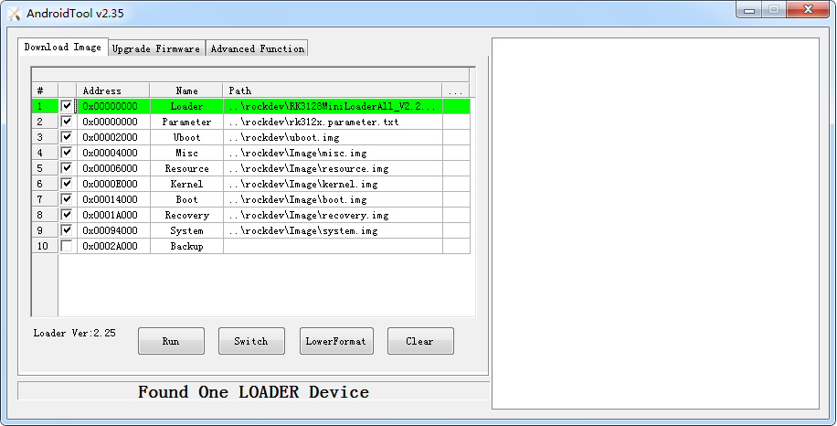

RK Linux编译

## 1.1 下载SDK并编译，生成固件
```
1、同步代码
$.repo/repo/repo sync --no-tags

2、选择单板
$ source buildroot/build/envsetup.sh
You're building on Linux
Lunch menu...pick a combo:
1. rockchip_rk3308_release
2. rockchip_rk3308_debug
3. rockchip_rk3308_robot_release
Which would you like? [1]
如选择 rockchip_rk3308_release，输入对应序号 （你的单板序号）。
注意：
这一步输错的话，建议多输入这个错误字符，再回车，强烈建议不要ctrl+c，否者可能造成编译过程中创建一半被中断，比如创建一个makefile空白，还没写入内容。编译就会遇到目标不存在等问题
注意：
shell的环境变量，只在当前shell有效，所以不要登入多个shell，会导致环境变量缺失编译失败。

3、编译
$ make

4、完成编译后生成固件
$ ./mkfirmware.sh  执行 SDK 根目录下的 mkfirmware.sh 脚本

5、完成编译后
所有烧写所需的镜像将都会拷贝于 rockdev 目录。
rockdev
├── boot.img
├── misc.img
├── parameter.txt
├── recovery.img
├── MiniLoaderAll.bin（即 rk3308_loader_v1.17.101.bin）
├── oem.img
├── userdata.img
├── rootfs.img
├── trust.img
└── uboot.img
```
## 1.2 烧写工具
请用SDK里面AndroidTool.exe ，不建议复制出来，SDK里面已经配置好了各子项名称路径，你可以直接选用。如

Windows工具：[AndroidTool](http://www.t-firefly.com/doc/download/page/id/4.html#windows_22)

```
    提示：AndroidTool_v2.35版本：升级MBR分区的Ubuntu固件
         AndroidTool_v2.58版本：升级GPT分区的Ubuntu固件
```


### 1.2.1 启动模式

Rockchip 平台硬件运行的几种模式如表所示，只有当设备处于 Maskrom，及 Loader
模式下，才能够烧写固件，或对板上固件进行更新操作。

| 模式            | 工具烧录 | 介绍                                                         |
| --------------- | -------- | ------------------------------------------------------------ |
| Maskrom         | 支持     | Flash 在未烧录固件时，芯片会引导进入 Maskrom 模式，可以<br/>进行初次固件的烧写；开发调试过程中若遇到 Loader 无法正常<br/>启动的情况，也可进入 Maskrom 模式烧写固件。 |
| Loader          | 支持     | Loader 模式下，可以进行固件的烧写、升级。可以通过工具单<br/>独烧写某一个分区镜像文件，方便调试。 |
| Recovery        | 不支持   | 系统引导 recovery 启动，主要作用是升级、恢复出厂设置类操<br/>作 |
| Normal<br/>Boot | 不支持   | 系统引导 rootfs 启动，加载 rootfs，大多数的开发都是在这个<br/>模式在调试的 |

进入烧写模式方式以下几种方法：
1. 未烧录过固件，上电，进入 Maskrom 模式。
2. 烧录过固件，按住 recovery 按键上电或复位，系统将进入 Loader 固件烧写模式。
3. 烧录过固件，按住 Maskrom 按键上电或复位，系统将进入 MaskRom 固件烧写模式。
4. 烧录过固件，上电或复位后开发板正常进入系统后，瑞芯微开发工具上显示“发现一个 **ADB**
**设备”或“发现一个 MSC 设备”**，然后点击工具上的按钮**“切换”，进入 Loader 模式。**
5. 烧录过固件，可在串口或 adb 命令行模式下，输入 reboot loader 命令，进入 Loader 模
式。

- Normal 模式

Normal 模式就是正常的启动过程，各个组件依次加载，正常进入系统。

- maskrom（不推荐）

```
如果芯片没烧写过，上电就是maskrom模式。这种模式用于拯救砖头机器。比如bootloader无法启动。无法进入loader正常下载。需要通过在板子上找对应的T13 C155 焊点，短接后通电，进入MASKROM模式，这些点需要问板子的生产商。
MaskRom 模式是设备变砖的最后一条防线。强行进入 MaskRom 涉及硬件操作，有一定风险， 因此仅在设备进入不了 Loader 模式情况下，方可尝试 MaskRom 模式。
```

- loder模式（推荐）

  ```
  是刷固件模式。这个模式可以刷各种镜像image，。按住recover按键再通电，通过uboot的检测进入这个模式
  ```

### 1.2.2 烧写方法

#### hotkey ##

为了用户开发方便，rockchip 定义了一些快捷键用于调试或触发某些操作。快捷键主要通过串口输入实
现：
开机长按 ctrl+c：进入 U-Boot 命令行模式；
开机长按 ctrl+d：进入 loader 烧写模式；
开机长按 ctrl+b：进入 maskrom 烧写模式；
开机长按 ctrl+f：进入 fastboot 模式；
开机长按 ctrl+m：打印 bidram/system 信息；
开机长按 ctrl+i：使能内核 initcall_debug；
开机长按 ctrl+p：打印 cmdline 信息；
开机长按 ctrl+s："Starting kernel..."之后进入 U-Boot 命令行；
开机反复按机器的 power button：进入 loader 烧写模式。但是用户需要先使能：

```
CONFIG_PWRKEY_DNL_TRIGGER_NUM
```

这是一个 int 类型的宏，用户根据实际情况定义（可理解为：灵敏度）。当连续按 power button 的次
数超过定义值后，U-Boot 会进入 loader 烧写模式。默认值为 0，表示禁用该功能。

- Maskrom模式下烧写

```
1、 进入Maskrom
如果没有烧录过系统的芯片，上电就是maskrom模式
或者reboot 命令重启，开机马上按'ctrl+c'进入uboot命令选择界面，help查看帮助，‘rbrom’进入Maskrom
或者reboot 命令重启， ctrl+b：进入 maskrom 烧写模式；

2、按上图图片，直接烧写
```

- Loader模式下烧写

```
采用loader烧写，说明芯片已经烧写过固件有loader和parameter在上面，所以可以单模块烧写，比如值烧写rootfs

1、 进入loader
方法一
reboot loader就会进入loader模式
方法二
reboot重启Ctrl+C进入uboot命令行输入  rockusb 0 mmc 0就会进入loder模式
或者 reboot重启 开机长按 ctrl+d：进入 loader 烧写模式
2、烧写
采用loader烧写，说明芯片已经烧写过固件有loader和parameter在机器，所以可以单模块烧写，比如值烧写rootfs
```

单模块烧写

```
在Maskrom下单模块烧写，并且你烧写过paramenter，那么这时候，单模块烧写，你就要选上（loader+单模块），比如说，你编译了builroot这时候生成的是rootfs，这时候loader+rootfs。这两项选上再烧写。

在loader模式下单模块烧写,你烧写过paramenter，那么会有分区信息，这时候就可以单模块烧写。在loader模式下，你只编译了buildroot生成的rootfs，那么只需要烧写 勾选上rootfs，其他不用选，烧写。
```

### 1.2.3 固件文件

固件文件一般有两种：

- 单个统一固件 update.img, 将启动加载器、参数和所有分区镜像都打包到一起，用于固件发布。
- 多个分区镜像,如 kernel.img, boot.img, recovery.img 等，在开发阶段生成。

#### 1.2.3.1 烧写统一固件 update.img

烧写统一固件 update.img 的步骤如下:

- 切换至”升级固件”页。
- 按”固件”按钮，打开要升级的固件文件。升级工具会显示详细的固件信息。
- 按”升级”按钮开始升级。
- 如果升级失败，可以尝试先按”擦除Flash”按钮来擦除 Flash，然后再升级。

注意：***如果你烧写的固件laoder版本与原来的机器的不一致，请在升级固件前先执行”擦除Flash”。***


#### 1.2.3.2 烧写分区映像

烧写分区映像的步骤如下：

- 切换至”下载镜像”页。
- 勾选需要烧录的分区，可以多选。
- 确保映像文件的路径正确，需要的话，点路径右边的空白表格单元格来重新选择。
- 点击”执行”按钮开始升级，升级结束后设备会自动重启。

 

### 1.2.4 各分区镜像

uboot：对应的是uboot.img。  uboot 属于bootloader的一种，是用来引导启动内核的，它的最终目的就是，从flash中读出内核，放到内存中，启动内核
trust：对应的是trust.img， 其中含有ATF以及休眠唤醒相关的文件。安全保护使用。
misc: misc 分区映像，对应misc.img，负责启动模式切换和急救模式的参数传递。
resource: 资源映像，对应的是resource.img，内含开机图片和内核的设备树信息。
kernel: 内核映像，对应的是kernel.img
boot: Android 的初始文件映像，即ramdisk，负责初始化并加载 system 分区，对应的是boot.img
recovery:急救模式映像，对应的是recovery.img
system: Android 的 system 分区映像，ext4 文件系统格式，对应的是system.img

## 2 编译

### 2.1 编译Buildroot

#### 2.1.1 source

```
source envsetup.sh  #选择开发板，如rk3128
```

生成连接指向配置

cw@SYS3:~/sdk/3126i/device/rockchip$ ls -al
lrwxrwxrwx  1 cw cw   21 Mar  5 15:41 .BoardConfig.mk -> rk3128/BoardConfig.mk

执行编译命令时，将会根据 `.mk` 文件进行编译。 对 Buildroot 相关配置进行说明 ：

```shell
cw@SYS3:~/sdk/3126i/device/rockchip$ vim .BoardConfig.mk
1 #!/bin/bash
2
3 # Target arch
4 export RK_ARCH=arm
5 # Uboot defconfig
6 export RK_UBOOT_DEFCONFIG=rk3128
7 # Kernel defconfig
8 export RK_KERNEL_DEFCONFIG=rockchip_linux_defconfig
9 # Kernel dts
10 export RK_KERNEL_DTS=rk3128-fireprime
11 # boot image type
12 export RK_BOOT_IMG=zboot.img
13 # kernel image path
14 export RK_KERNEL_IMG=kernel/arch/arm/boot/zImage
15 # parameter for GPT table
16 export RK_PARAMETER=parameter-buildroot.txt
17 # Buildroot config
18 export RK_CFG_BUILDROOT=rockchip_rk3128

# Buildroot 根文件系统配置文件
# 文件路径在 `buildroot/configs/rockchip_rk3128_defconfig`

19 # Recovery config
20 export RK_CFG_RECOVERY=rockchip_rk3128_recovery

# recovery 模式下根文件系统配置文件（可省略）
# 文件路径在 `buildroot/configs/rockchip_rk3288_recovery_defconfig`

21 # Pcba config
22 export RK_CFG_PCBA=rockchip_rk3128_pcba
23 # Build jobs
24 export RK_JOBS=12
25 # target chip
26 export RK_TARGET_PRODUCT=rk3128
27 # Set rootfs type, including ext2 ext4 squashfs
28 export RK_ROOTFS_TYPE=ext4
29 # rootfs image path
30 export RK_ROOTFS_IMG=rockdev/rootfs.${RK_ROOTFS_TYPE}

# Buildroot 根文件系统镜像路径
# 本例中，文件路径在 `buildroot/output/rockchip_rk3128/images/rootfs.ext4`
# 注：该文件路径将在首次编译根文件系统后生成

31 # Set oem partition type, including ext2 squashfs
32 export RK_OEM_FS_TYPE=ext2
33 # Set userdata partition type, including ext2, fat
34 export RK_USERDATA_FS_TYPE=ext2
35 #OEM config
36 export RK_OEM_DIR=oem_normal
37 #userdata config
38 export RK_USERDATA_DIR=userdata_normal
39 #misc image
40 export RK_MISC=wipe_all-misc.img

```

Linux export 命令用于设置或显示环境变量。

在 shell 中执行程序时，shell 会提供一组环境变量。export 可新增，修改或删除环境变量，供后续执行的程序使用。export 的效力仅限于该次登陆操作。（所以环境变量只在当前secureCRT窗口shell有效，再开一个窗口shell就没了）

```
export [-fnp][变量名称]=[变量设置值]
```

**参数说明**：

- -f 　代表[变量名称]中为函数名称。
- -n 　删除指定的变量。变量实际上并未删除，只是不会输出到后续指令的执行环境中。
- -p 　列出所有的shell赋予程序的环境变量。

列出当前所有的环境变量

```
# export -p //列出当前的环境变量值
declare -x HOME=“/root“
declare -x LANG=“zh_CN.UTF-8“
declare -x LANGUAGE=“zh_CN:zh“
```

#### 2.1.2  make

怎么编译buildroot修改的模块

```
make menuconfig    //# 进入图形化配置界面，选择所需模块，保存退出。斜杆搜索，空格或者y选上
make savedeconfig   //保存到配置文件 'buildroot/configs/rockchip_rk3128_defconfig'

举个例子，你看到如下改变
cw@SYS3:~/sdk/3126i/buildroot$ git diff
diff --git a/configs/rockchip_rk3128_defconfig b/configs/rockchip_rk3128_defconfig
index 4232fac868..06a4728bc3 100644
--- a/configs/rockchip_rk3128_defconfig
+++ b/configs/rockchip_rk3128_defconfig
@@ -16,8 +16,13 @@
 #include "qt_app.config"
+#include "video_gst_rtsp.config"


make rkwifibt-dirclean //清除掉之前的
make rkwifibt-rebuild //重新编译
再make 即可（实际就是等价于与./build.sh rootfs）。还要./mkfirmware.sh


cw@SYS3:~/sdk/3126i$ make savedefconfig
cw@SYS3:~/sdk/3126i$ ./build.sh rootfs （或者直接make，等价的）
cw@SYS3:~/sdk/3126i$ ./mkfirmware.sh  （打包固件）
```

### 2.2 编译Kernel

```
cd kernel

一共kernel下执行四条命令
cw@SYS3:~/sdk/3126i/kernel$ make  ARCH=arm rockchip_linux_defconfig
cw@SYS3:~/sdk/3126i/kernel$ make  ARCH=arm menuconfig
这条命令生成了.config文件

cw@SYS3:~/sdk/3126i/kernel$ make ARCH=arm savedefconfig
scripts/kconfig/conf  --savedefconfig=defconfig Kconfig
这条命令下生成上defconfig文件

cw@SYS3:~/sdk/3126i/kernel$ cp defconfig arch/arm/configs/rockchip_linux_defconfig
这条命令下生产了defconfig文件arch/arm/configs/rockchip_linux_defconfig

注意（为什么指定ARCH=arm，不加的话影响是啥）：
arch是说明用的是32位的机器，如RK3126、RK2128
cw@SYS3:~/sdk/3328/kernel$make menuconfig ARCH=arm
注意kernel对于32位，make menuconfig和make savedefconfig都必须加上ARCH=arm， menuconfig配置后save在拷贝到arch/arm/configs/rockchip_linux_defconfig。
如果不加 ARCH=arm的话，默认是64位，这时候，这时候你git diff下发现rockchip_linux_defconfig会有很大的改动。
加 ARCH=arm的话，就是32位机器，你git diff下发现rockchip_linux_defconfig就是刚才菜单的那些修改。
你看下下面文件搜索就会明白
cw@SYS3:~/sdk/3126i/kernel$ ag -g "rockchip_linux_defconfig"
arch/arm/configs/rockchip_linux_defconfig
arch/arm64/configs/rockchip_linux_defconfig
```

### 2.3 自动编译

#### 2.3.1 全自动编译

./build.sh   全自动编译会编译并打包固件 `update.img`，生成固件目录 `rockdev/`：

#### 2.3.2 部分编译

- 编译 kernel:      ./build.sh kernel

- 编译 u-boot:      ./build.sh uboot

- 编译 rootfs:        编译 Buildroot 根文件系统，将会在 `buildroot/output` 生成编译输出目录：

  ./build.sh buildroot 注：确保作为普通用户编译 Buildroot 根文件系统，避免不必要的错误。编译过程中会自动下载所需软件包，请保持联网状态

#### 2.3.3 更新链接&打包固件

- 更新链接

为确保 `rockdev/` 目录下文件链接正确，**更新各部分镜像链接**：

```
./mkfirmware.sh
```

- 打包固件

将 `rockdev` 目录的**各部分镜像打包成一个固件** `update.img`：

```
./build.sh updateimg
```

## 3  buildroot 与source envsetup.sh

### 3.1 编译buildroot

客户按实际编译环境配置好编译依赖后，按照以下步骤配置完后，执行 make 即可。
$ source buildroot/build/envsetup.sh
You're building on Linux
Lunch menu...pick a combo:

1. rockchip_rk3308_release
2. rockchip_rk3308_debug
3. rockchip_rk3308_robot_release
4. rockchip_rk3308_robot_debug
5. rockchip_rk3308_mini_release
Which would you like? [1]
如选择 rockchip_rk3308_release，输入对应序号 1。
$ make
完成编译后执行 SDK 根目录下的 mkfirmware.sh 脚本生成固件
$ ./mkfirmware.sh
所有烧写所需的镜像将都会拷贝于 rockdev 目录。

### 3.1 注意 1 source envsetup.sh禁止ctrl+c

envsetup.sh只是将某个单板的相关配置source进当前shell的环境变量

【注意 1】：build.sh不能强制ctrl+c，如果你输入错误的数字才发现错了，就再随便输入几个字母，回车

source envsetup.sh 执行的文件会生成Makefile等文件，比如你发下你填错数字了，千万不要ctrl+c，这时候比如他正在生成makefile后，可是你强制停止了，文件还没有写入任何内容，这时候你ctrl就终止了，可是make执行的就是这个空白的makefile。可能错误如下：

```
2020-03-12T20:06:26 >>>   Generating root filesystem image rootfs.tar
2020-03-12T20:06:26 rm -rf /home/cw/sdk/3126i/buildroot/output/rockchip_rk3128_recovery/build/buildroot-fs
2020-03-12T20:06:26 mkdir -p /home/cw/sdk/3126i/buildroot/output/rockchip_rk3128_recovery/build/buildroot-fs
2020-03-12T20:06:26 echo '#!/bin/sh' > /home/cw/sdk/3126i/buildroot/output/rockchip_rk3128_recovery/build/buildroot-fs/fakeroot.fs
2020-03-12T20:06:26 echo "set -e" >> /home/cw/sdk/3126i/buildroot/output/rockchip_rk3128_recovery/build/buildroot-fs/fakeroot.fs
2020-03-12T20:06:26 echo "chown -h -R 0:0 /home/cw/sdk/3126i/buildroot/output/rockchip_rk3128_recovery/target" >> /home/cw/sdk/3126i/buildroot/output/rockchip_rk3128_recovery/build/buildroot-fs/fakeroot.fs
2020-03-12T20:06:26 printf '    - - input -1 * - - - Input device groupnn' >> /home/cw/sdk/3126i/buildroot/output/rockchip_rk3128_recovery/build/buildroot-fs/users_table.txt
2020-03-12T20:06:26 PATH="/home/cw/sdk/3126i/buildroot/output/rockchip_rk3128_recovery/host/bin:/home/cw/sdk/3126i/buildroot/output/rockchip_rk3128_recovery/host/sbin:/usr/local/sbin:/usr/local/bin:/usr/sbin:/usr/bin:/sbin:/bin:/usr/games:/usr/local/games:/snap/bin" /home/cw/sdk/3126i/buildroot/support/scripts/mkusers /home/cw/sdk/3126i/buildroot/output/rockchip_rk3128_recovery/build/buildroot-fs/users_table.txt /home/cw/sdk/3126i/buildroot/output/rockchip_rk3128_recovery/target >> /home/cw/sdk/3126i/buildroot/output/rockchip_rk3128_recovery/build/buildroot-fs/fakeroot.fs
2020-03-12T20:06:26 cat system/device_table.txt > /home/cw/sdk/3126i/buildroot/output/rockchip_rk3128_recovery/build/buildroot-fs/device_table.txt
2020-03-12T20:06:26 printf '    /bin/busybox                     f 4755 0  0 - - - - -n /dev/console c 622 0 0 5 1 - - -nn' >> /home/cw/sdk/3126i/buildroot/output/rockchip_rk3128_recovery/build/buildroot-fs/device_table.txt
2020-03-12T20:06:26 echo "/home/cw/sdk/3126i/buildroot/output/rockchip_rk3128_recovery/host/bin/makedevs -d /home/cw/sdk/3126i/buildroot/output/rockchip_rk3128_recovery/build/buildroot-fs/device_table.txt /home/cw/sdk/3126i/buildroot/output/rockchip_rk3128_recovery/target" >> /home/cw/sdk/3126i/buildroot/output/rockchip_rk3128_recovery/build/buildroot-fs/fakeroot.fs
2020-03-12T20:06:26 printf '    (cd /home/cw/sdk/3126i/buildroot/output/rockchip_rk3128_recovery/target; find -print0 | LC_ALL=C sort -z | tar  -cf /home/cw/sdk/3126i/buildroot/output/rockchip_rk3128_recovery/images/rootfs.tar --null --no-recursion -T - --numeric-owner)n' >> /home/cw/sdk/3126i/buildroot/output/rockchip_rk3128_recovery/build/buildroot-fs/fakeroot.fs
2020-03-12T20:06:26 chmod a+x /home/cw/sdk/3126i/buildroot/output/rockchip_rk3128_recovery/build/buildroot-fs/fakeroot.fs
2020-03-12T20:06:26 rm -f /home/cw/sdk/3126i/buildroot/output/rockchip_rk3128_recovery/target/THIS_IS_NOT_YOUR_ROOT_FILESYSTEM
2020-03-12T20:06:26 PATH="/home/cw/sdk/3126i/buildroot/output/rockchip_rk3128_recovery/host/bin:/home/cw/sdk/3126i/buildroot/output/rockchip_rk3128_recovery/host/sbin:/usr/local/sbin:/usr/local/bin:/usr/sbin:/usr/bin:/sbin:/bin:/usr/games:/usr/local/games:/snap/bin" /home/cw/sdk/3126i/buildroot/output/rockchip_rk3128_recovery/host/bin/fakeroot -- /home/cw/sdk/3126i/buildroot/output/rockchip_rk3128_recovery/build/buildroot-fs/fakeroot.fs
2020-03-12T20:06:26 rootdir=/home/cw/sdk/3126i/buildroot/output/rockchip_rk3128_recovery/target
2020-03-12T20:06:26 table='/home/cw/sdk/3126i/buildroot/output/rockchip_rk3128_recovery/build/buildroot-fs/device_table.txt'
2020-03-12T20:06:26 /usr/bin/install -m 0644 support/misc/target-dir-warning.txt /home/cw/sdk/3126i/buildroot/output/rockchip_rk3128_recovery/target/THIS_IS_NOT_YOUR_ROOT_FILESYSTEM
2020-03-13T08:23:50 make: *** No targets.  Stop.
2020-03-13T09:15:54 make: *** No targets.  Stop.
2020-03-13T09:16:16 make: *** No targets.  Stop.
2020-03-13T09:16:36 make: *** No targets.  Stop.

cw@SYS3:~/sdk/3126i$ vi Makefile
2020-03-13T09:55:47 make: *** No targets.  Stop.
2020-03-13T10:04:06 make: *** No targets.  Stop.
```


```
cw@SYS3:~/sdk/3126i$ vi Makefile
  1 ### DO NOT EDIT THIS FILE ###
  2 ifeq ($(TARGET_OUTPUT_DIR),)
  3 $(error "Please use "source buildroot/build/envsetup.sh" to select a buildroot config")
  4 endif
  5
  6 O=$(TARGET_OUTPUT_DIR)//原因就是这个输出在output/rk3128/下的makefile由于ctrl+c，里面是空白的，还没有写入，把这个文件删除了就好
  7 include $(O)/Makefile
  //1696  cd buildroot/output/rockchip_rk3128/  rm Makefile
  8 ### DO NOT EDIT THIS FILE ###
```

解决

```
原因就是这个输出在output/rk3128/下的makefile由于ctrl+c强制停止脚本，里面是空白的，还没有写入，把这个文件删除了就好

 ~/sdk/3126i_study/buildroot/output/rockchip_rk3128/Makefile 这个makefile是自动生成的。所以强制停止
  # Automatically generated by /home/cw/sdk/3126i_study/buildroot/support/scripts/mkmakefile: don't edit
```

### 3.2 注意 2复制工程要删除重编译
 【注意 2】：你复制了A工程为B，在B工程下执行.build.sh会报错，因为用的还是A工程的路径。

解决：删除output/单板下

```

2020-03-13T10:26:28 /home/cw/sdk/3126i/buildroot/output/rockchip_rk3128/images/rootfs.ext2: ***** FILE SYSTEM WAS MODIFIED *****
2020-03-13T10:26:28 /home/cw/sdk/3126i/buildroot/output/rockchip_rk3128/images/rootfs.ext2: 5929/32768 files (0.1% non-contiguous), 72692/113478 blocks
2020-03-13T10:26:28 /home/cw/sdk/3126i/buildroot/output/rockchip_rk3128/host/sbin/tune2fs -m 5 /home/cw/sdk/3126i/buildroot/output/rockchip_rk3128/images/rootfs.ext2
2020-03-13T10:26:28 tune2fs 1.43.9 (8-Feb-2018)
2020-03-13T10:26:28 Setting reserved blocks percentage to 5% (5673 blocks)
2020-03-13T10:26:28 /home/cw/sdk/3126i/buildroot/output/rockchip_rk3128/host/sbin/resize2fs -M /home/cw/sdk/3126i/buildroot/output/rockchip_rk3128/images/rootfs.ext2
2020-03-13T10:26:28 resize2fs 1.43.9 (8-Feb-2018)
2020-03-13T10:26:28 Resizing the filesystem on /home/cw/sdk/3126i/buildroot/output/rockchip_rk3128/images/rootfs.ext2 to 106117 (4k) blocks.
2020-03-13T10:26:28 The filesystem on /home/cw/sdk/3126i/buildroot/output/rockchip_rk3128/images/rootfs.ext2 is now 106117 (4k) blocks long.
2020-03-13T10:26:28
```

### 3.3 切换单板与脚本的关系

根目录脚本envsetup.sh 下面有下面这句话，使用的是软连接 根目录/device/rockchip/.BoardConfig.mk

````
#注意一下，这个软件链，应该是手动在device/rockchip下面配置的
	source ${TOP_DIR}/device/rockchip/.BoardConfig.mk
	echo “source 文件里面的变量${TOP_DIR}/device/rockchip/.BoardConfig.mk 这里指定了每个的设备树，板载配置等”

````

看下这个软连接指向啥，这个软连接是是一个特定单板的芯片

```
root@c:/home/c/linux/v2/device/rockchip# ls -al
总用量 108
drwxr-xr-x 26 c    c    4096 3月  15 14:43 .
drwxr-xr-x  3 c    c    4096 1月  30 22:06 ..
lrwxrwxrwx  1 root root   21 3月  15 14:43 .BoardConfig.mk -> rk3128/BoardConfig.mk
drwxr-xr-x  2 c    c    4096 3月  15 01:41 common
drwxr-xr-x  2 c    c    4096 3月  15 00:01 .git
```

所以切换单板的操作：

```
root@c:/home/c/linux/v2/device/rockchip# ln -sf rk3128/BoardConfig.mk .BoardConfig.mk
root@c:/home/c/linux/v2# source envsetup.sh   #envsetup.sh 会source .BoardConfig.mk 里面的环境变量
root@c:/home/c/linux/v2# ./build.sh


如下可以看到，编译的时候，就单板已切换
processing option: allsave
============================================
TARGET_ARCH=arm
TARGET_PLATFORM=rk3128
TARGET_UBOOT_CONFIG=evb-rk3128
TARGET_KERNEL_CONFIG=rockchip_linux_defconfig
TARGET_KERNEL_DTS=rk3128-fireprime
TARGET_TOOLCHAIN_CONFIG=
TARGET_BUILDROOT_CONFIG=rockchip_rk3128
TARGET_RECOVERY_CONFIG=rockchip_rk3128_recovery
TARGET_PCBA_CONFIG=rockchip_rk3128_pcba
TARGET_RAMBOOT_CONFIG=
=============================
```

【错误实例】

如果3128切换为3308。你没有重新生成软链接指向3308的配置，哪怕你重新source之后，./build.sh还是使用的是3128的配置。


【./build.sh rootfs】

```
执行的就是删除相关文件，执行source命令和make命令
```

 全自动编译脚本，降低人工编译可能出现的误操作，该 SDK 中集成了全自动化编译脚本，方便固件编译、备份。

```

1）脚本原始文件存放于：
device/rockchip/common/build.sh
2）在 repo sync 的时候，通过 manifest 中的 copy 选项拷贝至工程根目录下：
3）修改 device/rockchip/rkxx(芯片平台)/BoardConfig.mk 脚本中的特定变量以编出对应
产品固件。
如 RK3308 平台，可修改 device/rockchip/rk3308/BoardConfig.mk 文件：
#buildroot defconfig
LUNCH=rockchip_rk3308_release
#uboot defconfig
UBOOT_DEFCONFIG=evb-rk3308
#kernel defconfig
KERNEL_DEFCONFIG=rk3308_linux_defconfig
#kernel dts
KERNEL_DTS= rk3308-evb-dmic-pdm-v11
以下变量请按实际项目情况，对应修改：
LUNCH 变量指定 Buildroot 编译 defconfig。
KERNEL_DTS 变量指定编译 kernel 的产品板极配置。
4）执行自动编译脚本：
./build.sh
该脚本会自动配置环境变量，编译 U-Boot，编译 Kernel，编译 Buildroot，编译 Recovery
继而生成固件。
5）脚本生成内容:
脚本会将编译生成的固件拷贝至：
IMAGE/RK3308-EVB-DMIC-PDM-V11_****_RELEASE_TEST/IMAGES 目录下，具体路
径以实际生成为准。每次编译都会新建目录保存，自动备份调试开发过程的固件版本，并存放固件
版本的各类信息
```

build.sh可编译单独模块, 使用命令`./build.sh -h`查看帮助


```
$./build.sh -h
====USAGE: build.sh modules====
uboot -build uboot
kernel -build kernel
rootfs -build default rootfs, currently build buildroot as default
buildroot -build buildroot rootfs
yocto -build yocto rootfs, currently build ros as default
ros -build ros rootfs
debian -build debian rootfs
pcba -build pcba
recovery -build recovery
all -build uboot, kernel, rootfs, recovery image
cleanall -clean uboot, kernel, rootfs, recovery
firmware -pack all the image we need to boot up system
updateimg -pack update image
save -save images, patches, commands used to debug
default -build all modules
如单独编译 kernel，只需要执行以下命令：
./build.sh kernel
如单独编译 kernel，只需要执行以下命令：
./build.sh rootfs
```

###  3.3 source 的作用

如果你没有 source envsetup.sh 的话会怎么样:	会说你没有指定目标

```
c@c:~/linux/v1$ ./build.sh kernel
./build.sh: 行 9: /home/c/linux/v1/device/rockchip/.BoardConfig.mk: 没有那个文件或目录
processing option: kernel
============Start build kernel============
TARGET_ARCH          =
TARGET_KERNEL_CONFIG =
TARGET_KERNEL_DTS    =
==========================================
Makefile:660: arch//Makefile: 没有那个文件或目录
make: *** 没有规则可制作目标“arch//Makefile”。 停止。
====Build kernel failed!====
```

有 source envsetup.sh 的话会怎么样:

```
c@c:~/linux/v1$ source envsetup.sh
Top of tree: /home/c/linux/v1

You're building on Linux
Lunch menu...pick a combo:

0. non-rockchip boards
22. rockchip_rk3036
23. rockchip_rk3036_recovery
24. rockchip_rk3126c
25. rockchip_rk3126c_dpf
26. rockchip_rk3126c_recovery
27. rockchip_rk3128

Which would you like? [0]: 27
-bash: /home/c/linux/v1/device/rockchip/.BoardConfig.mk: 没有那个文件或目录
===========================================

#TARGET_BOARD=rk3128
#OUTPUT_DIR=output/rockchip_rk3128
#CONFIG=rockchip_rk3128_defconfig

===========================================
make: 进入目录“/home/c/linux/v1/buildroot”
  GEN     /home/c/linux/v1/buildroot/output/rockchip_rk3128/Makefile
/home/c/linux/v1/buildroot/build/defconfig_hook.py -m /home/c/linux/v1/buildroot/configs/rockchip_rk3128_defconfig /home/c/linux/v1/buildroot/output/rockchip_rk3128/.rockchipconfig
BR2_DEFCONFIG='' KCONFIG_AUTOCONFIG=/home/c/linux/v1/buildroot/output/rockchip_rk3128/build/buildroot-config/auto.conf KCONFIG_AUTOHEADER=/home/c/linux/v1/buildroot/output/rockchip_rk3128/build/buildroot-config/autoconf.h KCONFIG_TRISTATE=/home/c/linux/v1/buildroot/output/rockchip_rk3128/build/buildroot-config/tristate.config BR2_CONFIG=/home/c/linux/v1/buildroot/output/rockchip_rk3128/.config HOST_GCC_VERSION="7" BUILD_DIR=/home/c/linux/v1/buildroot/output/rockchip_rk3128/build SKIP_LEGACY= BR2_DEFCONFIG=/home/c/linux/v1/buildroot/configs/rockchip_rk3128_defconfig /home/c/linux/v1/buildroot/output/rockchip_rk3128/build/buildroot-config/conf --defconfig=/home/c/linux/v1/buildroot/output/rockchip_rk3128/.rockchipconfig Config.in
/home/c/linux/v1/buildroot/output/rockchip_rk3128/.rockchipconfig:77:warning: override: reassigning to symbol BR2_PACKAGE_MPP
/home/c/linux/v1/buildroot/output/rockchip_rk3128/.rockchipconfig:78:warning: override: reassigning to symbol BR2_PACKAGE_MPP_ALLOCATOR_DRM
/home/c/linux/v1/buildroot/output/rockchip_rk3128/.rockchipconfig:80:warning: override: reassigning to symbol BR2_PACKAGE_LINUX_RGA
/home/c/linux/v1/buildroot/output/rockchip_rk3128/.rockchipconfig:266:warning: override: reassigning to symbol BR2_PACKAGE_RKWIFIBT
#
# configuration written to /home/c/linux/v1/buildroot/output/rockchip_rk3128/.config
#
make: 离开目录“/home/c/linux/v1/buildroot”
```

## 4 build.sh

为了提高编译的效率，降低人工编译可能出现的误操作，该 SDK 中集成了全自动化编译脚本，
方便固件编译、备份。

### 4.1原理

1. 该全自动化编译脚本原始文件存放于：
   device/rockchip/common/build.sh

2. 在 repo sync 的时候，通过 manifest 中的 copy 选项拷贝至工程根目录下：

3. **修改 device/rockchip/rkxx(芯片平台)/.BoardConfig.mk 脚本中的特定变量以编出对应**

   (换芯片要重新修改这个软连接)

4. 产品固件。
   如 RK3308 平台，可修改 device/rockchip/rk3308/BoardConfig.mk 文件：

   ```
   #buildroot defconfig
   LUNCH=rockchip_rk3308_release
   #uboot defconfig
   UBOOT_DEFCONFIG=evb-rk3308
   #kernel defconfig
   KERNEL_DEFCONFIG=rk3308_linux_defconfig
   #kernel dts
   KERNEL_DTS= rk3308-evb-dmic-pdm-v11
   以下变量请按实际项目情况，对应修改：
   LUNCH 变量指定 Buildroot 编译 defconfig。
   KERNEL_DTS 变量指定编译 kernel 的产品板极配置。
   ```

5. 执行自动编译脚本：
   ./build.sh
   该脚本会自动配置环境变量，编译 U-Boot，编译 Kernel，编译 Buildroot，编译 Recovery
   继而生成固件。

6. 脚本生成内容:
   脚本会将编译生成的固件拷贝至：
   IMAGE/RK3308-EVB-DMIC-PDM-V11__RELEASE_TEST/IMAGES 目录下，具体
   路径以实际生成为准。**每次编译都会新建目录保存，(如果你硬盘空间不够大，可以删除掉)自动备份调试开发过程的固件版本**，并存放固件版本的各类信息

### 4.2单模块编译

$./build.sh -h  //帮助文档

- uboot             编译uboot
- kernel            编译内核
- rootfs             编译default rootfs, currently build buildroot as default
- buildroot        编译buildroot rootfs
- yocto              编译yocto rootfs, currently build ros as default
- ros                  编译 ros rootfs
- debian             编译 debian rootfs
- pcba                编译pcba
- recovery          编译 recovery
- all -build uboot, kernel, rootfs, recovery image
- cleanall -clean uboot, kernel, rootfs, recovery
- firmware -pack all the image we need to boot up system
- updateimg -pack update image   打包update镜像
- save -save images, patches, commands used to debug
- default -build all modules  默认编译所有的模块


```shell
#!/bin/bash

unset RK_CFG_TOOLCHAIN

CMD=`realpath $0`
COMMON_DIR=`dirname $CMD`
TOP_DIR=$(realpath $COMMON_DIR/../../..)
BOARD_CONFIG=$TOP_DIR/device/rockchip/.BoardConfig.mk
source $BOARD_CONFIG
source $TOP_DIR/device/rockchip/common/Version.mk

//`./build.sh -h`命令时候，打印出帮助
function usage()
{
	echo "Usage: build.sh [OPTIONS]"
	echo "Available options:"
	echo "BoardConfig*.mk    -switch to specified board config"
	echo "uboot              -build uboot"
	echo "kernel             -build kernel"
	echo "modules            -build kernel modules"
	echo "toolchain          -build toolchain"
	echo "rootfs             -build default rootfs, currently build buildroot as default"
	echo "buildroot          -build buildroot rootfs"
	echo "ramboot            -build ramboot image"
	echo "multi-npu_boot     -build boot image for multi-npu board"
	echo "yocto              -build yocto rootfs"
	echo "debian             -build debian9 stretch rootfs"
	echo "distro             -build debian10 buster rootfs"
	echo "pcba               -build pcba"
	echo "recovery           -build recovery"
	echo "all                -build uboot, kernel, rootfs, recovery image"
	echo "cleanall           -clean uboot, kernel, rootfs, recovery"
	echo "firmware           -pack all the image we need to boot up system"
	echo "updateimg          -pack update image"
	echo "otapackage         -pack ab update otapackage image"
	echo "save               -save images, patches, commands used to debug"
	echo "allsave            -build all & firmware & updateimg & save"
	echo ""
	echo "Default option is 'allsave'."
}

#c@c:~/linux/v1$ ag -t "RK_UBOOT_DEFCONFIG"
#device/rockchip/common/build.sh
#43:     echo "TARGET_UBOOT_CONFIG=$RK_UBOOT_DEFCONFIG"
#48:     cd u-boot && ./make.sh $RK_UBOOT_DEFCONFIG && cd -
#271:    echo "TARGET_UBOOT_CONFIG=$RK_UBOOT_DEFCONFIG"
#376:    echo "UBOOT:  defconfig: $RK_UBOOT_DEFCONFIG" >> $STUB_PATH/build_cmd_info
#device/rockchip/rk3399/BoardConfig_debian.mk
#6:export RK_UBOOT_DEFCONFIG=rk3399
#device/rockchip/rk3399/BoardConfig.mk
#6:export RK_UBOOT_DEFCONFIG=rk3399
#device/rockchip/rk3326/BoardConfig.mk
#6:export RK_UBOOT_DEFCONFIG=evb-rk3326
#device/rockchip/rk3326/BoardConfig_32bit.mk
#6:export RK_UBOOT_DEFCONFIG=evb-rk3326
#device/rockchip/rk3326/BoardConfig_robot64.mk
#6:export RK_UBOOT_DEFCONFIG=evb-rk3326
#device/rockchip/rk3326/BoardConfig_robot64_no_gpu.mk
#6:export RK_UBOOT_DEFCONFIG=evb-rk3326
//编译uboot  ，RK_UBOOT_DEFCONFIG是source 的时候生成的环境变量，指定了uboot的默认芯片
function build_uboot(){
	echo "============Start build uboot============"
	echo "TARGET_UBOOT_CONFIG=$RK_UBOOT_DEFCONFIG"
	echo "========================================="
	if [ -f u-boot/*_loader_*.bin ]; then    #如果这个是文件件，就删除
		rm u-boot/*_loader_*.bin
	fi
	cd u-boot && ./make.sh $RK_UBOOT_DEFCONFIG && cd -
	# $? 是上一个程序执行是否成功的标志，如果执行成功则$? 为0，否则 不为0

	if [ $? -eq 0 ]; then
		echo "====Build uboot ok!===="
	else
		echo "====Build uboot failed!===="
		exit 1
	fi
}

//编译kernel,前面source声明了
# TARGET_ARCH 目标架构
# RK_KERNEL_DEFCONFIG 内核默认配置
#TARGET_KERNEL_DTS 使用的dts
function build_kernel(){
	echo "============Start build kernel============"
	echo "TARGET_ARCH          =$RK_ARCH"
	echo "TARGET_KERNEL_CONFIG =$RK_KERNEL_DEFCONFIG"
	echo "TARGET_KERNEL_DTS    =$RK_KERNEL_DTS"
	echo "=========================================="
	cd $TOP_DIR/kernel && make ARCH=$RK_ARCH $RK_KERNEL_DEFCONFIG && make ARCH=$RK_ARCH $RK_KERNEL_DTS.img -j$RK_JOBS && cd -
	if [ $? -eq 0 ]; then
		echo "====Build kernel ok!===="
	else
		echo "====Build kernel failed!===="
		exit 1
	fi
}
//编译kernel模块
前面source声明了
# TARGET_ARCH 目标架构
# RK_KERNEL_DEFCONFIG 内核默认配置
function build_modules(){
	echo "============Start build kernel modules============"
	echo "TARGET_ARCH          =$RK_ARCH"
	echo "TARGET_KERNEL_CONFIG =$RK_KERNEL_DEFCONFIG"
	echo "=================================================="
	cd $TOP_DIR/kernel && make ARCH=$RK_ARCH $RK_KERNEL_DEFCONFIG && make ARCH=$RK_ARCH modules -j$RK_JOBS && cd -
	if [ $? -eq 0 ]; then
		echo "====Build kernel ok!===="
	else
		echo "====Build kernel failed!===="
		exit 1
	fi
}

//编译toolchain交叉工具链,前面source声明了
# RK_CFG_TOOLCHAIN
function build_toolchain(){
	echo "==========Start build toolchain =========="
	echo "TARGET_TOOLCHAIN_CONFIG=$RK_CFG_TOOLCHAIN"
	echo "========================================="
	[[ $RK_CFG_TOOLCHAIN ]] \
		&& /usr/bin/time -f "you take %E to build toolchain" $COMMON_DIR/mk-toolchain.sh $BOARD_CONFIG \
		|| echo "No toolchain step, skip!"
	if [ $? -eq 0 ]; then
		echo "====Build toolchain ok!===="
	else
		echo "====Build toolchain failed!===="
		exit 1
	fi
}

function build_buildroot(){
	echo "==========Start build buildroot=========="
	echo "TARGET_BUILDROOT_CONFIG=$RK_CFG_BUILDROOT"
	echo "========================================="
	/usr/bin/time -f "you take %E to build builroot" $COMMON_DIR/mk-buildroot.sh $BOARD_CONFIG
	if [ $? -eq 0 ]; then
		echo "====Build buildroot ok!===="
	else
		echo "====Build buildroot failed!===="
		exit 1
	fi
}

function build_ramboot(){
	echo "=========Start build ramboot========="
	echo "TARGET_RAMBOOT_CONFIG=$RK_CFG_RAMBOOT"
	echo "====================================="
	/usr/bin/time -f "you take %E to build ramboot" $COMMON_DIR/mk-ramdisk.sh ramboot.img $RK_CFG_RAMBOOT
	if [ $? -eq 0 ]; then
		echo "====Build ramboot ok!===="
	else
		echo "====Build ramboot failed!===="
		exit 1
	fi
}

function build_multi-npu_boot(){
	if [ -z "$RK_MULTINPU_BOOT" ]; then
		echo "=========Please set 'RK_MULTINPU_BOOT=y' in BoardConfig.mk========="
		exit 1
	fi
	echo "=========Start build multi-npu boot========="
	echo "TARGET_RAMBOOT_CONFIG=$RK_CFG_RAMBOOT"
	echo "====================================="
	/usr/bin/time -f "you take %E to build multi-npu boot" $COMMON_DIR/mk-multi-npu_boot.sh
	if [ $? -eq 0 ]; then
		echo "====Build multi-npu boot ok!===="
	else
		echo "====Build multi-npu boot failed!===="
		exit 1
	fi
}

function build_yocto(){
	if [ -z "$RK_YOCTO_MACHINE" ]; then
		echo "This board doesn't support yocto!"
		exit 1
	fi

	echo "=========Start build ramboot========="
	echo "TARGET_MACHINE=$RK_YOCTO_MACHINE"
	echo "====================================="

	cd yocto
	ln -sf $RK_YOCTO_MACHINE.conf build/conf/local.conf
	source oe-init-build-env
	cd ..
	bitbake core-image-minimal -r conf/include/rksdk.conf

	if [ $? -eq 0 ]; then
		echo "====Build yocto ok!===="
	else
		echo "====Build yocto failed!===="
		exit 1
	fi
}

function build_debian(){
	cd debian

	if [ "$RK_ARCH" == "arm" ]; then
		ARCH=armhf
	fi
	if [ "$RK_ARCH" == "arm64" ]; then
		ARCH=arm64
	fi

	if [ ! -e linaro-stretch-alip-*.tar.gz ]; then
		echo "\033[36m Run mk-base-debian.sh first \033[0m"
		RELEASE=stretch TARGET=desktop ARCH=$ARCH ./mk-base-debian.sh
	fi

	VERSION=debug ARCH=$ARCH ./mk-rootfs-stretch.sh

	./mk-image.sh
	cd ..
	if [ $? -eq 0 ]; then
		echo "====Build Debian9 ok!===="
	else
		echo "====Build Debian9 failed!===="
		exit 1
	fi
}

function build_distro(){
	echo "===========Start build debian==========="
	echo "TARGET_ARCH=$RK_ARCH"
	echo "RK_DISTRO_DEFCONFIG=$RK_DISTRO_DEFCONFIG"
	echo "========================================"
	cd distro && make $RK_DISTRO_DEFCONFIG && /usr/bin/time -f "you take %E to build debian" $TOP_DIR/distro/make.sh && cd -
	if [ $? -eq 0 ]; then
		echo "====Build debian ok!===="
	else
		echo "====Build debian failed!===="
		exit 1
	fi
}

function build_rootfs(){
	rm -f $RK_ROOTFS_IMG

	case "$1" in
		yocto)
			build_yocto
			ROOTFS_IMG=yocto/build/tmp/deploy/images/$RK_YOCTO_MACHINE/rootfs.img
			;;
		debian)
			build_debian
			ROOTFS_IMG=debian/linaro-rootfs.img
			;;
		distro)
			build_distro
			ROOTFS_IMG=yocto/output/images/rootfs.$RK_ROOTFS_TYPE
			;;
		*)
			build_buildroot
			ROOTFS_IMG=buildroot/output/$RK_CFG_BUILDROOT/images/rootfs.$RK_ROOTFS_TYPE
			;;
	esac

	[ -z "$ROOTFS_IMG" ] && return

	if [ ! -f "$ROOTFS_IMG" ]; then
		echo "$ROOTFS_IMG not generated?"
	else
		mkdir -p ${RK_ROOTFS_IMG%/*}
		ln -rsf $TOP_DIR/$ROOTFS_IMG $RK_ROOTFS_IMG
	fi
}

function build_recovery(){
	echo "==========Start build recovery=========="
	echo "TARGET_RECOVERY_CONFIG=$RK_CFG_RECOVERY"
	echo "========================================"
	/usr/bin/time -f "you take %E to build recovery" $COMMON_DIR/mk-ramdisk.sh recovery.img $RK_CFG_RECOVERY
	if [ $? -eq 0 ]; then
		echo "====Build recovery ok!===="
	else
		echo "====Build recovery failed!===="
		exit 1
	fi
}

function build_pcba(){
	echo "==========Start build pcba=========="
	echo "TARGET_PCBA_CONFIG=$RK_CFG_PCBA"
	echo "===================================="
	/usr/bin/time -f "you take %E to build pcba" $COMMON_DIR/mk-ramdisk.sh pcba.img $RK_CFG_PCBA
	if [ $? -eq 0 ]; then
		echo "====Build pcba ok!===="
	else
		echo "====Build pcba failed!===="
		exit 1
	fi
}

function build_all(){
	echo "============================================"
	echo "TARGET_ARCH=$RK_ARCH"
	echo "TARGET_PLATFORM=$RK_TARGET_PRODUCT"
	echo "TARGET_UBOOT_CONFIG=$RK_UBOOT_DEFCONFIG"
	echo "TARGET_KERNEL_CONFIG=$RK_KERNEL_DEFCONFIG"
	echo "TARGET_KERNEL_DTS=$RK_KERNEL_DTS"
	echo "TARGET_TOOLCHAIN_CONFIG=$RK_CFG_TOOLCHAIN"
	echo "TARGET_BUILDROOT_CONFIG=$RK_CFG_BUILDROOT"
	echo "TARGET_RECOVERY_CONFIG=$RK_CFG_RECOVERY"
	echo "TARGET_PCBA_CONFIG=$RK_CFG_PCBA"
	echo "TARGET_RAMBOOT_CONFIG=$RK_CFG_RAMBOOT"
	echo "============================================"
	build_uboot
	build_kernel
	build_toolchain && \
	build_rootfs ${RK_ROOTFS_SYSTEM:-buildroot}
	build_recovery
	build_ramboot
}

function build_cleanall(){
	echo "clean uboot, kernel, rootfs, recovery"
	cd $TOP_DIR/u-boot/ && make distclean && cd -
	cd $TOP_DIR/kernel && make distclean && cd -
	rm -rf $TOP_DIR/buildroot/output
	rm -rf $TOP_DIR/yocto/build
	rm -rf $TOP_DIR/distro/output
	rm -rf $TOP_DIR/debian/binary
}

function build_firmware(){
	./mkfirmware.sh $BOARD_CONFIG
	if [ $? -eq 0 ]; then
		echo "Make image ok!"
	else
		echo "Make image failed!"
		exit 1
	fi
}

function build_updateimg(){
	IMAGE_PATH=$TOP_DIR/rockdev
	PACK_TOOL_DIR=$TOP_DIR/tools/linux/Linux_Pack_Firmware
	if [ "$RK_LINUX_AB_ENABLE"x = "true"x ];then
		echo "Make Linux a/b update.img."
		build_otapackage
		source_package_file_name=`ls -lh $PACK_TOOL_DIR/rockdev/package-file | awk -F ' ' '{print $NF}'`
		cd $PACK_TOOL_DIR/rockdev && ln -fs "$source_package_file_name"-ab package-file && ./mkupdate.sh && cd -
		mv $PACK_TOOL_DIR/rockdev/update.img $IMAGE_PATH/update_ab.img
		cd $PACK_TOOL_DIR/rockdev && ln -fs $source_package_file_name package-file && cd -
		if [ $? -eq 0 ]; then
			echo "Make Linux a/b update image ok!"
		else
			echo "Make Linux a/b update image failed!"
			exit 1
		fi

	else
		echo "Make update.img"
		cd $PACK_TOOL_DIR/rockdev && ./mkupdate.sh && cd -
		mv $PACK_TOOL_DIR/rockdev/update.img $IMAGE_PATH
		if [ $? -eq 0 ]; then
			echo "Make update image ok!"
		else
			echo "Make update image failed!"
			exit 1
		fi
	fi
}

function build_otapackage(){
	IMAGE_PATH=$TOP_DIR/rockdev
	PACK_TOOL_DIR=$TOP_DIR/tools/linux/Linux_Pack_Firmware

	echo "Make ota ab update.img"
	source_package_file_name=`ls -lh $PACK_TOOL_DIR/rockdev/package-file | awk -F ' ' '{print $NF}'`
	cd $PACK_TOOL_DIR/rockdev && ln -fs "$source_package_file_name"-ota package-file && ./mkupdate.sh && cd -
	mv $PACK_TOOL_DIR/rockdev/update.img $IMAGE_PATH/update_ota.img
	cd $PACK_TOOL_DIR/rockdev && ln -fs $source_package_file_name package-file && cd -
	if [ $? -eq 0 ]; then
		echo "Make update ota ab image ok!"
	else
		echo "Make update ota ab image failed!"
		exit 1
	fi
}

function build_save(){
	IMAGE_PATH=$TOP_DIR/rockdev
	DATE=$(date  +%Y%m%d.%H%M)
	STUB_PATH=Image/"$RK_KERNEL_DTS"_"$DATE"_RELEASE_TEST
	STUB_PATH="$(echo $STUB_PATH | tr '[:lower:]' '[:upper:]')"
	export STUB_PATH=$TOP_DIR/$STUB_PATH
	export STUB_PATCH_PATH=$STUB_PATH/PATCHES
	mkdir -p $STUB_PATH

	#Generate patches
	$TOP_DIR/.repo/repo/repo forall -c "$TOP_DIR/device/rockchip/common/gen_patches_body.sh"

	#Copy stubs
	$TOP_DIR/.repo/repo/repo manifest -r -o $STUB_PATH/manifest_${DATE}.xml
	mkdir -p $STUB_PATCH_PATH/kernel
	cp $TOP_DIR/kernel/.config $STUB_PATCH_PATH/kernel
	cp $TOP_DIR/kernel/vmlinux $STUB_PATCH_PATH/kernel
	mkdir -p $STUB_PATH/IMAGES/
	cp $IMAGE_PATH/* $STUB_PATH/IMAGES/

	#Save build command info
	echo "UBOOT:  defconfig: $RK_UBOOT_DEFCONFIG" >> $STUB_PATH/build_cmd_info
	echo "KERNEL: defconfig: $RK_KERNEL_DEFCONFIG, dts: $RK_KERNEL_DTS" >> $STUB_PATH/build_cmd_info
	echo "BUILDROOT: $RK_CFG_BUILDROOT" >> $STUB_PATH/build_cmd_info

}

function build_allsave(){
	build_all
	build_firmware
	build_updateimg
	build_save
}

#=========================
# build targets
#=========================
如果./build.sh的参数是包含help或-h，显示帮助
if echo $@|grep -wqE "help|-h"; then
	usage
	exit 0
fi

OPTIONS="$@"
for option in ${OPTIONS:-allsave}; do
	echo "processing option: $option"
	case $option in
		BoardConfig*.mk)
			CONF=$TOP_DIR/device/rockchip/$RK_TARGET_PRODUCT/$option
			echo "switching to board: $CONF"
			if [ ! -f $CONF ]; then
				echo "not exist!"
				exit 1
			fi

			ln -sf $CONF $BOARD_CONFIG
			;;
		buildroot|debian|distro|yocto)
			build_rootfs $option
			;;
		recovery)
			build_kernel
			;&
		*)
			eval build_$option || usage
			;;
	esac
done

```

device/rockchip/common/mk-buildroot.sh

```shell
  1 #!/bin/bash
  2
  3 COMMON_DIR=$(cd `dirname $0`; pwd)
  4 if [ -h $0 ]
  5 then
  6         CMD=$(readlink $0)
  7         COMMON_DIR=$(dirname $CMD)
  8 fi
  9 cd $COMMON_DIR
 10 cd ../../..    #回到SDK根目录
 11 TOP_DIR=$(pwd)  #回到SDK根目录
 12 BOARD_CONFIG=$1
 13 source $BOARD_CONFIG
 14 if [ -z $RK_CFG_BUILDROOT ]
 15 then
 16         echo "RK_CFG_BUILDROOT is empty, skip building buildroot rootfs!"
 17         exit 0
 18 fi
 19 source $TOP_DIR/buildroot/build/envsetup.sh $RK_CFG_BUILDROOT
 20 $TOP_DIR/buildroot/utils/brmake
 21 if [ $? -ne 0 ]; then
 22     echo "log saved on $TOP_DIR/br.log"
 23     tail -n 100 $TOP_DIR/br.log
 24     exit 1
 25 fi
 26 echo "log saved on $TOP_DIR/br.log. pack buildroot image at: $TOP_DIR/buildroot/output/$RK_CFG_BUILDROOT/images/rootfs.$RK_ROOTFS_TYPE"
~
```


## 5 firfly参考

### 配置编译文件

选择开发板对应的配置文件。配置文件会链接到 `device/rockchip/.BoardConfig.mk`，查看该文件可确认当前所使用的配置文件：

```
./build.sh firefly-rk3288.mk

# 文件路径在 `device/rockchip/rk3288/firefly-rk3288.mk`
```

`.mk` 文件默认配置为编译 Buildroot 固件，下面对 Buildroot 相关配置进行说明：

```
# Buildroot config
export RK_CFG_BUILDROOT=rockchip_rk3288     # Buildroot 根文件系统配置文件

# 文件路径在 `buildroot/configs/rockchip_rk3288_defconfig`
# Recovery config
export RK_CFG_RECOVERY=rockchip_rk3288_recovery     # recovery 模式下根文件系统配置文件（可省略）

# 文件路径在 `buildroot/configs/rockchip_rk3288_recovery_defconfig`
# rootfs image path
export RK_ROOTFS_IMG=buildroot/output/$RK_CFG_BUILDROOT/images/rootfs.$RK_ROOTFS_TYPE   # Buildroot 根文件系统镜像路径

# 本例中，文件路径在 `buildroot/output/rockchip_rk3288/images/rootfs.ext4`
# 注：该文件路径将在首次编译根文件系统后生成
```

执行编译命令时，将会根据 `.mk` 文件进行编译。

##  6 Buildroot 介绍

### 6.1 为什么要使用buildroot？

  （文件系统搭建，强烈建议直接用buildroot，官网[http://buildroot.uclibc.org/]上有使用教程非常详细）文件系统通常要包含很多第三方软件，比如busybox，udhcpc,tftp，apache，sqlite，PHP，iptable,DNS等，为了避免繁杂的移植工作。buildroot应运而生。通过menuconfig配置我们需要的功能，不需要的功能去掉，再执行make指令编译，buildroot就会自动从指定的服务器上下载源码包,自动编译,自动搭建成我们所需要的嵌入式根文件系统。

- buildroot/package/：下面放着应用软件的配置文件，每个应用软件的配置文件有Config.in和soft_name.mk，其中soft_name.mk(这种其实就Makefile脚本的自动构建脚本)文件可以去下载应用软件的包。

- buildroot/output/：是编译出来的输出文件夹，里面的build/目录存放着解压后的各种软件包编译完后的现场。

  - host：是由各类源码编译后在你主机上运行的工具(build for host)的安装目录,如arm-linux-gcc就是安装在这里.

    - 编译出来的主机工具在host/usr下
- 根目录所需要的库及一些基本目录就在host/< tuple >/sysroot/或host/usr/< tuple >/sysroot/里 (< tuple >:arm-buildroot-linux-gnueabi),如果是外部toolchain,比如lirano的就在libc里,名字不一样而已　　

  - build：所有源码包解压出来的文件存放地和编译的发生地

  - staging：软链接到host/< tuple >/sysroot/ 就是上面说到的文件系统需要的库等目录,方便查看

  - target： 目录是用来制作rootfs的，里面放着Linux系统基本的目录结构，以及各种编译好的应用库和bin可执行文件。不能用来nfs mount到开发板,因为buildroot不是root权权运行的,所以现dev/,etc/等一些文件无法创建,所以目录还不完整,要用images/里的rootfs.tar解压出来的根文件目录才能mount.使用如下命令：sudo tar -C /destination/of/extraction -xf images/rootfs.tar

  - Images：目录下就是最终生成的可烧写到板子上的各种image。

- buildroot/dl：存放下载的源码包及应用软件的压缩包

- buildroot/fs：放各种文件系统的源代码

- buildroot/fs/skeleton：放生成文件系统镜像的地方，及板子里面的系统

- buildroot/linux： 存放着Linux kernel的自动构建脚本。

- buildroot/configs：放置开发板的一些配置参数

- buildroot/dl：目录存放从官网上下载的开源软件包，第一次下载后，下次就不会再去从官网下载了，而是从dl/目录下拿开源包，以节约时间。**本身下载通常都是很慢的,你可以手动找到相关包下载后放到这里就OK了,make时会自动检测这个目录.**

- buildroot/docs： 存放相关的参考文档。

- buildroot/arch： 目录存放CPU架构相关的配置脚本，如arm/mips/x86 ，这些CPU相关的配置，在制作工具链，编译boot和内核时很关键。

- buildroot/board：存放了一些默认开发板的配置补丁之类的

- buildroot/boot：

- buildroot/build：

- buildroot/support：

- buildroot/system：这里就是根目录的主要骨架了和相关的启动初始化配置,当制作根目录时就是将此处的文件cp到output里去.然后再安装toolchain的动态库和你勾选的package的可执行文件之类的.

- buildroot/toolchain：

### buildroot目录介绍

  解压之后，我们可以看到以下的目录情况：

```
├── arch:   存放CPU架构相关的配置脚本，如arm/mips/x86,这些CPU相关的配置，在制作工具链时，编译uboot和kernel时很关键.
├── board   存放了一些默认开发板的配置补丁之类的
├── boot
├── CHANGES
├── Config.in
├── Config.in.legacy
├── configs:  放置开发板的一些配置参数.
├── COPYING
├── DEVELOPERS
├── dl:       存放下载的源代码及应用软件的压缩包.
├── docs:     存放相关的参考文档.
├── fs:       放各种文件系统的源代码.
├── linux:    存放着Linux kernel的自动构建脚本.
├── Makefile
├── Makefile.legacy
├── output: 是编译出来的输出文件夹.
│   ├── build: 存放解压后的各种软件包编译完成后的现场.
│   ├── host: 存放着制作好的编译工具链，如gcc、arm-linux-gcc等工具.
│   ├── images: 存放着编译好的uboot.bin, zImage, rootfs等镜像文件，可烧写到板子里, 让linux系统跑起来.
│   ├── staging
│   └── target: 用来制作rootfs文件系统，里面放着Linux系统基本的目录结构，以及编译好的应用库和bin可执行文件. (buildroot根据用户配置把.ko .so .bin文件安装到对应的目录下去，根据用户的配置安装指定位置)
├── package：下面放着应用软件的配置文件，每个应用软件的配置文件有Config.in和soft_name.mk，其中soft_name.mk(这种其实就Makefile脚本的自动构建脚本)文件可以去下载应用软件的包。
├── README
├── support
├── system
└── toolchain
```


### make命令解析

  通过make help可以看到buildroot下make的使用细节，包括对package、uclibc、busybox、linux以及文档生成等配置：

```
Cleaning:
  clean                  - delete all files created by build------------------清理
  distclean              - delete all non-source files (including .config)

Build:
  all                         - make world----------------------------编译整个系统
  toolchain              - build toolchain------------------------------------------编译工具链

Configuration:
  menuconfig             - interactive curses-based configurator-------------对整个buildroot进行配置
  savedefconfig          - Save current config to BR2_DEFCONFIG (minimal config)--------保存menuconfig的配置

Package-specific:---------------------------------------------------------对package配置
  <pkg>                  - Build and install <pkg> and all its dependencies---------单独编译对应APP
  <pkg>-source           - Only download the source files for <pkg>
  <pkg>-extract          - Extract <pkg> sources
  <pkg>-patch            - Apply patches to <pkg>
  <pkg>-depends          - Build <pkg>'s dependencies
  <pkg>-configure        - Build <pkg> up to the configure step
  <pkg>-build            - Build <pkg> up to the build step
  <pkg>-show-depends     - List packages on which <pkg> depends
  <pkg>-show-rdepends    - List packages which have <pkg> as a dependency
  <pkg>-graph-depends    - Generate a graph of <pkg>'s dependencies
  <pkg>-graph-rdepends   - Generate a graph of <pkg>'s reverse dependencies
  <pkg>-dirclean         - Remove <pkg> build directory--------------------清除对应APP的编译目录
  <pkg>-reconfigure      - Restart the build from the configure step
  <pkg>-rebuild          - Restart the build from the build step------------单独重新编译对应APP

busybox:
  busybox-menuconfig     - Run BusyBox menuconfig

uclibc:
  uclibc-menuconfig      - Run uClibc menuconfig

linux:
  linux-menuconfig       - Run Linux kernel menuconfig--------------------配置Linux并保存设置
  linux-savedefconfig    - Run Linux kernel savedefconfig
  linux-update-defconfig - Save the Linux configuration to the path specified
                             by BR2_LINUX_KERNEL_CUSTOM_CONFIG_FILE

Documentation:
  manual                 - build manual in all formats
  manual-pdf             - build manual in PDF
  graph-build            - generate graphs of the build times-----------对编译时间、编译依赖、文件系统大小生成图标
  graph-depends          - generate graph of the dependency tree
  graph-size             - generate stats of the filesystem size

```


### 5.2 rockchp buildroot

Buildroot 编译输出结果保存在 `output` 目录，具体目录由配置文件决定，本例保存在 `buildroot/output/rockchip_rk3288` 目录，后续可以在该目录执行 `make` 编译根文件系统。采用全自动编译方式时，默认会生成 `buildroot/output/rockchip_rk3288_recovery` 目录，这是 `recovery` 的编译输出目录。

###  5.3 Buildroot编译输出

**buildroot的编译流程是先从dl/xxx.tar下解压出源码到output/build/xxx,然后它利用本身的配置文件(如果有的话)覆盖output/build/xxx下的配置文件,在开始编译连接完成后安装到output/相应文件夹下。**

###  Buildroo的编译输出存放在output/.下面

cw@SYS3:~/sdk/3126i/buildroot/output/rockchip_rk3128$ du -h --max-depth=1
13G   ./build
830M  ./images
211M  ./target
893M  ./host
15G   .

- `build/` 包含所有的源文件，包括 Buildroot 所需主机工具和选择的包，这个目录包含所有 模块源码。 存放除交叉编译器之外的所有组件，每个组件自己有一个文件夹
- `host/`   包含host所需要的各种安装包（为运行buildroot所需要的各组件，及交叉编译器）
- `images/` 包含压缩好的根文件系统镜像文件，kernel image, bootloader and root filesystem等images
- `staging/` 这个目录类似根文件系统的目录结构，包含编译生成的所有头文件和库，以及其他开发文件，不过他们没有裁剪，比较庞大，不适用于目标文件系统。
- `target/` 包含完整的根文件系统，对比 `staging/`，它没有开发文件，不包含头文件，二进制文件也经过 `strip` 处理。 **包含几乎与目标根文件系统一样的目录，尚缺少的是设备文件/dev**（Buildroot不是运行在也不想运行在root权限下），因而这个目录也不能作为目标系统的根文件系统，你应该使用images/下的其中一个作为目标系统的根文件系统

###  5.4  模块配置

默认编译好的根文件系统不一定满足我们的需求，我们可能需要增加一些第三方包，或者修改包的配置选项，Buildroot 支持图形化方式去做选择配置：

```
cd buildroot/output/rockchip_rk3288/

# 进入图形化配置界面，选择所需模块，保存退出
make menuconfig

# 保存到配置文件 'buildroot/configs/rockchip_rk3288_defconfig'
make savedefconfig

#编译 Buildroot 根文件系统
make
```

需要了解的是：

- 进行编译时，Buildroot 根据配置，会自动从网络获取相关的软件包，包括一些第三方库，插件，实用工具等，放在dl/目录。
- 软件包会解压在 `output/build/` 目录下，然后进行编译。
- 如果要修改软件包的源码，可以通过打补丁的方式进行修改，补丁集中放在 `package/` 目录，Buildroot 会在解压软件包时为其打上相应的补丁。

###  5.6 Buildroot Overlay

文件系统覆盖是指在目标文件系统编译完成后将文件覆盖到文件系统目录。通过这种方式，我们可以简单的添加或修改一些文件：

- 本例覆盖目录 `buildroot/board/rockchip/rk3288/fs-overlay`
- 公有覆盖目录 `buildroot/board/rockchip/common`

例：`buildroot/board/rockchip/rk3288/fs-overlay/etc/firmware` 将覆盖文件系统的 `/etc/firmware` 文件。


###  5.7 什么是rootfs

Linux中的rootfs，就是那些文件夹和文件，包括什么根文件目录’/’系统相关的配置文件目录/etc存放系统启动相关配置的/etc/init存放系统相关的工具 /sbin存在用户的工具/usr/bin

如下target下就是开发板的根文件系统主要（不包含dev）：

```
cw@SYS3:~/sdk/3126i/buildroot/output/rockchip_rk3128/target$ ls
bin             dev   lib      media  oem   rockchip_test  sbin    system                            tmp       usr
busybox.config  etc   lib32    misc   opt   root           sdcard  THIS_IS_NOT_YOUR_ROOT_FILESYSTEM  udisk     var
data            init  linuxrc  mnt    proc  run            sys     timestamp                         userdata
```


| `dirclean`  | 删除整个包构建目录                                           |
| ----------- | ------------------------------------------------------------ |
| `reinstall` | 重新运行安装命令                                             |
| `rebuild`   | 重新运行编译命令 - 这只有在使用该`OVERRIDE_SRCDIR`功能（重新指定源码包位置）时才有意义，或者直接在编译目录中修改文件时才有意义 |


5.7 编译结果

- 编译结果位于output/images

包含一个或多个不同格式的rootfs

一个linux内核，可能一个或多个设备树块

一个或多个bootloader镜像

安装镜像的时候，不同设备不一样，没有一个标准，buildroot提供一些工具来产生USB/SDCARD/FLASH

-  make list-defconfigs

  列出所有buildroot/config/下所有的defconfig

环境变量O = output

## 6 官方


### 6.2 Build tree

### Build tree: $(O)

output/

▶ Global output directory
▶ Can be customized for out-of-tree build by passing O=<dir>
▶ Variable: O (as passed on the command line)
▶ Variable: BASE_DIR (as an absolute path)

### Build tree: $(O)/build

Build tree: $(O)/build
▶ output/
	▶ build/
		▶buildroot-config/
		▶busybox-1.22.1/
		▶host-pkgconf-0.8.9/
		▶kmod-1.18/
		▶build-time.log
▶ Where all source tarballs are extracted
▶ Where the build of each package takes place
▶ In addition to the package sources and object files, stamp files are created by
Buildroot
▶ Variable: BUILD_DIR

### Build tree: $(O)/host

​	▶ host/
​		▶lib
​		▶bin
​		▶sbin
​		▶<tuple>/sysroot/bin
​		▶<tuple>/sysroot/lib
​		▶<tuple>/sysroot/usr/lib
​		▶<tuple>/sysroot/usr/bin
​	▶ Contains both the tools built for the host (cross-compiler, etc.) and the sysroot of
the toolchain
​	▶ Variable: HOST_DIR
​	▶ Host tools are directly in host/
​	▶ The sysroot is in host/<tuple>/sysroot/usr
​	▶ <tuple> is an identifier of the architecture, vendor, operating system, C library and
ABI. E.g: arm-unknown-linux-gnueabihf.
​	▶ Variable for the sysroot: STAGING_DIR

### Build tree: $(O)/staging

​	▶ staging/
​	▶ Just a symbolic link to the sysroot, i.e. to host/<tuple>/sysroot/.
​	▶ Available for convenience

### Build tree: $(O)/target

​	▶ target/
​		▶bin/
​		▶etc/
​		▶lib/
​		▶usr/bin/
​		▶usr/lib/
​		▶usr/share/
​		▶usr/sbin/
​	▶THIS_IS_NOT_YOUR_ROOT_FILESYSTEM
​	▶...
​	▶ The target root filesystem
​	▶ Usual Linux hierarchy
​	▶ Not completely ready for the target: permissions, device files, etc.
​	▶ Buildroot does not run as root: all files are owned by the user running Buildroot, not
setuid, etc.
​	▶ Used to generate the final root filesystem images in images/
​	▶ Variable: TARGET_DIR

​	▶ images/
​		▶zImage
​		▶armada-370-mirabox.dtb
​		▶rootfs.tar
​		▶rootfs.ubi
​		▶ Contains the final images: kernel image, bootloader image, root filesystem image(s)
​		▶ Variable: BINARIES_DIR

​		▶ graphs/
​		▶ Visualization of Buildroot operation: dependencies between packages, time to build
the different packages
​		▶ make graph-depends
​		▶ make graph-build
​		▶ make graph-size
​		▶ Variable: GRAPHS_DIR
​		▶ See the section Analyzing the build later in this training.


​	▶ legal-info/
​		▶manifest.csv
​		▶host-manifest.csv
​		▶licenses.txt
​		▶licenses/
​		▶sources/
▶ Legal information: license of all packages, and their source code, plus a licensing
manifest
▶ Useful for license compliance
▶ make legal-info
▶ Variable: LEGAL_INFO_DIR

## 7 buildroot

## 随手改

### 7.1 编译

```
$source envsetup.sh
$make menuconfig
$ make savedefconfig
$ make  （或./build.sh rootfs 其实就是mak）
$ ./mkfirmware.sh        生成固件所烧写镜像
```

### 7.2 切换单板

```
root@c:/home/c/linux/v2/device/rockchip# ln -sf rk3128/BoardConfig.mk .BoardConfig.mk
root@c:/home/c/linux/v2# source envsetup.sh
root@c:/home/c/linux/v2# ./build.sh
```

### 7.3 编译原理

 针对output/**build**/某个包进行了修改，需要单独重新编译该软件包，直接编译Buildroot是不起效果的。

output/包/包含以下文件追踪编译过程。

```
.stamp_configured 配置
.stamp_downloaded 下载
.stamp_extracted 解压
.stamp_patched 打上补丁
.stamp_staging_installed 编译 
.stamp_target_installe 安装
```

#### 7.3.1 完全重建buildroot

目标架构改变、二进制格式、浮点、
工具链或其版本改变
你加入的包对其他包邮依赖、
删除一个包、文件系统架构

```
$make clean all
$make
```

#### 7.3.2 不完全重建buildroot

新增一个包无需全部重新编译，但是如果新增的是一个库，且别其他文件所引用，则需一起重新编
译，或者全部重编。

BuildRoot 如何单独编译某个一包？

1. 如果修改了package源码，在编译前运行 make < package >-dirclean。


```
make <package> -dirclean //删除output/build/package 这个文件夹
make                     //自动对这个包重新编译
```

2. 如果只是修改output 目录下代码，只需要启动编译的步骤，编译前运行 make < package >-rebuild千万不要make <package> -dirclean ，这样会删除整个output/<package>/这个文件夹，修改全没了。

```
 make <package> -rebuild
 make 或 make <package>
```

###7.4 拷贝文件到开发板根文件系统

开发根文件系统则存放在output/target，内核镜像、uboot、压缩的根文件系统存放在output/images下target

- 方法一：手动复制到output/target下

```
cw@SYS3:~/sdk/3126i/buildroot/output/rockchip_rk3128$ ag -g "sink-test"
build/intel-wds-ece955a9947e8d5848223c849d2c0f3f928078d4/sink/sink-test

cw@SYS3:~/sdk/3126i/buildroot/output/rockchip_rk3128$cp build/intel-wds-ece955a9947e8d5848223c849d2c0f3f928078d4/sink/sink-test target/

cw@SYS3:~/sdk/3126i$  make
cw@SYS3:~/sdk/3126i$  ./mkfirmware.sh
```

- 方法二：在包的配置mk文件，设置istall阶段自动拷贝

intel-wds编译后，想把它在output/包/下生成的某个可执行文件复制到开发板根文件系统（根文件系统则存放在output/target，也就是target目录，注意target目录就是开发板下面的除了dev目录的所有文件）
package/intel-wds/intel-wds.mk 在配置文件里面修改，编译后install把某个文件一起拷贝到开发板目录

```c
define INTEL_WDS_INSTALL_TARGET_CMDS
	cp -f $(@D)/sink/sink-test $(TARGET_DIR)/usr/bin/
endef
```

### 7.5 output下修改保存为补丁

如何给package 增加一个patch,生成补丁后，拷贝到对应的buildroot/package/对应包下。buildroot在解压源代码的时候，自动打上这个目录下的所有补丁，注意补丁的格式和序号。打补丁的过程，make编译的时可以看到log。

以rkwifibt 为例,

````
1. cd buildroot/output/rockchip_rk3308_release/build/rkwifibt-1.0.0
2. 初始化仓库
git init
3. 添加将要修改的文件到 git 仓库
git add wifi_start.sh
git commit -s
4. 修改文件
5. 提交修改文件
git add wifi_start.sh
git commit -s
6. 生成补丁
git format-patch
````

举例buildroot/package/connma，make的时候解压在ouput文件夹下面，解压后，会自动打上这些patch

```
cw@SYS3:~/sdk/3126i/buildroot/package/connman ls
0001-tethering-Reorder-header-includes.patch  0002-nat-build-failure.patch  Config.in  connman.hash  connman.mk  S45connman
```

## 8 buildroot命令

### 8.1 编译类命令

### make menuconfig

▶ make menuconfig   RK SDK支持
▶ make nconfig          RK SDK有点残废
▶ make xconfig          RK SDK不支持
▶ make gconfig          RK SDK不支持

ncurses 实现了menuconfig/nconfig,
Qt 实现 xconfig
Gtk 实现 gconfig

### make
$ make 配置后编译:

### make 2>&1 | tee build.log

编译时候保存日志（亲测ok,用于分析出错原因有用）


### make clean

删除所有build output，只保留配置文件

### make distclean

删除一切，包括所有配置文件，下载文件

### make V=1

详细构建，默认情况下，Buildroot隐藏在生成期间运行的许多命令，只展示最重要的。

 要获得完全详细的生成，请传递V=1：


### 8.2 分析类命令

### make graph-size

分析文件系统大小组成，文件大小，包大小

make graph-size produces:
▶ file-size-stats.csv, CSV               每个原始文件的大小
▶ package-size-stats.csv, CSV        每个包的大小
▶ graph-size.pdf,                             生成每个包消耗size的饼图

```
cw@SYS3:~/sdk/3126i$ make graph-depends
umask 0022 && make -C /home/cw/sdk/3126i/buildroot O=/home/cw/sdk/3126i/buildroot/output/rockchip_rk3128 graph-depends
Getting targets
Getting dependencies for ['QLauncher', 'alsa-config', 'alsa-lib', 'alsa-plugins', 'alsa-utils', 'android-tools', 'bash', 'busybox', 'cairo', 'camera_engine_rkisp', 'connman',  -libzlib', 'host-xlib_libX11', 'host-xlib_libxkbfile', 'host-mpfr', 'host-xorgproto', 'host-libopenssl', 'host-xlib_libXdmcp', 'host-xlib_libXau', 'host-xlib_xtrans', 'host-libxcb', 'host-libxslt', 'host-xcb-proto', 'host-libpthread-stubs']
dot  -Tpdf \
        -o /home/cw/sdk/3126i/buildroot/output/rockchip_rk3128/graphs/graph-depends.pdf \
        /home/cw/sdk/3126i/buildroot/output/rockchip_rk3128/graphs/graph-depends.dot

```


file-size-stats.csv 文件大小，举例：

|           File name           | Package name | File size | Package size | File size in package (%) | File size in system (%) |      |      |
| :---------------------------: | ------------ | --------- | ------------ | ------------------------ | ----------------------- | ---- | ---- |
| usr/share/zoneinfo/posix/GMT0 | tzdata       | 127       | 1173112      | 0                        | 0                       |      |      |
|       usr/bin/sink-test       | intel-wds    | 153692    | 372916       | 41.2                     | 0.1                     |      |      |

package-size-stats.csv 包大小，举例：

| Package name | Package size | Package size in system (%) |      |      |
| ------------ | ------------ | -------------------------- | ---- | ---- |
| intel-wds    | 372916       | 0.2                        |      |      |


### make graph-depends

生成全部软件依赖图

buildroot的库会根据依赖关系被自动下载，通过此图也可以了解某些某块被谁依赖。

```
cw@SYS3:~/sdk/3126i$ make graph-depends
umask 0022 && make -C /home/cw/sdk/3126i/buildroot O=/home/cw/sdk/3126i/buildroot/output/rockchip_rk3128 graph-depends
Getting targets
Getting dependencies for ['QLauncher', 'alsa-config', 'alsa-lib', 'alsa-plugins', 'alsa-utils', 'android-tools', 'bash', 'busybox', 'cairo', 'camera_engine_rkisp', 'connman', 'coreutils', 'dbus', 'deviceio_release', 'dhrystone', 'dnsmasq', 'dosfstools', 'dropbear', 'e2fsprogs', 'eudev', 'evtest', 'expat', 'faad2', 'fontconfig', 'freetype', 'glibc',  -flex', 'host-libglib2', 'host-cmake', 'host-gawk', 'host-pixman', 'udev', 'host-gettext', 'host-lzo',  -gcc-final', 'host-pcre', 'host-gmp', 'host-binutils', 'host-attr', 'host-libxml-parser-perl', 'host-openssl', 'host-mpc', 'host-expat', 'host-kmod', 'host-bzip2', 'host-zic', 'host-libffi', 'host-m4', 'host-libxml2', 'host-libzlib', 'host-xlib_libX11', 'host-xlib_libxkbfile', 'host-mpfr', 'host-xorgproto', 'host-libopenssl', 'host-xlib_libXdmcp', 'host-xlib_libXau', 'host-xlib_xtrans', 'host-libxcb', 'host-libxslt', 'host-xcb-proto', 'host-libpthread-stubs']
dot  -Tpdf \
        -o /home/cw/sdk/3126i/buildroot/output/rockchip_rk3128/graphs/graph-depends.pdf \
        /home/cw/sdk/3126i/buildroot/output/rockchip_rk3128/graphs/graph-depends.dot
```


### make <包名>-graph-depends

生成指定包的依赖图

```
cw@SYS3:~/sdk/3126i$ make intel-wds-graph-depends 
umask 0022 && make -C /home/cw/sdk/3126i/buildroot O=/home/cw/sdk/3126i/buildroot/output/rockchip_rk3128 intel-wds-graph-depends
Getting dependencies for ['intel-wds']
Getting dependencies for ['toolchain', 'skeleton', 'host-cmake', 'libglib2', 'host--zlib', 'skeleton-init-common', 'readline', 'host-pcre', 'host-gmp', 'host-libxml2', 'glibc', 'host-binutils', 'host-ncurses', 'host-mpfr', 'host-mpc', 'host-libzlib', 'host-qemu', 'linux-headers', 'host-gcc-initial', 'host-gawk', 'host-python', 'host-pixman', 'host-expat', 'host-openssl', 'host-libopenssl']
dot  -Tpdf -o /home/cw/sdk/3126i/buildroot/output/rockchip_rk3128/graphs/intel-wds-graph-depends.pdf /home/cw/sdk/3126i/buildroot/output/rockchip_rk3128/graphs/intel-wds-graph-depends.dot
```


### make graph-build 

可以明白整个编译流程时间都耗在哪里，针对性进行分析优化，有利于提高编译效率。

执行make graph-build会生成如下文件：

▶ make graph-build generates several graphs in $(O)/graphs/:
▶ build.hist-build.pdf, build time in build order                                    安装编译顺序
▶ build.hist-duration.pdf, build time by duration                                 按照耗时从大到小排列。
▶ build.hist-name.pdf, build time by package name                           按照字母排序
▶ build.pie-packages.pdf, pie chart of the per-package build time     每个包的编译时间饼图
▶ build.pie-steps.pdf, pie chart of the per-step build time                  编译顺序下，每一步的编译时间


其中比较有参考意义的文件是build.hist-duration.pdf文件，按照耗时从大到小排列。


```
cw@SYS3:~/sdk/3126i/buildroot$ cd ..
cw@SYS3:~/sdk/3126i$ make graph-build 
umask 0022 && make -C /home/cw/sdk/3126i/buildroot O=/home/cw/sdk/3126i/buildroot/output/rockchip_rk3128 graph-build
./support/scripts/graph-build-time --type=histogram --order=name --input=/home/cw/sdk/3126i/buildroot/output/rockchip_rk3128/build/build-time.log --.pie-packages.pdf 
./support/scripts/graph-build-time --type=pie-steps --input=/home/cw/sdk/3126i/buildroot/output/rockchip_rk3128/build/build-time.log --output=/home/cw/sdk/3126i/buildroot/output/rockchip_rk3128/graphs/build.pie-steps.pdf 
```

```
cw@SYS3:~/sdk/3126i/buildroot/output/rockchip_rk3128/graphs$ ls -al
-rw-r--r-- 1 cw cw 55482 Mar 16 19:15 build.hist-build.pdf
-rw-r--r-- 1 cw cw 55209 Mar 16 19:15 build.hist-duration.pdf
-rw-r--r-- 1 cw cw 55291 Mar 16 19:15 build.hist-name.pdf
-rw-r--r-- 1 cw cw 20547 Mar 16 19:15 build.pie-packages.pdf
-rw-r--r-- 1 cw cw 15303 Mar 16 19:15 build.pie-steps.pdf
```


###  RK SDK不支持的几个命令

```

Buildroot自带文档
▶ 网站文档 https://buildroot.org/docs.html (PDF,
HTML, text)
▶ 目录树下文档 docs/manual in the Buildroot sources
▶ 是 Asciidoc 格式
▶ The manual can be built with:
▶ make manual or just make manual-html, make manual-pdf, make manual-epub,
make manual-text, make manual-split-html
▶ A number of tools need to be installed on your machine, see the manual itself.
  
make manual //生成所有格式的手册 主机需要安装acsiidos软件还有需要w3m等
make manual-pdf //生成pdf的手册
make manual-split-html
make manual-text
```


## 8 UBOOT

### 8.1 Rockchip U-Boot 简介

Rockchip U-Boot 简介
Rockchip U-Boot next-dev 分支是 Rockchip 从 U-Boot 官方的 v2017.09 正式版本中切出
来进行开发的版本。目前在该平台上已经支持 RK 所有主流在售芯片。
  支持芯片：rk3288、rk3036、rk312x、rk3288、rk3308、rk3326、rk3399、px30
等；
  支持 RK Android 平台的固件启动；
  支持最新 Android AOSP(如 GVA)固件启动；
  支持 Linux Distro 固件启动；
  支持 Rockchip miniloader 和 SPL/TPL 两种 pre-loader 引导；
  支持 LVDS、EDP、MIPI、HDMI 等显示设备；
  支持 Emmc、Nand Flash、SPI NOR flash、SD 卡、U 盘等存储设备启动；
  支持 FAT, EXT2, EXT4 文件系统；
  支持 GPT, RK parameter 分区格式；
  支持开机 logo 显示、充电动画显示，低电管理、电源管理；
  支持 I2C、PMIC、CHARGE、GUAGE、USB、GPIO、PWM、GMAC、EMMC、NAND、
中断等驱动；
  支持 RockUSB 和 Google Fastboot 两种 USB gadget 烧写 EMMC；
  支持 Mass storage, ethernet, HID 等 USB 设备；
  支持使用 Kernel 的 dtb；
  支持 dtbo 功能

### 8.2 rkbin

U-Boot 根目录下生成 trust.img、uboot.img、loader 等相关固件

rkbin 工程主要存放了 Rockchip 不开源的 bin 文件（trust、loader 等）、脚本、打包工具等，
所以 rkbin 只是一个“工具包”工程 。
rkbin 工程需要和 U-Boot 工程保持同级目录关系，否则编译时会报找不到 rkbin 仓库。当在
U-Boot 工程执行编译的时候，编译脚本会从 rkbin 仓库里索引相关的 bin 文件和打包工具，最后
在 U-Boot 根目录下生成 trust.img、uboot.img、loader 等相关固件

### 8.3 gcc 工具链
默认使用的编译器是 gcc-linaro-6.3.1 版本：
32 位编译器：gcc‐linaro‐6.3.1‐2017.05‐x86_64_arm‐linux‐gnueabihf
64 位编译器：gcc‐linaro‐6.3.1‐2017.05‐x86_64_aarch64‐linux‐gnu
默认使用 Rockchip 提供的工具包：prebuilts，请保证它和 U-Boot 工程保持同级目录关系。

如果需要更改编译器路径，可以修改编译脚本./make.sh 里的内容：

````
GCC_ARM32=arm‐linux‐gnueabihf‐
GCC_ARM64=aarch64‐linux‐gnu‐
TOOLCHAIN_ARM32=../prebuilts/gcc/linux‐x86/arm/gcc‐linaro‐6.3.1‐
2017.05‐x86_64_arm‐linuxgnueabihf/
bin
TOOLCHAIN_ARM64=../prebuilts/gcc/linux‐x86/aarch64/gcc‐linaro‐6.3.1‐
2017.05‐x86_64_aarch64‐
linux‐gnu/bin
````

### 8.4 编译

编译命令：
./make.sh [board] ‐ ‐ ‐ ‐                         [board]的名字来源是：configs/[board]_defconfig 文件。
命令范例：

```
./make.sh evb‐ rk3308 ‐ ‐ ‐ ‐ build for evb‐ rk3308_defconfig
./make.sh firefly‐ rk3288 ‐ ‐ ‐ ‐ build for firefly‐ rk3288_defconfig
```


## 9 编译

### 9.1 U-Boot  编译步骤
RK3128H EVB 开发板：
cd u-boot;
make rk3128x_box_defconfig
make;
编译完成后，U-Boot 根目录，生成以下三个镜像文件：
$:~/u-boot$ tree
├── rk3128x_loader_v1.06.238.bin
├── trust_with_ta.img
└── uboot.img

### 9.2 Kernel  编译步骤
RK3308 EVB 开发板配置与编译如下 RK3128H EVB board：
cd kernel;
make ARCH=arm rockchip_linux_defconfig;
make ARCH=arm rk3128h-box.img CROSS_COMPILE=arm-linux-gnueabihf- -j16
编译完成后，kernel 根目录，生成以下二个镜像文件.
kernel/
├── kernel.img
├── resource.img


### 9.3 Buildroot  编译步骤

1. 客户按实际编译环境配置好 JDK 环境变量后，按照以下步骤配置完后，执行 make 即可。
   cd buildroot
   make rockchip_rk3128H_defconfig
   make
2. Create the ext4 image(rootfs.img)
    ./mk-image.sh
    完成编译后，执行 SDK 根目录下的 mkfirmware.sh 脚本生成固件，所有烧写所需的镜像将
    都会拷贝于 rockdev/目录。
    rockdev/
    ├── kernel.img
    ├── parameter.txt
    ├── resource.img
    ├── MiniLoaderAll.bin
    ├── data.img
    ├── cfg.img
    ├── rootfs.img
    ├── trust.img
    └── uboot.img
    得到了所有镜像文件后，为了方便烧写及量产，通常可手动将这些单独的镜像通过脚本打包
    成为 update.img。

  ## 11分区说明

   http://opensource.rock-chips.com/wiki_Boot_option

  ## 启动流程

  This chapter introduce the generic boot flow for Rockchip Application Processors, including the detail about what image we may use in Rockchip platform for kind of boot path:

  \- use U-Boot TPL/SPL from upsream or rockchip U-Boot, fully source code;

  \- use Rockchp idbLoader which is combinded by Rockchip ddr init bin and miniloader bin from Rockchip [rkbin project](https://github.com/rockchip-linux/rkbin);

  ```
  +--------+----------------+----------+-------------+---------+
  | Boot   | Terminology #1 | Actual   | Rockchip    | Image   |
  | stage  |                | program  |  Image      | Location|
  | number |                | name     |   Name      | (sector)|
  +--------+----------------+----------+-------------+---------+
  | 1      |  Primary       | ROM code | BootRom     |         |
  |        |  Program       |          |             |         |
  |        |  Loader        |          |             |         |
  |        |                |          |             |         |
  | 2      |  Secondary     | U-Boot   |idbloader.img| 0x40    | pre-loader
  |        |  Program       | TPL/SPL  |             |         |
  |        |  Loader (SPL)  |          |             |         |
  |        |                |          |             |         |
  | 3      |  -             | U-Boot   | u-boot.itb  | 0x4000  | including u-boot and atf
  |        |                |          | uboot.img   |         | only used with miniloader
  |        |                |          |             |         |
  |        |                | ATF/TEE  | trust.img   | 0x6000  | only used with miniloader
  |        |                |          |             |         |
  | 4      |  -             | kernel   | boot.img    | 0x8000  |
  |        |                |          |             |         |
  | 5      |  -             | rootfs   | rootfs.img  | 0x40000 |
  +--------+----------------+----------+-------------+---------+
  ```

  Then when we talking about boot from eMMC/SD/U-Disk/net, they are in different concept:

  - Stage 1 is always in boot rom, it loads stage 2 and may load stage 3(when SPL_BACK_TO_BROM option enabled).
  - Boot from SPI flash means firmware for stage 2 and 3(SPL and U-Boot only) in SPI flash and stage 4/5 in other place;
  - Boot from eMMC means all the firmware(including stage 2, 3, 4, 5) in eMMC;
  - Boot from SD card means all the firmware(including stage 2, 3, 4, 5) in SD card;
  - Boot from U-Disk means firmware for stage 4 and 5(not including SPL and U-Boot) in Disk, optionally only including stage 5;
  - Boot from net/tftp means firmeware for stage 4 and 5(not including SPL and U-Boot) on the network;

 


# 12 TrustZone 

目前 Rockchip 所有的平台都启用了 ARM TrustZone 技术，在整个 TrustZone 的架构中 U-Boot 属于
Non-Secure World，所以无法访问任何安全的资源（如：某些安全 memory、安全 efuse...）。

 Trustzone 是 ARM 公司为了解决可能遇到的软硬件安全问题提出的一种硬件解决方案。]基于 Trustzone 这种硬件架构设计的软硬件，能在很大程度和范围内保证系统的安全性，使软硬件破解都变得相对很困难。