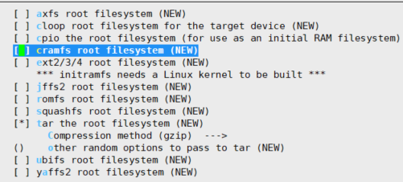

# buildroot 根文件系统

[buildroot](https://buildroot.org/)可用于构建小型的linux根文件系统。
大小最小可低至2M，与内核一起可以放入最小8M的spi flash中。
buildroot中可以方便地加入第三方软件包（其实已经内置了很多），省去了手工交叉编译的烦恼。
美中不足的是不支持包管理系统，没有gcc等。

## 下载安装：

首先安装一些依赖，比如linux头文件：
`apt-get install linux-headers-$(uname -r)`
然后下载安装：

```shell
wget https://buildroot.org/downloads/buildroot-2017.08.tar.gz
tar xvf buildroot-2017.08.tar.gz
cd buildroot-2017.08/
make menuconfig
```

## 配置

### Target options


注意此处eabi， bsp中为eabi，主线为eabihf（同时选择VFP）

### Toolchain


### System configuration


### Filesystem images



首先配置工具链，因为之前开发uboot和内核都用到了自己下载的工具链，所以这里也配置成外部工具链。
在本机上外部工具链配置为：/opt/gcc-linaro-6.3.1-2017.05-x86_64_arm-linux-gnueabihf/
工具链前缀是：arm-linux-gnueabihf
外部工具链gcc版本：我们使用的是最新的6.3版本
外部工具链内核头文件：是在arm-linux-gnueabi/libc/usr/include/linux/version.h里读取内核版本信息。本机的版本是4.6. (bsp为3.0.4)
C库还是选择传统的glibc。需要小体积可以选uclibc（需要自行编译安装）。
再在system 设置下主机名，root密码等。
另外是串口号，波特率等

最后就是配置自己需要的软件包，在menuconfig中选中即可。
有时候下载速度慢，可以复制下载链接，使用迅雷等下载好后，拷贝到dl目录下，会自动识别。

## 编译

make

> 有时候构建会出现莫名其妙的错误，make clean下会ok？

编译完成后，会生成 output/images/rootfs.tar，此即所需的根文件系统

默认失能串口登录，需要修改/etc/inittab:
ttyS0::respawn:/sbin/getty -L ttyS0 115200 vt100 # GENERIC_SERIAL

## 删除软件包

buildroot在menuconfig里去掉软件包后，并不会在打包的镜像里去掉。
需要手动在output/target/usr/bin/里移除

make xxx-clean
清理 output/build/xxx, 包含

## 重新编译软件包

删除这个目录下的.stamp_built和.stamp_target_installed.然后回到buildroot根目录下make。buildroot会自动重新编译对应软件包并且拷贝到文件系统。
有些软件包，比如QT，只删除标记并不能达到完全重新编译的效果，需要手工删除编译目录来重新编译。

## 加入软件包

1. 在package/Config.in 中对应位置添加 source "package//Config.in"
2. package/下添加
   [Config.in](http://config.in/), 使用kconfig编写，描述该软件包的状态(Y/N/M)
   .mk 使用make编写，描述该软件包获取源的方法，编译、安装的方法等
   可选的.hash 检查下载文件的完整性
   可选的.patch文件 在编译前给源代码打补丁

Config.in写法

```shell
config BR2_PACKAGE_
bool "pkg name"
depends on BR2_PACKAGE_XXX
select BR2_PACKAGE_XXX
help
pkg help content
```


### 网络下载的软件包

一般软件包写法
需要指定软件包的基本信息(版本、下载地址等)，依赖关系，
根据不同类型目标来设置_INSTALL_xxx=YES or NO

```
 应用软件包     TARGET_DIR     无需修改
 共享库文件     TARGET_DIR 和 STAGING_DIR     
 静态库        STAGING_DIR
 安装入bootloader或kernel     BINARIES_DIR     
```

定义一般软件包generic-package的动作

```makefile
<pkg>_CONFIGURE_CMDS,             配置命令， 总是调用
<pkg>_BUILD_CMDS,                编译命令，总是调用
<pkg>_INSTALL_TARGET_CMDS,      //如上节所示调用
<pkg>_INSTALL_STAGING_CMDS, 
<pkg>_INSTALL_IMAGES_CMDS, 
<pkg>_INSTALL_CMDS,                主机软件包总是调用
<pkg>_CLEAN_CMDS                 //清理命令
<pkg>_UNINSTALL_TARGET_CMDS
<pkg>_UNINSTALL_STAGING_CMDS
```

常用软件包信息

```makefile
LIBFOO_VERSION         版本号，如LIBFOO_VERSION = 0.1.2
LIBFOO_SOURCE          软件包tar的名字，默认是packagename-$(LIBFOO_VERSION).tar.gz.
                       如LIBFOO_SOURCE = foobar-$(LIBFOO_VERSION).tar.bz2
LIBFOO_PATCH           补丁名
LIBFOO_SITE            软件包源地址
     缺省为http://$$(BR2_SOURCEFORGE_MIRROR).dl.sourceforge.net/sourceforge/packagename.
     LIBFOO_SITE=http://www.libfoosoftware.org/libfoo
     LIBFOO_SITE=http://svn.xiph.org/trunk/Tremor/
LIBFOO_SITE_METHOD            获取软件包的方法 
     wget, svn, git, bzr,    不指定的话会从URL猜测方法。
LIBFOO_DEPENDENCIES          列出软件包的依赖

$(@D)           软件包的源代码解压目录
$(MAKE)         调用make
$(MAKE1)        不能使用并行编译时候的make
$(TARGET_MAKE_ENV) $(HOST_MAKE_ENV),     传给make的环境变量
$(TARGET_CC), $(TARGET_LD)               CC,LD的选项.
$(TARGET_CROSS)                          教程编译工具链的前缀
$(TARGET_DIR), $(STAGING_DIR), $(BINARIES_DIR), $(HOST_DIR).

常用HOOK （用+=添加）
LIBFOO_POST_PATCH_HOOKS
LIBFOO_PRE_CONFIGURE_HOOKS
LIBFOO_POST_CONFIGURE_HOOKS
LIBFOO_POST_BUILD_HOOKS
LIBFOO_POST_INSTALL_HOOKS (for host packages only)
LIBFOO_POST_INSTALL_STAGING_HOOKS (for target packages only)
LIBFOO_POST_INSTALL_TARGET_HOOKS (for target packages only)
```

例程

```makefile
#############################################################
# libfoo   download from website
#############################################################
LIBFOO_VERSION = 1.0                               版本
LIBFOO_SOURCE = libfoo-$(LIBFOO_VERSION).tar.gz    压缩包名
LIBFOO_SITE = http://www.foosoftware.org/download  下载地址
#LIBFOO_INSTALL_STAGING = YES     # default NO
LIBFOO_DEPENDENCIES = host-libaaa libbbb            依赖

define LIBFOO_BUILD_CMDS                            编译命令
     # $(@D) is pkg source folder
     $(MAKE) CC=$(TARGET_CC) LD=$(TARGET_LD) -C $(@D) all
endef

#condition  statement
#ifneq ($(BR2_PACKAGE_LIBFOO_TEST),y) 
#    LIBFOO_CONF_OPT += --enable-test
#endif

#define LIBFOO_INSTALL_STAGING_CMDS     编译生成文件阶段
#     $(INSTALL) -D -m 0755 $(@D)/libfoo.a $(STAGING_DIR)/usr/lib/libfoo.a
#     $(INSTALL) -D -m 0644 $(@D)/foo.h $(STAGING_DIR)/usr/include/foo.h
#     $(INSTALL) -D -m 0755 $(@D)/libfoo.so* $(STAGING_DIR)/usr/lib
#endef

define LIBFOO_INSTALL_TARGET_CMDS       安装到文件系统阶段
     $(INSTALL) -D -m 0755 $(@D)/libfoo.so* $(TARGET_DIR)/usr/lib
     $(INSTALL) -d -m 0755 $(TARGET_DIR)/etc/foo.d
endef

define LIBFOO_CLEAN_CMDS               清理阶段
     -$(MAKE) -C $(@D) clean
endef

$(eval $(call GENTARGETS,package,libfoo))     # gen pkt， must the last line
```

GENTARGETS需要三个参数
\1. 软件包目录前缀，一般是package，如果更深就是package/xxx
\2. 小写的包名，比如libfoo, .mk里的变量前缀就是LIBFOO_，
Config.in文件里的配置选项就是 BR2_PACKAGE_LIBFOO.
\3. 可选，缺省是target，标识为host则为主机包

### autotools-based软件包的mk写法

```makefile
#############################################################
# libfoo
#############################################################
LIBFOO_VERSION = 1.0
LIBFOO_SOURCE = libfoo-$(LIBFOO_VERSION).tar.gz
LIBFOO_SITE = http://www.foosoftware.org/download
LIBFOO_INSTALL_STAGING = YES
LIBFOO_INSTALL_TARGET = YES
LIBFOO_CONF_OPT = --enable-shared
LIBFOO_DEPENDENCIES = libglib2 host-pkg-config

$(eval $(call AUTOTARGETS,package,libfoo))
```

### CMake-based软件包mk写法

```makefile
#############################################################
# libfoo
#############################################################
LIBFOO_VERSION = 1.0
LIBFOO_SOURCE = libfoo-$(LIBFOO_VERSION).tar.gz
LIBFOO_SITE = http://www.foosoftware.org/download
LIBFOO_INSTALL_STAGING = YES
LIBFOO_INSTALL_TARGET = YES
LIBFOO_CONF_OPT = -DBUILD_DEMOS=ON
LIBFOO_DEPENDENCIES = libglib2 host-pkg-config

$(eval $(call CMAKETARGETS,package,libfoo))
```

### .mk写法之本地软件包

常用变量

```makefile
LIBFOO_VERSION
LIBFOO_SOURCE
LIBFOO_SITE
LIBFOO_DIR                         软件包被配置和编译的目录，一般建在BUILD_DIR下
LIBFOO_BINARY                   软件包二进制文件名
LIBFOO_TARGET_BINARY     软件包的目标文件系统的安装目录
```

本地软件包的.mk更像正常的makefile，当做普通makefile看即可

```makefile
##############################################################
# libfoo
#############################################################
LIBFOO_DIR:=$(BUILD_DIR)/libfoo

#这里 填获取源代码的方式，即本地拷贝文件
$(LIBFOO_DIR)/.source :
     mkdir -pv $(LIBFOO_DIR)  $(LIBFOO_HOST_DIR)
     cp -rf package/libfoo/src/* $(LIBFOO_DIR)
     touch $@     #create dummy file

#这里填配置编译的操作     
$(LIBFOO_DIR)/.configured: $(LIBFOO_DIR)/.source
     touch $@
     
#compile
libfoo-binary: $(LIBFOO_DIR)/.configured
     mkdir -pv $(HOST_DIR)/usr/bin
     $(MAKE) BUILD_DIR=$(BUILD_DIR) CC="$(TARGET_CC)" -C $(LIBFOO_DIR)

#install
libfoo: libfoo-binary
     $(MAKE) DESTDIR="$(TARGET_DIR)" -C $(LIBFOO_DIR) install

##############################################################
# Add our target
#############################################################
ifeq ($(BR2_PACKAGE_LIBFOO),y)
     TARGETS += libfoo
endif

然后在src里加入对应的 源文件和makefile，示例如下
###########################################  
#Makefile for simple programs  
###########################################  
INC=  
LDLIBS += -lpthread  
CFLAGS += -Wall 
#CPPFLAGS += 
  
PRG=threadpooltest  
OBJ=CThreadManage.o CThreadPool.o CThread.o CWorkerThread.o threadpooltest.o  
  
$(PRG):$(OBJ)  
    $(CC) $(INC) $(LIB) -o $@ $(OBJ)  
      
.SUFFIXES: .c .o .cpp  
.cpp.o:  
    $(CC) $(CFLAGS ) $(INC) -c $*.cpp -o $*.o  
  
.PRONY:clean  
clean:  
    @echo "Removing linked and compiled files......"  
    rm -f $(OBJ) $(PRG)  

SRCS := xxx.c 
CFLAGS := -Wall 

libfoo : $(SRCS)
     $(CC) $(filter %.c, $(SRCS)) $(CFLAGS) -o fsck_msdos
clean:    
     rm libfoo
install:
     cp fsck_msdos $(DESTDIR)/usr/bin/
```

//这个是manual makefile，也类似

```makefile
#############################################################
# libfoo
#############################################################
LIBFOO_VERSION:=1.0
LIBFOO_SOURCE:=libfoo-$(LIBFOO_VERSION).tar.gz
LIBFOO_SITE:=http://www.foosoftware.org/downloads
LIBFOO_DIR:=$(BUILD_DIR)/foo-$(FOO_VERSION)
LIBFOO_BINARY:=foo
LIBFOO_TARGET_BINARY:=usr/bin/foo

#method to get source
$(DL_DIR)/$(LIBFOO_SOURCE):
     $(call DOWNLOAD,$(LIBFOO_SITE),$(LIBFOO_SOURCE))

#target: .source      extract source tar
$(LIBFOO_DIR)/.source: $(DL_DIR)/$(LIBFOO_SOURCE)
     $(ZCAT) $(DL_DIR)/$(LIBFOO_SOURCE) | tar -C $(BUILD_DIR) $(TAR_OPTIONS) -
     touch $@

#target:.configured     
$(LIBFOO_DIR)/.configured: $(LIBFOO_DIR)/.source
     (cd $(LIBFOO_DIR); rm -rf config.cache; \
          $(TARGET_CONFIGURE_OPTS) \
          $(TARGET_CONFIGURE_ARGS) \
          ./configure \
          --target=$(GNU_TARGET_NAME) \
          --host=$(GNU_TARGET_NAME) \
          --build=$(GNU_HOST_NAME) \
          --prefix=/usr \
          --sysconfdir=/etc \
     )
     touch $@

#target: binary file     compile
$(LIBFOO_DIR)/$(LIBFOO_BINARY): $(LIBFOO_DIR)/.configured
     $(MAKE) CC=$(TARGET_CC) -C $(LIBFOO_DIR)

#target: target binary file          move to target,strip,remove manual
$(TARGET_DIR)/$(LIBFOO_TARGET_BINARY): $(LIBFOO_DIR)/$(LIBFOO_BINARY)
     $(MAKE) DESTDIR=$(TARGET_DIR) -C $(LIBFOO_DIR) install-strip
     rm -Rf $(TARGET_DIR)/usr/man

#dependencies
libfoo: uclibc ncurses $(TARGET_DIR)/$(LIBFOO_TARGET_BINARY)

#download before compile
libfoo-source: $(DL_DIR)/$(LIBFOO_SOURCE)

libfoo-clean:
     $(MAKE) prefix=$(TARGET_DIR)/usr -C $(LIBFOO_DIR) uninstall
     -$(MAKE) -C $(LIBFOO_DIR) clean

libfoo-dirclean:
     rm -rf $(LIBFOO_DIR)

#############################################################
# Toplevel Makefile options
#############################################################
ifeq ($(BR2_PACKAGE_LIBFOO),y)
     TARGETS+=libfoo
endif
```

