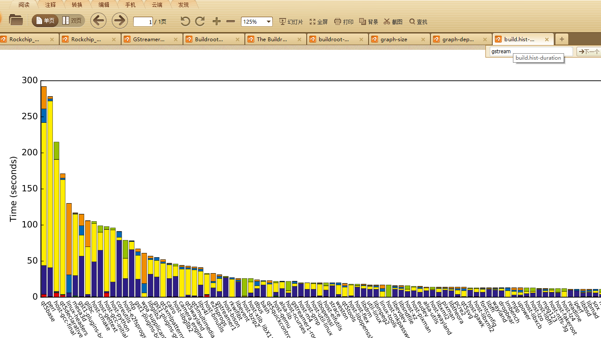

# buildroot框架

buildroot 是用来构建嵌入式软件系统。里面集成非常多的软件包，可以自定义下载使用，就像一个软件包管理器如360软件管家、腾讯软件管家。

他有自己一套的命名框架。添加软件包的框架。系统定义的变量。

buildroot里面构建项目，一定要遵守命名规则，否则会有各种报错。

## 软件包管理器

先说软件包支持的命令有哪些。pkg-generic.mk文件，是makefile的语法，

buildroot\package\pkg-generic.mk, 举例部分

```shell
.PHONY:	$(1) \
	$(1)-all-external-deps \
	$(1)-all-legal-info \
	$(1)-all-source \
	$(1)-build \
	$(1)-clean-for-rebuild \
	$(1)-clean-for-reconfigure \
	$(1)-clean-for-reinstall \
	$(1)-configure \
	$(1)-depends \
	$(1)-dirclean \              清理软件
	$(1)-external-deps \
	$(1)-extract \               只下载解压pkg,不编译         
	$(1)-graph-depends \
	$(1)-install \
	$(1)-install-host \
	$(1)-install-images \
	$(1)-install-staging \
	$(1)-install-target \
	$(1)-legal-info \
	$(1)-legal-source \
	$(1)-patch \
	$(1)-rebuild \              重新编译pkg
	$(1)-reconfigure \
	$(1)-reinstall \
	$(1)-rsync \
	$(1)-show-depends \
	$(1)-show-version \
	$(1)-source
```

### 软件包下载目录

buildroot 在make时，会在顶层目录创建dl目录，然后在dl目录寻找需要的安装包，

如果找不到需要的安装包就会从网上下载安装包到dl目录，再解压到output/build目录下，再编译安装；
或者在你指定的工作目录，拷贝源文件到output/build目录下，再编译安装；

```

cw@SYS3:~/sdk/rv1109/buildroot/dl$ ls -al
total 3288776
drwxrwxr-x  3 cw cw     20480 Apr  1 16:12 .
drwxrwxr-x 18 cw cw      4096 Dec 14 09:25 ..
-rw-rw-r--  1 cw cw    386604 Nov 17 09:52 acl-2.2.52.src.tar.gz
-rw-rw-r--  1 cw cw    979225 Nov 17 09:52 alsa-lib-1.1.5.tar.bz2
-rw-rw-r--  1 cw cw    366999 Nov 17 09:52 alsa-plugins-1.1.5.tar.bz2
等等
```

如果下载失败，可以手动拷贝。千万不要执行make distclean，会把dl目录删除。

编译过程还是不要强制停止，鬼知道会下载一半文件错误！ 下载错误，你就找哪个包错了，删除这个包重编译

### 软件包编译的6个阶段

buildroot在编译之前会根据.config 文件来检查output/build/package/各个软件包 的6个文件，做相应的步骤：

.stamp_configured, 
.stamp_downloaded, 此文件表示源码已经下载过，没有此文件会重新下载
.stamp_patched, 此文件表示已经打过补丁
.stamp_extracted  此文件表示已经解压过
.stamp_builted 此文件表示源码已经编译过    (或者你把这个.stamp_buildt 删掉再make)
.stamp_target_installed  此文件表示软件已经安装过

注意这几个文件是空的文件，所以只是用文件存在与否判断编译状态

```
cw@SYS3:~/sdk/rv1109/buildroot/output/rockchip_rv1126_rv1109/build/json-c-0.13$ du -sh .stamp_*
0       .stamp_built
0       .stamp_configured
0       .stamp_downloaded
0       .stamp_extracted
0       .stamp_patched
0       .stamp_staging_installed
0       .stamp_target_installed
```

想要从新执行哪一步，就把对应的.stamp_文件删除就行
进入buildroot/output/build/vsftpd-2.3.4目录，然后进入这个目录。按自己的要求修改文件，然后删除这个目录下的.stamp_built和.stamp_target_installed.然后回到这个buildroot根目录下make。buildroot会自动重新编译vsftpd并且拷贝到文件系统。
buildroot/output/build/vsftpd-2.3.4这个目录下除了上面提到的两个文件还有类似的4个：.stamp_configured, .stamp_downloaded, .stamp_patched,.stamp_extracted其实每个工具包里都有这样的几个文件，这几个文件主要控制这个工具包的下载，解压，打包，配置，编译，安装。而根据我们的需要是要修改然后重新编译，安装即可。所以删除.stamp_built和.stamp_target_installed就可以啦。然后编译完了再进去看看。这两个文件又产生啦，如果我们仅仅是修改了文件，而没有删除这两个文件是不会编译的。


- 软件的构建过程（按它们执行的顺序）：make

```
make source       下载源码到dl目录下
make depends      构建并安装软件包的所有依赖关系
make extract      解压源代码到对应的目录下
patch             如果有补丁就会打上补丁
configure         如果有配置就会运行配置
build             运行编译命令
install-staging   目标软件包：如果需要，在分段目录中运行软件包的安装
install-target    目标软件包：如果需要，请在目标目录中运行软件包的安装
install           目标包：运行2个以前的安装命令 进行软件的安装     主机包：在主机目录中运行包的安装
```


### 软件包的二次编译

1. 如果修改了package源码（实际源码），在编译前运行 make < package >-dirclean。

```shell
make <pkg>-dirclean删除整个包构建目录
make <pkg>-reinstall重新运行安装命令

make <pkg>--dirclean //删除output/build/package 这个文件夹
make                     //自动对这个包重新编译
```

2. 如果只是修改output 目录下代码（非源码！！！只是一份拷贝），只需要启动编译的步骤，编译前运行 make < package >-rebuild千万不要make <package> -dirclean ，这样会删除整个output/<package>/这个文件夹，修改全没了。

```makefile
make <package> -rebuild
然后make （ make 或 make <package>）打包
最后 ./mkfirmware.sh
```

### 保存对软件包的修改

output 软件包源码修改保存为补丁

- 1. 先介绍软件包编译（执行make 软件报名）过程 

.stamp_configured 配置

stamp_downloaded 下载

.stamp_extracted 解压

.stamp_patched 打上补丁

.stamp_staging_installed 编译

.stamp_target_installe 安装

这是一个软件包编译的5个过程。首先buildroot是一个git仓库，buildroot/package/包含各个软件包的下载地址、开个、补丁、编译配置，这些包含在Git仓库里，而buildroot/output并不被Git仓库管理，而是编译输出。

```shell
root@cw:/home/cw/3126c_i/buildroot/package/qjson# ls -al
总用量 84
drwxr-xr-x    2 root root  4096 6月  22  2020 .
drwxr-xr-x 1991 root root 65536 7月  25 10:12 ..
-rw-r--r--    1 root root   845 6月  22  2020 0001-fix-Qt4-package-error-in-CMakeLists.txt.patch 补丁
-rw-r--r--    1 root root   373 6月  22  2020 Config.in   KCONFIG配置
-rw-r--r--    1 root root   110 6月  22  2020 qjson.hash 下载地址和哈希校验码
-rw-r--r--    1 root root   455 6月  22  2020 qjson.mk 编译配置
```

编译过先检查 Config.in 宏开关是不是打开了，是的话，就从qjson.hash文件的下载地址下载压缩包到dl目录，从dl目录解压软件包源码到build。root/output/rockchip_rk3126c/build/rqjson目录, 注意buildroot/output是不被 buildroot git仓库所管理的。

注意:dl目录编译时显示url下载失败，你可以从其他地方拷贝软件压缩包到这个目录下。强烈注意，不要对buildroot执行make clean，这样会删除dl目录下下载的压缩包，正确的做法，应该是rm -rf buildroot/output/开发板， 然后再重新编译。

- 2. 如何将buildroot/output/软件包，源码修改保存为补丁

由于buildroot/output/软件包源码是不被 buildroot git仓库所管理的。那么我们需要在该软件包下初始化一个git仓库，然后修好后保存为补丁，并复制到buildroot/package/包名/目录下，这个是被buildroot git仓库所管理的，提交在buildroot git仓库。  于是下次编译这个的时候，会自动打上这个补丁。

以rkwifibt 为例：

````c
buildroot/package/1. cd buildroot/output/rockchip_rk3308_release/build/rkwifibt-1.0.0 //这个目录是软件包的编译源代码目录。是编译过程解压出来的，并自动打上对应补丁
2. 初始化仓库
git init
3. 添加将要修改的文件到 git 仓库
git add wifi_start.sh
git commit -s
4. 修改文件
5. 提交修改文件
git add wifi_start.sh
git commit -s
6. 生成补丁
git format-patch  然后复制到buildroot/package/对应包目录下，注意buildroot目录下是一个仓库，这个仓库忽略了.gitignore目录

root@cw:/home/cw/3126c_i/buildroot# git log  提交的格式如下
f81e5a020835b837722e94ce9a9af8afa5cf0ad3 package: rockchip: rockface: add face detection choice
d7df81695cc14fe7a6e11b38d4c0e45a47c045ba package: rockchip: QFacialGate: modify install S06_QFacialGate
5109a69a9a0c2de53ac0f96f

root@cw:/home/cw/3126c_i/buildroot# cat .gitignore  
/output  不被buildroot仓库管理
/dl
/download
/.auto.deps
/.config.cmd
/.config.old
/..config.tmp
/.config
*.depend
*.o
/*.patch
/*.diff
*.orig
*.rej
*~
*.pyc
.BoardConfig.mk
````

举例buildroot/package/connma，make的时候解压在ouput文件夹下面，解压后，会自动打上这些patch

```shell
cw@SYS3:~/sdk/3126i/buildroot/package/connman ls
0001-tethering-Reorder-header-includes.patch  0002-nat-build-failure.patch  Config.in  connman.hash  connman.mk  S45connman
```

### strip

```
cw@SYS3:~/sdk/rv1109/buildroot/output/rockchip_rv1126_rv1109/build$ du -sh
7.9G    .
cw@SYS3:~/sdk/rv1109/buildroot/output/rockchip_rv1126_rv1109/target$ du -sh
193M    .
```

build目录没有strip，

target是设备上的文件系统，是strip过，去除了调试信息。

- strip

是一个命令，用于去除可执行文件的调式信息。查看一个object文件有not stripped和stripped，而buildroot编译出来的目标文件大多是stripped的。

检查文件是否strip可以使用file命令：

```shell
root@cw:/home/cw/3126c_i/buildroot/output/rockchip_rk3128# ag -g whetstone
build/whetstone-1.2/whetstone
target/usr/bin/whetstone

root@cw:/home/cw/3126c_i/buildroot/output/rockchip_rk3128# file target/usr/bin/whetstone
target/usr/bin/whetstone: ELF 32-bit LSB executable, ARM, EABI5 version 1 (SYSV), dynamically linked, interpreter /lib/ld-linux-armhf.so.3, for GNU/Linux 4.4.0, stripped
root@cw:/home/cw/3126c_i/buildroot/output/rockchip_rk3128# 
root@cw:/home/cw/3126c_i/buildroot/output/rockchip_rk3128# file build/whetstone-1.2/whetstone
build/whetstone-1.2/whetstone: ELF 32-bit LSB executable, ARM, EABI5 version 1 (SYSV), dynamically linked, interpreter /lib/ld-linux-armhf.so.3, for GNU/Linux 4.4.0, not stripped
```

1)  buildroot是默认strip的,   STRIP_STRIP_DEBUG的意义：Remove debugging symbols only.

```makefile
buildroot/Config.in

注意 BR2_STRIP_strip 默认是选中的 
config BR2_STRIP_strip
    bool "strip target binaries"
    depends on !BR2_PACKAGE_HOST_ELF2FLT
    default y
    help
      Binaries and libraries in the target filesystem will be
      stripped using the normal 'strip' command. This allows to save
      space, mainly by removing debugging symbols. Debugging symbols
      on the target are needed for native debugging, but not when
```

2） STRIP_FIND_CMD  

```makefile
定义在文件 buildroot/Makefile
STRIP_FIND_CMD = find $(TARGET_DIR)
ifneq (,$(call qstrip,$(BR2_STRIP_EXCLUDE_DIRS)))
STRIP_FIND_CMD += \( $(call finddirclauses,$(TARGET_DIR),$(call qstrip,$(BR2_STRIP_EXCLUDE_DIRS))) \) -prune -o
 endif
 
STRIP_FIND_CMD += -type f \( -perm /111 -o -name '*.so*' \)
 
# file exclusions:
# - libpthread.so: a non-stripped libpthread shared library is needed for
#   proper debugging of pthread programs using gdb.
# - ld.so: a non-stripped dynamic linker library is needed for valgrind
# - kernel modules (*.ko): do not function properly when stripped like normal
#   applications and libraries. Normally kernel modules are already excluded
#   by the executable permission check above, so the explicit exclusion is only
#   done for kernel modules with incorrect permissions.
STRIP_FIND_CMD += -not \( $(call findfileclauses,libpthread*.so* ld-*.so* *.ko $(call qstrip,$(BR2_STRIP_EXCLUDE_FILES
```

大概解读一下STRIP_FIND_CMD：

查找target目录下，除BR2_STRIP_EXCLUDE_DIRS目录和BR2_STRIP_EXCLUDE_FILES文件以外的，所有可执行的regular文件，或者文件名是*.so的文件

另外 libpthread*.so, ld-*.so, *.ko 也被看做是strip例外文件，注释里有解释。

你在output/target下看到的binary文件就是stripped的了

### 添加软件包

无论是软件包的命名、文件夹的命令、变量的命名、都要遵循buildroot命名规则。

#### 第一步

buildroot\package 添加软件包目录

cw@SYS3:~/sdk/rv1109/buildroot/package/rockchip/rtc_demo$ tree

├── Config.in（在make menuconfig增加开关）
└── rtc_demo.mk（makefile的语法）


Config.in

```
config BR2_PACKAGE_RTC_DEMO
	bool "rtc_demo"
```

 rtc_demo.mk

```makefile
#############################################################
#
# RTC_DEMO
#
#############################################################
ifeq ($(BR2_PACKAGE_RTC_DEMO), y)
RTC_DEMO_VERSION:=1.0.0
RTC_DEMO_SITE=$(TOPDIR)/../external/rtc_demo
RTC_DEMO_SITE_METHOD=local

define RTC_DEMO_BUILD_CMDS
    $(TARGET_MAKE_ENV) $(MAKE) CC=$(TARGET_CC) CXX=$(TARGET_CXX) -C $(@D)
endef

define RTC_DEMO_CLEAN_CMDS
    $(TARGET_MAKE_ENV) $(MAKE) -C $(@D) clean
endef

define RTC_DEMO_INSTALL_TARGET_CMDS
    $(TARGET_MAKE_ENV) $(MAKE) -C $(@D) install
endef

define RTC_DEMO_UNINSTALL_TARGET_CMDS
    $(TARGET_MAKE_ENV) $(MAKE) -C $(@D) uninstall
endef

$(eval $(generic-package))
endif
```

####  第二步

cw@SYS3:~/sdk/rv1109/external/rtc_demo$ ls^C
cw@SYS3:~/sdk/rv1109/external/rtc_demo$ tree

├── LICENSE
├── Makefile
└── test.c

rtc_demo.c

```C
#include <stdio.h>

int main()
{
	printf("hello world\r\n");
	return 0;
}
```

Makefile

```makefile
all: helloworld

helloworld: helloworld.o
	$(CC) -o helloworld helloworld.o

clean:
	rm -rf *.o
	rm -rf helloworld

install:
	$(INSTALL) -D -m 0755 helloworld $(TARGET_DIR)/bin
```

#### 自己的软件包使用了动态库

使用动态库，必须用到头文件。

buildroot的动态库头文件，常常放在目标文件系统usr/include 、usr/lib等下面，只需要在编译软件包的makefile指定搜索的路径，和指定连接的动态库名字。

```makefile
OBJ = rtc_demo.o

CFLAGS = -liniparser -Iusr/include -Iusr/lib -lc -DUSE_UPDATEENGINE=ON

%.o : %.c
	$(CC) -c -o $@ $< $(CFLAGS)

build:
	arm-linux-gnueabihf-gcc test.c $(CFLAGS) -o test_chenwei

rtc_demo : $(OBJ)
	$(CXX) -o $@ $^ $(CFLAGS)

.PHONY : clean

clean :
	rm -f *.o *~ test_chenwei
.PHONY : install

install :
	cp -f test_chenwei $(TARGET_DIR)/usr/bin/

.PHONY: uninstall

uninstall :
	rm -f $(TARGET_DIR)/usr/bin/test_chenwei
```


#### 将自己软件包生成动态库

修改Makefile

```makefile
DEPS = 
OBJ = rtc_demo.o

CFLAGS = -lasound -I/usr/include -I/usr/lib -I/usr/include/libdrm/ -lc -DUSE_UPDATEENGINE=ON

%.o : %.cpp $(DEPS)
	$(CC) -c -o $@ $< $(CFLAGS)
	#$(CC) -c -o rtc_demo.o rtc_demo.c $(CFLAGS)
build:
	 arm-linux-gnueabihf-gcc -fPIC -shared -o librtc_demo.so rtc_demo.c
# arm-linux-gnueabihf-gcc test.c -L. -lrtc_demo -o test
rtc_demo : $(OBJ)
	$(CXX) -o $@ $^ $(CFLAGS)
.PHONY : clean

clean :
	rm -f *.o *~ rtc_demo
.PHONY : install
	
install :
	cp -f rtc_demo $(TARGET_DIR)/usr/bin/
.PHONY: uninstall
	
uninstall :
	rm -f $(TARGET_DIR)/usr/bin/rtc_demo
```


## Buildroot命令

### make help命令帮助

通过make help可以看到buildroot下make的使用细节，包括对package、uclibc、busybox、linux以及文档生成等配置：

```makefile
Cleaning:
  clean                  删除所有编译中产生的文件
  distclean              类似make clean 但是会删除.config

Build:
  all                    - make world      编译整个系统
  toolchain               编译交叉编译工具链

Configuration:
  menuconfig              对buildroot进行配置
  savedefconfig           保存menuconfig的配置

Package-specific:          对package配置
  <pkg>                   单独编译对应APP
  <pkg>-source            获取源代码（下载压缩包，克隆源代码库等）      下载源码
  <pkg>-extract           解压源码包 把源代码放在包构建目录中（提取压缩包，复制源代码等）    
  <pkg>-patch             给指定的包打补丁
  <pkg>-depends           检查依赖关系 构建并安装构建软件包所需的所有依赖关系            
  <pkg>-configure         运行configure命令（如果有的话）进行软件的配置
  <pkg>-build             编译指定的包或者命令只到build步骤
  <pkg>-show-depends      列出指定包的依赖项
  <pkg>-show-rdepends     列出依赖于指定包的其他的包
  <pkg>-graph-depends     生成指定包的依赖关系图
  <pkg>-graph-rdepends    生成依赖于指定包的关系图
  <pkg>-dirclean          指定包的编译清理工作
  <pkg>-reconfigure       指定包的重配置工作
  <pkg>-rebuild           指定包的重新编译工作

busybox:
  busybox-menuconfig     -busybox的配置界面
uclibc:
  uclibc-menuconfig      - uclibc 的配置界面

linux:
  linux-menuconfig        kernel内核配置
  linux-savedefconfig     kernel内核配置保存
  linux-update-defconfig  保存kernel的配置用过变量
   Save the Linux configuration to the path specified
                             by BR2_LINUX_KERNEL_CUSTOM_CONFIG_FILE

Documentation:
  manual                 生成所有格式的手册
  manual-pdf             生成pdf的手册
  graph-build            整个编译流程时间
  graph-depends          生成全部软件依赖图
  graph-size             分析文件系统大小组成，文件大小，包大小
```


| make menuconfig            | make menuconfig   RK SDK支持 make nconfig          RK SDK有点残废make xconfig          RK SDK不支持 make gconfig          RK SDK不支持 |
| -------------------------- | ------------------------------------------------------------ |
|                            | make 配置后编译:                                             |
| make                       | make 配置后编译:                                             |
| make 2>&1 \| tee build.log | 编译时候保存日志（亲测ok,用于分析出错原因有用）              |
| make clean                 | 删除所有build output，只保留配置文件                         |
| make distclean             | 删除一切，包括所有配置文件，dl目录下的下载文件 (最好不要用)  |
| make V=1                   | 详细构建，默认情况下，Buildroot隐藏在生成期间运行的许多命令，只展示最重要的。要获得完全详细的生成，请传递V=1： |


### make graph-size

分析文件系统大小组成，文件大小，包大小

make graph-size produces:
▶ file-size-stats.csv, CSV               每个原始文件的大小
▶ package-size-stats.csv, CSV        每个包的大小
▶ graph-size.pdf,                             生成每个包消耗size的饼图

```
cw@SYS3:~/sdk/3126i$ make graph-size
umask 0022 && make -C /home/cw/sdk/3126i/buildroot O=/home/cw/sdk/3126i/buildroot/output/rockchip_rk3128 graph-depends
Getting targets
Getting dependencies for ['QLauncher', 'alsa-config', 'alsa-lib', 'alsa-plugins', 'alsa-utils', 'android-tools', 'bash', 'busybox', 'cairo', 'camera_engine_rkisp', 'connman',  -libzlib', 'host-xlib_libX11', 'host-xlib_libxkbfile', 'host-mpfr', 'host-xorgproto', 'host-libopenssl', 'host-xlib_libXdmcp', 'host-xlib_libXau', 'host-xlib_xtrans', 'host-libxcb', 'host-libxslt', 'host-xcb-proto', 'host-libpthread-stubs']
dot  -Tpdf \
        -o /home/cw/sdk/3126i/buildroot/output/rockchip_rk3128/graphs/graph-depends.pdf \
        /home/cw/sdk/3126i/buildroot/output/rockchip_rk3128/graphs/graph-depends.dot

```


file-size-stats.csv 文件大小，举例：

|           File name           | Package name | File size | Package size | File size in package (%) | File size in system (%) |      |      |
| :---------------------------: | ------------ | --------- | ------------ | ------------------------ | ----------------------- | ---- | ---- |
| usr/share/zoneinfo/posix/GMT0 | tzdata       | 127       | 1173112      | 0                        | 0                       |      |      |
|       usr/bin/sink-test       | intel-wds    | 153692    | 372916       | 41.2                     | 0.1                     |      |      |

package-size-stats.csv 包大小，举例：

| Package name | Package size | Package size in system (%) |      |      |
| ------------ | ------------ | -------------------------- | ---- | ---- |
| intel-wds    | 372916       | 0.2                        |      |      |

### make graph-depends 

生成全部软件依赖图

buildroot的库会根据依赖关系被自动下载，通过此图也可以了解某些某块被谁依赖。

```
cw@SYS3:~/sdk/3126i$ make graph-depends
umask 0022 && make -C /home/cw/sdk/3126i/buildroot O=/home/cw/sdk/3126i/buildroot/output/rockchip_rk3128 graph-depends
Getting targets
Getting dependencies for ['QLauncher', 'alsa-config', 'alsa-lib', 'alsa-plugins', 'alsa-utils', 'android-tools', 'bash', 'busybox', 'cairo', 'camera_engine_rkisp', 'connman', 'coreutils', 'dbus', 'deviceio_release', 'dhrystone', 'dnsmasq', 'dosfstools', 'dropbear', 'e2fsprogs', 'eudev', 'evtest', 'expat', 'faad2', 'fontconfig', 'freetype', 'glibc',  -flex', 'host-libglib2', 'host-cmake', 'host-gawk', 'host-pixman', 'udev', 'host-gettext', 'host-lzo',  -gcc-final', 'host-pcre', 'host-gmp', 'host-binutils', 'host-attr', 'host-libxml-parser-perl', 'host-openssl', 'host-mpc', 'host-expat', 'host-kmod', 'host-bzip2', 'host-zic', 'host-libffi', 'host-m4', 'host-libxml2', 'host-libzlib', 'host-xlib_libX11', 'host-xlib_libxkbfile', 'host-mpfr', 'host-xorgproto', 'host-libopenssl', 'host-xlib_libXdmcp', 'host-xlib_libXau', 'host-xlib_xtrans', 'host-libxcb', 'host-libxslt', 'host-xcb-proto', 'host-libpthread-stubs']
dot  -Tpdf \
        -o /home/cw/sdk/3126i/buildroot/output/rockchip_rk3128/graphs/graph-depends.pdf \
        /home/cw/sdk/3126i/buildroot/output/rockchip_rk3128/graphs/graph-depends.dot
```


### make <包名>-graph-depends 

生成指定包的依赖图

```
cw@SYS3:~/sdk/3126i$ make intel-wds-graph-depends 
umask 0022 && make -C /home/cw/sdk/3126i/buildroot O=/home/cw/sdk/3126i/buildroot/output/rockchip_rk3128 intel-wds-graph-depends
Getting dependencies for ['intel-wds']
Getting dependencies for ['toolchain', 'skeleton', 'host-cmake', 'libglib2', 'host--zlib', 'skeleton-init-common', 'readline', 'host-pcre', 'host-gmp', 'host-libxml2', 'glibc', 'host-binutils', 'host-ncurses', 'host-mpfr', 'host-mpc', 'host-libzlib', 'host-qemu', 'linux-headers', 'host-gcc-initial', 'host-gawk', 'host-python', 'host-pixman', 'host-expat', 'host-openssl', 'host-libopenssl']
dot  -Tpdf -o /home/cw/sdk/3126i/buildroot/output/rockchip_rk3128/graphs/intel-wds-graph-depends.pdf /home/cw/sdk/3126i/buildroot/output/rockchip_rk3128/graphs/intel-wds-graph-depends.dot
```


### make graph-build 

整个编译流程时间

可以明白整个编译流程时间都耗在哪里，针对性进行分析优化，有利于提高编译效率。

执行make graph-build会生成如下文件：

▶ make graph-build generates several graphs in $(O)/graphs/:
▶ build.hist-build.pdf, build time in build order                                    安装编译顺序
▶ build.hist-duration.pdf, build time by duration                                 按照耗时从大到小排列。
▶ build.hist-name.pdf, build time by package name                           按照字母排序
▶ build.pie-packages.pdf, pie chart of the per-package build time     每个包的编译时间饼图
▶ build.pie-steps.pdf, pie chart of the per-step build time                  编译顺序下，每一步的编译时间


其中比较有参考意义的文件是build.hist-duration.pdf文件，按照耗时从大到小排列。

```
cw@SYS3:~/sdk/3126i/buildroot$ cd ..
cw@SYS3:~/sdk/3126i$ make graph-build 
umask 0022 && make -C /home/cw/sdk/3126i/buildroot O=/home/cw/sdk/3126i/buildroot/output/rockchip_rk3128 graph-build
./support/scripts/graph-build-time --type=histogram --order=name --input=/home/cw/sdk/3126i/buildroot/output/rockchip_rk3128/build/build-time.log --.pie-packages.pdf 
./support/scripts/graph-build-time --type=pie-steps --input=/home/cw/sdk/3126i/buildroot/output/rockchip_rk3128/build/build-time.log --output=/home/cw/sdk/3126i/buildroot/output/rockchip_rk3128/graphs/build.pie-steps.pdf 
```

```
cw@SYS3:~/sdk/3126i/buildroot/output/rockchip_rk3128/graphs$ ls -al
-rw-r--r-- 1 cw cw 55482 Mar 16 19:15 build.hist-build.pdf
-rw-r--r-- 1 cw cw 55209 Mar 16 19:15 build.hist-duration.pdf
-rw-r--r-- 1 cw cw 55291 Mar 16 19:15 build.hist-name.pdf
-rw-r--r-- 1 cw cw 20547 Mar 16 19:15 build.pie-packages.pdf
-rw-r--r-- 1 cw cw 15303 Mar 16 19:15 build.pie-steps.pdf
```



###  make show-targets

 显示出本次配置所要编译所有的目标

- 显示出本次配置所要编译所有的目标，这些目标可以单独作为模块，用 make <pkg-target> 命令进行单独编译。从这条命令的显示结果来看，mini2440_defconfig需要编译uclibc(微型C库)，busybox等目标，当然demo_app也是一个编译目标，是我在menocunfig时候加进去的，所以可以用make demo_app来编译

```shell
cw@SYS3:~/sdk/rv1109$ make show-targets
umask 0022 && make -C /home/cw/sdk/rv1109/buildroot O=/home/cw/sdk/rv1109/buildroot/output/rockchip_rv1126_rv1109 show-targets
CallFunIpc alsa-config alsa-lib alsa-plugins alsa-utils android-tools attr avahi bash bluez5_utils busybox camera_engine_rkaiq common_algorithm connman coreutils dbserver dbus dbus-cpp dbus-glib dhrystone dnsmasq dosfstools dropbear e2fsprogs eudev evtest exiv2 expat fcgiwrap ffmpeg freetype gesftpserver host-e2fsprogs host-fakeroot host-lzip host-makedevs host-mkpasswd host-ntfs-3g host-patchelf host-squashfs host-util-linux hostapd i2c-tools ifupdown-scripts iniparser initscripts input-event-daemon ipc-daemon ipcweb-backend iperf iptables iputils isp2-ipc iw json-c json-for-modern-cpp keyutils kmod libIPCProtocol libcgicc libcurl libdaemon libdrm libevent libfcgi libffi libgdbus libglib2 libgudev libical liblockfile libmad libnl libopenssl libpng libpthread-stubs librkdb libunwind libusb libv4l libzlib linux-rga linux-tools live555 lockfile-progs lrzsz mediaserver memtester minilogger mpp ncurses netserver nginx nginx-http-flv-live ntp openssl pcba_adb_test pcre pixman pm-utils procps-ng procrank_linux readline recovery rk_oem rkmedia rknpu rkscript rktoolkit rkwifibt rockchip_test rockface rockx rtc_demo skeleton skeleton-init-common skeleton-init-sysv sox sqlite startup_app_ipc storage_manager strace stress-ng stressapptest toolchain toolchain-external toolchain-external-custom tzdata upower usbmount util-linux wireless_tools wpa_supplicant zlib rootfs-cpio rootfs-ext2 rootfs-squashfs rootfs-tar
```


## buildroot 目录结构

  解压之后，我们可以看到以下的目录情况：

```
├── arch:   存放CPU架构相关的配置脚本，如arm/mips/x86,这些CPU相关的配置，在制作工具链时，编译uboot和kernel时很关键.
├── board   存放了一些默认开发板的配置补丁之类的
├── boot
├── CHANGES
├── Config.in 
├── Config.in.legacy
├── configs:  放置开发板的一些配置参数. 各种default
├── COPYING
├── DEVELOPERS
├── dl:       存放下载的源代码及应用软件的压缩包.如果有个软件包下载地址下载失败，会报错！！（不被git仓库管理）
├── docs:     存放相关的参考文档.
├── fs:       放各种文件系统的源代码.
├── linux:    存放着Linux kernel的自动构建脚本.
├── Makefile
├── Makefile.legacy
├── output: 是编译出来的输出文件夹. （不被git仓库管理）
│   ├── build: 存放解压后的各种软件包编译完成后的现场.
│   ├── host: 存放着制作好的编译工具链，如gcc、arm-linux-gcc等工具.
│   ├── images: 存放着编译好的uboot.bin, zImage, rootfs等镜像文件，可烧写到板子里, 让linux系统跑起来.
│   ├── staging
│   └── target: 用来制作rootfs文件系统，里面放着Linux系统基本的目录结构，以及编译好的应用库和bin可执行文件. (buildroot根据用户配置把.ko .so .bin文件安装到对应的目录下去，根据用户的配置安装指定位置)
├── package：下面放着应用软件的配置文件，每个应用软件的配置文件有Config.in和soft_name.mk，其中soft_name.mk(这种其实就Makefile脚本的自动构建脚本)文件可以去下载应用软件的包。
├── README
├── support
├── system
└── toolchain

root@cw:/home/cw/3126c_i/buildroot# cat .gitignore  这些不被git仓库所管理
/output 编译输出目录
/dl   各个软件压缩包的下载目录
/download
/.auto.deps
/.config.cmd
/.config.old
/..config.tmp
/.config
*.depend
*.o
/*.patch
/*.diff
*.orig
*.rej
*~
*.pyc
.BoardConfig.mk
```

编译出的文件系统如下，打包为rootfs镜像，烧录到开发板。

```shell
Linux中的rootfs，就是那些文件夹和文件，包括什么根文件目录’/’系统相关的配置文件目录/etc存放系统启动相关配置的/etc/init存放系统相关的工具 /sbin存在用户的工具/usr/bin

如下target下就是开发板的根文件系统主要（不包含dev）：

    cw@SYS3:~/sdk/3126i/buildroot/output/rockchip_rk3128/target$ ls
    bin             dev   lib      media  oem   rockchip_test  sbin    system tmp       usr    busybox.config  etc   lib32    misc   opt   root           sdcard     THIS_IS_NOT_YOUR_ROOT_FILESYSTEM  udisk     var data init  linuxrc  mnt    proc  run  sys     timestamp userdata
```


