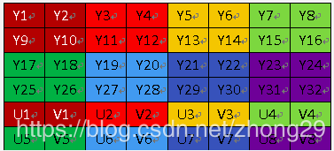
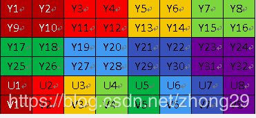
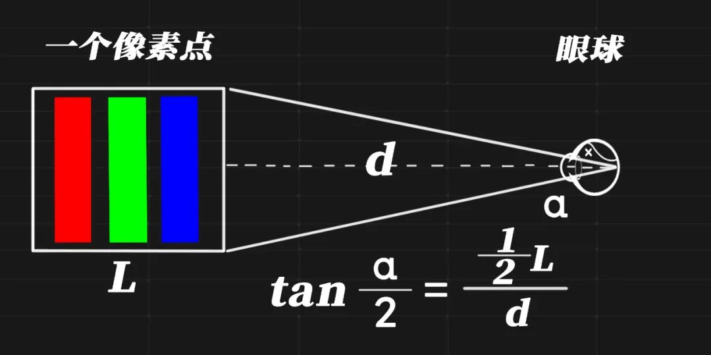

# 1. RGB、YUV和YCbCr(YUV 4:4:4...)

首先要说明，上述的RGB、YUV和YCbCr都是人为规定的彩色模型或颜色空间（有时也叫彩色系统或彩色空间）。它的用途是在某些标准下用通常可接受的方式对彩色加以说明。本质上，彩色模型是坐标系统和子空间的阐述。

## 1.1 RGB

RGB（红绿蓝）是依据人眼识别的颜色定义出的空间，可表示大部分颜色。但在科学研究一般不采用RGB颜色空间，因为它的细节难以进行数字化的调整。它将色调，亮度，饱和度三个量放在一起表示，很难分开。它是最通用的面向硬件的彩色模型。该模型用于彩色监视器和一大类彩色视频摄像。

## 1.2 YUV

在 YUV 空间中，每一个颜色有一个亮度信号 Y，和两个色度信号 U 和 V。亮度信号是强度的感觉，它和色度信号断开，这样的话强度就可以在不影响颜色的情况下改变。

YUV 使用RGB的信息，但它从全彩色图像中产生一个黑白图像，然后提取出三个主要的颜色变成两个额外的信号来描述颜色。把这三个信号组合回来就可以产生一个全彩色图像。

Y 通道描述 Luma 信号，它与亮度信号有一点点不同，值的范围介于亮和暗之间。 Luma 是黑白电视可以看到的信号。U (Cb) 和 V (Cr) 通道从红 (U) 和蓝 (V) 中提取亮度值来减少颜色信息量。这些值可以从新组合来决定红，绿和蓝的混合信号。

YUV和RGB的转换:

```
Y = 0.299 R + 0.587 G + 0.114 B
U = -0.1687 R - 0.3313 G + 0.5 B + 128
V = 0.5 R - 0.4187 G - 0.0813 B + 128
R = Y + 1.402 (V-128)

G= Y - 0.34414 (U-128) - 0.71414 (V-128)
B= Y + 1.772 (U-128)
```

## 1.3 YCbC

YCbCr 是在世界数字组织视频标准研制过程中作为ITU - R BT1601 建议的一部分, 其实是YUV经过缩放和偏移的翻版。其中Y与YUV 中的Y含义一致, Cb , Cr 同样都指色彩, 只是在表示方法上不同而已。在YUV 家族中, YCbCr 是在计算机系统中应用最多的成员, 其应用领域很广泛,JPEG、MPEG均采用此格式。一般人们所讲的YUV大多是指YCbCr。

YCbCr与RGB的相互转换

```
Y=0.299R+0.587G+0.114B
Cb=0.564(B-Y)
Cr=0.713(R-Y)

R=Y+1.402Cr
G=Y-0.344Cb-0.714Cr
B=Y+1.772Cb
```

# 2 YUV（YCbCr）采样格式

主要的采样格式有YCbCr 4:2:0、YCbCr 4:2:2、YCbCr 4:1:1和 YCbCr 4:4:4。其中YCbCr 4:1:1 比较常用，其含义为：每个点保存一个 8bit 的亮度值(也就是Y值), 每 2 x 2 个点保存一个 Cr和Cb值, 图像在肉眼中的感觉不会起太大的变化。所以, 原来用 RGB(R,G,B 都是 8bit unsigned) 模型, 每个点需要 8x3=24 bits， 而现在仅需要 8+(8/4)+(8/4)=12bits, 平均每个点占12bits。这样就把图像的数据压缩了一半。

上边仅给出了理论上的示例，在实际数据存储中是有可能是不同的，下面给出几种具体的存储形式：

1. YUV 4:4:4采样，每一个Y对应一组UV分量。
2. YUV 4:2:2采样，每两个Y共用一组UV分量。 
3. YUV 4:2:0采样，每四个Y共用一组UV分量。 

## 2.1 YUV 4:4:4

　　YUV三个信道的抽样率相同，因此在生成的图像里，每个象素的三个分量信息完整（每个分量通常8比特），经过8比特量化之后，未经压缩的每个像素占用3个字节。

```
下面的四个像素为: [Y0 U0 V0] [Y1 U1 V1] [Y2 U2 V2] [Y3 U3 V3]

存放的码流为: Y0 U0 V0 Y1 U1 V1 Y2 U2 V2 Y3 U3 V3
```

## 2.2  YUV 4:2:2

　　每个色差信道的抽样率是亮度信道的一半，所以水平方向的色度抽样率只是4:4:4的一半。对非压缩的8比特量化的图像来说，每个由两个水平方向相邻的像素组成的宏像素需要占用4字节内存(例如下面映射出的前两个像素点只需要Y0、Y1、U0、V1四个字节)。

```
下面的四个像素为: [Y0 U0 V0] [Y1 U1 V1] [Y2 U2 V2] [Y3 U3 V3]

存放的码流为: Y0 U0 Y1 V1 Y2 U2 Y3 V3

映射出像素点为：[Y0 U0 V1] [Y1 U0 V1] [Y2 U2 V3] [Y3 U2 V3]
```

## 2.3 YUV 4:1:1

　　4:1:1的色度抽样，是在水平方向上对色度进行4:1抽样。对于低端用户和消费类产品这仍然是可以接受的。对非压缩的8比特量化的视频来说，每个由4个水平方向相邻的像素组成的宏像素需要占用6字节内存

```
下面的四个像素为: [Y0 U0 V0] [Y1 U1 V1] [Y2 U2 V2] [Y3 U3 V3]

存放的码流为: Y0 U0 Y1 Y2 V2 Y3

映射出像素点为：[Y0 U0 V2] [Y1 U0 V2] [Y2 U0 V2] [Y3 U0 V2]
```

## 2.4 YUV4:2:0

　　4:2:0并不意味着只有Y,Cb而没有Cr分量。它指得是对每行扫描线来说，只有一种色度分量以2:1的抽样率存储。相邻的扫描行存储不同的色度分量，也就是说，如果一行是4:2:0的话，下一行就是4:0:2，再下一行是4:2:0...以此类推。对每个色度分量来说，水平方向和竖直方向的抽样率都是2:1，所以可以说色度的抽样率是4:1。对非压缩的8比特量化的视频来说，每个由2x2个2行2列相邻的像素组成的宏像素需要占用6字节内存。

```
下面八个像素为：
[Y0 U0 V0] [Y1 U1 V1] [Y2 U2 V2] [Y3 U3 V3]
[Y5 U5 V5] [Y6 U6 V6] [Y7U7 V7] [Y8 U8 V8]

存放的码流为：
Y0 U0 Y1 Y2 U2 Y3
Y5 V5 Y6 Y7 V7 Y8

映射出的像素点为：
[Y0 U0 V5] [Y1 U0 V5] [Y2 U2 V7] [Y3 U2 V7]
[Y5 U0 V5] [Y6 U0 V5] [Y7U2 V7] [Y8 U2 V7]

之前对于4:4:4、4:2:2、4:2:0一直没有清晰地认识，而上面的解释是我见到的最直观的，使我一目了然，豁然开朗。
```

int rk_camera_init(void)

​    instance->i2c_bus = (rk_i2c_bus_device *)rk_find_device(instance->i2c_name);

​        ret = rkdev_create(DEV_CLASS_I2C, I2C_DEV0, &speed);

       ```
     GC0308_DEBUG("(%s):s0.0 find i2c_bus\n");
       ```

rk_clk_set_rate(CLK_VIP_OUT, 24000000);

        GC0308_INFO("Info:get the clk gate id:0x%x\n",instance->mclk.gate->gateId);
​    ret = rt_gc0308_detect_sensor(instance);

ret_err_t rk_rkos_camera_register(struct rk_camera_device *camera,uint8_t dev_object_id,void *data)

void GC0308_detect(void)

```
检查i2c有没有。检查clk，
```

int rk_device_vicap_init(void)

```
    ret_err_t ret;
    struct rk_vicap_dev *rk_vicapdev = &vicap_instance; 初始化vicap设备
    struct vicap_clock_info *vicap_clk = &rk_vicapdev->vicap_clk;初始化时钟
    
    struct vicap_clock_info
{
    rk_clk_gate *vicap_pclk;
    rk_clk_gate *vicap_hclk;
    rk_clk_gate *vicap_aclk;
};
设置vicap的工作模式
#if defined(VICAP_MODULE_WORKMODE_FRAME_ONEFRAME)
    rk_vicap_ctrl_set_workmode(rk_vicapdev, VICAP_WORKMODE_FRAME_ONEFRAME);
#elif defined(VICAP_MODULE_WORKMODE_FRAME_PINGONG)
    rk_vicap_ctrl_set_workmode(rk_vicapdev, VICAP_WORKMODE_FRAME_PINGPONG);
#elif defined(VICAP_MODULE_WORKMODE_BLOCK_PINGPONG)
    rk_vicap_ctrl_set_workmode(rk_vicapdev, VICAP_WORKMODE_BLOCK_PINGPONG);
#endif

    ret = rk_vicap_register(rk_vicapdev, rk_vicapdev->name);注册vicap设备
```


```
static int process_create_device(void)
{
    int ret;

    ret = rk_camera_init();
    //摄像头初始化（driver\camera\drv_gc0308.c rk_camera_init1、开i2c检查2、注册摄像头）
    if (ret != RET_SYS_EOK)
    {
        rk_kprintf("create camera failed!\n");
        goto end;
    }
    else
    {
        rk_kprintf("create camera successfully!\n");
    }

    ret = rk_device_vicap_init();
    //注册vicap设备，设置设置vicap的工作模式VICAP_MODULE_WORKMODE_FRAME_ONEFRAME
    if (ret != RET_SYS_EOK)
    {
        rk_kprintf("create vicap device failed!\n");
    }
    else
    {
        rk_kprintf("create vicap device successfully!\n");
    }

}
```

Grey formats 灰度格式

# 3 YUV

###  3.1 YUV分类

“Y”表示明亮度（Luminance或Luma），也就是灰度值；而“U”和“V” 表示的则是色度（Chrominance或Chroma），作用是描述影像色彩及饱和度，用于指定像素的颜色。

YUV格式：有两大类：planar和packed。
对于planar的YUV格式，先连续存储所有像素点的Y，紧接着存储所有像素点的U，随后是所有像素点的V。
对于packed的YUV格式，每个像素点的Y,U,V是连续交存储的。


### 3.1 YUV420SP和YUV420P

在YUV420中，一个像素点对应一个Y，一个4X4的小方块对应一个U和V。对于所有 YUV420图像，它们的Y值排列是完全相同的，因为只有Y的图像就是灰度图像。YUV420sp与YUV420p的数据格式它们的UV排列在原理上是完 全不同的。420p它是先把U存放完后，再存放V，也就是说UV它们是连续的。而420sp它是UV、UV这样交替存放的。(见下图) 有了上面的理论，我就可以准确的计算出一个YUV420在内存中存放的大小。 width * hight =Y（总和） U = Y / 4  V = Y / 4

所以YUV420 数据在内存中的长度是 width * hight * 3 / 2，

- YUV420SP：

sp（semi-Planar二维平面.属于平面模式和打包模式的混合模式, ）指的是YUV不是3个平面而是分成2个平面。Y数据一个平面，UV数据合用一个平面。UV平面的数据格式是UVUVUV...



- YUV420P (属于平面模式,3个平面)：

420P是先把U存放完后，再存放V，也就是说UV他们是连续的。




# 4 RGB

**RGB565**:

用16个bit表示一个像素，5个bit表示R(红色)，6个bit表示G(绿色)，5个bit表示B(蓝色)，从高位到低位排列如下：

R R R R R G G G G G G B B B B B

**RGB555**:

用16个bit表示一个像素，其中最高位不用，R(红色), G(绿色), B(蓝色)都用5个bit来表示,从高位到低位排列如下:

X R R R R R G G G G G B B B B B
**RGB24**:

用24个bit表示一个像素，R(红色), G(绿色), B(蓝色)都用8个bit来表示,从高位到低位排列如下:

R R R R R R R R G G G G G G G G B B B B B B B B
**RGB32（RGBA）**:

用32个bit表示一个像素，R(红色), G(绿色), B(蓝色)都用8个bit来表示，然后用8个bit来表示alpha(透明度),从高位到低位排列如下:

B B B B B B B B G G G G G G G G R R R R R R R R A A A A A A A A


# 5 常识

