# [camera理论基础和工作原理](https://www.cnblogs.com/fjutacm/p/220631977df995512d136e4dbd411951.html)

写在前面的话，本文是因为工作中需要编写摄像头程序，因为之前没有做过这类产品，所以网上搜索的资料，先整理如下，主要参考文章如下，如果有侵权，请联系我；另外，转载请注明出处。本文不一定全部正确，如果发现错误请指正。如果有新的理解，会继续整理。

 

http://blog.csdn.net/xubin341719/article/details/7723725

http://blog.csdn.net/pengwentao/article/details/7180115

http://blog.csdn.net/southcamel/article/details/8305873

http://blog.csdn.net/xubin341719/article/details/7727041

http://wenku.baidu.com/link?url=rF0-i3pP_hkf2-Lz_eFn-qN7vv6Md8HBMOKIIqnFpZGtCEPmla2gvMKlPmlkQYxoXeKLUNYsCXn1vB7Zdn2ge-XZcQzJR30-DraXuBG1kFu

 

导读：

一、摄像头模组CCM

二、摄像头工作原理

 

 

# 1摄像头模组（CCM）

## 1.1 camera特写

摄像头模组，Camera Compact Module，简写为CCM，是影响捕捉的重要元器件，我的理解就是硬件上的摄像头。如下图：

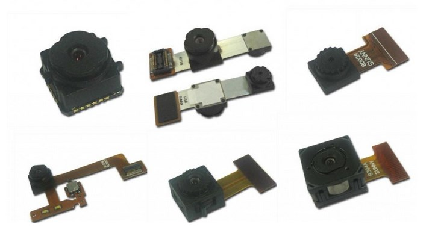

## 1.2 摄像头内部分解

摄像头硬件结构图：

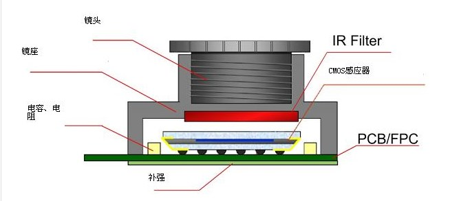

## 1.3 工作原理

光线通过镜头Lens进入摄像头内部，然后经过IR Filter过滤红外光，最后到达sensor（传感器），senor分为按照材质可以分为CMOS和CCD两种，可以将光学信号转换为电信号，再通过内部的ADC电路转换为数字信号，然后传输给DSP（如果有的话，如果没有则以DVP的方式传送数据到基带芯片baseband，此时的数据格式Raw Data，后面有讲进行加工）加工处理，转换成RGB、YUV等格式输出。

## 1.4 镜头 Lens

镜头是相机的灵魂，单反中一个镜头上万是很随意的事。镜头对成像有很重要的作用，相当于人眼中的晶状体，利用透镜的折射原理，景物光线透过镜头在聚焦平面上形成清晰的像，然后通过感光材料CMOS或CCD记录影像，并通过电路转换为电信号。镜头产业有比较高的技术门槛，国外主要集中在日本、韩国，国内主要是在台湾，业内比较知名的如：富士精机、柯尼卡美能达、大力光、Enplas等。

Lens一般由几片透镜组成透镜结构，按材质可分为塑胶透镜(plastic)或玻璃透镜(glass)，玻璃镜片比树脂镜片贵。塑胶透镜其实是树脂镜片，透光率和感光性等光学指标比不上镀膜镜片。

通常摄像头采用的镜头结构有：1P、2P、1G1P、1G2P、2G2P、2G3P、4G、5G等。透镜越多，成本越高，相对成像效果会更出色（个人理解是光线更均匀、更细致；对光线的选通更丰富；成像畸变更小，但是会导致镜头变长，光通量变小）。

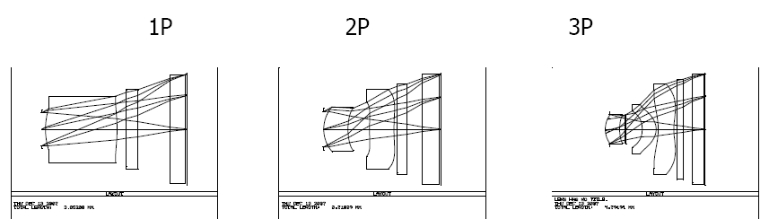

## 1.5 红外滤光片 IR Filter

主要是过滤掉进入镜头的光线中的红外光，这是因为人眼看不到红外光，但是sensor却能感受到红外光，所以需要将光线中的红外光滤掉，以便图像更接近人眼看到的效果。

## 1.6 传感器 Sensor

sensor是摄像头的核心，负责将通过Lens的光信号转换为电信号，再经过内部AD转换为数字信号。每个pixel像素点只能感受R、G、B中的一种，因此每个像素点中存放的数据是单色光，所以我们通常所说的30万像素或者130万像素，表示的就是有30万或130万个感光点，每个感光点只能感应一种光，这些最原始的感光数据我们称为RAW Data。Raw Data数据要经过ISP（应该理解为Image Sensor Processor，是Sensor模块的组成部分，下面有解释）的处理才能还原出三原色，也就是说如果一个像素点感应为R值，那么ISP会根据该感光点周围的G、B的值，通过插值和特效处理等，计算出该R点的G、B值，这样该点的RGB就被还原了，除此之外，ISP还有很多操作，下面有介绍。

目前常用的sensor有两种，一种是CCD（电荷耦合）原件；一种是CMOS（金属氧化物导体）原件。

**>>**CCD（Charge Coupled Device），电荷耦合器件传感器：使用一种高感光度的半导体材料制成，能把光线转变成电荷，通过模数转换器芯片转换成电信号。CCD由许多独立的感光单位组成，通常以百万像素为单位。当CCD表面受到光照时，每个感光单位都会将电荷反映在组件上，所有的感光单位产生的信号加在一起，就构成了一幅完整的图像。CCD传感器以日本厂商为主导，全球市场上有90%被日本厂商垄断，索尼、松下、夏普是龙头。

**>>**CMOS（Complementary Metal-Oxide Semiconductor），互补性氧化金属半导体：主要是利用硅和锗做成的半导体，使其在CMOS上共存着带N(-)和P(+)级的半导体，这两个互补效应所产生的电流可以被处理芯片记录并解读成影像。CMOS传感器主要以美国、韩国和中国台湾为主导，主要生产厂家是美国的OmnVison、Agilent、Micron，中国台湾的锐像、原相、泰视等，韩国的三星、现代。

## 1.7 图像处理芯片 DSP

DSP是CCM的重要组成部分，它的作用是将感光芯片获得的数据**及时地快速地传递到中央处理器并刷新感光芯片**，因此DSP芯片的好坏，直接影响画面品质，如：色彩饱和度、清晰度、流畅度等。如果sensor没有集成DSP，则通过DVP的方式传输到baseband芯片中（可以理解为外挂DSP），进入DSP的数据是RAW Data，采集到的原始数据。如果集成了DSP，则RAW Data会经过AWB、color matrix、lens shading、gamma、sharpness、AE和de-noise处理，最终输出YUV或者RGB格式的数据。如下图中所示， ISP（Image Sensor Processor，不是Image Signal Processor） 部分中使用的就是DSP来处理Image sensor的输出数据（Raw Data）：

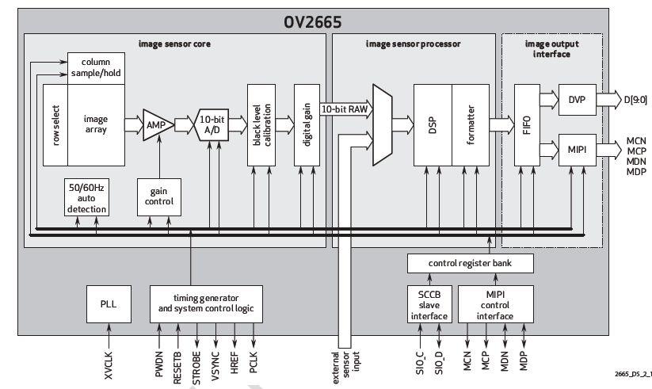

DSP结构框架：

**>>**ISP（Image Signal Processor），镜像信号处理器或者图像信号处理器

**>>**JPEG encoder，JPEG图像编码器，有软件硬件之分。

## 1.8 FPC柔性电路板(柔性PCB)

　 简称"软板", 又称"柔性线路板",连接芯片和手机。起到电信号传输作用。

## 1.9 ISP、DSP、基带芯片的区别和联系

几篇文章中出现的术语，这里做个专门的补充。

　 **>>**常见基带处理器或者基带芯片负责数据处理与储存，相当于一个**协处理器**，主要组件为DSP、微控制器、内存（如SRAM、Flash）等单元，主要功能为基带编码/译码、声音编码及语音编码 等。目前主流基带架构：DSP+ARM。可分为五个子块：CPU处理器、信道编码器、DSP、调制解调器和接口模块。

基带芯片是用来合成即将的发射的基带信号，或对接收到的基带信号进行解码。具体地说，就是：发射时，把音频信号编译成用来发射的基带码；接收时，把收到的基带码解译为音频信号。同时，也负责地址信息（手机号、网站地址）、文字信息（短讯文字、网站文字）、图片信息的编译。

**>>**ISP，Image Signal Processor，图像信号处理器；DSP，Data Signal Processor，数字信号处理器。

ISP一般用来处理Image Sensor（图像传感器）的输出数据，如进行：AEC（自动曝光控制）、AGC（自动增益控制）、AWB（自动白平衡）、色彩校正、Gamma校正、祛除坏点、Auto Black Level、Auto White Level 等等功能的处理。

**>>**而DSP功能就比较多了，它可以做些拍照以及回显（JPEG的编解码）、录像以及回放（Video 的编解码）、H.264的编解码、还有很多其他方面的处理，总之是处理数字信号了。可以认为ISP是一类特殊的处理图像信号的DSP。

　 **在这篇文章中，可以将基带芯片当做开发板上的控制芯片，ISP和DSP可以对等，都是对Raw Data进行处理。这里尊重原文作者的说法，并没有统一。**

还有要注意的是，在摄像头这部分，要看清楚ISP表示的是什么，是Image Signal Processor（图像信号处理器），还是Image Sensor Processor（图像传感器处理器）。像上面的OV2665里面的ISP就是Image Sensor Processor，相当于Sensor模块中的一部分，由DSP做处理器。而下面的GC0308，则正好相反，是Image Signal Processor，是一个真正的处理器，所以在看到ISP的时候要根据语境看指的是一个具体的处理器还是模块的组成部分而非实指。

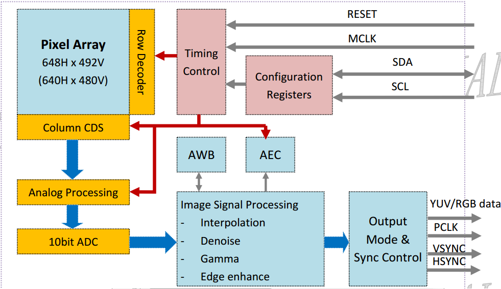

# 2 DVP

DVP分为三个部分：输出总线；输入总线；电源总线；如下图：

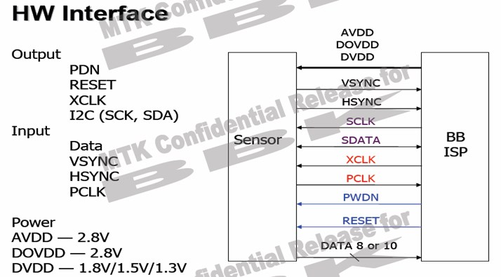

## 2.1 输入总线介绍

a>PWDN是camera的使能管脚，有两种配置方式，一种为standby，一种是normal work，设置为standby的时候，一切对camera的操作都是无效的，包括复位。所以在**RESET之前，一定要将PWDN管脚设置为normal模式，否则RESET无效**。

b>RESET是camera的复位管脚，此方式为硬复位模式，camera的各个IO口恢复到出厂默认状态。只有在XCLK开启后，将RESET置为低，硬复位才有效，否则复位无效。

c>XCLK是camera的工作时钟管脚，此管脚为BB提供camera的工作时钟。

d>IIC是camera和BB通信的总线通道。

## 2.2 输出总线介绍

a>data为camera的数据管脚。此数据脚可以输出的格式有YUV、RGB、JPEG等。

b>VSYNC为camera的帧同步信号管脚。一个VYSNC信号结束表示一帧（即一个画面）的数据已经输出完毕。

c>HSYNC为camera行同步信号管脚。一个HSYNC信号结束表示一行的数据已经输出完毕。

d>PCLK为像素同步信号管脚。一个PCLK信号结束表示一个像素点的数据已经输出完毕。 

## 2.3 Power线介绍

a>AVDD为camera的模拟电压。

b>DOVDD为camera的GPIO口数字电压。

c>DVDD为camera的核工作电压。

一般来说，要求先提供sensor的GPIO口电压，接着提供模拟电压，最后提供工作电压。时序如下图：

# 3 CCM组装方式

## 3.1 定焦CCM组装

CCM分为定焦模组和自动变焦模组，其中定焦模组主要由镜头、镜座、感光集成电路、软性线路板、补强和钢片装配而成，其装配图如下：

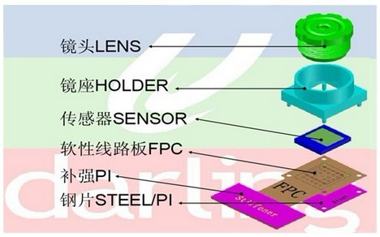

## 3.2 自动变焦模组组装

主要是镜头下面装了一个VCM音圈马达

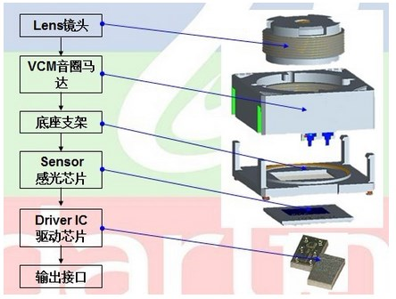

## 3.3 3D模组

多台摄像头拍摄图像，然后组合：

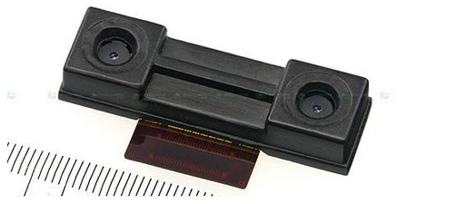

# 4 摄像头的一些技术指标

## 4.1 图像解析度/分辨率(resolution)

| QSIF/QQVGA | 160 x 120 | 19200| |
| ---------- | ----------- | -------- | ------------------------- |
| QCIF | 176 x 144 | 25344| |
| SIF/QVGA | 320 x 240 | 76800| |
| CIF| 352 x 288 | 101376 | 10万像素|
| VGA| 640 x 480 | 307200 | 30万像素(35万是指648X488) |
| SVGA | 800 x 600 | 480000 | 50万像素|
| XGA| 1024 x 768| 786438 | 80万像素|
| SXGA | 1280 x 1024 | 1310720| 130万像素 |
| UXGA | 1600 x 1200 | 1920000| 200万像素 |
| QXGA | 2048 x 1536 | 3145728| 300万像素(320W) |
| QSXGA| 2592 x 1944 | 5038848| 500万像素 |
|| 2816 x 2112 | 2947392| 600万像素 |
|| 3072 x 2304 | 7077888| 700万像素 |
|| 3200 x 2400 | 7680000| 770万像素 |
|| 3264 x 2448 | 7990272| 800万像素 |
|| 3876 x 2584 | 10015584 | 1000万像素|

## 4.2 sensor输出的图像格式

- YUV：luma(Y)+chroma(UV)格式（亮度、色度），一般情况下sensor支持YUV422格式，即Y-U-Y-V次序输出数据。

- RGB：传统的红绿蓝格式，比如RGB565,5bit R + 6bit G + 5bit B，G多一位是因为人眼对绿色比较敏感。

- RAW RGB：sensor的每一像素对应一个彩色滤光片，滤光片按Bayer Pattern(拜耳模板)分布，将每一个像素的数据直接输出，即Raw RGB Data。

- JPEG：有些sensor，特别是低分辨率的，其自带JPEG engine，可以直接输出压缩后的jpg格式的数据。

**注意**：

**a>**YUV一个像素占2B，如果像素太大，在高时钟下基带芯片处理不过来，JPEG数据量就要小很多，因为基带芯片对输出数据的速率有要求，所以基带芯片低时钟下使用YUV sensor，高时钟下使用JPEG sensor。

**b>**如果直接输出RGB，对于LCD显示是最方便的，但是大多数基带芯片都是要求输出为YUV格式的数据再进行，这是因为，YUV输出数据的亮度信号没有任何损失，而色偏信号人眼并不是特别敏感，RGB565输出格式是R5G3 G3B5，会丢失很多原始信息，所以YUV图像质量和稳定性要比RGB565好的多。因此，很低端的基带芯片上才会输出RGB565格式。

Raw和JPEG的区别：

Raw优点：

1. Raw格式文件本质上是一个没有经过任何图像处理的源文件，它能原原本本地记录相机拍摄的信息，没有经过图像处理（锐化、色彩对比增强）和压缩而造成的信息丢失。相比之下，JPEG格式的数据经过压缩处理，无法完整的保存原图形的所有数据。

2. Raw是一种专业摄影师常用的格式，因为它能原原本本地保存信息，让用户能大幅度进行后期制作，并且无论怎么操作，照片都能无损的恢复到最初状态；但是JPEG就弱了些，虽然因为PS等技术的发展，也可以在JPEG上进行后期制作，但是如果做大幅度的调整还是Raw文件比较合适。

3. 可以用专门的软件修正摄像机的不足，比如佳能DPP软件可以修正镜头失光、变形等。

Raw缺点：

1 存储数据量太大，JPEG就小很多
2 需要专门的软件来打开，JPEG几乎所有的PC都可以直接打开 
3 打开速度较慢，JPEG较快 
4 不同的软件有不同的方式去演绎RAW文件，所以在不同的软件上会有细微的差别。 
5 厂商卖的专用软件价格较高，而这方面JPEG几乎无成本

## 4.3 自动白平衡调整(AWB)

定义：要求在不同色温环境下，照白色的物体，屏幕中的图像应也是白色的。色温表示光谱成份，光的颜色。色温低表示长波光成分多。当色温改变时，光源中三基色(红、绿、蓝)的比例会发生变化，需要调节三基色的比例来达到彩色的平衡，这就是白平衡调节的实际。

## 4.4 图像压缩方式

JPEG：(joint photo graphicexpert group)静态图像压缩方式。一种有损图像的压缩方式。压缩比越大，图像质量也就越差。当图像精度要求不高存储空间有限时，可以选择这种格式。目前大部分数码相机都使用JPEG格式。

## 4.5 彩色深度(色彩位数)

反映对色彩的识别能力和成像的色彩表现能力，实际就是A/D转换器的量化精度，是指将信号分成多少个等级。常用色彩位数(bit)表示。彩色深度越高，获得的影像色彩就越艳丽动人。现在市场上的摄像头均已达到24位，有的甚至是32位（原文）

## 4.6 图像噪音

指的是图像中的杂点干挠。表现为图像中有固定的彩色杂点。

## 4.7 视角

与人的眼睛成像是相同原理，简单说就是成像范围。

## 4.8 输出/输入接口

串行接口(RS232/422):传输速率慢，为115kbit/s
　并行接口(PP)：速率可以达到1Mbit/s
　红外接口(IrDA)：速率也是115kbit/s，一般笔记本电脑有此接口
　通用串行总线USB：即插即用的接口标准，支持热插拔。USB1.1速率可达12Mbit/s,USB2.0可达480Mbit/s
　IEEE1394(火线)接口(亦称ilink):其传输速率可达100M~400Mbit/s 

## 4.9 CAMIF, Camera Interface

下面这张图，没看懂，暂时放在这里

## 4.10 FIME，Fully Interactive Moblio Camera

摄像头采集的数据CPU无法直接处理，所以，主动芯片里面集成了Camera控制器，即FIMC。摄像头需要先将图像数九传送给控制器，经过控制器处理（裁剪拉升后直接预览或者编码）之后交给CPU处理。MCLK就是由FIMC提供的。

CAMMCLK给摄像头提供时钟，CAMRST是复位线，PWD在摄像头工作时应该始终为敌。HREF是行参考信号，PCLK是像素始终，VSYNC是场同步信号，一旦给摄像头提供了时钟，并且复位了摄像头，摄像头就开始工作了。

 FIMC信号定义如下所示(YCbCr模式)

| Signal| I/O| Description| Type |
| --------- | ---- | ------------ | ---- |
| HREF| I| 行同步信号 ||
| PCLK| I| 像素时钟 ||
| DATA[7:0] | I| 像素数据 ||
| FIELD | O| FIELD信号||
| MCLK| O| 系统时钟信号 ||
---------------

## 4.9 camera时钟域

每个摄像头都有三个时钟域，第一个是系统总线时钟域；第二个是摄像头像素时钟域PCLK；第三个是内部始终MCLK。

系统总线时钟必须高于PCLK，CAM_MCLK必须固定频率发呢拼比，如：PLL时钟。

# 5 摄像头工作原理

手册中内容扫盲： 

首先，我们要明白，一旦给摄像头提供了时钟，并且复位了摄像头，摄像头就可以工作了，通过PCLK、HSYNC、VSYNC听不传输数字图像信号。

摄像头的驱动需要完成三大步：

**>>**摄像头的上电、时钟这些基本条件

**>>**IIC保证摄像头的初始化

**>>**摄像头工作后传回数据到主控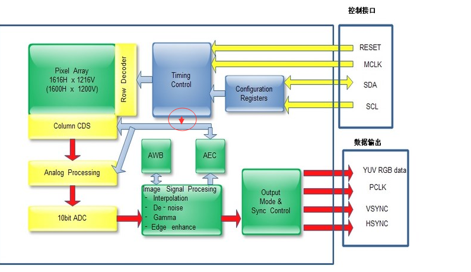

　 原图有误，已经修改，红色圈圈部分。

 控制部分是摄像头上电、IIC控制接口；数据输出是摄像头拍摄的图像数据传到主控芯片，所以，需要有Data、行场同步时钟(告诉主控芯片哪些数据是一行，哪些是一帧)、以及时钟（PCLK，像素时钟，告诉主控芯片哪些数据是一个像素点）。

## 5.1 MCLK

摄像头要 工作，必须要有个时钟进行同步，这个时钟就是MCLK，必须要有，否则摄像头就是一个死物，这个时钟由主控芯片提供，确切的说是有主控芯片的控制器提供，下面会提到。

## 5.2 RESET

复位信号，上面有提

## 5.3 SDA、SCL

IIC总线，主要作用就是为主控芯片配置或者读取摄像头的寄存器提供通道。mini2440音频模块中的L3协议，也是这个作用。不要看见协议就怕，协议就是一条路，数据传输的路，有规定的数据传输的道路。

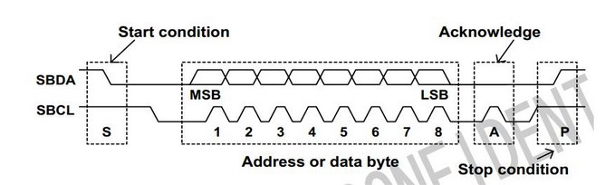

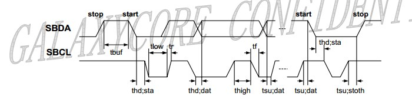

## 5.4 Configuration Register

配置寄存器，控制器（在主控芯片中）通过IIC来设置，相当于告诉摄像头如何工作等。

## 5.5 Timing Control

时序控制，主要是根据主控芯片提供的MCLK时钟来控制行场同步、自动曝光AEC等。因为这些都需要时钟的配合。

## 5.6 Pixel Array

| pixel | 英[ˈpɪksl] | 美[ˈpɪksl] |
| ----- | ---------- | ---------- |
| n.   | 像素(组成屏幕图像的最小独立元素); |

gc0308物理上的阵列是648H*492V，实际采样阵列是648H*488V，也是有效阵列。实际取像的阵列是640H*480V。如下图所示：

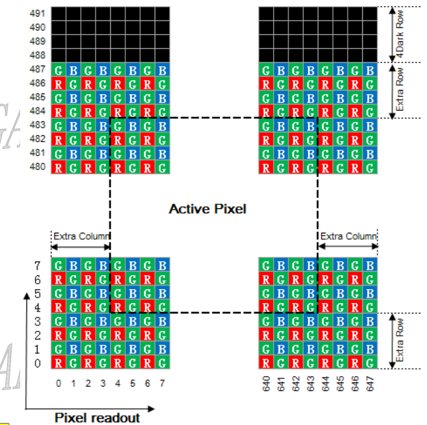

## 5.7 CDS

Correlated Double Sampling，相关双联取样电路。CCD传感器的每个像素点输出波形只在一部分时间内是图像信号，其余时间是复位电平和干扰，为了提取图像信号并消除干扰，就要采用取样保持电路。

## 5.8 Analog Processing、10bit ADC

主要是将sensor得到的电信号转换为数字信号，方便ISP或者DSP处理。

## 5.9 Image Signal Processing

图像信号处理器，可以理解为DSP的一种，主要是对sensor经过ADC处理后的Raw Data进行处理，主要有自动白平衡AWB、插值计算（Bayer interpolation主要是对Raw Data进行格式转换，转为YUV /RGB等）、去噪、gamaa修正、色彩修正、边缘增强等。这些都是由寄存器决定，寄存器又是通过IIC总线来设置的。

## 5.10 Output Mode & Sync Control

输出接口，从光线进入镜头、过滤、光感应、ADC，然后到图像数据处理，最终数据到达外部接口。摄像头取一幅图像的整个工作完成，摄像头本质上还是一个终端节点，所以需要将采集好的图像数据传递给主控芯片，所以要有数据引脚，图形格式补在是Raw Data，而是YUV或者RGB数据。进行数据传输，肯定需要时钟进行同步，所以需要PCLK，告诉主控芯片，哪个数据代表了一个像素点；VSYNC负责告诉芯片哪些是一帧数据，HSYNC则同步行数据。

## 5.11 设备地址

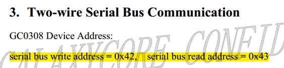

百科上的定义，在数据通信中，可以发送或接受数据的任何设备标识。

操作系统课程上面有讲到，系统为了管理外部设备而进行的编码。不知道这个地址是不是这个意思。

反正写入的时候指定0x42，读取的时候指定0x43，

## 5.12 IIC通信

 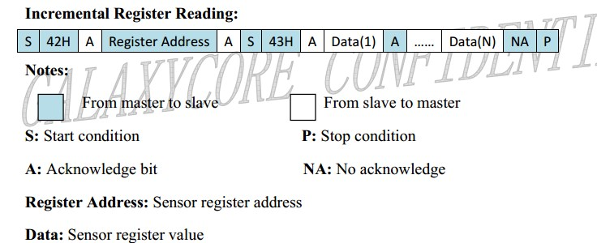

IIC通信是一个交互的过程，需要等待对方的确认信号，并不是一次性完成的。首先，主机需要做两个事情：

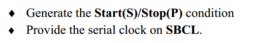

一个是，提供启动、结束信号；一个是提供IIC时钟信号。图示很明白了，不在啰嗦。

## 5.13 时序 Timing

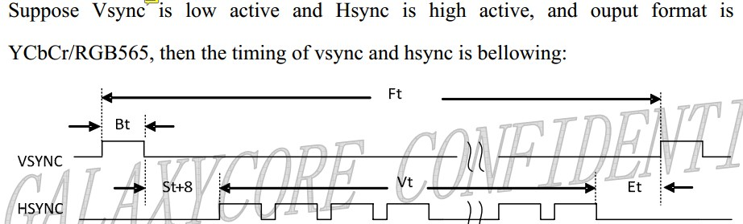

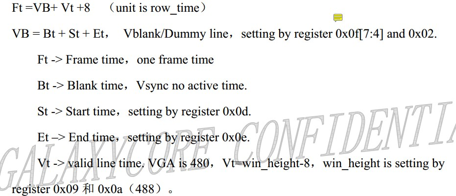

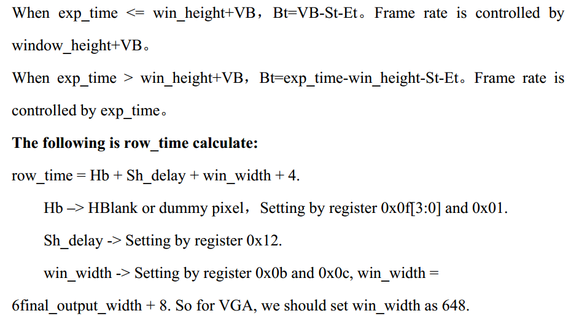

帧时间（Ft，Frame time）=帧时钟不活动时间（Bt，Blank time）+启动时间（St，Start time）+有效行时间（Vt，Valid line time）+结束时间（Et，End time）+8

空白无效行时间（Vblank/Dummy line）=Bt+St+Et。

首先要明白，物理上492行，但是实际感应光线的只有488行，4行是Dark Row，黑暗行；但是这488有数据的行中只有480行是有效行。然后推导公式，首先分析小公式——空白行时间，空白时间包括无效的帧同步时间，这里就是VSYNC处于高电平的无效时间；开始数据采集之前需要有几个时钟周期的缓冲，然后才开始采集行数据，所以这个时间，也就是启动时间也要算在空白行时间里面，同理，480行有效数据采集完成后，也需要几个时钟周期表示数据采集结束，结束时间也要包括在空白行时间里面。

一帧图像所需要的时间，首先包括空白行时间Bt，还有有效行时间Vt，然后加上8。这个8应该是代表那8行无效数据（不确定），欢迎留言！

exp_time应该是曝光时间，当曝光时间小于488行数据采集时间+空白行时间，这帧时间由所有行采集的时间+空白行时间控制，那么VSYNC无效电平的时间=行空白时间-启动时间-结束时间。

如果曝光时间超过win_height+VB，也就是在曝光没有在正常的一帧时间内完成，那么肯定需要继续曝光，帧时间由曝光时间确定。帧同步无效时间=曝光时间-win_height-启动时间-结束时间。

# 7 DVP MIPI-CSI 摄像头接口的区别

## 7.1 MIPI

1、什么是MIPI？

MIPI联盟，即移动产业处理器接口（Mobile Industry Processor Interface 简称MIPI）联盟。
MIPI（移动产业处理器接口）是MIPI联盟发起的为移动应用处理器制定的开放标准和一个规范。

2、MIPI的特点

MIPI是差分串口传输，速度快，抗干扰。主流手机模组现在都是用MIPI传输，传输时使用4对差分信号传输图像数据和一对差分时钟信号；最初是为了减少LCD屏和主控芯片之间连线的数量而设计的，后来发展到高速了，支持高分辨率的显示屏，现在基本上都是MIPI接口了。

MIPI摄像头有三个电源：VDDIO（IO电源），AVDD（模拟电源），DVDD（内核数字电源），不同sensor模组的摄像头供电不同，AVDD有2.8V或3.3V的；DVDD一般使用1.5V或更高，不同厂家的设计不同，1.5V可能由sensor模组提供或外部供给，可以使用外部供电则建议使用外部供，电压需大于内部的DVDD；VDDIO电压应与MIPI信号线的电平一致，若信号线是2.8V电平，则VDDIO也应供2.8V，有些sensor模组也可以不供VDDIO，由内部提供。

补充说明：MIPI的camera接口叫 CSI，MIPI的display接口叫DSI。

## 7.2 DVP

DVP是并口传输，速度较慢，传输的带宽低，需要如下接口：

① PCLK：sensor输出时钟（对mcu输入的时钟倍频），像素点同步时钟信号，每个PCLK对应一个像素点，可以为48MHz；对于时钟信号，一般做包地处理，减少对其他信号的干扰，还需要在源端加电阻和电容，减少过冲和振铃，从而减少对其他信号的干扰。

② MCLK（XCLK）：外部时钟输入，可由主控或晶振提供，由sensor规格书确定，可以为24MHZ；

③ VSYNC：帧同步信号，一帧一个信号，频率为几十Hz（30Hz）

④ HSYNC：行同步信号（频率为几十KHz）

⑤ D[0：11] ：并口数据 （可以是8/10/12bit数据，看ISP或baseband是否支持）

例如：分别率 320×240的屏，每一行需要输入320个脉冲来依次移位、锁存这一行的数据，然后来个HSYNC 脉冲换一行；这样依次输入240行之后换行同时来个VSYNC脉冲把行计数器清零，又重新从第一行开始刷新显示。

# 8 Sensor信号输出YUV、RGB、RAW DATA、JPEG 4种方式区别

YUV: 

luma (Y) + chroma (UV) 格式，

 Y”表示明亮度（Luminance或Luma），也就是灰阶值，“U”和“V”表示的则是色度（Chrominance或Chroma），作用是描述影像色彩及饱和度，用于指定像素的颜色。 [1] 

 一般情况下sensor支持YUV422格式，即数据格式是按Y-U-Y-V次序输出的

RGB: 传统的红绿蓝格式，比如RGB565，其16-bit数据格式为5-bit R + 6-bit G + 5-bit B。G多一位，原因是人眼对绿色比较敏感。
RAW RGB: sensor的每一像素对应一个彩色滤光片，滤光片按Bayer pattern分布。将每一个像素的数据直接输出，即RAW RGB data
JPEG: 有些sensor，特别是低分辨率的，其自带JPEG engine，可以直接输出压缩后的jpg格式的数据

对于这几种输出格式，几个疑问：
1、 有些手机基带芯片只能支持2M以下的YUV sensor，3M以上只能使用JPEG sensor，这里说明YUV输出格式对基带芯片有一定的要求， 那么到底YUV sensor对基带芯片有怎样的要求呢？
2、 如果直接输出RGB，对于LCD的显示是最方便的，那么为何大多数基带芯片都是要求输出为YUV格式的数据再进行处理呢？

1 YUV一个像素占2B，如果像素太高在高时钟下基带芯片处理不过来，JPEG数据量就要小的多，所以不是YUV对基带芯片有要求而是基带芯片对输出数据速率有要求。
2 RGB565一般用在很低端的基带芯片上，直接往屏上刷。YUV输出亮度信号没有任何损失，而色偏信号人眼并不是特别敏感，RGB565输出格式是R5G3 G3B5会丢掉很多原始信息，所以YUV图像质量和稳定性要比RGB565好的多

3 RAW数据每个像素就1B，数据量要少很多，一般5M以上sensor就只输出RAW数据以保证比较快的输出速度，后端挂一个DSP来处理输出的数据。
--------------------------------------------------------------------------------
RAW和JPEG的区别
RAW格式文件基本上是一个没有经任何图像处理的源文件， 它能原原本本地记录相机拍摄到的信 息，没有因为图像处理（如锐化、增加色彩对比）和压缩而造成的信息丢失，但需要用特别的软件 来打开这些文件。 另一种常用的格式便是JPEG，相机会先根据使用者的设定来做一定的图像处理，然后经过压缩 （程度因相机内设定的照片质量而定）和保存照片。 为何要拍摄RAW？ RAW是一种专业摄影师常用的格式，因为它能原原本本地保存信息，让用户能大幅度对照片进行 后期制作，如调整白平衡、曝光程度、颜色对比等设定，也特别适合新手补救拍摄失败的照片，而 且无论在后期制作上有什么改动，相片也能无损地回复到最初状态，不怕因意外储存而损失照片。 RAW还有一个好处，例如佳能DPP软件可以修正镜头失光、变形等。 JPEG格式有什么优点？ JPEG格式为一种非常普及的照片格式，差不多所有现代数码相机都能使用这个格式，绝大部分 的计算机上也能打开JPEG文件，使用者也可以随意设定压缩程度来保留画质（最佳的JPEG画质跟RAW 的非常接近），是一种十分方便的格式。 我该拍摄RAW还是JPEG？ 在讨论这个问题之前，让我们看看RAW格式有什么缺点： 1.因为RAW文件需要保留所有细节和信息，所以文件比JPEG大很多，这样储存照片或把照片传输 到计算机的时间便更长更久，需要的储存容量也更大； 2.RAW文件需要使用特别的软件来打开，一旦计算机没有安装软件便没法打开文件； 3.承上，一旦10年后那套特定的软件没法安装，之前拍摄的照片便没有办法打开； 4.软件打开RAW的时间比较长，快的需要8、9s，慢的可能要用上20s也说不定； 5.不同的软件有不同的方式去“演译”RAW文件，所以一个RAW文件在Photoshop 和Nikon Capture NX看可能会有所差别； 6.厂商卖的专用软件价钱不低。（佳能DPP可以免费下载，尼康NX则需另购） 清楚RAW的缺点以后，我们便可以看看哪种情况应该选择RAW或JPEG： 如果你需要拍摄大量的照片，应该考虑使用JPEG，因为其容量需求比较少和可以保留后制及把 照片转换为JPEG的时间； 如果你用作商业拍摄或喜欢后期制作，应该使用RAW，因为后制空间较大； 如果你正进行旅行摄影，可以考虑使用RAW或者RAW+JPEG，因为旅行的地方可能没法常去，使用 RAW让你一旦拍摄失败也有较大的机会补救。 后记 其实现在Photoshop的功能很强大，对于JPEG文件也能通过level或curve来调较曝光、白平衡、 色彩对比等，当然如果需要做大幅度的调整还是RAW文件比较适合的。

摄像头数据格式

摄像头的数据输出格式一般分为CCIR601、CCIR656、RAW RGB等格式，此处说的RGB格式应该就是CCIR601或CCIR656格式。而RAW RGB格式与一般的RGB格式是有区别的。
我们知道，Sensor的感光原理是通过一个一个的感光点对光进行采样和量化，但，在Sensor中，每一个感光点只能感光RGB中的一种颜色。所以，通常所说的30万像素或130万像素等，指的是有30万或130万个感光点。每一个感光点只能感光一种颜色。

但是，要还原一个真正图像，需要每一个点都有RGB三种颜色，所以，对于CCIR601或656的格式，在Sensor模组的内部会有一个ISP模块，会将Sensor采集到的数据进行插值和特效处理，例如：如果一个感光点感应的颜色是R，那么，ISP模块就会根据这个感光点周围的G、B感光点的数值来计算出此点的G、B值，那么，这一点的RGB值就被还原了，然后在编码成601或656的格式传送给Host。

而RAW RGB格式的Sensor则是将没个感光点感应到的RGB数值直接传送给Host，由Host来进行插值和特效处理。

Raw RGB 每个像素只有一种颜色（R、G、B中的一种）；
RGB 每个像素都有三种颜色，每一个的值在0~255之间；
在手机摄像头的测试过程中，由sensor输出的数据就是Raw data（Raw RGB），经过彩色插值就变成RGB

 sensor输出的数据格式，主要分两种：YUV（比较流行），RGB，这就是sonsor的数据输出；这其中的GRB就是Raw RGB，是sensor的bayer阵列获取的数据（每种传感器获得对应的颜色亮度）；
但是输出的数据不等于就是图像的实际数据，模组测试时，就要写一个软件，完成数据采集（获得Raw data）－>彩色插值（目的是获得RGB格式，便于图像显示）－>图像显示；
这样就可以发现整个模组是否正常，有无坏点，脏点的等，检测出不良品；（软件的处理过程当中，为了获得更好的图像质量，还需要白平衡，gamma校正，彩色校正）
而在手机的应用中，手机根据相机模组的数据格式，提供一个ISP（主要用于RGB格式的），配合软件，使照相功能得到应用；

对于SENSOR来说,Bayer RGB和RGB Raw两者的图象结构都是BG/GR的(Bayer pattern说的是COLOR FILTER的结构,分为两种：STD Bayer pattern 与Pair pattern，其中STD Bayer pattern的结构是BG/GR的，而Pair Pattern顾名思义是指BGBG/GRGR的结构，即以四行为一个单位，前两行是BG的结构，后两行是GR的结构，这种结构是美光专门为此申请了专利的，主要是在输出TV模式（NTSC/PAL制）时用到），
由于后端应用时，对RAW DATA图像的 解码是按默认的结构来 解码的 ，如BG/GR，因此 Bayer RGB和RGB Raw两者的图象结构必须都是BG/GR的，而如果输出图像结构是BGBG/GRGR，则不可以直接显示和解码 的。
Bayer RGB与RGB Raw的主要区别在于两者输出前经过的处理不同，Bayer RGB从ADC输出，只经过了LENS SHADING CORRECTION，GAMMA等模块处理而后就直接输出，而RGB Raw则经过了整个ISP模块的处理，最终是经过YUV422的数据转化而来的

数字视频CCIR 601编码标准

一、采样频率：为了保证信号的同步，采样频率必须是电视信号行频的倍数。CCIR为NTSC、PAL和SECAM制式制定的共同的电视图像采样标准：
fs＝13.5MHz
这个采样频率正好是PAL、SECAM制行频的864倍，NTSC制行频的858倍，可以保证采样时采样时钟与行同步信号同步。对于4：2：2的采样格式，亮度信号用fs频率采样，两个色差信号分别用
fs／2＝6.75MHz的频率采样。由此可推出色度分量的最小采样率是3.375MHz。

二、分辨率：根据采样频率，可算出对于PAL和SECAM制式，每一扫描行采样864个样本点；对于NTSC制则是858个样本点。由于电视信号中每一行都包括一定的同步信号和回扫信号，故有效的图像信号样本点并没有那么多，CCIR 601规定对所有的制式，其每一行的有效样本点数为720点。由于不同的制式其每帧的有效行数不同（PAL和SECAM制为576行，NTSC制为484行），CCIR定义720×484为高清晰度电视HDTV（High Definition TV）的基本标准。实际计算机显示数字视频时，通常采用下表的参数：

电视制式    分辨率      帧 率
NTSC        640×480     30
PAL           768×576      25

三、数据量：CCIR 601规定，每个样本点都按8位数字化，也即有256个等级。但实际上亮度信号占220级，色度信号占225级，其它位作同步、编码等控制用。如果按fs的采样率、4：2：2的格式采样，则数字视频的数据量为：
13.5(MHz)×8(bit)＋2×6.75(MHz)×8(bit) = 27Mbyte / s

同样可以算出，如果按4：4：4的方式采样，数字视频的数据量为每秒40兆字节！按每秒27兆字节的数据率计算，一段10秒钟的数字视频要占用270兆字节的存储空间。按此数据率，一张680兆字节容量的光盘只能记录约25秒的数字视频数据信息，而且即使目前高倍速的光驱，其数据传输率也远远达不到每秒27兆字节的传输要求，视频数据将无法实时回放。这种未压缩的数字视频数据量对于目前的计算机和网络来说无论是存储或传输都是不现实的，因此，在多媒体中应用数字视频的关键问题是数字视频的压缩技术。

 CCIR601和CCIR656标准的区别
关于这两种信号的区别：
ITU-R BT 601:16位数据传输；21芯；Y、U、V信号同时传输。
ITU-R BT 656:9芯，不需要同步信号；8位数据传输；串行视频传输；传输速率是601的2倍；先传Y，后传UV。
CCIR601要通过行、场同步两根信号线来传递行、场同步信息；
CCIR656不需要这两根信号线，它只通过8位数据线实现“软”同步。
CCIR656=CCIR601+HSYNC+VSYNC
656输出的是串行数据，行场同步信号嵌入在数据流中；
601是传输的是并行数据，行场同步有单独输出;
656只是数据传输接口而已，可以说是作为601的一个传输方式。
简单的说ITU-R BT.601是“演播室数字电视编码参数” 标准，而ITU-R BT.656则是ITU-R BT.601附件A中的数字接口标准,用于主要数字视频设备(包括芯片)之间采用27Mhz/s并口或243Mb/s串行接口的数字传输接口标准。
CCIR601号建议的制定，是向着数字电视广播系统参数统一化、标准化迈出的第一步。在该建议中，规定了625和525行系统电视中心演播室数字编码的基本参数值。
601号建议单独规定了电视演播室的编码标准。它对彩色电视信号的编码方式、取样频率、取样结构都作了明确的规定。
它规定彩色电视信号采用分量编码。所谓分量编码就是彩色全电视信号在转换成数字形式之前，先被分离成亮度信号和色差信号，然后对它们分别进行编码。分量信号（Y、B -- Y、R -- Y）被分别编码后，再合成数字信号。 它规定了取样频率与取样结构。
例如：在4：2：2等级的编码中，规定亮度信号和色差信号的取样频率分别为13.5MHZ和6.75MHZ，取样结构为正交结构，即按行、场、帧重复，每行中的R-Y和B-Y取样与奇次(1,3,5……)Y的取样同位置，即取样结构是固定的，取样点在电视屏幕上的相对位置不变。 它规定了编码方式。对亮度信号和两个色差信号进行线性PCM编码，每个取样点取8比特量化。同时，规定在数字编码时，不使用A/D转换的整个动态范围，只给亮度信号分配220个量化级，黑电平对应于量化级16，白电平对应于量化级235。为每个色差信号分配224个量化级，色差信号的零电平对应于量化级128。
综上所述，我们知道，分量信号的编码数据流是很高的。以4：2：2编码标准为例，其比特流为：13.5×8+6.75×8×2=216Mb/S。若采用4：4：4编码方式，即对复合信号直接编码，其抽样频率取为13.3×8=106.4 Mb/S。
PS:我们可以认为CCIR601即“ITU-R BT.601-5”，“ITU-R BT.656-4"即CCIR601。

656只有8位DATA+CLK，601有8位DATA+CLK+HSYNC+VSYNC，还有16位DATA+CLK+HSYNC+VSYNC。
656把HSYNC、VSYNC插到数据中，601的数据线只有数据

