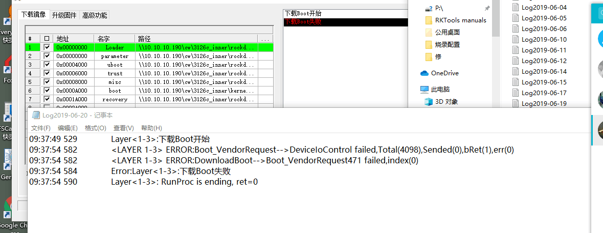

# 1 rk812报错

```

DDR V2.09 20171030
In
DDR2
300MHz
BW=16  Col=10  Bk=8  Row=13  CS=1  Die BW=16  Size=128MB
OUT
Boot1 Release Time: Jul 25 2018 09:52:22, version: 2.52
bootrom_ver: 56323030, ChipType:12
...FlashInit enter...
...NandcInit enter...
0:200 0 7f7f05 22 200
gNandcVer = 6 56363232
mmc Ext_csd, ret=0 ,
 Ext[226]=20, bootSize=2000, 
                        Ext[215]=1, Ext[214]=d1, Ext[213]=f0, Ext[212]=0,cap =1d1f000 REL=1f
mmc2:cmd19,256
SdmmcInit=2 0
BootCapSize=2000
UserCapSize=14910MB
FwPartOffset=2000 , 2000
UsbHook 734806
powerOn 734866
DDR V2.09 20171030
In
DDR2
300MHz
BW=16  Col=10  Bk=8  Row=13  CS=1  Die BW=16  Size=128MB
OUT
Boot1 Release Time: Mar 12 2019 17:23:39, version: 2.54
ChipType = 0xb, 2285
bootrom_ver: 56323030, ChipType:12
mmc2:cmd19,100
SdmmcInit=2 0
BootCapSize=2000   LL
SdmmcInit=0 1
StorageInit ok = 107865
GPT part:  0, name:            uboot, start:0x4000, size:0x2000
GPT part:  1, name:            trust, start:0x6000, size:0x2000
GPT part:  2, name:             misc, start:0x8000, size:0x2000
GPT part:  3, name:             boot, start:0xa000, size:0x10000
GPT part:  4, name:         recovery, start:0x1a000, size:0x10000
GPT part:  5, name:           backup, start:0x2a000, size:0x10000
GPT part:  6, name:              oem, start:0x3a000, size:0x20000
GPT part:  7, name:           rootfs, start:0x5a000, size:0x100000
GPT part:  8, name:         userdata, start:0x15a000, size:0x1bc4fdf
find part:uboot OK. first_lba:0x4000.
find part:trust OK. first_lba:0x6000.
LOADER Check OK! 0x60000000, 410019
TOS    Check OK! 0x61800000, 632578
Enter Trust OS
INF [0x0] TEE-CORE:init_primary_helper:381: Initializing (1.1.0-386-g448a414 #2 Thu May 23 04:02:27 UTC 2019 arm)

INF [0x0] TEE-CORE:init_primary_helper:382: Release version: 1.2

INF [0x0] TEE-CORE:init_primary_helper:383: Next entry point address: 0x60000000

INF [0x0] TEE-CORE:init_teecore:83: teecore inits done


U-Boot 2017.09-02923-g48802b4 (Jun 20 2019 - 19:14:11 +0800)

Model: Rockchip RK3126 Evaluation board
DRAM:  125 MiB
Sysmem: init
Relocation Offset is: 00000000
Using default environment

dwmmc@1021c000: 0
MMC Device 1 not found
no mmc device at slot 1
switch to partitions #0, OK
mmc0(part 0) is current device
Bootdev: mmc 0
PartType: EFI
boot mode: recovery
Load FDT from recovery part
DTB: rk-kernel.dtb
I2c speed: 400000Hz
rk8xx_read: read reg 0x17 failed, ret=-121
rk8xx_read: read reg 0x17 failed, ret=-121
rockchip_panel_probe: Cannot get power supply: -121
Can't get crtc id, default set to id = 0
Model: Rockchip RK3126 Linux board
rk8xx_read: read reg 0x17 failed, ret=-121
rk8xx_read: read reg 0x17 failed, ret=-121
enter Recovery mode!
Rockchip UBOOT DRM driver version: v1.0.1
### ERROR ### Please RESET the board ###

```





```
这个是要要kernel里面关闭rk812
```

# 2 进不去内核

```
DDR V2.09 20171030
In
DDR2
300MHz
BW=16  Col=10  Bk=8  Row=13  CS=1  Die BW=16  Size=128MB
OUT
Boot1 Release Time: Jul 25 2018 09:52:22, version: 2.52
bootrom_ver: 56323030, ChipType:12
...FlashInit enter...
...NandcInit enter...
0:200 0 7f7f05 22 200
gNandcVer = 6 56363232
mmc Ext_csd, ret=0 ,
 Ext[226]=20, bootSize=2000, 
                        Ext[215]=1, Ext[214]=d1, Ext[213]=f0, Ext[212]=0,cap =1d1f000 REL=1f
mmc2:cmd19,256
SdmmcInit=2 0
BootCapSize=2000
UserCapSize=14910MB
FwPartOffset=2000 , 2000
UsbHook 731061
powerOn 731106
DDR V2.09 20171030
In
DDR2
300MHz
BW=16  Col=10  Bk=8  Row=13  CS=1  Die BW=16  Size=128MB
OUT
Boot1 Release Time: Mar 12 2019 17:23:39, version: 2.54
ChipType = 0xb, 2286
bootrom_ver: 56323030, ChipType:12
mmc2:cmd19,100
SdmmcInit=2 0
BootCapSize=2000   LISHhV+Eсz part:  0, name:            uboot, start:0x4000, size:0x2000
GPT part:  1, name:            trust, start:0x6000, size:0x2000
GPT part:  2, name:             misc, start:0x8000, size:0x2000
GPT part:  3, name:             boot, start:0xa000, size:0x10000
GPT part:  4, name:         recovery, start:0x1a000, size:0x10000
GPT part:  5, name:           backup, start:0x2a000, size:0x10000
GPT part:  6, name:              oem, start:0x3a000, size:0x20000
GPT part:  7, name:           rootfs, start:0x5a000, size:0x100000
GPT part:  8, name:         userdata, start:0x15a000, size:0x1bc4fdf
find part:uboot OK. first_lba:0x4000.
find part:trust OK. first_lba:0x6000.
tag:LOADER error,addr:0x4000
hdr 633377e0 + 0x0:0x00000000,0x00000000,0x00000000,0x00000000,
tag:LOADER error,addr:0x6000
hdr 633377e0 + 0x0:0x00,0x00,0x00,0x00,0x00,0x00,0x00,0x00,0x00,0x00,0x00,0x00,0x00,0x00,0x00,0x00,

tag:LOADER error,addr:0x4800
hdr 633377e0 + 0x0:0x00000000,0x00000000,0x00000000,0x00000000,
tag:LOADER error,addr:0x6800
hdr 633377e0 + 0x0:0x00,0x00,0x00,0x00,0x00,0x00,0x00,0x00,0x00,0x00,0x00,0x00,0x00,0x00,0x00,0x00,

tag:LOADER error,addr:0x5000
hdr 633377e0 + 0x0:0x00000000,0x00000000,0x00000000,0x00000000,
tag:LOADER error,addr:0x7000
hdr 633377e0 + 0x0:0x00,0x00,0x00,0x00,0x00,0x00,0x00,0x00,0x00,0x00,0x00,0x00,0x00,0x00,0x00,0x00,

tag:LOADER error,addr:0x5800
hdr 633377e0 + 0x0:0x00000000,0x00000000,0x00000000,0x00000000,
tag:LOADER error,addr:0x7800
hdr 633377e0 + 0x0:0x00,0x00,0x00,0x00,0x00,0x00,0x00,0x00,0x00,0x00,0x00,0x00,0x00,0x00,0x00,0x00,

tag:LOADER error,addr:0x6000
hdr 633377e0 + 0x0:0x00000000,0x00000000,0x00000000,0x00000000,
tag:LOADER error,addr:0x8000
hdr 633377e0 + 0x0:0x00,0x00,0x00,0x00,0x00,0x00,0x00,0x00,0x00,0x00,0x00,0x00,0x00,0x00,0x00,0x00,

tag:LOADER error,addr:0x6800
hdr 633377e0 + 0x0:0x00000000,0x00000000,0x00000000,0x00000000,
tag:LOADER error,addr:0x8800
hdr 633377e0 + 0x0:0x00,0x00,0x00,0x00,0x00,0x00,0x00,0x00,0x00,0x00,0x00,0x00,0x00,0x00,0x00,0x00,

tag:LOADER error,addr:0x7000
hdr 633377e0 + 0x0:0x00000000,0x00000000,0x00000000,0x00000000,
tag:LOADER error,addr:0x9000
hdr 633377e0 + 0x0:0x00,0x00,0x00,0x00,0x00,0x00,0x00,0x00,0x00,0x00,0x00,0x00,0x00,0x00,0x00,0x00,

tag:LOADER error,addr:0x7800
hdr 633377e0 + 0x0:0x00000000,0x00000000,0x00000000,0x00000000,
tag:LOADER error,addr:0x9800
hdr 633377e0 + 0x0:0x00,0x00,0x00,0x00,0x00,0x00,0x00,0x00,0x00,0x00,0x00,0x00,0x00,0x00,0x00,0x00,

tag:TOS    error,addr:0x6000
hdr 633377e0 + 0x0:0x00000000,0x00000000,0x00000000,0x00000000,
tag:TOS    error,addr:0x8000
hdr 633377e0 + 0x0:0x00,0x00,0x00,0x00,0x00,0x00,0x00,0x00,0x00,0x00,0x00,0x00,0x00,0x00,0x00,0x00,

tag:TOS    error,addr:0x6800
hdr 633377e0 + 0x0:0x00000000,0x00000000,0x00000000,0x00000000,
tag:TOS    error,addr:0x8800
hdr 633377e0 + 0x0:0x00,0x00,0x00,0x00,0x00,0x00,0x00,0x00,0x00,0x00,0x00,0x00,0x00,0x00,0x00,0x00,

tag:TOS    error,addr:0x7000
hdr 633377e0 + 0x0:0x00000000,0x00000000,0x00000000,0x00000000,
tag:TOS    error,addr:0x9000
hdr 633377e0 + 0x0:0x00,0x00,0x00,0x00,0x00,0x00,0x00,0x00,0x00,0x00,0x00,0x00,0x00,0x00,0x00,0x00,

tag:TOS    error,addr:0x7800
hdr 633377e0 + 0x0:0x00000000,0x00000000,0x00000000,0x00000000,
tag:TOS    error,addr:0x9800
hdr 633377e0 + 0x0:0x00,0x00,0x00,0x00,0x00,0x00,0x00,0x00,0x00,0x00,0x00,0x00,0x00,0x00,0x00,0x00,

tag:TOS    error,addr:0x8000
hdr 633377e0 + 0x0:0x00000000,0x00000000,0x00000000,0x00000000,
tag:TOS    error,addr:0xa000
hdr 633377e0 + 0x0:0x00,0x00,0x00,0x00,0x00,0x00,0x00,0x00,0x00,0x00,0x00,0x00,0x00,0x00,0x00,0x00,

tag:TOS    error,addr:0x8800
hdr 633377e0 + 0x0:0x00000000,0x00000000,0x00000000,0x00000000,
tag:TOS    error,addr:0xa800
hdr 633377e0 + 0x0:0x00,0x00,0x00,0x00,0x00,0x00,0x00,0x00,0x00,0x00,0x00,0x00,0x00,0x00,0x00,0x00,

tag:TOS    error,addr:0x9000
hdr 633377e0 + 0x0:0x00000000,0x00000000,0x00000000,0x00000000,
tag:TOS    error,addr:0xb000
hdr 633377e0 + 0x0:0x00,0x00,0x00,0x00,0x00,0x00,0x00,0x00,0x00,0x00,0x00,0x00,0x00,0x00,0x00,0x00,

tag:TOS    error,addr:0x9800
hdr 633377e0 + 0x0:0x00000000,0x00000000,0x00000000,0x00000000,
tag:TOS    error,addr:0xb800
hdr 633377e0 + 0x0:0x00,0x00,0x00,0x00,0x00,0x00,0x00,0x00,0x00,0x00,0x00,0x00,0x00,0x00,0x00,0x00,

DDR V2.09 20171030
In
DDR2
300MHz
BW=16  Col=10  Bk=8  Row=13  CS=1  Die BW=16  Size=128MB
OUT
Boot1 Release Time: Jul 25 2018 09:52:22, version: 2.52
bootrom_ver: 56323030, ChipType:12
...FlashInit enter...
...NandcInit enter...
0:200 0 7f7f05 22 200
gNandcVer = 6 56363232
mmc Ext_csd, ret=0 ,
 Ext[226]=20, bootSize=2000, 
                        Ext[215]=1, Ext[214]=d1, Ext[213]=f0, Ext[212]=0,cap =1d1f000 REL=1f
mmc2:cmd19,256
SdmmcInit=2 0
BootCapSize=2000
UserCapSize=14910MB
FwPartOffset=2000 , 2000
UsbHook 734852
powerOn 734912
DDR V2.09 20171030
In
DDR2
300MHz
BW=16  Col=10  Bk=8  Row=13  CS=1  Die BW=16  Size=128MB
OUT
Boot1 Release Time: Mar 12 2019 17:23:39, version: 2.54
ChipType = 0xb, 2286
bootrom_ver: 56323030, ChipType:12
mmc2:cmd19,100
SdmmcInit=2 0
BootCapSize=2000   LISHhV+Eс part:  0, name:            uboot, start:0x4000, size:0x2000
GPT part:  1, name:            trust, start:0x6000, size:0x2000
GPT part:  2, name:             misc, start:0x8000, size:0x2000
GPT part:  3, name:             boot, start:0xa000, size:0x10000
GPT part:  4, name:         recovery, start:0x1a000, size:0x10000
GPT part:  5, name:           backup, start:0x2a000, size:0x10000
GPT part:  6, name:              oem, start:0x3a000, size:0x20000
GPT part:  7, name:           rootfs, start:0x5a000, size:0x100000
GPT part:  8, name:         userdata, start:0x15a000, size:0x1bc4fdf
find part:uboot OK. first_lba:0x4000.
find part:trust OK. first_lba:0x6000.
LOADER Check OK! 0x60000000, 410048
TOS    error!
_- 633377e0 + 0x0:0x20534f54,0x20202020,0x00000000,0x00000000,
tag:TOS    error,addr:0x1fff
hdr 633377e0 + 0x0:0x00,0x00,0x00,0x00,0x00,0x00,0x00,0x00,0x00,0x00,0x00,0x00,0x00,0x00,0x00,0x00,

^ 633377e0 + 0x0:0x00000000,0x00000000,0x00000000,0x00000000,
tag:TOS    error,addr:0x3fff
hdr 633377e0 + 0x0:0x00,0x00,0x00,0x00,0x00,0x00,0x00,0x00,0x00,0x00,0x00,0x00,0x00,0x00,0x00,0x00,

TOS    error!
tag:TOS    error,addr:0x8000
hdr 633377e0 + 0x0:0x00000000,0x00000000,0x00000000,0x00000000,
tag:TOS    error,addr:0xa000
hdr 633377e0 + 0x0:0x41,0x4e,0x44,0x52,0x4f,0x49,0x44,0x21,0x80,0xea,0x72,0x00,0x00,0x80,0x00,0x10,

tag:TOS    error,addr:0x8800
hdr 633377e0 + 0x0:0x00000000,0x00000000,0x00000000,0x00000000,
tag:TOS    error,addr:0xa800
hdr 633377e0 + 0x0:0xeb,0x3b,0x0c,0xd4,0x8f,0xeb,0xd2,0xfa,0x51,0xc8,0xf8,0xe6,0x6f,0x71,0x3f,0xd0,

tag:TOS    error,addr:0x9000
hdr 633377e0 + 0x0:0x00000000,0x00000000,0x00000000,0x00000000,
tag:TOS    error,addr:0xb000
hdr 633377e0 + 0x0:0x9c,0xd3,0xdb,0xce,0xeb,0x83,0x0f,0x84,0x1f,0xf4,0x63,0xc9,0xf4,0x4f,0xce,0x95,

tag:TOS    error,addr:0x9800
hdr 633377e0 + 0x0:0x00000000,0x00000000,0x00000000,0x00000000,
tag:TOS    error,addr:0xb800
hdr 633377e0 + 0x0:0xe4,0xfd,0xc6,0x42,0x7c,0x17,0xa8,0x73,0xf8,0x6f,0xf9,0xf4,0x39,0x28,0xc7,0xb1,

```

解决

```

擦除成，重新烧录固件，misc不烧写
uboot编译打包的候./make.sh trust-all
然后烧录trust_lddr.img
```


# 3 一直在重启


```
DDR2
300MHz
BW=16  Col=10  Bk=8  Row=13  CS=1  Die BW=16  Size=128MB
OUT
Boot1 Release Time: Mar 12 2019 17:23:39, version: 2.54
ChipType = 0xb, 2285
bootrom_ver: 56323030, ChipType:12
mmc2:cmd19,100
SdmmcInit=2 0
BootCapSize=2000
[YL
SdmmcInit=0 1B
StorageInit ok = 107821
GPT part:  0, name:            uboot, start:0x4000, size:0x2000
GPT part:  1, name:            trust, start:0x6000, size:0x2000
GPT part:  2, name:             misc, start:0x8000, size:0x2000
GPT part:  3, name:             boot, start:0xa000, size:0x10000
GPT part:  4, name:         recovery, start:0x1a000, size:0x10000
GPT part:  5, name:           backup, start:0x2a000, size:0x10000
GPT part:  6, name:              oem, start:0x3a000, size:0x20000
GPT part:  7, name:           rootfs, start:0x5a000, size:0x100000
GPT part:  8, name:         userdata, start:0x15a000, size:0xd35fdf
find part:uboot OK. first_lba:0x4000.
find part:trust OK. first_lba:0x6000.
LOADER Check OK! 0x60000000, 410116
TOS    Check OK! 0x61800000, 632835
Enter Trust OS
INF [0x0] TEE-CORE:init_primary_helper:381: Initializing (1.1.0-386-g448a414 #2 Thu May 23 04:02:27 UTC 2019 arm)

INF [0x0] TEE-CORE:init_primary_helper:382: Release version: 1.2

INF [0x0] TEE-CORE:init_primary_helper:383: Next entry point address: 0x60000000

INF [0x0] TEE-CORE:init_teecore:83: teecore inits done


U-Boot 2017.09-02923-g48802b420e-dirty (Apr 03 2020 - 17:37:29 +0800)

Model: Rockchip RK3126 Evaluation board
DRAM:  125 MiB
Sysmem: init
Relocation Offset is: 00000000
Using default environment

dwmmc@1021c000: 0
MMC Device 1 not found
no mmc device at slot 1
switch to partitions #0, OK
mmc0(part 0) is current device
Bootdev: mmc 0
PartType: EFI
boot mode: recovery
Load FDT from recovery part
DTB: rk-kernel.dtb
Can't get crtc id, default set to id = 0
Model: Rockchip RK3126 Linux board
enter Recovery mode!
Rockchip UBOOT DRM driver version: v1.0.1
Using display timing dts
Detailed mode clock 45000 kHz, flags[a]
    H: 1024 1234 1264 1274
    V: 0600 0622 0635 V2.09 20171030
In
DDR2
300MHz
BW=16  Col=10  Bk=8  Row=13  CS=1  Die BW=16  Size=128MB
OUT
Boot1 Release Time: Mar 12 2019 17:23:39, version: 2.54
ChipType = 0xb, 2286
bootrom_ver: 56323030, ChipType:12
mmc2:cmd19,100
SdmmcInit=2 0
BootCapSize=2000
[YL
SdmmcInit=0 1B
StorageInit ok = 107814
GPT part:  0, name:            uboot, start:0x4000, size:0x2000
GPT part:  1, name:            trust, start:0x6000, size:0x2000
GPT part:  2, name:             misc, start:0x8000, size:0x2000
GPT part:  3, name:             boot, start:0xa000, size:0x10000
GPT part:  4, name:         recovery, start:0x1a000, size:0x10000
GPT part:  5, name:           backup, start:0x2a000, size:0x10000
GPT part:  6, name:              oem, start:0x3a000, size:0x20000
GPT part:  7, name:           rootfs, start:0x5a000, size:0x100000
GPT part:  8, name:         userdata, start:0x15a000, size:0xd35fdf
find part:uboot OK. first_lba:0x4000.
find part:trust OK. first_lba:0x6000.
LOADER Check OK! 0x60000000, 410108
TOS    Check OK! 0x61800000, 632827
Enter Trust OS
INF [0x0] TEE-CORE:init_primary_helper:381: Initializing (1.1.0-386-g448a414 #2 Thu May 23 04:02:27 UTC 2019 arm)

INF [0x0] TEE-CORE:init_primary_helper:382: Release version: 1.2

INF [0x0] TEE-CORE:init_primary_helper:383: Next entry point address: 0x60000000

INF [0x0] TEE-CORE:init_teecore:83: teecore inits done


U-Boot 2017.09-02923-g48802b420e-dirty (Apr 03 2020 - 17:37:29 +0800)

Model: Rockchip RK3126 Evaluation board
DRAM:  125 MiB
Sysmem: init
Relocation Offset is: 00000000
Using default environment

dwmmc@1021c000: 0
MMC Device 1 not found
no mmc device at slot 1
switch to partitions #0, OK
mmc0(part 0) is current device
Bootdev: mmc 0
PartType: EFI
boot mode: recovery
Load FDT from recovery part
DTB: rk-kernel.dtb
Can't get crtc id, default set to id = 0
Model: Rockchip RK3126 Linux board
enter Recovery mode!
Rockchip UBOOT DRM driver version: v1.0.1
Using display timing dts
Detailed mode clock 45000 kHz, flags[a]
    H: 1024 1234 1264 1274
    V: 0600 0622 0635 V2.09 20171030
In
DDR2
300MHz
BW=16  Col=10  Bk=8  Row=13  CS=1  Die BW=16  Size=128MB
OUT
Boot1 Release Time: Mar 12 2019 17:23:39, version: 2.54
ChipType = 0xb, 2286
bootrom_ver: 56323030, ChipType:12
mmc2:cmd19,100
SdmmcInit=2 0
BootCapSize=2000
[YL
SdmmcInit=0 1B
StorageInit ok = 107846
GPT part:  0, name:            uboot, start:0x4000, size:0x2000
GPT part:  1, name:            trust, start:0x6000, size:0x2000
GPT part:  2, name:             misc, start:0x8000, size:0x2000
GPT part:  3, name:             boot, start:0xa000, size:0x10000
GPT part:  4, name:         recovery, start:0x1a000, size:0x10000
GPT part:  5, name:           backup, start:0x2a000, size:0x10000
GPT part:  6, name:              oem, start:0x3a000, size:0x20000
GPT part:  7, name:           rootfs, start:0x5a000, size:0x100000
GPT part:  8, name:         userdata, start:0x15a000, size:0xd35fdf
find part:uboot OK. first_lba:0x4000.
find part:trust OK. first_lba:0x6000.
LOADER Check OK! 0x60000000, 410143
TOS    Check OK! 0x61800000, 632863
Enter Trust OS
INF [0x0] TEE-CORE:init_primary_helper:381: Initializing (1.1.0-386-g448a414 #2 Thu May 23 04:02:27 UTC 2019 arm)

INF [0x0] TEE-CORE:init_primary_helper:382: Release version: 1.2

INF [0x0] TEE-CORE:init_primary_helper:383: Next entry point address: 0x60000000

INF [0x0] TEE-CORE:init_teecore:83: teecore inits done


U-Boot 2017.09-02923-g48802b420e-dirty (Apr 03 2020 - 17:37:29 +0800)

Model: Rockchip RK3126 Evaluation board
DRAM:  125 MiB
Sysmem: init
Relocation Offset is: 00000000
Using default environment

dwmmc@1021c000: 0
MMC Device 1 not found
no mmc device at slot 1
switch to partitions #0, OK
mmc0(part 0) is current device
Bootdev: mmc 0
PartType: EFI
boot mode: recovery
Load FDT from recovery part
DTB: rk-kernel.dtb
Can't get crtc id, default set to id = 0
Model: Rockchip RK3126 Linux board
enter Recovery mode!
Rockchip UBOOT DRM driver version: v1.0.1
Using display timing dts
Detailed mode clock 45000 kHz, flags[a]
    H: 1024 1234 1264 1274
    V: 0600 0622 0635 V2.09 20171030
In
DDR2
300MHz
BW=16  Col=
```


这个原因是由于烧录了mic

# 4  启动内核卡住

```
DDR V2.09 20171030
In
DDR2
300MHz
BW=16  Col=10  Bk=8  Row=13  CS=1  Die BW=16  Size=128MB
OUT
Boot1 Release Time: Jul 25 2018 09:52:22, version: 2.52
bootrom_ver: 56323030, ChipType:12
...FlashInit enter...
...NandcInit enter...
0:1e200 1452 320001 3 205
gNandcVer = 6 56363232
mmc Ext_csd, ret=0 ,
 Ext[226]=20, bootSize=2000, 
                        Ext[215]=0, Ext[214]=e9, Ext[213]=0, Ext[212]=0,cap =e90000 REL=1f
mmc2:cmd19,256
SdmmcInit=2 0
BootCapSize=2000
UserCapSize=7456MB
FwPartOffset=2000 , 2000
UsbHook 731160
powerOn 731205
DDR V2.09 20171030
In
DDR2
300MHz
BW=16  Col=10  Bk=8  Row=13  CS=1  Die BW=16  Size=128MB
OUT
Boot1 Release Time: Mar 12 2019 17:23:39, version: 2.54
ChipType = 0xb, 2286
bootrom_ver: 56323030, ChipType:12
mmc2:cmd19,100
SdmmcInit=2 0
BootCapSize=2000
[YL
SdmmcInit=0 1B
StorageInit ok = 107845
GPT part:  0, name:            uboot, start:0x4000, size:0x2000
GPT part:  1, name:            trust, start:0x6000, size:0x2000
GPT part:  2, name:             misc, start:0x8000, size:0x2000
GPT part:  3, name:             boot, start:0xa000, size:0x10000
GPT part:  4, name:         recovery, start:0x1a000, size:0x10000
GPT part:  5, name:           backup, start:0x2a000, size:0x10000
GPT part:  6, name:              oem, start:0x3a000, size:0x20000
GPT part:  7, name:           rootfs, start:0x5a000, size:0x100000
GPT part:  8, name:         userdata, start:0x15a000, size:0xd35fdf
find part:uboot OK. first_lba:0x4000.
find part:trust OK. first_lba:0x6000.
LOADER Check OK! 0x60000000, 410140
TOS    Check OK! 0x61800000, 632860
Enter Trust OS
INF [0x0] TEE-CORE:init_primary_helper:381: Initializing (1.1.0-386-g448a414 #2 Thu May 23 04:02:27 UTC 2019 arm)

INF [0x0] TEE-CORE:init_primary_helper:382: Release version: 1.2

INF [0x0] TEE-CORE:init_primary_helper:383: Next entry point address: 0x60000000

INF [0x0] TEE-CORE:init_teecore:83: teecore inits done


U-Boot 2017.09-02923-g48802b4-dirty (Jun 21 2019 - 10:07:15 +0800)

Model: Rockchip RK3126 Evaluation board
DRAM:  125 MiB
Sysmem: init
Relocation Offset is: 00000000
Using default environment

dwmmc@1021c000: 0
MMC Device 1 not found
no mmc device at slot 1
switch to partitions #0, OK
mmc0(part 0) is current device
Bootdev: mmc 0
PartType: EFI
boot mode: None
Load FDT from boot part
DTB: rk-kernel.dtb
Can't get crtc id, default set to id = 0
Model: Rockchip RK3126 Linux board
Rockchip UBOOT DRM driver version: v1.0.1
Using display timing dts
Detailed mode clock 45000 kHz, flags[a]
    H: 1024 1234 1264 1274
    V: 0600 0622 0635 0645
bus_format: 1009
CLK: (uboot. arm: enter 600000 KHz, init 600000 KHz, kernel 0N/A)
  apll 600000 KHz
  dpll 600000 KHz
  cpll 630000 KHz
  gpll 594000 KHz
  armclk 600000 KHz
  aclk_cpu 148500 KHz
  hclk_cpu 74250 KHz
  pclk_cpu 74250 KHz
  aclk_peri 148500 KHz
  hclk_peri 74250 KHz
  pclk_peri 74250 KHz
Net:   Net Initialization Skipped
No ethernet found.
Hit key to stop autoboot('CTRL+C'):  0 
ANDROID: reboot reason: "(none)"
Not AVB images, AVB skip
Kernel image @ 0x63dc3380 [ 0x000000 - 0x72ea80 ]
Fdt Ramdisk skip relocation
FDT load addr 0x10f00000 size 83 KiB
Booting ZIMAGE kernel at 0x62008000(Uncompress to 0x60000000) with fdt at 0x61700000...


## Booting Android Image at 0x62007800 ...
Kernel load addr 0x62008000 size 7355 KiB
## Flattened Device Tree blob at 61700000
   Booting using the fdt blob at 0x61700000
   XIP Kernel Image ... OK
  'reserved-memory' region@88000000: addr=88000000 size=1800000
  'reserved-memory' ramoops@62e00000: addr=62e00000 size=f0000
   Using Device Tree in place at 61700000, end 6170efa4
Adding bank: 0x60000000 - 0x61800000 (size: 0x01800000)
Adding bank: 0x61b00000 - 0x68000000 (size: 0x06500000)
Total: 585.347 ms

Starting kernel ...

```


解决Starting kernel ...内核卡住

```
diff --git a/arch/arm/boot/dts/rk3126-evb.dts b/arch/arm/boot/dts/rk3126-evb.dts
index 1d84c81..d2d1642 100755
--- a/arch/arm/boot/dts/rk3126-evb.dts
+++ b/arch/arm/boot/dts/rk3126-evb.dts
@@ -50,6 +50,27 @@
        model = "Rockchip RK3126 Evaluation board";
        compatible = "rockchip,rk3126";
 
+       chosen {
+               bootargs = "root=PARTUUID=614e0000-0000-4b53-8000-1d28000054a9 rootwait";
+       };
+
+       reserved-memory {
+               #address-cells = <1>;
+               #size-cells = <1>;
+               ranges;
+
+               cma_region: region@88000000 {
+                       compatible = "shared-dma-pool";
+                       reusable;
+                       reg = <0x0 0x0>;
+               };
+
+               ramoops_mem: ramoops@62e00000 {
+                       reg = <0x0 0x0>;
+               };
+       };
+
+
        adc-keys {
                compatible = "adc-keys";
                io-channels = <&saradc 2>;

```

