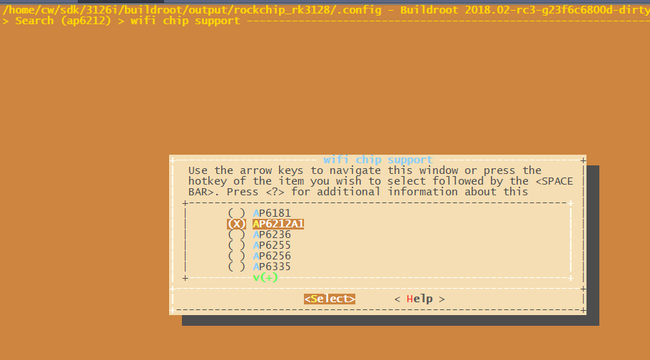
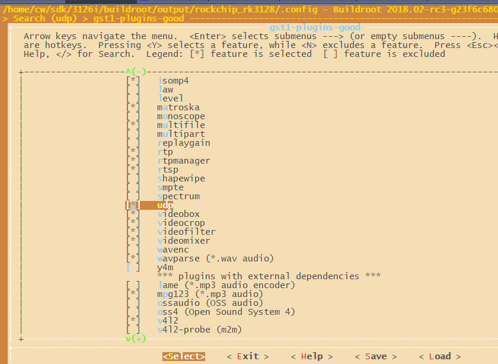
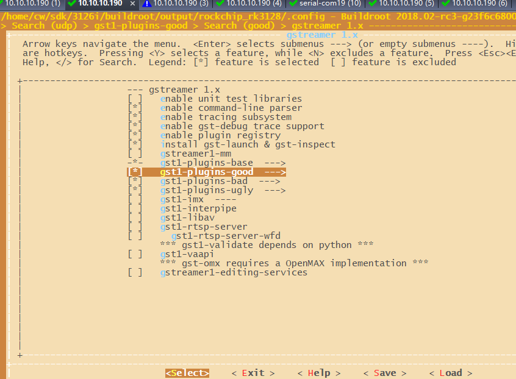
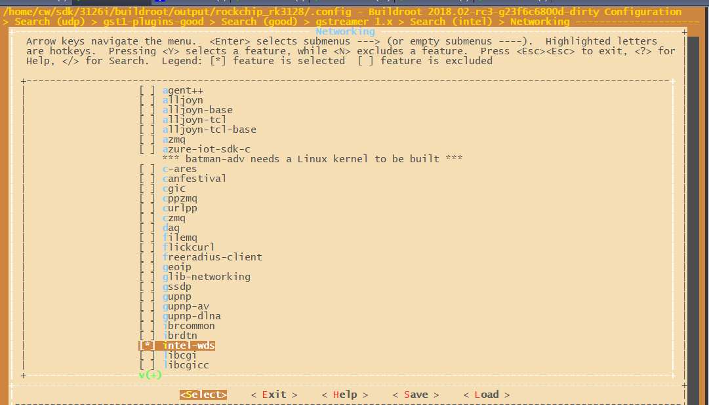
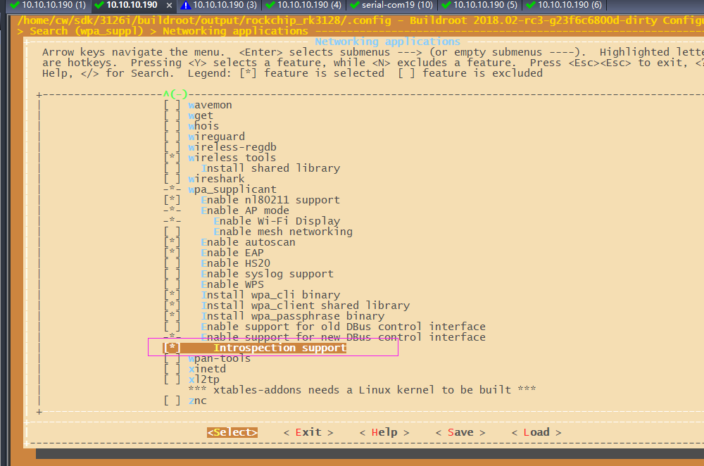
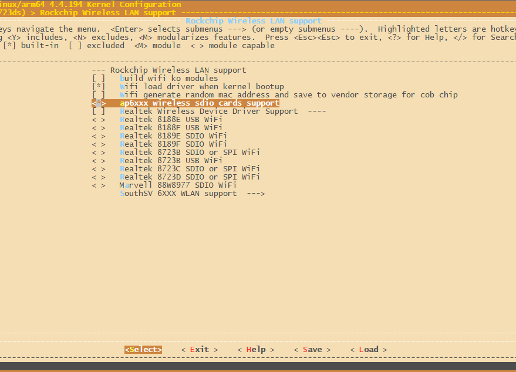

# intel WDS in RockChip 3128 firefly

文件标识： 

发布版本：V1.0.0

日期：2020-02-20

文件密级：□绝密   □秘密   □内部资料   ■公开

------

**免责声明**1

本文档按“现状”提供，福州瑞芯微电子股份有限公司（“本公司”，下同）不对本文档的任何陈述、信息和内容的准确性、可靠性、完整性、适销性、特定目的性和非侵权性提供任何明示或暗示的声明或保证。本文档仅作为使用指导的参考。

由于产品版本升级或其他原因，本文档将可能在未经任何通知的情况下，不定期进行更新或修改。

商标声明

“Rockchip”、“瑞芯微”、“瑞芯”均为本公司的注册商标，归本公司所有。

本文档可能提及的其他所有注册商标或商标，由其各自拥有者所有。

版权所有 © 2020 福州瑞芯微电子股份有限公司

超越合理使用范畴，非经本公司书面许可，任何单位和个人不得擅自摘抄、复制本文档内容的部分或全部，并不得以任何形式传播。

福州瑞芯微电子股份有限公司

Fuzhou Rockchip Electronics Co., Ltd.

地址：     福建省福州市铜盘路软件园A区18号

网址：     www.rock-chips.com

客户服务电话： +86-4007-700-590

客户服务传真： +86-591-83951833

客户服务邮箱： fae@rock-chips.com

------

## **前言**

**概述**

本文旨在介绍Firefly-RK3128的intel WDS配置使用

**产品版本**

| **芯片名称** | **内核版本**     |
| ------------ | ---------------- |
| RK2206       | FreeRTOS V10.0.1 |

**读者对象**

本文档（本指南）主要适用于以下工程师：

1. 技术支持工程师
2. 软件开发工程师

**修订记录**

| **日期**   | **版本** | **作者** | **修改说明**           |
| ---------- | -------- | --------  | ---------------------- |
| 2020-03-12 | V1.0.0   | Conway | 初始版本               |

## **目录**

[TOC]

## **1. INTEL WDS 介绍**

- 开发环境

Firefly-RK3128采用Cortex-A7架构四核1.3GHz处理器，集成Mali-400MP2 GPU，拥有优秀的运算与图形处理能力；
板载千兆以太网口、2.4GHz Wi-Fi和蓝牙4.0，展现出不俗的网络扩展和传输性能，Firefly-RK3128 板载WiFi为 AP6212。

- WDS

WDS是一组库，供希望在linux上构建Wi-Fi显示应用程序的开发人员使用


## 2 Buildroot配置

1. 第一步

```
cw@SYS3:~/sdk/3126i$ source envsetup.sh   选择3128
cw@SYS3:~/sdk/3126i$ make menuconfig      配置见下图
```



该菜单下面，只开AP6212A。可用/搜索AP6212



可用/搜索udp （即）选上



按图中开启gstream，和图中一摸一样即可，特别是BR2_PACKAGE_GST1_PLUGINS_BAD



开启intel-wds



肖垚说的：Introspection support(即 BR2_PACKAGE_WPA_SUPPLICANT_DBUS_INTROSPECTION)开启，这个为解决P2P，但是无效，现在先开着吧


2. 第二步保存并编译

```
cw@SYS3:~/sdk/3126i$ make savedefconfig
cw@SYS3:~/sdk/3126i$ ./build.sh rootfs （或者直接make，等价的）
cw@SYS3:~/sdk/3126i$ ./mkfirmware.sh  （打包固件）
```

3、检查 rockchip_rk3128_defconfig，少的话就手动修改加上去

```
cw@SYS3:~/sdk/3126i/buildroot$ git diff
diff --git a/configs/rockchip_rk3128_defconfig b/configs/rockchip_rk3128_defconfig
index 4232fac868..4ea55ad722 100644
--- a/configs/rockchip_rk3128_defconfig
+++ b/configs/rockchip_rk3128_defconfig
@@ -5,7 +5,9 @@
 #include "display.config"
 #include "video_mpp.config"
 #include "video_gst.config"
+#include "video_gst_rtsp.config"
 #include "audio.config"
+#include "audio_gst.config"
 #include "camera.config"
 #include "camera_gst.config"
 #include "test.config"
@@ -18,6 +20,12 @@
 #include "qt_app.config"
 BR2_TARGET_GENERIC_HOSTNAME="rk3128"
 BR2_TARGET_GENERIC_ISSUE="Welcome to RK3128 Buildroot"
-BR2_PACKAGE_BLUEZ5_UTILS=y
-BR2_PACKAGE_RKWIFIBT_RTL8723DS=y
+BR2_PACKAGE_RKWIFIBT_AP6212A1=y
+BR2_PACKAGE_GST1_PLUGINS_GOOD_PLUGIN_DEINTERLACE=y
+BR2_PACKAGE_QT5BASE_CONCURRENT=y
+BR2_PACKAGE_QT5BASE_DBUS=y
 BR2_PACKAGE_SBC=y
+BR2_PACKAGE_INTEL_WDS=y
+BR2_PACKAGE_LIBBSD=y
+BR2_PACKAGE_LIBICAL=y
+BR2_PACKAGE_WPA_SUPPLICANT_DBUS_INTROSPECTION=y
```

4. 检查模块wpa_supplicant相关配置，下面3项配置检查下，是关的就开起来。

```
buildroot/output/rockchip_rk3128/build/wpa_supplicant-2.6/wpa_supplicant$ vim .config 
349 CONFIG_CTRL_IFACE_DBUS_NEW=y  
488 CONFIG_P2P=y
496 CONFIG_WIFI_DISPLAY=y
```

5、重编译wpa_supplicant

```
cw@SYS3:~/sdk/3126i$ make wpa_supplicant-rebuild
cw@SYS3:~/sdk/3126i$ make 或者  （./build.sh rootfs 实际就是执行）
cw@SYS3:~/sdk/3126i$ ./mkfirmware.sh 
```

7、检查模块connman相关配置，下面3项配置检查下，是关的就开起来。

```shell
cw@SYS3:~/sdk/3126i/buildroot/output/rockchip_rk3128/build/connman-1.35/gsupplicant$ vim supplicant.c 

diff --git a/gsupplicant/supplicant.c b/gsupplicant/supplicant.c
index f56b595..c7dd5b2 100644cd on
--- a/gsupplicant/supplicant.c
+++ b/gsupplicant/supplicant.c
@@ -5433,7 +5433,7 @@ static void interface_p2p_connect_params(DBusMessageIter *iter, void *user_data)
    supplicant_dbus_dict_open(iter, &dict);

    if (data->peer->master)
\-        go_intent = 15;
\+        go_intent = 7;
```

8、重编译connman

```shell
cw@SYS3:~/sdk/3126i$ make connman-rebuild
cw@SYS3:~/sdk/3126i$ make (或者  ./build.sh rootfs其实就是make)
cw@SYS3:~/sdk/3126i$ ./mkfirmware.sh 
```

## 3 kernel配置

第一步：修改设备树：

应为使用RK的SDK，从firefly抄过来的设备树有问题。需要配置一个wifi 32K的引脚到PMU上面。

```shell
w@SYS3:~/sdk/3126i/kernel$ git show
commit 84de4a74ed2b5ac7d41d1f629f4cea97916c9b81 (HEAD -> 39)
Author: chenwei <wei.chen@rock-chips.com>
Date:   Fri Mar 6 18:20:58 2020 +0800

    ARM: dts: rk3128-fireprime: config pmic clock enable Wi-Fi
    
    Change-Id: Icad7c244fd57c9de3943563440e7eef7aed71fa4
    Signed-off-by: chenwei <wei.chen@rock-chips.com>

diff --git a/arch/arm/boot/dts/rk3128-fireprime.dts b/arch/arm/boot/dts/rk3128-fireprime.dts
index 0f54e87689f2..041dd108c0c9 100644
--- a/arch/arm/boot/dts/rk3128-fireprime.dts
+++ b/arch/arm/boot/dts/rk3128-fireprime.dts
@@ -121,6 +121,8 @@
 
        sdio_pwrseq: sdio-pwrseq{
                compatible = "mmc-pwrseq-simple";
+               clocks = <&rk818 1>;
+               clock-names = "ext_clock";
                pinctrl-name = "default";
                pinctrl-0 = <&wifi_enable_h>;
                reset-gpios = <&gpio1 RK_PB3 GPIO_ACTIVE_LOW>;
@@ -617,8 +619,8 @@
 };
 
 &sdio {
-       clock-frequency = <50000000>;
-       clock-freq-min-max = <200000 50000000>;
+       clock-frequency = <20000000>;
+       clock-freq-min-max = <200000 20000000>;
        supports-sdio;
        disable-wp;
        cap-sd-highspeed;

```

第二步： 修改vop寄存器驱动（补丁 https://10.10.10.29/c/rk/kernel/+/96675）

```shell
cw@SYS3:~/sdk/3126i/kernel$ git diff
diff --git a/drivers/gpu/drm/rockchip/rockchip_vop_reg.c b/drivers/gpu/drm/rockchip/rockchip_vop_reg.c
index 6fb3c0f63b71..83adba87f35c 100644
--- a/drivers/gpu/drm/rockchip/rockchip_vop_reg.c
+++ b/drivers/gpu/drm/rockchip/rockchip_vop_reg.c
@@ -1439,9 +1439,9 @@ static const struct vop_win_phy rk3126_win1_data = {
 
 static const struct vop_win_data rk3126_vop_win_data[] = {
        { .base = 0x00, .phy = &rk3036_win0_data,
-         .type = DRM_PLANE_TYPE_PRIMARY },
+         .type = DRM_PLANE_TYPE_OVERLAY },
        { .base = 0x00, .phy = &rk3126_win1_data,
-         .type = DRM_PLANE_TYPE_CURSOR },
+         .type = DRM_PLANE_TYPE_PRIMARY },
 };
```

第二步：开启wifi并编译

```
cw@SYS3:~/sdk/312/kernel$make  ARCH=arm rockchip_linux_defconfig  
cw@SYS3:~/sdk/3328/kernel$make menuconfig ARCH=arm

注意kernel对于32位，make menuconfig和make savedefconfig都必须加上ARCH=arm，
menuconfig配置后save在拷贝到arch/arm/configs/rockchip_linux_defconfig。 
不加 ARCH=arm的话，默认是64位，这时候，这时候你git diff下发现rockchip_linux_defconfig会有很大的改动。加 ARCH=arm的话，就是32位机器，你git diff下发现rockchip_linux_defconfig就是刚才menuconfig的那些修改。你看下下面文件搜索就会明白
cw@SYS3:~/sdk/3126i/kernel$ ag -g "rockchip_linux_defconfig"
arch/arm/configs/rockchip_linux_defconfig
arch/arm64/configs/rockchip_linux_defconfig
```



```
如图所示，注意是bootup选项，意思是开机启动AP6XX驱动加载进内核，支持ap6x型号Wi-Fi

cw@SYS3:~/sdk/3126i/kernel$ make savedefconfig  ARCH=arm          
scripts/kconfig/conf  --savedefconfig=defconfig Kconfig

cw@SYS3:~/sdk/3126i/kernel$ cp defconfig arch/arm/configs/rockchip_linux_defconfig

#为
```

## 4 开发板操作

### 4.1 测试程序介绍

编译后intel-wds自动生成sink-test，并复制到开发板的usr/bin/目录下。

 ### 4.2 测试步骤

开发板连接hdmi显示器，开机后开一个串口界面一个adb界面

1、 开发板开机后kill 杀掉两个进程（如果有）： wpa_supplicant和weston。

```
  542 root     44912 S    weston --tty=2 --idle-time=0
  656 root      5880 S    wpa_supplicant -B -i wlan0 -c /userdata/cfg/wpa_supp
[root@rk3128:/]# kill 两个进程号
```

2、insmod /bcmdhd.ko（insmod system/lib/modules/bcmdhd.ko ）  （按本教程，不需要执行）

如果WI-Fi 加载到内核的，这一步“模块加载”的操作就不需要 ，不然就会报错一下错误，说符号重复
如下

```
[root@rk3128:/]# insmod /bcmdhd.ko（insmod system/lib/modules/bcmdhd.ko ） 
[root@rk3128:/]# insmod system/lib/modules/bcmdhd.ko
[   27.577071] bcmdhd: exports duplicate symbol bcmsdh_cfg_read (owned by kernel)
[   27.738885] bcmdhd: exports duplicate symbol bcmsdh_cfg_read (owned by kernel)
insmod: can't insert 'system/lib/modules/bcmdhd.ko': invalid module format
```

3、wpa_supplicant -u&
4、connmand
5、执行connmanctl，在交互命令依次执行

```
enable wifi 
enable p2p
agent on
```

6、ADB界面

```
[root@rk3128:/usr/bin]# export GST_DEBUG=3
[root@rk3128:/usr/bin]# ./sink-test
Rga built version:version:+2017-09-28 10:12:42 
- Registering Wifi Display with IE 00000600111C440032
Warning: P2P not found in Connman technologies.（这个只有第一次烧录才不会有，重启就会这种问题)
Received unknown command: 
Received unknown command: 
```

7、手机上打开无线显示，可以搜到ConnMan设备，点击连接
 串口界面，会显示一个确认连接的yes/no,所以输入yes，有些手机还会弹出来一个窗口，问确定与否。


## 5 错误

### 5.1 错误 No space left on device (28)

```
18:audioringbuffer_thread_func:<alsasink0> failed to set thread priority
0:00:21.678011844   695  0x16262f0 WARN            kmsallocator gstkmsallocator.c:555:gst_kms_allocator_dmabuf_import:<KMSMemory::allocator> Failed to close GEM handle: Invalid argument 22
0:00:21.679143802   695  0x16262f0 WARN                 kmssink gstkmssink.c:1427:gst_kms_sink_sync:<kmssink0> drmModePageFlip failed: No space left on device (28)
0:00:21.756511302   695 0xb53061b0 ERROR            mppvideodec gstmppvideodec.c:707:gst_mpp_video_dec_handle_frame:<mppvideodec0> can't process this frame
0:00:21.758654469   695  0x1673860 WARN                 basesrc gstbasesrc.c:3055:gst_base_src_loop:<source> error: Internal data stream error.
0:00:21.758767927   695  0x1673860 WARN                 basesrc gstbasesrc.c:3055:gst_base_src_loop:<source> error: streaming stopped, reason error (-5)

```

这个错误No space left on device (28)说设备没内错了，解决就是第三章上面那个kernel下面的gpu补丁，需要设置overlay

### 5.2 错误Failed to send Action Frame(retry 6

```shell
问题：
[  166.361139] CFG80211-ERROR) wl_cfg80211_send_action_frame : Failed to send Action Frame(retry 6)有的

解决:
connman$ git diff .
diff --git a/gsupplicant/supplicant.c b/gsupplicant/supplicant.c
index f56b595..c7dd5b2 100644
--- a/gsupplicant/supplicant.c
+++ b/gsupplicant/supplicant.c
@@ -5433,7 +5433,7 @@ static void interface_p2p_connect_params(DBusMessageIter *iter, void *user_data)
        supplicant_dbus_dict_open(iter, &dict);
 
        if (data->peer->master)
-               go_intent = 15;
+               go_intent = 7;


```

### 5.3 check your GStreamer installation.

```
问题：

** (sink-test:1046): WARNING **: [gst-core-error-quark] Missing element 'deinterlace' - check your GStreamer installation.

** (sink-test:1046): WARNING **: [gst-core-error-quark] Missing element 'deinterlace' - check your GStreamer installation.

解决 buildroot 下面开启这个 BR2_PACKAGE_GST1_PLUGINS_GOOD_PLUGIN_UDP
```

### 5.3 p2p 报错Method "SetProperty" with signature "sv" on interface "net.connman.Technology" doesn't exist

P2P报错，第一次烧写rootfs不会有这个问题，复位后都会出现这个问题。cw@SYS3:~/sdk/3126i/buildroot/output/rockchip_rk3128/build/connman-1.35$ cd -

```

P2P报错，这个问题，只要断电第一次开机就不会有，复位后都会出现这个问题
20200310_16：20:47Error wifi: Already enabled
20200310_16：20:50connmanctl> enable p2p
20200310_16：20:50Error p2p: Method "SetProperty" with signature "sv" on interface "net.connman.Technology" doesn't exist
20200310_16：20:54connmanctl> agent on
```

## 6 依赖和功能实现

 WDS即linux上wifi投屏显示。WDS 依赖很少，主要是GStreamer 和GLib。但是为了确WIFI功能ok，你还要安装wpa_supplicant、connman

相关代码

​    buildroot/output/rockchip_rk3128/build/intel-wds-ece955a9947e8d5848223c849d2c0f3f928078d4/

- *sink：*Wi-Fi显示槽，依赖gStreer、Connman和glib主回路。
- *source：*Wi-Fi显示源，依赖gStreer、Connman和glib主循环。

WDS软件架构

- libwds：主库实现了RTSP的Wi-Fi显示方言，包括解析器、接收器和源的实际协商逻辑以及相关的数据结构。它不与任何特定的连接管理器、媒体框架或主循环相关联。此库还与MSVC兼容。
- 网络：支持与glib主循环和gflow的集成。
- P2P：支持与Connman Wifi P2P功能的集成

确保wifi正常相关

- WIFI适配器使用 Intel 7260-family 或Atheros ath9k，在其他的适配器可能有p2p问题

- [wpa_supplicant](http://w1.fi/wpa_supplicant/): 版本2.4后，开启	

  `CONFIG_P2P=y`

  `CONFIG_WIFI_DISPLAY=y` 

   `CONFIG_CTRL_IFACE_DBUS_NEW=y`

- [connman](https://01.org/connman): 版本1.28 以后

- gstreamer: either master branch more recent than Feb 3rd 2015 (commit d0a50be2), or 1.4 branch more recent than Feb 3rd 2005 (commit 1ce3260a638d or release 1.4.6 or later).

  


##  7其他概念

依赖

ConnMan(Connection Manager)是一个开源项目，在Linux操作系统中提供一个后台进程，来管理网络连接。ConnMan设计小巧，并且尽可能的减小资源消耗，因此他能很容易的集成进其他平台。


## 8 同类竞品

 电视果3除了支持AirPlay、DLNA还支持win10系统的无线显示功能 


DNLA，Digital Living Network Alliance，是索尼、英特尔、微软等发起的一套 PC、移动设备、消费电器之间互联互通的协议。 

DLNA与苹果的AirPlay功能比较类似，协议也大体相同，他们都可以让你手机中的媒体内容投放到电视屏幕里。不同的是手机上的DLNA 并没有类似Apple TV的AirPlay的镜像功能，也没有Apple TV 所支持的双屏体游戏体验。目前DLNA更多只是能将手机的照片和视频投送到大屏幕中。

另外，在线视频也可以用DLNA模式推送到客厅电视上显示，安卓系统部分播放器就具备DLNA功能，目前支持无线推送的视频客户端有以下：腾讯视频、搜狐视频、PPTV视频。可以将原来应该在N7屏幕的影片转移到电视屏幕上。前提是你要有能支持DLNA的电视或者电视盒。

 

要点：依赖和功能在第6章

硬件：电视果3等

功能 ：同类用的AirPlay、DLNA

改进：改进就是gstream优化吧，资料比较少


## 10其他笔记垃圾

6、手机上打开无线显示，可以搜到ConnMan设备，点击连接
7、连接失败，串口看到报错：
[ 167.877065] CFG80211-ERROR) wl_cfg80211_send_action_frame : Failed to send Acti
on Frame(retry 6)

 

如果wifi是加载进内核和模块加载的

```
[root@rk3128:/]# cd /system/lib/modules/
[root@rk3128:/system/lib/modules]# ls
bcmdhd.ko
[root@rk3128:/system/lib/modules]# ./bcmdhd.ko 
-/bin/sh: ./bcmdhd.ko: Permission denied
[root@rk3128:/system/lib/modules]# 
[root@rk3128:/system/lib/modules]# chmod 777 bcmdhd.ko 
[root@rk3128:/system/lib/modules]# ./bcmdhd.ko .ko
内核加载模块时提示usb_common: exports duplicate symbol of_usb_get_dr_mode
1.分析:
既然符号重复了，那么说明有一个部分既被编译到内核中也被编译成模块了，因此在加载模块时，内核报符号重复的提示

2.解决
直接配置内核的某一部分编译成模块，例如笔者就直接将USB这一部分编译成模块即可
```

wifi相关：

```
ps删除wpa
ifconfig   看不到wlan0设备
echo 1 > sys/class/rfkill/rfkill1/state     
ifconfig wlan0 up
ps
wpa_supplicant -B -i wlan0 -c /data/cfg/wpa_supplicant.conf
wpa_cli -i wlan0 -p /var/run/wpa_supplicant scan
wpa_cli -i wlan0 -p /var/run/wpa_supplicant scan_results
```

```
#TARGET_BOARD=rk3128
#OUTPUT_DIR=output/rockchip_rk3128
#CONFIG=rockchip_rk3128_defconfig
```

```
network={
  ssid="aaabbb"
  psk="a123456789"
  key_mgmt=WPA-PSK
}
```

```
cw@SYS3:~/sdk/3126i/buildroot/output/rockchip_rk3128/build$ cd g
glibc-2.29-11-ge28ad442e73b00ae2047d89c8cc7f9b2a0de5436/ gst1-plugins-base-1.14.4/
glmark2-9b1070fe9c5cf908f323909d3c8cbed08022abe8/        gst1-plugins-good-1.14.4/
glmarktest-0.1/                                          gst1-plugins-ugly-1.14.4/
gst1-plugins-bad-1.14.4/                                 
cw@SYS3:~/sdk/3126i/buildroot/output/rockchip_rk3128/build$ rm -rf  gst1*
```

```
cw@SYS3:~/sdk/3126i/buildroot/output/rockchip_rk3128/build/intel-wds-ece955a9947e8d5848223c849d2c0f3f928078d4/sink$ ls
CMakeFiles           CMakeLists.txt       gst_sink_media_manager.cpp  main.cpp  sink-app.cpp  sink.cpp  sink-test
cmake_install.cmake  CTestTestfile.cmake  gst_sink_media_manager.h    Makefile  sink-app.h    sink.h


adb push D:\ADBplatform-tools\sink-test /
chmod 777 sink-test
./sink-test


```

关于buildroot下面如何打补丁

```
cw@SYS3:~/sdk/3126i/buildroot/package/connman ls
0001-tethering-Reorder-header-includes.patch  0002-nat-build-failure.patch  Config.in  connman.hash  connman.mk  S45connman
```

###  开发板执行测试程序

-  方法一：复制到开发板target根目录，重新烧写rootfs

```
cw@SYS3:~/sdk/3126i/buildroot/output/rockchip_rk3128$ ag -g "sink-test"
build/intel-wds-ece955a9947e8d5848223c849d2c0f3f928078d4/sink/sink-test

cw@SYS3:~/sdk/3126i/buildroot/output/rockchip_rk3128$cp build/intel-wds-ece955a9947e8d5848223c849d2c0f3f928078d4/sink/sink-test target/

cw@SYS3:~/sdk/3126i$  make
cw@SYS3:~/sdk/3126i$  ./mkfirmware.sh
```

