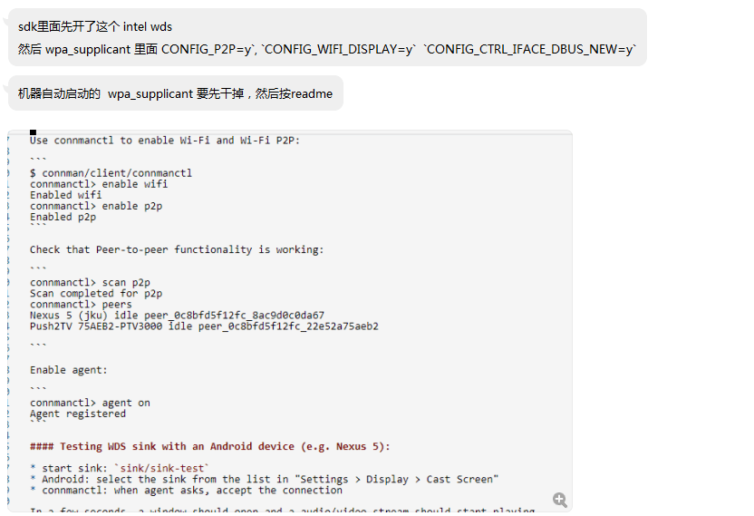

# intel wds

文件标识： 

发布版本：V1.0.0

日期：2020-02-20

文件密级：□绝密   □秘密   □内部资料   ■公开

------

**免责声明**

本文档按“现状”提供，福州瑞芯微电子股份有限公司（“本公司”，下同）不对本文档的任何陈述、信息和内容的准确性、可靠性、完整性、适销性、特定目的性和非侵权性提供任何明示或暗示的声明或保证。本文档仅作为使用指导的参考。

由于产品版本升级或其他原因，本文档将可能在未经任何通知的情况下，不定期进行更新或修改。

商标声明

“Rockchip”、“瑞芯微”、“瑞芯”均为本公司的注册商标，归本公司所有。

本文档可能提及的其他所有注册商标或商标，由其各自拥有者所有。

版权所有 © 2020 福州瑞芯微电子股份有限公司

超越合理使用范畴，非经本公司书面许可，任何单位和个人不得擅自摘抄、复制本文档内容的部分或全部，并不得以任何形式传播。

福州瑞芯微电子股份有限公司

Fuzhou Rockchip Electronics Co., Ltd.

地址：     福建省福州市铜盘路软件园A区18号

网址：     www.rock-chips.com

客户服务电话： +86-4007-700-590

客户服务传真： +86-591-83951833

客户服务邮箱： fae@rock-chips.com

------

## **前言**

**概述**

本文旨在介绍mbed TLS部分算法使用示例，详情请参考官网[mbed TLS](https://tls.mbed.org)。

**产品版本**

| **芯片名称** | **内核版本**     |
| ------------ | ---------------- |
| RK2206       | FreeRTOS V10.0.1 |

**读者对象**

本文档（本指南）主要适用于以下工程师：

1. 技术支持工程师
2. 软件开发工程师

**修订记录**

| **日期**   | **版本** | **作者** | **修改说明**           |
| ---------- | -------- | --------  | ---------------------- |
| 2020-02-20 | V1.0.0   | Conway Chen | 初始版本               |

## **目录**

[TOC]

### **1. intelwds 介绍**



杨汉兴  2020/2/21 15:04:09
这个intel wds在3126跑起来

杨汉兴  2020/2/21 15:04:41
开机后:
1、insmod /bcmdhd.ko（insmod system/lib/modules/bcmdhd.ko ）
2、wpa_supplicant -u&
3、connmand
4、执行connmanctl，在交互命令依次执行
enable wifi 会有一大堆
enable p2p
agent on
5、ctrl+c 退出，执行./sink-test

```
cw@SYS3:~/sdk/3126i/buildroot/output/rockchip_rk3128/build/intel-wds-ece955a9947e8d5848223c849d2c0f3f928078d4/sink$ ls
CMakeFiles           CMakeLists.txt       gst_sink_media_manager.cpp  main.cpp  sink-app.cpp  sink.cpp  sink-test
cmake_install.cmake  CTestTestfile.cmake  gst_sink_media_manager.h    Makefile  sink-app.h    sink.h


adb push D:\ADBplatform-tools\sink-test /

chmod 777 sink-test
./sink-test
```


6、手机上打开无线显示，可以搜到ConnMan设备，点击连接
7、连接失败，串口看到报错：
[ 167.877065] CFG80211-ERROR) wl_cfg80211_send_action_frame : Failed to send Acti
on Frame(retry 6)

Ebook-陈渐飞 2020/2/17 18:11:17
xiaoyao(1005727889) 12/12 星期四 10:55:56
connman$ git diff .
diff --git a/gsupplicant/supplicant.c b/gsupplicant/supplicant.c
index f56b595..c7dd5b2 100644
--- a/gsupplicant/supplicant.c
+++ b/gsupplicant/supplicant.c
@@ -5433,7 +5433,7 @@ static void interface_p2p_connect_params(DBusMessageIter *iter, void *user_data)
    supplicant_dbus_dict_open(iter, &dict);

​    if (data->peer->master)
\-        go_intent = 15;
\+        go_intent = 7;
2020/2/17 18:15:38
Ebook-陈渐飞 2020/2/17 18:15:38

BR2_PACKAGE_CONNMAN=y
BR2_PACKAGE_CONNMAN_ETHERNET=y
BR2_PACKAGE_CONNMAN_WIFI=y
\# BR2_PACKAGE_CONNMAN_WISPR is not set
\# BR2_PACKAGE_CONNMAN_BLUETOOTH is not set
\# BR2_PACKAGE_CONNMAN_LOOPBACK is not set
\# BR2_PACKAGE_CONNMAN_NEARD is not set
\# BR2_PACKAGE_CONNMAN_OFONO is not set
BR2_PACKAGE_CONNMAN_DEBUG=y
BR2_PACKAGE_CONNMAN_CLIENT=y

Ebook-陈渐飞 2020/2/17 18:15:48

BR2_PACKAGE_WPA_SUPPLICANT=y
BR2_PACKAGE_WPA_SUPPLICANT_NL80211=y
BR2_PACKAGE_WPA_SUPPLICANT_AP_SUPPORT=y
BR2_PACKAGE_WPA_SUPPLICANT_WIFI_DISPLAY=y
\# BR2_PACKAGE_WPA_SUPPLICANT_MESH_NETWORKING is not set
BR2_PACKAGE_WPA_SUPPLICANT_AUTOSCAN=y
BR2_PACKAGE_WPA_SUPPLICANT_EAP=y
\# BR2_PACKAGE_WPA_SUPPLICANT_HOTSPOT is not set
\# BR2_PACKAGE_WPA_SUPPLICANT_DEBUG_SYSLOG is not set
\# BR2_PACKAGE_WPA_SUPPLICANT_WPS is not set
BR2_PACKAGE_WPA_SUPPLICANT_CLI=y
BR2_PACKAGE_WPA_SUPPLICANT_WPA_CLIENT_SO=y
BR2_PACKAGE_WPA_SUPPLICANT_PASSPHRASE=y
\# BR2_PACKAGE_WPA_SUPPLICANT_DBUS_OLD is not set
BR2_PACKAGE_WPA_SUPPLICANT_DBUS_NEW=y

Ebook-陈渐飞 2020/2/17 18:15:55

BR2_PACKAGE_INTEL_WDS=y

Ebook-陈渐飞 2020/2/17 18:16:24
开机后:
1、insmod /bcmdhd.ko
2、wpa_supplicant -u&
3、connmand
4、执行connmanctl，在交互命令依次执行
enable wifi
enable p2p
agent on
5、另开终端，执行sink-test 
6、手机上打开无线显示，可以搜到ConnMan设备，点击连接


```
[root@rk3128:/]# cd /system/lib/modules/
[root@rk3128:/system/lib/modules]# ls
bcmdhd.ko
[root@rk3128:/system/lib/modules]# ./bcmdhd.ko 
-/bin/sh: ./bcmdhd.ko: Permission denied
[root@rk3128:/system/lib/modules]# 
[root@rk3128:/system/lib/modules]# chmod 777 bcmdhd.ko 
[root@rk3128:/system/lib/modules]# ./bcmdhd.ko .ko
```

[root@rk3128:/]# 
[root@rk3128:/]# insmod system/lib/modules/bcmdhd.ko
[   27.577071] bcmdhd: exports duplicate symbol bcmsdh_cfg_read (owned by kernel)
[   27.738885] bcmdhd: exports duplicate symbol bcmsdh_cfg_read (owned by kernel)
insmod: can't insert 'system/lib/modules/bcmdhd.ko': invalid module format

查看网上

```
内核加载模块时提示usb_common: exports duplicate symbol of_usb_get_dr_mode
1.分析:
既然符号重复了，那么说明有一个部分既被编译到内核中也被编译成模块了，因此在加载模块时，内核报符号重复的提示

2.解决
直接配置内核的某一部分编译成模块，例如笔者就直接将USB这一部分编译成模块即可
```


```
D:\ADBplatform-tools 的目录

2020/03/09  11:26    <DIR>          .
2020/03/09  11:26    <DIR>          ..
2016/12/13  15:25         1,489,920 adb.exe
2016/12/13  15:25            97,792 AdbWinApi.dll
2016/12/13  15:25            62,976 AdbWinUsbApi.dll
2020/03/09  11:25           924,060 sink-test
               4 个文件      2,574,748 字节
               2 个目录 732,702,875,648 可用字节


D:\ADBplatform-tools>
D:\ADBplatform-tools>
D:\ADBplatform-tools>adb push D:\ADBplatform-tools\sink-test /
[100%] /mnt/sink-test
```


```
ifconfig
echo 1 > sys/class/rfkill/rfkill1/state
ifconfig wlan0 up
ps
wpa_supplicant -B -i wlan0 -c /data/cfg/wpa_supplicant.conf
wpa_cli -i wlan0 -p /var/run/wpa_supplicant scan
wpa_cli -i wlan0 -p /var/run/wpa_supplicant scan_results
```

```
#TARGET_BOARD=rk3128
#OUTPUT_DIR=output/rockchip_rk3128
#CONFIG=rockchip_rk3128_defconfig
```


```
network={
  ssid="aaabbb"
  psk="a123456789"
  key_mgmt=WPA-PSK
}
```


```
cw@SYS3:~/sdk/3126i/buildroot/output/rockchip_rk3128/build$ cd g
glibc-2.29-11-ge28ad442e73b00ae2047d89c8cc7f9b2a0de5436/ gst1-plugins-base-1.14.4/
glmark2-9b1070fe9c5cf908f323909d3c8cbed08022abe8/        gst1-plugins-good-1.14.4/
glmarktest-0.1/                                          gst1-plugins-ugly-1.14.4/
gst1-plugins-bad-1.14.4/                                 
cw@SYS3:~/sdk/3126i/buildroot/output/rockchip_rk3128/build$ rm -rf  gst1*
```

