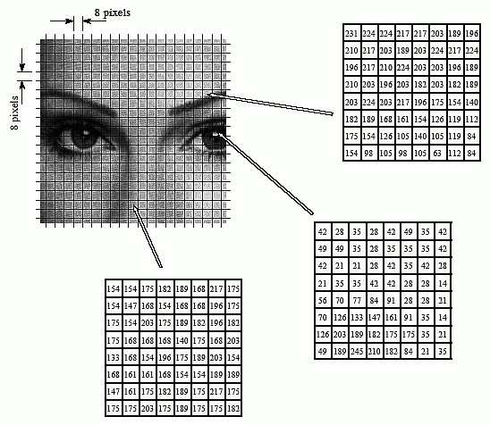
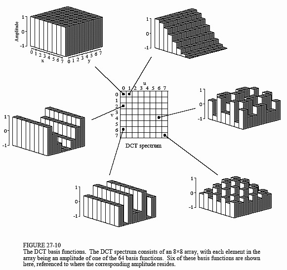
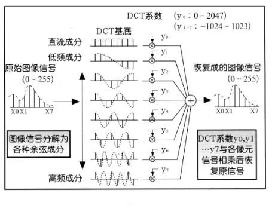
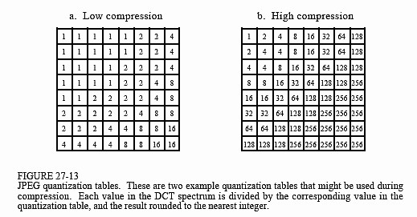
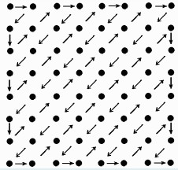
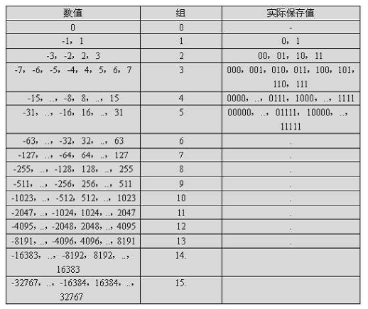

**jpeg介绍**

JPEG 是 Joint Photographic Exports Group 的英文缩写，中文称之为联合图像专家小组。

JPEG算法压缩出来的静态图片文件称为JPEG文件，扩展名通常为*.jpg、*.jpe*.jpeg

**JPEG 专家组开发了两种基本的压缩算法、两种熵编码方法、四种编码模式。**

```
压缩算法：有损的离散余弦变换（Discrete Cosine Transform，DCT）；无损的预测技术压缩
数据编码方法：哈夫曼编码；算术编码；
编码模式：
基于DCT顺序模式：编/解码通过一次扫描完成；
基于DCT递进模式：编/解码需要多次扫描完成，扫描效果从粗糙到精细，逐级递进；
无损模式：基于DPCM，保证解码后完全精确恢复到原图像采样值；
层次模式：图像在多个空间多种分辨率进行编码，可以根据需要只对低分辨率数据作解码，放弃高分辨率信息。
```

**JPEG压缩编码算法的主要计算步骤如下：**

```
(0) 8*8分块。
(1) 正向离散余弦变换(FDCT)。
(2) 量化(quantization)。
(3) Z字形编码(zigzag scan)。
(4) 使用差分脉冲编码调制(DPCM)对直流系数(DC)进行编码。
(5) 使用行程长度编码(RLE)对交流系数(AC)进行编码。
(6) 熵编码。

1、一张图片，切割为8*8像素的小块，

dtc（压缩第一遍）
每个块是DTC变换的输入，（DTC变换：离散余弦变换，是数字处理方法，核心是余弦函数。图片是二维空间，DTC把二位空间映射到 频率域进行计算，通过频率域的统计特性，损失高频系数，对余下系数进行量化。
这样低频部分在8*8图像的左上角，高频部分在8*8图片部分的右下角。这样有个前提，就是低频部分比高频部分重要的多，损失一点不影响全局，  DTC减少图片的亮度、层次，达到数据压缩的目的。），这时候输出一张处理过的图片。

量化（压缩第二遍）
这样开始量化，量化就是用像素值÷量化表对应值所得的结果。（量化表是是压缩图片时候使用，每个DTC的块，会没量化表除）量化表左上角值较小，右上角值较大，这样保持低频分量、抑制高频分量。YUV是y是亮度、uv代表了色差。


编码
分为两类：
1、DC（直流分量）
2、交流(AC)系数，采用行程编码（游程编码Run-length encode,RLE）。
我们得到了DC码字和AC行程码字

编码格式：（压缩）
用哈夫曼熵编码，节省比特位。

```


1. JPEG压缩的编解码互逆过程：

- 编码


- 解码


2. 具体过程：（这里仅以编码为例，解码过程为其逆过程）   

  A. 将原始图像分为8*8的小块, 每个block里有64pixels：

将图像中每个8*8的block进行DCT变换：
 B. 将图像中每个8*8的block进行DCT变换：
数据压缩中有很多变换，比如KLT（Karhunen-Loeve Transform），这里我们用的是DCT离散余弦变换。和FFT一样，DCT也是将信号从时域到频域的变换，不同的是DCT中变换结果没有复数，全是实数。每8*8个original pixels都变成了另外8*8个数字，变换后的每一个数都是由original 64 data通过basis function组合而得的，如下图所示为DCT谱中6个元素的由来。


将低频部分集中在每个8*8块的左上角，高频部分在右下角，所谓JPEG的有损压缩，损的是量化过程中的高频部分。为什么呢？因为有这样一个前提：低频部分比高频部分要重要得多，romove 50%的高频信息可能对于编码信息只损失了5%。

- [ ] 


 C. 量化：

所谓量化就是用像素值÷量化表对应值所得的结果。由于量化表左上角的值较小，右上角的值较大，这样就起到了保持低频分量，抑制高频分量的目的。JPEG使用的颜色是YUV格式。我们提到过，Y分量代表了亮度信息，UV分量代表了色差信息。相比而言，Y分量更重要一些。我们可以对Y采用细量化，对UV采用粗量化，可进一步提高压缩比。所以上面所说的量化表通常有两张，一张是针对Y的；一张是针对UV的。



通过量化可以reducing the number of bits and eliminating some of the components，达到通低频减高频的效果，如下图所示就是两张量化表的例子. 

  D. 编码分类：

编码信息分两类，一类是每个8*8格子F中的[0,0]位置上元素，这是**DC**（直流分量），代表8*8个子块的平均值，JPEG中对F[0,0]单独编码，由于两个相邻的8×8子块的DC系数相差很小，所以对它们采用[差分编码DPCM](http://en.wikipedia.org/wiki/Delta_encoding)，可以提高压缩比，也就是说对相邻的子块DC系数的差值进行编码。

另一类是8×8块的其它63个子块，即交流(**AC**)系数，采用[行程编码（游程编码Run-length encode,RLE）](http://en.wikipedia.org/wiki/Run-length_encoding)。这里出现一个问题：这63个系数应该按照怎么样的顺序排列？为了保证低频分量先出现，高频分量后出现，以增加行程中连续“0”的个数，这63个元素采用了“之”字型(***\*Zig-Zag\****)的**排列方法**，如下图所示。




E. 编码格式：

上面，我们得到了DC码字和AC行程码字。为了进一步提高压缩比，需要对RLE编码结果再进行熵编码，这里选用Huffman编码。

1）DC系数的差分脉冲调制编码

​    8*8的图像块经过DCT变换之后得到的DC系数有两个特点：

（1）系数的数值比较大；

（2）相邻的8*8图像块的DC系数值变化不大；

根据这两个特点，DC系数一般采用差分脉冲调制编码DPCM（Difference Pulse Code Modulation），即：取同一个图像分量中每个DC值与前一个DC值的差值来进行编码。对差值进行编码所需要的位数会比对原值进行编码所需要的位数少了很多。假设某一个8*8图像块的DC系数值为15，而上一个8*8图像块的DC系数为12，则两者之间的差值为3。

2）DC系数的中间格式计算

​    JPEG中为了更进一步节约空间，并不直接保存数据的具体数值，而是将数据按照位数分为16组，保存在表里面。这也就是所谓的变长整数编码VLI。即，第0组中保存的编码位数为0，其编码所代表的数字为0；第1组中保存的编码位数为1，编码所代表的数字为-1或者1......，如下面的表格所示，这里，暂且称其为VLI编码表：

 

前面提到的那个DC差值为3的数据，通过查找VLI可以发现，整数3位于VLI表格的第2组，因此，可以写成（2）（3）的形式，该形式，称之为DC系数的中间格式。

3）AC系数的行程长度编码(RLC)

​    量化之后的AC系数的特点是，63个系数中含有很多值为0的系数。因此，可以采用行程编码RLC（Run Length Coding）来更进一步降低数据的传输量。利用该编码方式，可以将一个字符串中重复出现的连续字符用两个字节来代替，其中，第一个字节代表重复的次数，第二个字节代表被重复的字符串。例如，（4,6）就代表字符串“6666”。但是，在JPEG编码中，RLC的含义就同其原有的意义略有不同。在JPEG编码中，假设RLC编码之后得到了一个（M,N）的数据对，其中M是两个非零AC系数之间连续的0的个数（即，行程长度），N是下一个非零的AC系数的值。采用这样的方式进行表示，是因为AC系数当中有大量的0，而采用Zigzag扫描也会使得AC系数中有很多连续的0的存在，如此一来，便非常适合于用RLC进行编码。

例如，现有一个字符串，如下所示：

57,45,0,0,0,0,23,0,-30,-8,0,0,1,000.....

经过RLC之后，将呈现出以下的形式：

(0,57) ; (0,45) ; (4,23) ; (1,-30) ; (0,-8) ; (2,1) ; (0,0)

注意，如果AC系数之间连续0的个数超过16，则用一个扩展字节(15,0)来表示16连续的0。

4）AC系数的中间格式

​    根据前面提到的VLI表格，对于前面的字符串：

  (0,57) ; (0,45) ; (4,23) ; (1,-30) ; (0,-8) ; (2,1) ; (0,0)

只处理每对数右边的那个数据，对其进行VLI编码: 查找上面的VLI编码表格，可以发现，57在第6组当中，因此，可以将其写成(0,6),57的形式，该形式，称之为AC系数的中间格式。

同样的(0,45)的中间格式为：(0,6),45；

 (1,-30)的中间格式为：(1,5),-30；

 

5）熵编码

​    在得到DC系数的中间格式和AC系数的中间格式之后，为进一步压缩图象数据，有必要对两者进行熵编码。JPEG标准具体规定了两种熵编码方式：Huffman编码和算术编码。JPEG基本系统规定采用Huffman编码（因为不存在专利问题），但JPEG标准并没有限制JPEG算法必须用Huffman编码方式或者算术编码方式。

下面为AC系数的Huffman表。

| **run/size value (RSV)** | **VLC length** | **Variable-length Code (VLC)** | **run/size value (RSV)** | **VLC length** | **Variable-length Code (VLC)** |
| ------------------------ | -------------- | ------------------------------ | ------------------------ | -------------- | ------------------------------ |
| 0/1                      | 2              | 00                             | 3/2                      | 9              | 111110111                      |
| 0/2                      | 2              | 01                             | 8/1                      | 9              | 111111000                      |
| 0/3                      | 3              | 100                            | 9/1                      | 9              | 111111001                      |
| 0/0                      | 4              | 1010                           | A/1                      | 9              | 111111010                      |
| 0/4                      | 4              | 1011                           | 0/8                      | 10             | 1111110110                     |
| 1/1                      | 4              | 1100                           | 2/3                      | 10             | 1111110111                     |
| 0/5                      | 5              | 11010                          | 4/2                      | 10             | 1111111000                     |
| 1/2                      | 5              | 11011                          | B/1                      | 10             | 1111111001                     |
| 2/1                      | 5              | 11100                          | C/1                      | 10             | 1111111010                     |
| 3/1                      | 6              | 111010                         | 1/5                      | 11             | 11111110110                    |
| 4/1                      | 6              | 111011                         | 5/2                      | 11             | 11111110111                    |
| 0/6                      | 7              | 1111000                        | D/1                      | 11             | 11111111000                    |
| 1/3                      | 7              | 1111001                        | F/0                      | 11             | 11111111001                    |
| 5/1                      | 7              | 1111010                        | 2/4                      | 12             | 111111110100                   |
| 6/1                      | 7              | 1111011                        | 3/3                      | 12             | 111111110101                   |
| 0/7                      | 8              | 11111000                       | 6/2                      | 12             | 111111110110                   |
| 2/2                      | 8              | 11111001                       | 7/2                      | 12             | 111111110111                   |
| 7/1                      | 8              | 11111010                       | 8/2                      | 15             | 111111111000000                |
| 1/4                      | 9              | 111110110                      | the rest 125 VLCs        | 16             | ···                            |

下面我们举例来说明8*8图像子块经过DCT及量化之后的处理过程：

假设一个图像块经过量化以后得到以下的系数矩阵：

15 0 -1 0 0 0 0 0
-2 -1 0 0 0 0 0 0
-1 -1 0 0 0 0 0 0
0 0 0 0 0 0 0 0
0 0 0 0 0 0 0 0
0 0 0 0 0 0 0 0
0 0 0 0 0 0 0 0
0 0 0 0 0 0 0 0

显然，DC系数为15，假设前一个8*8的图像块的DC系数量化值为12，则当前DC系统同上一个DC系数之间的差值为3，通过查找VLI编码表，可以得到DC系数的中间格式为（2）（3），这里的2代表后面的数字（3）的编码长度为2位；之后，通过Zigzag扫描之后，遇到第一个非0的AC系数为-2，遇到0的个数为1，AC系数经过RLC编码后可表示为（1，-2），通过查找VLI表发现，-2在第2组，因此，该AC系数的中间格式为（1,2）-2；
  其余的点类似，可以求得这个8*8子块熵编码的中间格式为
（DC）（2）（3）；AC（1，2）（-2），（0，1）（-1），（0，1）（-1），（0，1）（-1），（2，1）（-1），（EOB）（0，0）
  对于DC系数的中间格式(2)(3)而言，数字2查DC亮度Huffman表得到011，数字3通过查找VLI编码表得到其被编码为11；
  对于AC系数的中间格式(1,2)(-2)而言，(1,2)查AC亮度Huffman表得到11011，-2通过查找VLI编码表得到其被编码为01；

对于AC系数的中间格式(0,1)(-1)而言，(0,1)查AC亮度Huffman表得到00，数字-1通过查找VLI编码表得到其被编码为0；

对于AC系数的中间格式(2,1)(1)而言，（2,1）查AC亮度Huffman表得到11100，数字-1通过查找VLI编码表得到其被编码为0；

对于AC系数的中间格式(0,0)而言，查AC亮度Huffman表得到1010；
  因此，最后这个8*8子块亮度信息压缩后的数据流为01111，1101101，000，000，000，111000，1010。总共31比特，其压缩比是64*8/31=16.5，大约每个像素用半个比特。