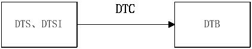

# kernel

## 编译4条命令

确定使用的单板

env 查看环境变量，得到xxxdefconifg 

- make ARCH=arm xxxdefconifg 会生成.config (ARCH=arm 代表32位， ARCH=arm64或者不标就是64位机器)
- make menuconfig  依据.config内容生成 新的.config    备份旧的  .config.old   
- make savedefconfig 把.config格式改为savedefconfig格式, 生成defconfig文。.config包含非常多的宏我们不需要内容，我们只需要实际修改的
- cp defconfig arch/arm/configs/rockchip_linux_defconfig              覆盖最终的配置

## helloworld驱动

hello.c

```shell
          
cw@SYS3:~/sdk/312x_i/kernel$ cat drivers/hello/hello.c
#include <linux/init.h>
#include <linux/module.h>
 
static int __init hello_init(void) {
    printk(KERN_ALERT "Hello, world\n");
    return 0;
}
 
static void __exit hello_exit(void) {
    printk(KERN_ALERT "Goodbye, cruel world\n");
}
 
MODULE_LICENSE("Dual BSD/GPL");
 
module_init(hello_init);
module_exit(hello_exit);

```

kconfig

```shell
diff --git a/drivers/Kconfig b/drivers/Kconfig
index c7a3c412bce1..3c94b9ea5802 100644
--- a/drivers/Kconfig
+++ b/drivers/Kconfig
@@ -202,6 +202,8 @@ source "drivers/fpga/Kconfig"
 
 source "drivers/tee/Kconfig"
 
+source "drivers/hello/Kconfig"
+
 source "drivers/rkflash/Kconfig"
 
 source "drivers/rk_nand/Kconfig"
```

makefile

```shell
 
diff --git a/drivers/Makefile b/drivers/Makefile
index ee62edb593f1..23444200230b 100644
--- a/drivers/Makefile
+++ b/drivers/Makefile
@@ -58,6 +58,9 @@ obj-y                         += gpu/
 
 obj-$(CONFIG_CONNECTOR)                += connector/
 
+# chenwei hello world
+obj-$(CONFIG_HELLO_CHENWEI)                            += hello/
+
 # i810fb and intelfb depend on char/agp/
 obj-$(CONFIG_FB_I810)           += video/fbdev/i810/
 obj-$(CONFIG_FB_INTEL)          += video/fbdev/intelfb/
```

编译

  make ARCH=arm menuconfig
 make ARCH=arm savedefconfig
  cp defconfig arch/arm/configs/rockchip_linux_defconfig

```

  
  cw@SYS3:~/sdk/312x_i/kernel$ git diff
diff --git a/arch/arm/configs/rockchip_linux_defconfig b/arch/arm/configs/rockchip_linux_defconfig
index cabffc153fd5..0e2bb0518e00 100644
--- a/arch/arm/configs/rockchip_linux_defconfig
+++ b/arch/arm/configs/rockchip_linux_defconfig
@@ -475,6 +475,7 @@ CONFIG_PHY_ROCKCHIP_INNO_VIDEO_COMBO_PHY=y
 CONFIG_ANDROID=y
 CONFIG_NVMEM=y
 CONFIG_ROCKCHIP_EFUSE=y
+CONFIG_HELLO_CHENWEI=m
 CONFIG_RK_NAND=y
 CONFIG_ROCKCHIP_SIP=y
 CONFIG_EXT4_FS=y
```


## 设备树

设备树概念

”开源文档中对设备树的描述是，一种描述硬件资源的数据结构，它通过bootloader将硬件资源传给内核，使得内核和硬件资源描述相对独立(也就是说*.dtb文件由Bootloader读入内存，之后由内核来解析)。

注：要使得3.x之后的内核支持使用设备树，除了内核编译时需要打开相对应的选项外，bootloader也需要支持将设备树的数据结构传给内核。

设备树的主要优势：对于同一SOC的不同主板，只需更换设备树文件.dtb即可实现不同主板的无差异支持，而无需更换内核文件。

Device Tree可以描述的信息包括CPU的数量和类别、内存基地址和大小、总线和桥、外设连接、中断控制器和中断使用情况、GPIO控制器和GPIO使用情况、Clock控制器和Clock使用情况。

设备树包含DTC（device tree compiler），DTS（device tree source和DTB（device tree blob）。其对应关系如图1-1所示：




### DTC

DTC为编译工具，它可以将.dts文件编译成.dtb文件。

DTC的源码位于内核的scripts/dtc目录，内核选中CONFIG_OF，编译内核的时候，主机可执行程序DTC就会被编译出来。

```
在scripts/dtc/Makefile中
hostprogs-y := dtc
always := $(hostprogs-y) 
在内核的arch/arm/boot/dts/Makefile中，若选中某种SOC，则与其对应相关的所有dtb文件都将编译出来。在linux下，make dtbs可单独编译dtb。以下截取了TEGRA平台的一部分。
ifeq ($(CONFIG_OF),y)
dtb-$(CONFIG_ARCH_TEGRA) += tegra20-harmony.dtb \
tegra30-beaver.dtb \
tegra114-dalmore.dtb \
```

### DTB

DTC编译*.dts生成的二进制文件(*.dtb)，bootloader在引导内核时，会预先读取*.dtb到内存，进而由内核解析。
tegra124-ardbeg.dtb 

###  DTB 内核解析过程

DTC编译*.dts生成的二进制文件(*.dtb)，bootloader在引导内核时，会预先读取*.dtb到内存，进而由内核解析。

```c
cw@SYS3:~/sdk/312x_i/kernel$ ls arch/arm/kernel/head.S
arch/arm/kernel/head.S
```

在arch/arm/kernel/head.S中，有这样一段：


_vet_atags定义在/arch/arm/kernel/head-common.S中，它主要对DTB镜像做了一个简单的校验。

```c
cw@SYS3:~/sdk/312x_i/kernel$ ag unflatten_device_tree
drivers/of/fdt.c
374: * __unflatten_device_tree - create tree of device_nodes from flat blob
385:static void __unflatten_device_tree(const void *blob,
393:    pr_debug(" -> unflatten_device_tree()\n");
432:    pr_debug(" <- unflatten_device_tree()\n");
454:    __unflatten_device_tree(blob, mynodes, &kernel_tree_alloc);
1077: * called from unflatten_device_tree() to bootstrap devicetree itself
1147: * unflatten_device_tree - create tree of device_nodes from flat blob
1154:void __init unflatten_device_tree(void)
1156:   __unflatten_device_tree(initial_boot_params, &of_root,
1171: * section. If the FDT memory is reserved already then unflatten_device_tree
1192:   unflatten_device_tree();
```

① kernel入口处获取到uboot传过来的.dtb镜像的基地址

② 通过early_init_dt_scan()函数来获取kernel初始化时需要的bootargs和cmd_line等系统引导参数。

③ 调用unflatten_device_tree函数来解析dtb文件，构建一个由device_node结构连接而成的单向链表，并使用全局变量of_allnodes保存这个链表的头指针。

④ 内核调用OF的API接口，获取of_allnodes链表信息来初始化内核其他子系统、设备等。


### DTS与DTSI

> -  *- .dts文件是一种ASCII文本对Device Tree的描述，放置在内核的/arch/arm/boot/dts目录。一般而言，一个*.dts文件对应一个ARM的machine。
>
> -  *.dtsi文件作用：由于一个SOC可能有多个不同的电路板，而每个电路板拥有一个 *.dts。这些dts势必会存在许多共同部分，为了减少代码的冗余，设备树将这些共同部分提炼保存在*.dtsi文件中，
>


```shell
 
设备树编译工具DTC
DTC将.dts编译为.dtb的工具。DTC的源代码在目录scripts/dtc目录中
内核使能了设备树。编译内核的时候DTC工具会自动被编译出来，对应于
scripts/dtc/Makefile  中 hostprogs-y := dtc
 也可以单独安装DTC

sudo apt-get install device-tree-compiler
 在linux内核的arch/arm/boot/Makefile中。定义了哪些dtb文件会被编译出来，如下

dtb-$(CONFIG_SOC_AM33XX) += \
    am335x-lxm.dtb \
    am335x-pigoa800.dtb \
    am335x-pigoa800-1g.dtb \
    am335x-pigoa810.dtb \
    am335x-pigoa810-1g.dtb \
    am335x-pigoa840.dtb \
    am335x-pigoa840-1g.dtb \
    am335x-pigoa84x.dtb \
    am335x-pigoa84x-1g.dtb \
    am335x-pigoa84x-ram1g-nand1g.dtb \
    am335x-pigoa84x-ram1g-nand256.dtb \
    am335x-pigoa84x-ram512g-nand1g.dtb \
    am335x-pigoa84x-ram512-nand256.dtb  \
    am335x-ieda800-1g.dtb \
    am335x-chiliboard.dtb \
    am335x-wega-rdk.dtb
在linux下，我们可以单独编译设备树

make dtbs
　反汇编

./scripts/dtc/dtc -I dtb -o dts -o xxx.dts arch/arm/boot/dts/xxx.dtb
```

https://www.cnblogs.com/aaronLinux/p/5496559.html#t1

DTC为编译工具，它可以将.dts文件编译成.dtb文件。DTC的源码位于内核的scripts/dtc目录，内核选中CONFIG_OF，编译内核的时候，主机可执行程序DTC就会被编译出来。 即scripts/dtc/Makefile中

hostprogs-y := dtc

always := $(hostprogs-y) 

在内核的arch/arm/boot/dts/Makefile中，若选中某种SOC，则与其对应相关的所有dtb文件都将编译出来。在linux下，make dtbs可单独编译dtb。以下截取了TEGRA平台的一部分。

ifeq ($(CONFIG_OF),y)

dtb-$(CONFIG_ARCH_TEGRA) += tegra20-harmony.dtb \

tegra30-beaver.dtb \

tegra114-dalmore.dtb \

tegra124-ardbeg.dtb 

```shell
cw@SYS3:~/sdk/312x_i/kernel/scripts/dtc$ ls
checks.c                 dtc.o                     fdtput.c          modules.order
checks.o                 dtc-parser.tab.c          flattree.c        srcpos.c
data.c                   dtc-parser.tab.c_shipped  flattree.o        srcpos.h
data.o                   dtc-parser.tab.h          fstree.c          srcpos.o
dtc                      dtc-parser.tab.h_shipped  fstree.o          treesource.c
dtc.c                    dtc-parser.tab.o          include-prefixes  treesource.o
dtc.h                    dtc-parser.y              libfdt            update-dtc-source.sh
dtc-lexer.l              dt_to_config              livetree.c        util.c
dtc-lexer.lex.c          dtx_diff                  livetree.o        util.h
dtc-lexer.lex.c_shipped  fdtdump.c                 Makefile          util.o
dtc-lexer.lex.o          fdtget.c                  Makefile.dtc      version_gen.h
```


### 转换

DTC把 DTS文件编译为DTB文件，uboot启动都会把dtb文件加载到内存，然后解析。

```
(1)  DTS编译生成DTB
./dtc -I dts -O dtb -o B_dtb.dtb A_dts.dts
把A_dts.dts编译生成B_dtb.dtb

(2)  DTB编译生成DTS
./dtc -I dtb -O dts -o A_dts.dts A_dtb.dtb


测试
dtc -I dtb -O dts rk3308-evb-dmic-pdm-v13-aarch32.dtb  | less         
dtc -I dtb -O dts rk3308-evb-dmic-pdm-v13-aarch32.dtb  >1.tc
```

### 常用函数

设备树函数思路是：
uboot启动时将设备树地址传给内核，内核解析设备树，并创建设备，初始化相关属性，驱动中通 of_get_XXX函数去获取设备树加载时创建的设备。想要知道of函数做了什么，就去追踪这个函数最后调用了什么，同时也就知道了内核解析设备树的时候为我们创建了什么。

（1）of_get_named_gpio从设备树中提取gpio口

```c
/**
 * include/of_gpio.h
 * of_get_named_gpio - 从设备树中提取gpio口
 * @np - 设备节点指针
 * @propname - 属性名
 * @index - gpio口引脚标号 
 * 成功：得到GPIO口编号；失败：负数，绝对值是错误码
 */
int of_get_named_gpio(struct device_node *np, const char *propname, int index);
```

（2）gpio_to_irq  PIN值转换为相应的IRQ值,中断编号可以传给request_irq()和free_irq()
```c
/*

- include/gpio.h
- PIN值转换为相应的IRQ值,中断编号可以传给request_irq()和free_irq()
- @gpio - gpio口引脚标号 
- 成功：得到GPIO口编号
*/
static inline int gpio_to_irq(unsigned gpio)
```

（3）devm_request_any_context_irq 注册中断

```c
/**

- 注册中断
*/
devm_request_any_context_irq
```

（4）of_match_ptr      匹配设备树上的参数，将设备int_demo_dt_ids与驱动int_demo_driver联系起来

```c
/**

- 匹配设备树上的参数，将设备int_demo_dt_ids与驱动int_demo_driver联系起来
- 系统会根据设备树种定义的compatible参数比较驱动中的int_demo_dt_ids中定义的 .compatible 参数
*/
of_match_ptr(int_demo_dt_ids)

例子：
static const struct of_device_id int_demo_dt_ids[] = {  
{ .compatible = "tiny4412,interrupt_demo", },  
{},  
};  

MODULE_DEVICE_TABLE(of, int_demo_dt_ids);  

static struct platform_driver int_demo_driver = {  
    .driver        = {  
        .name      = "interrupt_demo",  
        .of_match_table    = of_match_ptr(int_demo_dt_ids),  
    },  
    .probe         = int_demo_probe,  
    .remove        = int_demo_remove,  
};  
```

（5）of_get_property通过给定的设备节点和属性名字得到value。

```c
/*
 */drivers/of/base.c
- Find a property with a given name for a given node
- and return the value.
- 通过给定的设备节点和属性名字得到value。
*/
const void *of_get_property(const struct device_node *np, const char *name, int *lenp)
{
struct property *pp = of_find_property(np, name, lenp);
return pp ? pp->value : NULL;
}
```


（6）devm_pinctrl_get          获取一个pinctrl句柄
```c
获取一个pinctrl句柄，参数是dev是包含这个pin的device结构体即xxx这个设备的device
获取设备操作句柄（设备模型中的struct device）的pin control state holder（struct pinctrl）
/** 
- struct devm_pinctrl_get() - Resource managed pinctrl_get() 
- @dev: the device to obtain the handle for 
- 
- If there is a need to explicitly destroy the returned struct pinctrl, 
- devm_pinctrl_put() should be used, rather than plain pinctrl_put(). 
*/  
struct pinctrl *devm_pinctrl_get(struct device *dev)  
```

（7）pinctrl_lookup_state        获取这个pin对应pin_state（引脚状态-turnon_tes/turnoff_tes）

```c

/** 
- pinctrl_lookup_state() - retrieves a state handle from a pinctrl handle 
- @p: the pinctrl handle to retrieve the state from 
- @name: the state name to retrieve 
*/  
struct pinctrl_state *pinctrl_lookup_state(struct pinctrl *p, const char *name)  

int pinctrl_select_state(struct pinctrl *p, struct pinctrl_state *state) 
```

（8）pinctrl_select_state 设置引脚为为某个stata -- turnon_tes/turnoff_tes

```
/** 
- pinctrl_select_state() - select/activate/program a pinctrl state to HW 
- @p: the pinctrl handle for the device that requests configuration 
- @state: the state handle to select/activate/program 
*/  
int pinctrl_select_state(struct pinctrl *p, struct pinctrl_state *state) 
```

（9）of_get_named_gpio 得到GPIO的编号

```c
./**

- include/of_gpio.h
- of_get_named_gpio - 从设备树中提取gpio口
- @np - 设备节点指针
- @propname - 属性名
- @index - gpio口引脚标号 
- 成功：得到GPIO口编号int型；失败：负数，绝对值是错误码
*/
int of_get_named_gpio(struct device_node *np, const char *propname, int index);
of_get_named_gpio：此函数是解析设备树的函数，我们通过这个函数去解析设备树，tiny4412,int_gpio1 = <&gpx3 2 GPIO_ACTIVE_HIGH>; 
跟踪下去会发现这个函数掉用了list = of_get_property(np, "tiny4412,int_gpio2", &size);设备树解析是创界了设备节点，现在通过这个函数去获取属性。
```

（10）devm_gpio_request_one 获取一个GPIO并初始化属性

```c
/**

- devm_gpio_request_one - request a single GPIO with initial setup
- @dev:   device to request for
- @gpio: the GPIO number
- @flags: GPIO configuration as specified by GPIOF_*
- @label: a literal description string of this GPIO
*/
int devm_gpio_request_one(struct device *dev, unsigned gpio,
unsigned long flags, const char *label)
```

### pinctrl

管脚描述符控制结构体：

```c
struct pinctrl_pin_desc {
	unsigned number; //pin管脚值 如：PA01=0x00
	const char *name; //pin管脚名字 如：PA01="PA0"
};
```


管脚操作结构体：

```c
struct pinctrl_ops {
	int (*get_groups_count) (struct pinctrl_dev *pctldev); //一个驱动控制器由哪些管脚构成，这里表示获取多少个控制器设备，见结构体nuc970_pinctrl_groups[]！
	const char *(*get_group_name) (struct pinctrl_dev *pctldev,
				       unsigned selector); //每一组控制器都有对应的名字，如下面nuc970_pinctrl_groups[]结构体中第一个成员控制器的名字为“emac0_grp”
	int (*get_group_pins) (struct pinctrl_dev *pctldev,
			       unsigned selector,
			       const unsigned **pins,
			       unsigned *num_pins); //获取一个驱动控制器由哪些外围管脚构成和管脚的个数，如"emac0_grp"是由“emac0_pins[]”数组构成
	void (*pin_dbg_show) (struct pinctrl_dev *pctldev, struct seq_file *s,
			  unsigned offset);
	int (*dt_node_to_map) (struct pinctrl_dev *pctldev,
			       struct device_node *np_config,
			       struct pinctrl_map **map, unsigned *num_maps);
	void (*dt_free_map) (struct pinctrl_dev *pctldev,
			     struct pinctrl_map *map, unsigned num_maps);
};
```


### 内核内存分配

#### devm_kmalloc

| `void * devm_kzalloc (` | struct device * dev, |
| ----------------------- | -------------------- |
|                         | size_t size,         |
|                         | gfp_t gfp`)`;        |

- *`dev`*

  Device to allocate memory for

  申请内存的目标设备。

- *`size`*

  Allocation size

  申请的内存大小

- *`gfp`*

  Allocation gfp flags

  申请内存的类型标志

Managed kzalloc. Memory allocated with this function is automatically freed on driver detach. Like all other devres resources, guaranteed alignment is unsigned long long.

管理kzalloc。这个功能分配的内存会在驱动卸载时自动释放。像所有其他devres资源一样，需要确保是按unsigned long long对齐的。

#### devm_kzalloc

| `void * devm_kzalloc (` | struct device * dev, |
| ----------------------- | -------------------- |
|                         | size_t size,         |
|                         | gfp_t gfp`)`;        |

 

- *`dev`*

  Device to allocate memory for

  申请内存的目标设备。

- *`size`*

  Allocation size

  申请的内存大小

- *`gfp`*

  Allocation gfp flags

  申请内存的类型标志

Managed kzalloc. Memory allocated with this function is automatically freed on driver detach. Like all other devres resources, guaranteed alignment is unsigned long long.

管理kzalloc。这个功能分配的内存会在驱动卸载时自动释放。像所有其他devres资源一样，需要确保是按unsigned long long对齐的。

kzalloc()实现了kmalloc()+memset()的功能 

####  devm_kfree

```c
/**
 * devm_kfree - Resource-managed kfree
 * @dev: Device this memory belongs to
 * @p: Memory to free
 *
 * Free memory allocated with devm_kmalloc().
 */
void devm_kfree(struct device *dev, void *p)
{
    int rc;

    rc = devres_destroy(dev, devm_kmalloc_release, devm_kmalloc_match, p);
    WARN_ON(rc);
}
```

