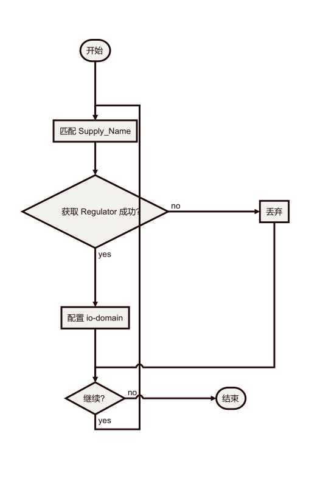

DTS 中无定义 Regulator 情况处理
在使用的过程中可能会遇到，你找不到相应的regulator来配置，可能项目上面
未使用 pmic等电源，只是简单的拉了一个电源过来，dts 上找不到 regulator 的
定义，那么你需要在 dts 文件里面增加?xed regulator 的定义，一般 3.3v 和 1.8v
两个 regulator 就够用了。


下面是 rk3229-evb.dts 的配置例子，确定硬件上的电压是用 1.8v 还是 3.3v，配
置成相应的 regulator：


kernel\arch\arm\boot\dts\rk3229-evb.dts

```
	regulators {
		compatible = "simple-bus";
		#address-cells = <1>;
		#size-cells = <0>;

		vccio_1v8_reg: regulator@0 {
			compatible = "regulator-fixed";
			regulator-name = "vccio_1v8";
			regulator-min-microvolt = <1800000>;
			regulator-max-microvolt = <1800000>;
			regulator-always-on;
		};

		vccio_3v3_reg: regulator@1 {
			compatible = "regulator-fixed";
			regulator-name = "vccio_3v3";
			regulator-min-microvolt = <3300000>;
			regulator-max-microvolt = <3300000>;
			regulator-always-on;
		};
	};
	
	&io_domains {
	status = "okay";

	vccio1-supply = <&vccio_3v3_reg>;
	vccio2-supply = <&vccio_1v8_reg>;
	vccio4-supply = <&vccio_3v3_reg>;
};
```

