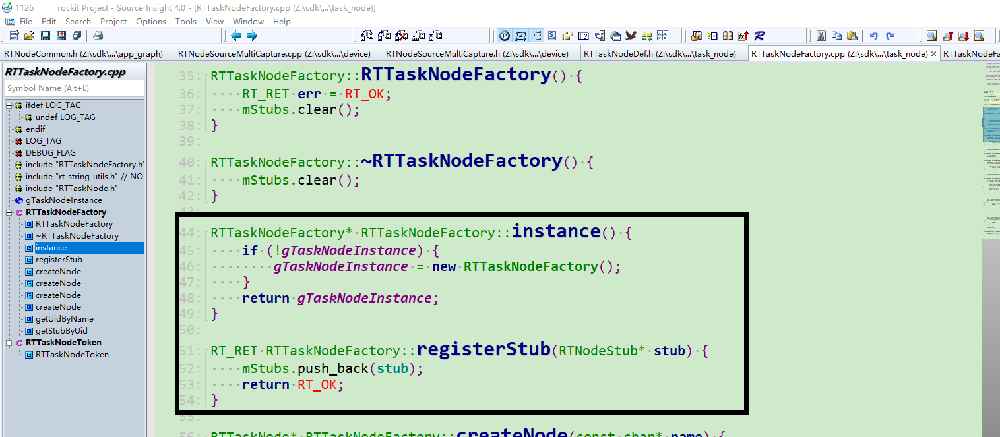
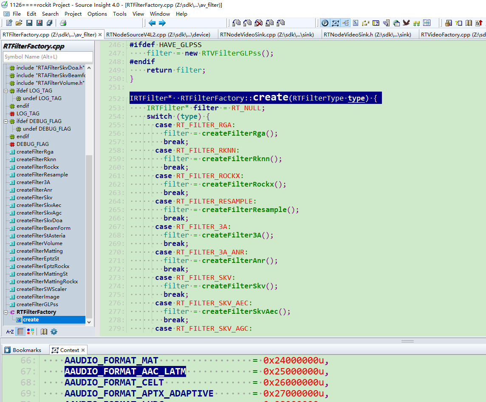
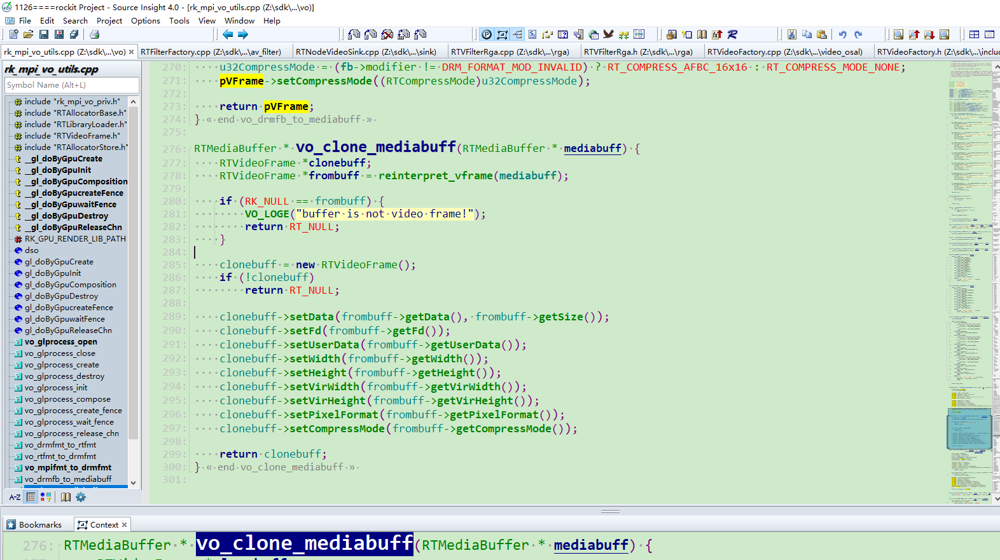
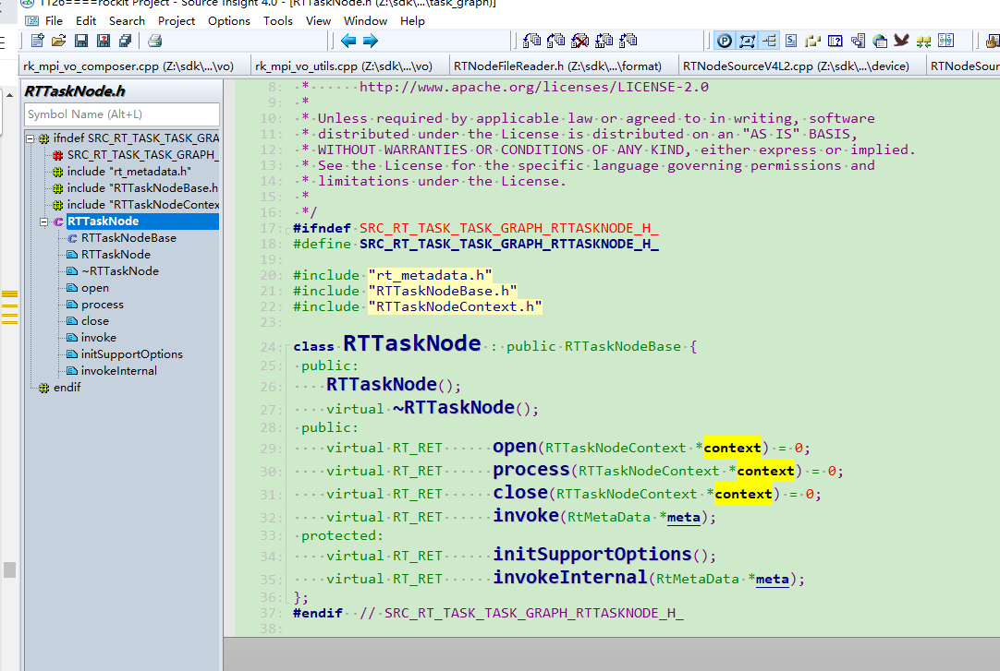
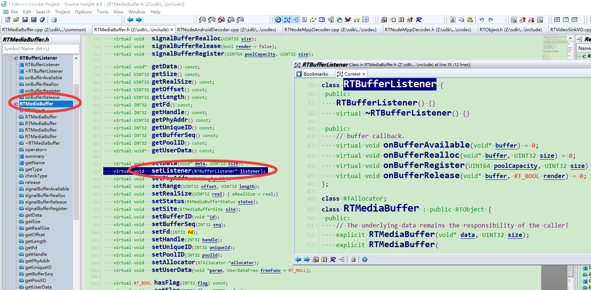

https://www.cnblogs.com/chengjundu/p/8473564.html

##  单例设计模式

例模式顾名思义，保证一个类仅可以有一个实例化对象，并且提供一个可以访问它的全局接口。实现单例模式必须注意一下几点：

- 单例类只能由一个实例化对象。
- 单例类必须自己提供一个实例化对象。
- 单例类必须提供一个可以访问唯一实例化对象的接口。

单例模式分为懒汉和饿汉两种实现方式。

###  懒汉单例模式

懒汉：故名思义，不到万不得已就不会去实例化类，也就是说在第一次用到类实例的时候才会去实例化一个对象。在访问量较小，甚至可能不会去访问的情况下，采用懒汉实现，这是以时间换空间。

#### 非线程安全的懒汉单例模式

```c++
/*
* 关键代码：构造函数是私有的，不能通过赋值运算，拷贝构造等方式实例化对象。
*/

//懒汉式一般实现：非线程安全，getInstance返回的实例指针需要delete
class Singleton
{
public:
    static Singleton* getInstance();
    ~Singleton(){}

private:
    Singleton(){}                                        //构造函数私有
    Singleton(const Singleton& obj) = delete;            //明确拒绝
    Singleton& operator=(const Singleton& obj) = delete; //明确拒绝

    static Singleton* m_pSingleton;
};

Singleton* Singleton::m_pSingleton = NULL;

Singleton* Singleton::getInstance()
{
    if(m_pSingleton == NULL)
    {
        m_pSingleton = new Singleton;
    }
    return m_pSingleton;
}
```

#### 线程安全的懒汉单例模式

```c++
std::mutex mt;

class Singleton
{
public:
    static Singleton* getInstance();
private:
    Singleton(){}                                    //构造函数私有
    Singleton(const Singleton&) = delete;            //明确拒绝
    Singleton& operator=(const Singleton&) = delete; //明确拒绝

    static Singleton* m_pSingleton;

};
Singleton* Singleton::m_pSingleton = NULL;

Singleton* Singleton::getInstance()
{
    if(m_pSingleton == NULL)
    {
        mt.lock();
        if(m_pSingleton == NULL)
        {
            m_pSingleton = new Singleton();
        }
        mt.unlock();
    }
    return m_pSingleton;
}
```

####  返回一个reference指向local static对象

这种单例模式实现方式多线程可能存在不确定性：任何一种non-const static对象，不论它是local或non-local,在多线程环境下“等待某事发生”都会有麻烦。解决的方法：在程序的单线程启动阶段手工调用所有reference-returning函数。这种实现方式的好处是不需要去delete它。

```c++
class Singleton
{
public:
    static Singleton& getInstance();
private:
    Singleton(){}
    Singleton(const Singleton&) = delete;  //明确拒绝
    Singleton& operator=(const Singleton&) = delete; //明确拒绝
};

Singleton& Singleton::getInstance()
{
    static Singleton singleton;
    return singleton;
}
```



### 饿汉单例模式

饿汉：饿了肯定要饥不择食。所以在单例类定义的时候就进行实例化。在访问量比较大，或者可能访问的线程比较多时，采用饿汉实现，可以实现更好的性能。这是以空间换时间。

```
//饿汉式：线程安全，注意一定要在合适的地方去delete它
class Singleton
{
public:
    static Singleton* getInstance();
private:
    Singleton(){}                                    //构造函数私有
    Singleton(const Singleton&) = delete;            //明确拒绝
    Singleton& operator=(const Singleton&) = delete; //明确拒绝

    static Singleton* m_pSingleton;
};

Singleton* Singleton::m_pSingleton = new Singleton();

Singleton* Singleton::getInstance()
{
    return m_pSingleton;
}
```


## 工厂模式

在工厂模式中，我们在创建对象时不会对客户端暴露创建逻辑，并且是通过使用一个共同的接口来指向新创建的对象。工厂模式作为一种创建模式，一般在创建复杂对象时，考虑使用；在创建简单对象时，建议直接new完成一个实例对象的创建。

### 简单工厂模式

主要特点是需要在工厂类中做判断，从而创造相应的产品，当增加新产品时，需要修改工厂类。使用简单工厂模式，我们只需要知道具体的产品型号就可以创建一个产品。

缺点：工厂类集中了所有产品类的创建逻辑，如果产品量较大，会使得工厂类变的非常臃肿。

```c
/*
关键代码：创建过程在工厂类中完成。
*/
​
#include <iostream>
​
using namespace std;
​
//定义产品类型信息
typedef enum
{
    Tank_Type_56,
    Tank_Type_96,
    Tank_Type_Num
}Tank_Type;

//抽象产品类
class Tank
{
public:
    virtual const string& type() = 0;
};

//具体的产品类
class Tank56 : public Tank
{
public:
    Tank56():Tank(),m_strType("Tank56")
    {
    }

    const string& type() override
    {
        cout << m_strType.data() << endl;
        return m_strType;
    }
private:
    string m_strType;
};

//具体的产品类
class Tank96 : public Tank
{
public:
    Tank96():Tank(),m_strType("Tank96")
    {
    }
    const string& type() override
    {
        cout << m_strType.data() << endl;
        return m_strType;
    }

private:
    string m_strType;
};

//工厂类
class TankFactory
{
public:
    //根据产品信息创建具体的产品类实例，返回一个抽象产品类
    Tank* createTank(Tank_Type type)
    {
        switch(type)
        {
        case Tank_Type_56:
            return new Tank56();
        case Tank_Type_96:
            return new Tank96();
        default:
            return nullptr;
        }
    }
};

int main()
{
    TankFactory* factory = new TankFactory();
    Tank* tank56 = factory->createTank(Tank_Type_56);
    tank56->type();
    Tank* tank96 = factory->createTank(Tank_Type_96);
    tank96->type();
    delete tank96;
    tank96 = nullptr;
    delete tank56;
    tank56 = nullptr;
    delete factory;
    factory = nullptr;
    return 0;
}
```

#### 静态函数和工厂模式

首先想到的是**静态成员函数**。我们知道相比于普通成员函数，静态成员**对象间共享且可以通过类名直接访问，同时普通函数指针必须指向静态成员函数**。普通成员函数与静态成员函数区别可以总结于下图。

```c
class RTDeviceFactory {
 public:
    static IRTDevice* create(INT32 type);
};

IRTDevice* RTDeviceFactory::create(INT32 type) {
    IRTDevice* device = RT_NULL;
    switch (type) {
        case RT_DEVICE_V4L2_INPUT:
            device = createV4L2();
            break;
        case RT_DEVICE_ALSA_CAPTURE:
            device = createALSACapture();
            break;
        case RT_DEVICE_ALSA_PLAYBACK:
            device = createALSAPlayback();
            break;
        default:
            RT_LOGE("type = %d not support", type);
            break;
    }
    return device;
}

```




### 抽象工厂模式

抽象工厂模式提供创建一系列相关或相互依赖对象的接口，而无需指定它们具体的类。

当存在多个产品系列，而客户端只使用一个系列的产品时，可以考虑使用抽象工厂模式。

缺点：当增加一个新系列的产品时，不仅需要现实具体的产品类，还需要增加一个新的创建接口，扩展相对困难。

```c++
/*
* 关键代码：在一个工厂里聚合多个同类产品。
* 以下代码以白色衣服和黑色衣服为例，白色衣服为一个产品系列，黑色衣服为一个产品系列。白色上衣搭配白色裤子，   黑色上衣搭配黑色裤字。每个系列的衣服由一个对应的工厂创建，这样一个工厂创建的衣服能保证衣服为同一个系列。
*/
​
//抽象上衣类
class Coat
{
public:
    virtual const string& color() = 0;
};
​
//黑色上衣类
class BlackCoat : public Coat
{
public:
    BlackCoat():Coat(),m_strColor("Black Coat")
    {
    }
​
    const string& color() override
    {
        cout << m_strColor.data() << endl;
        return m_strColor;
    }
private:
    string m_strColor;
};
​
//白色上衣类
class WhiteCoat : public Coat
{
public:
    WhiteCoat():Coat(),m_strColor("White Coat")
    {
    }
    const string& color() override
    {
        cout << m_strColor.data() << endl;
        return m_strColor;
    }

private:
    string m_strColor;
};

//抽象裤子类
class Pants
{
public:
    virtual const string& color() = 0;
};

//黑色裤子类
class BlackPants : public Pants
{
public:
    BlackPants():Pants(),m_strColor("Black Pants")
    {
    }
    const string& color() override
    {
        cout << m_strColor.data() << endl;
        return m_strColor;
    }

private:
    string m_strColor;
};
​
//白色裤子类
class WhitePants : public Pants
{
public:
    WhitePants():Pants(),m_strColor("White Pants")
    {
    }
    const string& color() override
    {
        cout << m_strColor.data() << endl;
        return m_strColor;
    }

private:
    string m_strColor;
};

//抽象工厂类，提供衣服创建接口
class Factory
{
public:
    //上衣创建接口，返回抽象上衣类
    virtual Coat* createCoat() = 0;
    //裤子创建接口，返回抽象裤子类
    virtual Pants* createPants() = 0;
};

//创建白色衣服的工厂类，具体实现创建白色上衣和白色裤子的接口
class WhiteFactory : public Factory
{
public:
    Coat* createCoat() override
    {
        return new WhiteCoat();
    }

    Pants* createPants() override
    {
        return new WhitePants();
    }
};

//创建黑色衣服的工厂类，具体实现创建黑色上衣和白色裤子的接口
class BlackFactory : public Factory
{
    Coat* createCoat() override
    {
        return new BlackCoat();
    }

    Pants* createPants() override
    {
        return new BlackPants();
    }
};
```


## 原型模式

原型模式：用原型实例指定创建对象的种类，并且通过拷贝这些原型创建新的对象。通俗的讲就是当需要创建一个新的实例化对象时，我们刚好有一个实例化对象，但是已经存在的实例化对象又不能直接使用。这种情况下拷贝一个现有的实例化对象来用，可能会更方便。

以下情形可以考虑使用原型模式：

- 当new一个对象，非常繁琐复杂时，可以使用原型模式来进行复制一个对象。比如创建对象时，构造函数的参数很多，而自己又不完全的知道每个参数的意义，就可以使用原型模式来创建一个新的对象，不必去理会创建的过程。
- 当需要new一个新的对象，这个对象和现有的对象区别不大，我们就可以直接复制一个已有的对象，然后稍加修改。
- 当需要一个对象副本时，比如需要提供对象的数据，同时又需要避免外部对数据对象进行修改，那就拷贝一个对象副本供外部使用。

```c++
/*
* 关键代码：拷贝，return new className(*this);
*/
#include <iostream>
​
using namespace std;
​
//提供一个抽象克隆基类。
class Clone
{
public:
    virtual Clone* clone() = 0;
    virtual void show() = 0;
};
​
//具体的实现类
class Sheep:public Clone
{
public:
    Sheep(int id, string name):Clone(),
                               m_id(id),m_name(name)
    {
        cout << "Sheep() id address:" << &m_id << endl;
        cout << "Sheep() name address:" << &m_name << endl;
    }
    ~Sheep()
    {
    }
    //关键代码拷贝构造函数
    Sheep(const Sheep& obj)
    {
        this->m_id = obj.m_id;
        this->m_name = obj.m_name;
        cout << "Sheep(const Sheep& obj) id address:" << &m_id << endl;
        cout << "Sheep(const Sheep& obj) name address:" << &m_name << endl;
    }
    //关键代码克隆函数，返回return new Sheep(*this)
    Clone* clone()
    {
        return new Sheep(*this);
    }
    void show()
    {
        cout << "id  :" << m_id << endl;
        cout << "name:" << m_name.data() << endl;
    }
private:
    int m_id;
    string m_name;
};

int main()
{
    Clone* s1 = new Sheep(1, "abs");
    s1->show();
    Clone* s2 = s1->clone();
    s2->show();

    delete s1;
    s1 = nullptr;
    delete s2;
    s2 = nullptr;
    return 0;
}
```



### 模板模式（继承）

模板模式：定义一个操作中的算法的骨架，而将一些步骤延迟到子类中。 

```c++
/*
* 关键代码：在抽象类实现通用接口，细节变化在子类实现。
*/
​
#include <iostream>
using namespace std;

class Computer
{
public:
    void product()
    {
        installCpu();
        installRam();
        installGraphicsCard();
    }

protected:
    virtual void installCpu() = 0;
    virtual void installRam() = 0;
    virtual void installGraphicsCard() = 0;
};

class ComputerA : public Computer
{
protected:
    void installCpu() override
    {
        cout << "ComputerA install Inter Core i5" << endl;
    }

    void installRam() override
    {
        cout << "ComputerA install 2G Ram" << endl;
    }

    void installGraphicsCard() override
    {
        cout << "ComputerA install Gtx940 GraphicsCard" << endl;
    }
};
​
class ComputerB : public Computer
{
protected:
    void installCpu() override
    {
        cout << "ComputerB install Inter Core i7" << endl;
    }
​
    void installRam() override
    {
        cout << "ComputerB install 4G Ram" << endl;
    }
​
    void installGraphicsCard() override
    {
        cout << "ComputerB install Gtx960 GraphicsCard" << endl;
    }
};
​
int main()
{
    ComputerB* c1 = new ComputerB();
    c1->product();
​
    delete c1;
    c1 = nullptr;
​
    return 0;
}
```



## 代理模式

在某些情况下，一个对象不适合或者不能直接引用另一个对象，而代理对象可以在客户端和目标对象之间起到中介作用。

代理模式：为其它对象提供一种代理以控制这个对象的访问。

优点：

- 职责清晰。真实的角色只负责实现实际的业务逻辑，不用关心其它非本职责的事务，通过后期的代理完成具体的任务。这样代码会简洁清晰。
- 代理对象可以在客户端和目标对象之间起到中介的作用，这样就保护了目标对象。
- 扩展性好。

```c++
/*
* 关键代码：一个是真正的你要访问的对象(目标类)，一个是代理对象,真正对象与代理对象实现同一个接口,先访问代理*         类再访问真正要访问的对象。
*/
#include <iostream>
using namespace std;

class Gril
{
public:
    Gril(const string& name = "gril"):m_string(name){}
    string getName()
    {
        return m_string;
    }
private:
    string m_string;
};
​
class Profession
{
public:
    virtual ~Profession(){}
    virtual void profess() = 0;
};
​
class YoungMan : public Profession
{
public:
    YoungMan(const Gril& gril):m_gril(gril){}
    void profess()
    {
        cout << "Young man love " << m_gril.getName().data() << endl;
    }
​
private:
    Gril m_gril;
};
​
class ManProxy : public Profession
{
public:
    ManProxy(const Gril& gril):m_pMan(new YoungMan(gril)){}
    ~ManProxy()
    {
        delete m_pMan;
        m_pMan = nullptr;
    }
    void profess()
    {
        m_pMan->profess();
    }
private:
    YoungMan* m_pMan;
};
​
int main(int argc, char *argv[])
{
    Gril gril("heihei");
    ManProxy* proxy = new ManProxy(gril);
    proxy->profess();
​
    delete proxy;
    proxy = nullptr;
    return 0;
}
```


## 监听者模式

监听者对大家来说可能并不陌生，所谓监听者就是用来监听自已感兴趣的事件的，当收到自已感兴趣的事件时会做出相应的反映。

  它的应用是非常广的，比如win32的消息机制，它跟监听者模式就异曲同工，操作系统将产生的各种事件包装成消息(msg),该消息结构包装了发生的事件的描述信息，比如消息值，屏幕坐标等，然后将它投递到相应的进程中，当该进程收到该消息时会查看该msg结构中的信息，也就知道了发生了什么事件，并对自已感兴趣的事件进行响应。

  下面我们就来用c++实现一个简单的监听者

```c++
using namespace std;  
//listener基类(抽象类)  
class abstractlistener  
{  
	public:  
	abstractlistener(){};  
	virtual ~abstractlistener(){};  
	virtual void actionperformed(int state) = 0;  
};  
//listener实现类(它类似于操作系统中的进程)  
class statelistener:public abstractlistener  
{  
	public:  
	statelistener(){};  
	virtual ~statelistener(){};  
	virtual void actionperformed(int state);  
};  
void statelistener::actionperformed(int state)  
{          
	//这里就是对自已感兴趣的事件的相应处理  
	if(state==1){  
		cout<<"event 1 is fired."<<endl;  
	}else if(state==2){  
		cout<<"event 2 is fired."<<endl;  
	}else{  
		cout<<"other event is fired."<<endl;  
	}  
}  
//listener center(类似于操作系统(os))  
class listenercenter  
{  
	private:  
	statelistener listenerlist[50];//存储listener的数组  
	int count;//当前中心中已有的listener的个数  
	public:  
	listenercenter();  
	virtual ~listenercenter(){};  
	int getcount();  
	void addlistener(statelistener);  
	void firestatelistener(int state);  
};  
listenercenter::listenercenter()  
{  
	this->count=0;  
}  
int listenercenter::getcount()  
{  
	return count;  
}  
void listenercenter::addlistener(statelistener statelistener)  
{  
	listenerlist[this->count]=statelistener;  
	this->count++;  
}  
void listenercenter::firestatelistener(int state)  
{  
	for(int i=0;i<this->count;i++){  
		listenerlist[i].actionperformed(state);  
	}  
}  
int main(int argc, char* argv[])  
{  
	listenercenter listenercenter;  
	statelistener statelis1;  
	statelistener statelis2;  
	listenercenter.addlistener(statelis1);  
	listenercenter.addlistener(statelis2);  
	cout<<"=========================="<<endl;  
	listenercenter.firestatelistener(1);  
	cout<<"=========================="<<endl;  
	listenercenter.firestatelistener(2);  
	cout<<"=========================="<<endl;  
	listenercenter.firestatelistener(3);  
	cout<<"=========================="<<endl;  
	return 0;  
} 
```

```c++
打印：

==========================
event 1 is fired.
event 1 is fired.
==========================
event 2 is fired.
event 2 is fired.
==========================
other event is fired.
other event is fired.
==========================
```



## 观察者模式

**Observer 模式**应该可以说是应用最多、影响最广的模式之一，因为 Observer 的一个实例 Model/View/Control（ MVC） 结构在系统开发架构设计中有着很重要的地位和意义， MVC实现了业务逻辑和表示层的解耦。在 MFC 中， Doc/View（文档视图结构）提供了实现 MVC 的框架结构。在 Java 阵容中， Struts 则提供和 MFC 中 Doc/View 结构类似的实现 MVC 的框架。另外 Java 语言本身就提供了 Observer 模式的实现接口。当然， MVC 只是 Observer 模式的一个实例。 Observer 模式要解决的问题为： 建立一个一（ Subject）对多（ Observer） 的依赖关系， 并且做到当“一” 变化的时候， 依赖这个“一”的多也能够同步改变。

在GOF的《设计模式:可复用面向对象软件的基础》一书中对观察者模式是这样说的：定义对象间的一种一对多的依赖关系，当一个对象的状态发生改变时，所有依赖于它的对象都得到通知并被自动更新。当一个对象发生了变化，关注它的对象就会得到通知；这种交互也称为发布-订阅(publish-subscribe)。目标是通知的发布者，它发出通知时并不需要知道谁是它的观察者。

**最常见的一个例子**就是： 对同一组数据进行统计分析时候， 我们希望能够提供多种形式的表示 （例如以表格进行统计显示、柱状图统计显示、百分比统计显示等）。这些表示都依赖于同一组数据， 我们当然需要当数据改变的时候， 所有的统计的显示都能够同时改变。 Observer 模式就是解决了这一个问题。

**UML类图：**


Subject（目标）
——目标知道它的观察者。可以有任意多个观察者观察同一个目标；
——提供注册和删除观察者对象的接口。

Observer（观察者）
——为那些在目标发生改变时需获得通知的对象定义一个更新接口。

ConcreteSubject（具体目标）
——将有关状态存入各ConcreteObserver对象；
——当它的状态发生改变时，向它的各个观察者发出通知。

ConcreteObserver（具体观察者）
——维护一个指向ConcreteSubject对象的引用；
——存储有关状态，这些状态应与目标的状态保持一致；
——实现Observer的更新接口以使自身状态与目标的状态保持一致。

观察者模式按照以下方式进行协作：

1. 1. 当ConcreteSubject发生任何可能导致其观察者与其本身状态不一致的改变时，它将通知它的各个观察者；
   2. 在得到一个具体目标的改变通知后，ConcreteObserver对象可向目标对象查询信息。ConcreteObserver使用这些信息以使它的状态与目标对象的状态一致。

以下是调用时序图：


**适用场合**

在以下任一情况下都可以使用观察者模式：

1. 当一个抽象模型有两个方面，其中一个方面依赖于另一方面。将这二者封装在独立的对象中以使它们可以各自独立的改变和复用；
2. 当对一个对象的改变需要同时改变其它对象，而不知道具体有多少对象有待改变；
3. 当一个对象必须通知其它对象，而它又不能假定其它对象是谁；也就是说，你不希望这些对象是紧密耦合的。

#### **代码实现：**

```c++
#include <iostream>
#include <list>
using namespace std;
 
class Observer
{
public:
    virtual void Update(int) = 0;
};
 
class Subject
{
public:
    virtual void Attach(Observer *) = 0;
    virtual void Detach(Observer *) = 0;
    virtual void Notify() = 0;
};
 
class ConcreteObserver : public Observer
{
public:
    ConcreteObserver(Subject *pSubject) : m_pSubject(pSubject){}
 
    void Update(int value)
    {
        cout << "ConcreteObserver get the update. New State:" << value << endl;
    }
 
private:
    Subject *m_pSubject;
};
 
class ConcreteObserver2 : public Observer
{
public:
    ConcreteObserver2(Subject *pSubject) : m_pSubject(pSubject){}
 
    void Update(int value)
    {
        cout << "ConcreteObserver2 get the update. New State:" << value << endl;
    }
 
private:
    Subject *m_pSubject;
};
 
class ConcreteSubject : public Subject
{
public:
    void Attach(Observer *pObserver);
    void Detach(Observer *pObserver);
    void Notify();
 
    void SetState(int state)
    {
        m_iState = state;
    }
 
private:
    std::list<Observer *> m_ObserverList;
    int m_iState;
};
 
void ConcreteSubject::Attach(Observer *pObserver)
{
    m_ObserverList.push_back(pObserver);
}
 
void ConcreteSubject::Detach(Observer *pObserver)
{
    m_ObserverList.remove(pObserver);
}
 
void ConcreteSubject::Notify()
{
    std::list<Observer *>::iterator it = m_ObserverList.begin();
    while (it != m_ObserverList.end())
    {
        (*it)->Update(m_iState);
        ++it;
    }
}
 
int main()
{
    // Create Subject
    ConcreteSubject *pSubject = new ConcreteSubject();
 
    // Create Observer
    Observer *pObserver = new ConcreteObserver(pSubject);
    Observer *pObserver2 = new ConcreteObserver2(pSubject);
 
    // Change the state
    pSubject->SetState(2);
 
    // Register the observer
    pSubject->Attach(pObserver);
    pSubject->Attach(pObserver2);
 
    pSubject->Notify();
 
    // Unregister the observer
    pSubject->Detach(pObserver);
 
    pSubject->SetState(3);
    pSubject->Notify();
 
    delete pObserver;
    delete pObserver2;
    delete pSubject;
}
```


**示例2代码实现：**　　


这里的目标 Subject 提供依赖于它的观察者 Observer 的注册（ Attach） 和注销（ Detach）操作，并且提供了使得依赖于它的所有观察者同步的操作（ Notify）。 观察者 Observer 则提供一个 Update 操作， 注意这里的 Observer 的 Update 操作并不在 Observer 改变了 Subject 目标状态的时候就对自己进行更新， 这个更新操作要延迟到 Subject 对象发出 Notify 通知所有Observer 进行修改（调用 Update）。

#### 1

```c++
#include <iostream>
#include <string>
#include <list>
using namespace std;
 
class Subject;
//抽象观察者
class Observer
{
protected:
    string name;
    Subject *sub;
public:
    Observer(string name, Subject *sub)
    {
        this->name = name;
        this->sub = sub;
    }
    virtual void update() = 0;
};
//具体的观察者，看股票的
class StockObserver :public Observer
{
public:
    StockObserver(string name, Subject *sub) :Observer(name, sub)
    {
    }
    void update();
};
//具体的观察者，看NBA的
class NBAObserver :public Observer
{
public:
    NBAObserver(string name, Subject *sub) :Observer(name, sub)
    {
    }
    void update();
};
//抽象通知者
class Subject
{
protected:
    list<Observer*> observers;
public:
    string action;
    virtual void attach(Observer*) = 0;
    virtual void detach(Observer*) = 0;
    virtual void notify() = 0;
};
//具体通知者，秘书
class Secretary :public Subject
{
    void attach(Observer *observer)
    {
        observers.push_back(observer);
    }
    void detach(Observer *observer)
    {
        list<Observer *>::iterator iter = observers.begin();
        while (iter != observers.end())
        {
            if ((*iter) == observer)
            {
                observers.erase(iter);
            }
            ++iter;
        }
    }
    void notify()
    {
        list<Observer *>::iterator iter = observers.begin();
        while (iter != observers.end())
        {
            (*iter)->update();
            ++iter;
        }
    }
};
 
void StockObserver::update()
{
    cout << name << " 收到消息：" << sub->action << endl;
    if (sub->action == "梁所长来了!")
    {
        cout << "我马上关闭股票，装做很认真工作的样子！" << endl;
    }
}
 
void NBAObserver::update()
{
    cout << name << " 收到消息：" << sub->action << endl;
    if (sub->action == "梁所长来了!")
    {
        cout << "我马上关闭NBA，装做很认真工作的样子！" << endl;
    }
}
 
int main()
{
    Subject *dwq = new Secretary(); //创建观察者<br>　　　　//被观察的对象
    Observer *xs = new NBAObserver("xiaoshuai", dwq);
    Observer *zy = new NBAObserver("zouyue", dwq);
    Observer *lm = new StockObserver("limin", dwq);
　　　　//加入观察队列
    dwq->attach(xs);
    dwq->attach(zy);
    dwq->attach(lm);
　　　　//事件
    dwq->action = "去吃饭了！";<br>　　　　//通知
    dwq->notify();
    cout << endl;
    dwq->action = "梁所长来了!";
    dwq->notify();
    return 0;
}
```


## 监听者设计模式

说到事件监听模式,很容易将它和观察者模式联系在一起。
实质上这两者完成同类型的工作。依个人理解，事件监听模式更像是观察者模式的进阶。

用一张图来方便描述它们的区别:


观察者模式中，‘主题’会在特定逻辑下通知所有‘观察者’。
如果这个通知不包含任何信息，那么这种实现就是通常的观察者模式。

```c++
class Subject
{
protected:
    void notify()
    {
        for (int i = 0; i < numObservers_; i++)
        {
          observers_[i]->onNotify();
        }
    }
};
```

如果‘主题’通知‘观察者’的过程带有一些<其他信息>。那么‘主题’本身已经上升成为了‘事件源’，
而通知中带有的<其他信息>经过封装就成为了事件。


```c++
class Subject
{
protected:
    void notify(const Entity& entity, Event event)
    {
        for (int i = 0; i < numObservers_; i++)
        {
          observers_[i]->onNotify(entity, event);
        }
    }
};
```

事件监听模式的优势：
在很多应用场景中，通知中附带的<其他信息>是必不可少的，
事件Event则对这些<信息>进行了封装，使它本身拥有了多态的特性。
每个事件对象就可以包含不同的信息。但各个‘观察者’提供给‘主题’的接口仍然是统一的 ：
onNotify(entity, event)


举个简单的例子，某游戏中的成就系统包含两种成就：
1.达成等级成就(观察者1)    2.达成战斗力成就(观察者2)
玩家(事件源)在完成升级时会创建两个对象，
升级事件(包含玩家等级字段)     战斗力提升事件(包含玩家当前战斗力字段)。
成就系统收到事件后执行统一的逻辑:
observers_[event.type]->OnAchieveEvent(entity, event);

总结来说 事件监听机制就是对观察者模式进行了进一步抽象，节省了代码量。

