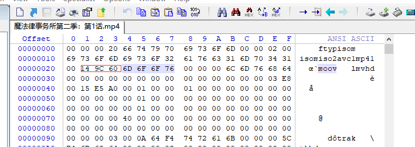
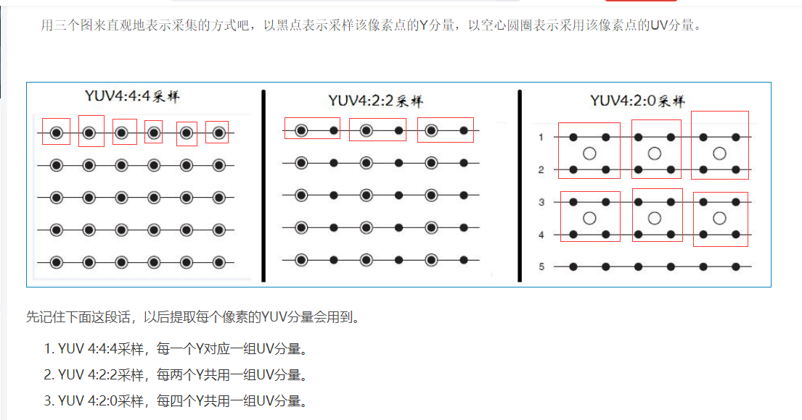
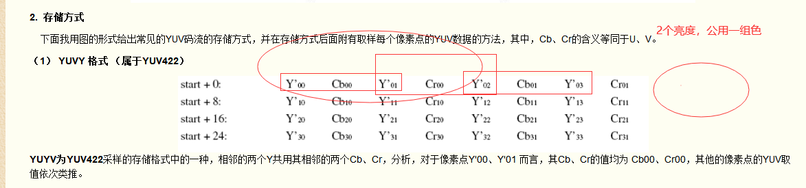
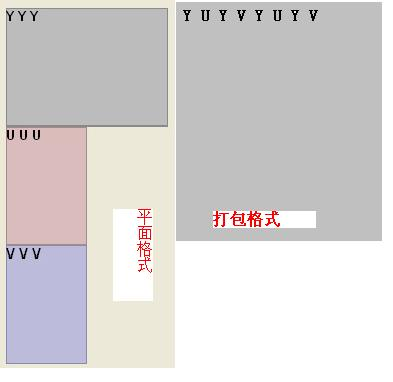

```
cw@SYS3:~/ffmpeg$ git clone https://github.com/FFmpeg/FFmpeg.git
cw@SYS3:~/ffmpeg/FFmpeg$ ffplay  --help
```

解析M4媒体文件时需要一些关键的信息，



```
过解析该moov容器的字节长度，可以看到，该容器共包含Ox00149c60字节(1,350,752Byte)，容器的类型为moov；接着继续在这个moov容器中往下解析，下一个容器的大小为Ox0000006c(108）字节，类型为mvhd；然后继续在moov容器中往下解析：
```


FFmpeg查看媒体文件信息

ffprobe -v quiet -print_format json -show_streams -show_format test.jpg 

```
cw@SYS3:~/ffmpeg/my$ ffprobe -v quiet -print_format json -show_streams -show_format test.jpg 
{
    "streams": [
        {
            "index": 0,
            "codec_name": "mjpeg",
            "codec_long_name": "MJPEG (Motion JPEG)",
            "codec_type": "video",
            "codec_time_base": "1/25",
            "codec_tag_string": "[0][0][0][0]",
            "codec_tag": "0x0000",
            "width": 547,
            "height": 386,
            "coded_width": 547,
            "coded_height": 386,
            "has_b_frames": 0,
            "sample_aspect_ratio": "1:1",
            "display_aspect_ratio": "547:386",
            "pix_fmt": "yuvj420p",
            "level": -99,
            "color_range": "pc",
            "color_space": "bt470bg",
            "chroma_location": "center",
            "refs": 1,
            "r_frame_rate": "25/1",
            "avg_frame_rate": "0/0",
            "time_base": "1/25",
            "start_pts": 0,
            "start_time": "0.000000",
            "duration_ts": 1,
            "duration": "0.040000",
            "bits_per_raw_sample": "8",
            "disposition": {
                "default": 0,
                "dub": 0,
                "original": 0,
                "comment": 0,
                "lyrics": 0,
                "karaoke": 0,
                "forced": 0,
                "hearing_impaired": 0,
                "visual_impaired": 0,
                "clean_effects": 0,
                "attached_pic": 0
            }
        }
    ],
    "format": {
        "filename": "test.jpg",
        "nb_streams": 1,
        "nb_programs": 0,
        "format_name": "image2",
        "format_long_name": "image2 sequence",
        "start_time": "0.000000",
        "duration": "0.040000",
        "size": "44087",
        "bit_rate": "8817400",
        "probe_score": 50
    }
}
cw@SYS3:~/ffmpeg/my$ 
```

Y：亮度分量  UV：色度分量

​    Y与RGB的演算关系为：Y = 0.2126 R + 0.7152 G + 0.0722 B

 

YUV4:2:2或4：2：0都是指的Y分量和UV分量在一个像素点中占有的**平均比例**。
YUV422:水平方向上的UV分量减半了




```
YUV的采样格式及每种格式中单像素所占内存大小

YUV主要的采样格式有YCbCr 4:2:0、YCbCr 4:2:2、YCbCr 4:1:1和 YCbCr 4:4:4。

采样格式                 单像素所占内存大小          存放的码流

YCbCr 4:4:4            3  byte                   Y0 U0 V0 Y1 U1 V1 Y2 U2 V2 Y3 U3 V3（4像素为例）

YCbCr 4:2:2            2  byte                   Y0 U0 Y1 V1 Y2 U2 Y3 V3（4像素为例）

YCbCr 4:2:0            1.5byte                   Y0 U0 Y1 Y2 U2 Y3 Y5 V5 Y6 Y7 V7 Y8（8像素为例）

YCbCr 4:1:1            1.5byte                   Y0 U0 Y1 Y2 V2 Y3（4像素为例）
```


```
YUV文件大小计算
以720×488大小图象YUV420 planar为例，其存储格式是： 共大小为(720×480×3>>1)字节，

分为三个部分:Y,U和V

Y分量： (720×480)个字节 
U(Cb)分量：(720×480>>2)个字节 
V(Cr)分量：(720×480>>2)个字节

三个部分内部均是行优先存储，三个部分之间是Y,U,V 顺序存储。 
即 
0－－720×480字节是Y分量值， 
720×480－－720×480×5/4字节是U分量 
720×480×5/4 －－720×480×3/2字节是V分量。
```


```
YUV420格式中一种YUV分量的排列顺序
以640x480_420.yuv为例，正确的存储格式为一大片Y，跟着一大片U，最后是一大片V:
-------------------------640x480 point
Y(0,0) Y(0,1)... Y(0,639)
...
Y(479,0) Y(479,1)... Y(479,639)
-------------------------640x480 point

-------------------------320x240 point
U(0,0) U(0,1)... U(0,319)
...
U((239,0) U((239,1)... U((239,319)
-------------------------320x240 point

-------------------------320x240 point
V(0,0) V(0,1)... V(0,319)
...
V((239,0) V((239,1)... V((239,319)
-------------------------320x240 point
```

 YUV422P也属于YUV422的一种，它是一种Plane模式，即平面模式，并不是将YUV数据交错存储，而是先存放所有的Y分量，然后存储所有的U（Cb）分量，最后存储所有的V（Cr）分量，如上图所示。其每一个像素点的YUV值提取方法也是遵循YUV422格式的最基本提取方法，即两个Y共用一个UV。比如，对于像素点Y'00、Y'01 而言，其Cb、Cr的值均为 Cb00、Cr00。


**1. YUV简介**

**YUV定义：**分为三个分量，“Y”表示明亮度（Luminance或Luma），也就是灰度值；而“U”和“V” 表示的则是色度（Chrominance或Chroma），作用是描述影像色彩及饱和度，用于指定像素的颜色。

**YUV格式**：有两大类：planar和packed。
对于planar的YUV格式，先连续存储所有像素点的Y，紧接着存储所有像素点的U，随后是所有像素点的V。
对于packed的YUV格式，每个像素点的Y,U,V是连续交*存储的。

**YUV存储**：格式其实与其采样的方式密切相关，主流的采样方式有三种，YUV4:4:4，YUV4:2:2，YUV4:2:0，关于其详细原理，可以通过网 上其它文章了解，这里我想强调的是如何根据其采样格式来从码流中还原每个像素点的YUV值，因为只有正确地还原了每个像素点的YUV值，才能通过YUV与 RGB的转换公式提取出每个像素点的RGB值，然后显示出来。 

**YUV特点**：也是一种颜色编码方法，它将亮度信息（Y）与色彩信息（UV）分离，没有UV信息一样 可以显示完整的图像，只不过是黑白的，这样的设计很好地解决了**彩色电视机与黑白电视的兼容问题**。并且，YUV不像RGB那样要求三个独立的视频信号同时传 输，所以用**YUV方式传送占用极少的频宽**。



YUV信号有很多种，一般YUV420和YUV422用的比较多，

​    **YUV422格式**，又分为很多小类，按照U、V的排列可以有YUYV,YVYU,UYVY,VYUY四种，其中，YUYVY一般又称作yuv2格式。

​    而这四种**YUV422格式**，每种又可以分为2小类，按Y和UV的排列可以有打包格式和平面格式。


例如，一个640×480×2的YUV文件，打包格式就是YUYVYUYV这样一直排列下去，

平面格式就是先640×480个Y排列完，然后是640×240个U，然后是640×240个V这样排列，如下图：


   假如有一幅640×480的图片，用yuv422来表示，那么，采样方式就是每个像素采样Y信号，U,V信号隔一个采样，这样算下来，就有640×480个Y,640×240个U,640×240个V，一幅640×480大小的YUV图片占的总字节数为640×480×2个字节，每像素2个字节，也就是16位。

   在内存种这样排列：Y0U0Y1V0 Y2U1Y3V1...

  第一个像素的YUV值为：Y0 U0 V0

  第二个像素的YUV值为： Y1 U0 V0

  第三个像素的YUV值为： Y2 U1 V1

.....其他以此推类，也就是说每两个像素是共用了UV的；在一行上来看，每个像素的YUV值种Y值被采样，UV值采样0后，跳到3，然后5，所以每行上Y有640个，U,V各320个

