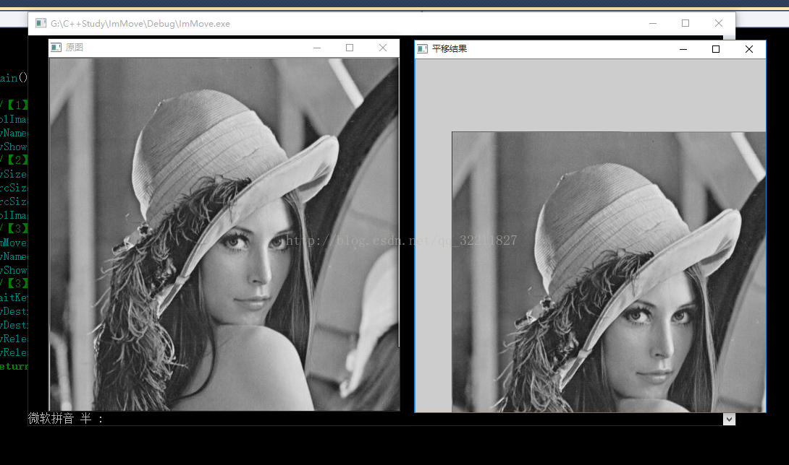
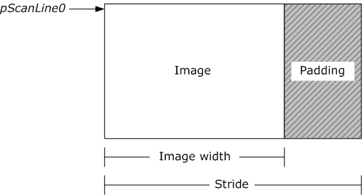

*** RGA** ：二维图像辅助计算单元
    这又是Rockchip的神器之一，该单元可以在极短时间内拷贝、旋转、格式转换、缩放、混合 图片，想想在PC上被CPU memcpy支配的恐惧，再回头看看能在短短几个毫秒内内存拷贝一张4K图片，还能同时缩放、旋转、把YUV转成RGB之类的格式转换，用上后就再也不会想用CPU来做这些工作了。
    不论你是Android还是Linux开发者，想用RGA的话都需要使用我们的rga lib来调用，而安卓因为hwc单元一直在使用该器件进行转屏混合工作，所以在安卓上使用rga效率远远低于linux平台。（安卓的librga位置在hardware/rockchip/librga目录里）

RGA优点：

1. 不占用CPU资源
2. DRM/CMA物理内存拷贝和转换速度很快

RGA缺点：

1. 对malloc的不连续的虚拟内存操作速度很慢

```
RGA的设备节点挂在：
/dev/rga


RGA库安装,如果大家不想了解更底层的细节，可以直接安装这个库来使用，我们已经帮大家封装了常用的操作和细节：
sudo dnf install librockchip_rga-devel

如果想进一步了解RGA，可以研究下Android的Hardware/rockchip/librga来查看寄存器的配置等更详细的调用方式，或者使用该代码调用RGA。
本教学的下载地址：
https://github.com/Jerzha/samples-toybrick-rga.git
```


```
[root@RV1126_RV1109:/tmp]# rgaImDemo --querystring
-/bin/sh: rgaImDemo: not found
[root@RV1126_RV1109:/tmp]# ./im2d  rgaImDemo --querystring
./im2d: /lib/libstdc++.so.6: no version information available (required by librga.so)
./im2d: /lib/libstdc++.so.6: no version information available (required by librga.so)
./im2d: /lib/libstdc++.so.6: no version information available (required by librga.so)
./im2d: /lib/libstdc++.so.6: no version information available (required by librga.so)
./im2d: /lib/libstdc++.so.6: no version information available (required by librga.so)
./im2d: /lib/libstdc++.so.6: no version information available (required by librga.so)
./im2d: /lib/libstdc++.so.6: no version information available (required by librga.so)
librga:RGA_GET_VERSION:3.02,3.020000
ctx=0x28070,ctx->rgaFd=3
Rga built version:version:1.00Start selecting mode
im2d querystring ..

RGA vendor            : Rockchip Electronics Co.,Ltd.
RGA version           : RGA_2_Enhance
Max input             : 8192x8192
Max output            : 4096x4096
Scale limit           : 0.0625 ~ 16
Input support format  : RGBA_8888 RGBA_4444 RGBA_5551 RGB_565 RGB_888 YUV420/YUV422 YUV420_10bit/YUV422_10bit 
output support format : RGBA_8888 RGBA_4444 RGBA_5551 RGB_565 RGB_888 YUV420/YUV422 YUYV 
```


旋转180度脚

```
[root@RV1126_RV1109:/usr/lib]# ./im2d rgaImDemo --rotate=180
./im2d: libstdc++.so.6: no version information available (required by librga.so)
./im2d: libstdc++.so.6: no version information available (required by librga.so)
./im2d: libstdc++.so.6: no version information available (required by librga.so)
./im2d: libstdc++.so.6: no version information available (required by librga.so)
./im2d: libstdc++.so.6: no version information available (required by librga.so)
./im2d: libstdc++.so.6: no version information available (required by librga.so)
./im2d: libstdc++.so.6: no version information available (required by librga.so)
librga:RGA_GET_VERSION:3.02,3.020000
ctx=0x28070,ctx->rgaFd=3
Rga built version:version:1.00Start selecting mode
im2d rotate ..
nrotation 180 ...
open file
render_mode=0 rotate_mode=1
src:[0,a681e008,a68ff008],x-y[0,0],w-h[1280,720],vw-vh[1280,720],f=0dst:[0,a6499008,a657a008],x-y[1279,719],w-h[1280,720],vw-vh[1280,720],f=0pat:[0,0,0],x-y[0,0],w-h[0,0],vw-vh[0,0],f=0ROP:[0,0,0],LUT[0]color:[0,0,0,0,0]MMU:[1,0,80000521]mode[0,0,0,0,0]gr_color_x [0, 0, 0] 
gr_color_x [0, 0, 0] 
rotating .... Run successfully

open /usr/data/out0w1280-h720-rgba8888.bin and write ok
```


【1】理论知识

  图像平移就是将图像中所有的点按照指定的平移量水平或者垂直移动



图像平移


```

图像处理、显示中的行宽（linesize）、步长（stride）、间距（pitch）
在图像数据传输和显示的过程中有一个不常用的参数：间距。

间距的名称：
它有很多的别名，在使用d3d显示的时候，它叫pitch；在用ffmpeg解码的时候，它叫linesize；
在用ffmpeg转换格式的时候，它叫stride。这篇文章中统一以间距来表示。

间距为什么出现：
这个参数看起来似乎没什么用，因为它的值和图像的宽度一样。但是那是大多数情况下，一旦遇到它和宽度不一样的时候，如果你不了解它的含义，那么程序肯定要出问题。可是为什么有时候它等于宽度，有时候又不等于呢？这就和它的含义有关了。
我们都知道现在计算机的cpu都是32位或者64位的cpu，他们一次最少读取4、8个字节，如果少于这些，反而要做一些额外的工作，会花更长的时间。所有会有一个概念叫做内存对齐，将结构体的长度设为4、8的倍数。
间距也是因为同样的理由出现的。因为图像的操作通常按行操作的，如果图像的所有数据都紧密排列，那么会发生非常多次的读取非对齐内存。会影响效率。而图像的处理本就是一个分秒必争的操作，所以为了性能的提高就引入了间距这个概念。

间距的含义：
间距就是指图像中的一行图像数据所占的存储空间的长度，它是一个大于等于图像宽度的内存对齐的长度。这样每次以行为基准读取数据的时候就能内存对齐，虽然可能会有一点内存浪费，但是在内存充裕的今天已经无所谓了。

间距的值：
所以如果图像的宽度如果是内存对齐长度的整数倍，那么间距就会等于宽度，而现在的cpu通常一次读取都是4个字节，而我们通常见到的分辨率都是4的整数倍，所以我们通常发现间距和图像的宽度一样（这里通常指rgb32格式或者以通道表示的yuv420p格式的y通道）。但是如果遇到一些少见的分辨率时间距和图像的宽度就不一样。
还有一种情况是显卡，因为显卡是独立工作的，所以显卡可能和cpu的内存对齐位数是不同的，此时间距就可能和cpu上的有很大差别，例如NVIDA显卡（它的内存对齐位数超大），通常在用d3d显示的时候会用到间距。所以如果你的d3d显示程序在Intel的显卡上显示正常，而在NVIDA显卡上显示不正常，先不要怀疑显卡驱动，先看看你有没有正确处理间距的问题（亲生经历）。

间距的处理：
那么对于间距和宽度不同的时候要如何处理呢？在不同的情况下，处理不同，但是只要把握一个核心—内存对齐，就能理解。

在使用d3d做图像显示的时候，在获取显示内存空间的时候通常会获取到一个参数pitch，就是我们的间距。显卡每次都将pitch长度的数据当做一行。我们将图像数据复制过去得时候要一行一行复制，每次下一行数据的目的起始位置都是上一行的起始位置加上间距。如果是yv12这种通道表示的数据，u、v通道要相应的将行距除2。间距导致的空间内容可以不用置空。
在ffmpeg解码的时候，解码后会获取到一个参数linesize，其实也是间距。从解码后的数据内存中将数据拷贝出来的时候，需要一行一行拷贝，每一行数据的起始位置都是上一行的起始位置加上间距，一行的真正的图像数据长度就是是图像宽度（通道类型要相应除倍数）。
在用ffmpeg进行图像格式转换的时候，需要传入一个参数stride，其实也是间距。只不过这次不需要复杂的处理，只需要知道传入ffmpeg进行转换的图像数据使用的间距，然后传入就行，ffmpeg会自动根据这个值进行相应的处理。
```



stride可以翻译为：跨距、步长

stride指在内存中每行像素所占的空间。如下图所示，为了实现内存对齐（或者其它的什么原因），每行像素在内存中所占的空间并不是图像的宽度。

# [图像处理中Stride和Width的关系](https://www.cnblogs.com/dearzhoubi/p/8655326.html)

　　一行有 11 个像素(Width = 11), 对一个 32 位(每个像素 4 字节)的图像, Stride = 11 * 4 = 44.

　　但还有个字节对齐的问题, 譬如:

　　一行有 11 个像素(Width = 11), 对一个 24 位(每个像素 3 字节)的图像, Stride = 11 * 3 + 3 = 36.

　　为什么不是 Stride = 33? 因为它是按 4 字节对齐的.

　　根据上面道理, 我们可以手动计算 Stride 的值:

　　1、Stride = 每像素占用的字节数(也就是像素位数/8) * Width;

　　2、如果 Stride 不是 4 的倍数, 那么 Stride = Stride + (4 - Stride mod 4);