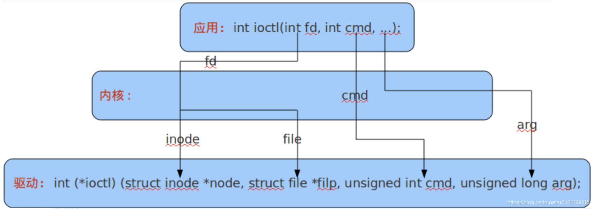

#《Linux设备驱动程序》ioctl详解

------

用户态程序是无法直接调用内核态API的，那么应用程序开发者如何与硬件沟通？
Linux就提供了一系列的系统调用，用来让开发者在用户态与系统沟通，进而与硬件沟通，其中就包括了我们常用的open、close、read、write和ioctl。

 从ioctl这个名称上看，本意是针对I/O设备进行的控制操作，但实际并不限制是真正的I/O设备，可以是任何一个内核设备即可。

除了读取和写入设备之外，大部分驱动程序还需要通过设备驱动程序实行各种类型的硬件控制。简单的数据传输之外，大部分设备还可以执行其他一些操作，比如，用户空间经常会请求设备锁门，弹出介质，报告错误信息，改变波特率或者执行子破坏，等等。这些操作通常通过ioctl方法来支持。

用户态的ioctl原型为

```
int ioctl(int fd, int cmd, ...)
```

而陷入内核之后，ioctl的函数原型为

```
int (*ioctl)(struct inode *node, struct file *filp, unsigned int cmd, unsigned long arg)
```



 写一个简单的内核模块HelloWorld

```c
#include <linux/init.h>             // 包含了__init和__exit函数的宏定义
#include <linux/module.h>           // 可加载内核模块的核心的头文件
#include <linux/kernel.h>           // 包含了kernel中的类型、宏和函数等

MODULE_LICENSE("GPL");              //此模块使用的licence，如果不用GPL的话编译时会出warning
MODULE_AUTHOR("StayrealS");      ///模块作者，加载后使用modeinfo可以在系统中看到
MODULE_DESCRIPTION("A simple Linux driver.");  //模块信息，加载后使用modeinfo可以在系统中看到
MODULE_VERSION("0.1");              ///模块版本，加载后使用modeinfo可以在系统中看到


/** @brief Module初始化函数，作为module的入点，使用insmod加载时会调用本函数。
 */
static int __init helloHW_init(void){
   printk(KERN_INFO "HW: HelloWorld from the BBB LKM!\n");
   return 0;
}

/** @brief 与init函数相似，在rmmod卸载本模块的时候会调用本函数进行清理等工作。
 */
static void __exit helloHW_exit(void){
   printk(KERN_INFO "HW: Goodbye from the HW LKM!\n");
}

/** @brief 一个模块必需使用module_init() 和module_exit() 宏来
 *  定义module的入点和出点
 */
module_init(helloHW_init);
module_exit(helloHW_exit);
```

内核模块Makefile

````
obj-m+=hello.o

all:
	make -C /lib/modules/$(shell uname -r)/build/ M=$(PWD) modules # 使用M=本文件夹的方式编译本文件夹下的.o为内核模块.ko
clean:
	make -C /lib/modules/$(shell uname -r)/build/ M=$(PWD) clean
````

其中`$shell uname -r`用来打印本机linux 内核的版本信息，用于找寻linux内核关于编译module用到的工具。接下来，只需要使用`make`就可以将hello world编译成为后缀名为`.ko`的可加载module。
接下来，使用

````
insmod hello.ko # 加载模块
lsmod # 查看已加载的模块
rmmod hello.ko  # 卸载模块
````

```
刚才在编写模块的时候打印是使用了printk，它是printf的内核态版本。
printk的输出不会打印在linux终端上，但是会打印到内核缓冲区中，可以使用
dmesg # 查看内核缓冲区
dmesg -c # 清空内核缓冲区
```

编写一个提供ioctl接口的设备驱动程序（内核模块）
如第一部分中所说，设备驱动程序是内核模块的一个应用案例。本节我们将编写一个提供ioctl接口的设备驱动程序。Linux的设备

### 设备的分类

Linux中I/O设备分为两类：字符设备和块设备。两种设备本身没有严格限制，但是，基于不同的功能进行了分类。

- 字符设备：提供连续的数据流，应用程序可以顺序读取，通常不支持随机存取。相反，此类设备支持按字节/字符来读写数据。举例来说，键盘、串口、调制解调器都是典型的字符设备。
- 块设备：应用程序可以随机访问设备数据，程序可自行确定读取数据的位置。硬盘、软盘、CD-ROM驱动器和闪存都是典型的块设备，应用程序可以寻址磁盘上的任何位置，并由此读取数据。此外，数据的读写只能以块(通常是512B)的倍数进行。与字符设备不同，块设备并不支持基于字符的寻址。

这两种设备都可以通过访问文件系统中的设备文件（在`/dev`下）来访问。例如，接下来我们要编写的一个虚拟字符设备，就被挂载在`/dev/test`处。

```shell
当我们执行ls -l /dev的时候，就能看到大量的设备文件，c就是字符设备，b就是块设备，网络设备没有对应的设备文件。编写一个外部模块的字符设备驱动，除了要实现编写一个模块所需要的代码之外，还需要编写作为
[root@RV1126_RV1109:/dev]# ls -al
drwxr-xr-x  2 root root        1820 Aug  6 22:34 char
crw-------  1 root root      5,   1 Aug  6 22:34 console
crw-------  1 root root     10,  62 Aug  6 22:34 cpu_dma_latency
drwxr-xr-x  8 root root         160 Aug  6 22:34 disk
drwxr-xr-x  3 root root         100 Aug  6 22:34 dri
lrwxrwxrwx  1 root root          13 Aug  6 22:34 fd -> /proc/self/fd
crw-rw-rw-  1 root root      1,   7 Aug  6 22:34 full
crw-------  1 root root    199,   0 Aug  6 22:34 galcore
crw-------  1 root root    254,   0 Aug  6 22:34 gpiochip0
```

### 设备的主编号（major number）与副编号（minor number）

设备的主编号是为了让操作系统区分不同**种类**的设备的。例如`/dev/ram0`和`/dev/null`的主编号都是1。
设备的副编号是为了区分**同种类的不同设备**的，例如以上两个设备的副编号一定不同。
设备的主副编号可以在`/dev`文件夹下使用`ls -l`查看。

```shell
root@RV1126_RV1109:/dev]# 
crw-rw----  1 root video    81,  27 Aug  6 22:34 v4l-subdev2
crw-rw----  1 root video    81,  28 Aug  6 22:34 v4l-subdev3
crw-rw----  1 root video    81,  29 Aug  6 22:34 v4l-subdev4
```

## 编写驱动程序(实现ioctl回调函数)

```c
#include <linux/module.h>    // included for all kernel modules
#include <linux/kernel.h>    // included for KERN_INFO
#include <linux/init.h>      // included for __init and __exit macros
#include <linux/scpi_protocol.h>
#include <asm/io.h>
#include <linux/slab.h>
#include <linux/fs.h>        // file_operation is defined in this header

#include <linux/device.h>
MODULE_LICENSE("GPL");
MODULE_AUTHOR("StayrealS");
MODULE_DESCRIPTION("Driver as a test case");

static int      majorNumber;
static struct   class*  test_module_class = NULL;
static struct   device* test_module_device = NULL;
#define DEVICE_NAME "test"      //define device name
#define CLASS_NAME  "test_module"

//函数原型
static long test_module_ioctl(struct file *, unsigned int, unsigned long);
static int __init test_init(void);
static void __exit test_exit(void);

///linux/fs.h中的file_operations结构体列出了所有操作系统允许的对设备文件的操作。在我们的驱动中，需要将其中需要的函数进行实现。下面这个结构体就是向操作系统声明，那些规定好的操作在本模块里是由哪个函数实现的。例如下文就表示unlocked_ioctl是由本模块中的test_module_ioctl()函数实现的。
static const struct file_operations test_module_fo = {
        .owner = THIS_MODULE,
        .unlocked_ioctl = test_module_ioctl,
};

//本模块ioctl回调函数的实现
/*    ioctl其实没有什么很难的东西需要理解，关键是理解cmd命令码是怎么在用户程序里生成
      并在驱动程序里解析的，程序员最主要的工作量在switch{case}结构中，因为对设备的
      I/O控制都是通过这一部分的代码实现的。 */
static long test_module_ioctl(struct file *file,        /* ditto */
                 unsigned int cmd,      /* number and param for ioctl */
                 unsigned long param)
{
        /* ioctl回调函数中一般都使用switch结构来处理不同的输入参数（cmd） */
        switch(cmd){
        case 0:
        {
                printk(KERN_INFO "[TestModule:] Inner function (ioctl 0) finished.\n");
                break;
        }
        default:
                printk(KERN_INFO "[TestModule:] Unknown ioctl cmd!\n");
                return -EINVAL;
        }
        return 0;
}

static int __init test_init(void){
        printk(KERN_INFO "[TestModule:] Entering test module. \n");
        // 在加载本模块时，首先向操作系统注册一个chrdev，也即字节设备，三个参数分别为：主设备号（填写0即为等待系统分配），设备名称以及file_operation的结构体。返回值为系统分配的主设备号。
        majorNumber = register_chrdev(0, DEVICE_NAME, &test_module_fo);
        if(majorNumber < 0){
                printk(KERN_INFO "[TestModule:] Failed to register a major number. \n");
                return majorNumber;
        }
        printk(KERN_INFO "[TestModule:] Successful to register a major number %d. \n", majorNumber);

        //接下来，注册设备类
        test_module_class = class_create(THIS_MODULE, CLASS_NAME);
        if(IS_ERR(test_module_class)){
                unregister_chrdev(majorNumber, DEVICE_NAME);
                printk(KERN_INFO "[TestModule:] Class device register failed!\n");
                return PTR_ERR(test_module_class);
        }
        printk(KERN_INFO "[TestModule:] Class device register success!\n");

        //最后，使用device_create函数注册设备驱动
        test_module_device = device_create(test_module_class, NULL, MKDEV(majorNumber, 0), NULL, DEVICE_NAME);
        if (IS_ERR(test_module_device)){               // Clean up if there is an error
                class_destroy(test_module_class);           // Repeated code but the alternative is goto statements
                unregister_chrdev(majorNumber, DEVICE_NAME);
                printk(KERN_ALERT "Failed to create the device\n");
                return PTR_ERR(test_module_device);
        }
        printk(KERN_INFO "[TestModule:] Test module register successful. \n");
        return 0;
}


static void __exit test_exit(void)
{
		//退出时，依次清理生成的device, class和chrdev。这样就将系统/dev下的设备文件删除，并自动注销了/proc/devices的设备。
        printk(KERN_INFO "[TestModule:] Start to clean up module.\n");
        device_destroy(test_module_class, MKDEV(majorNumber, 0));
        class_destroy(test_module_class);
        unregister_chrdev(majorNumber, DEVICE_NAME);
        printk(KERN_INFO "[TestModule:] Clean up successful. Bye.\n");

}

module_init(test_init);
module_exit(test_exit);
```

相信读者也发现了，在我的`test_module_fo`结构体中，没有直接使用`.ioctl=test_module_ioctl`而是使用了`.unlocked_ioctl=test_module_ioctl`。这是因为在较新的Linux内核中，已经修改了系统调用`ioctl`的内部实现为`unlocked_ioctl`，实现时要注意这一点。最新的file_operation结构体定义如下：（我使用的内核版本在`/usr/src/linux-headers-4.4.145-armv7-x16/include/linux/fs.h`中）

```c
 // Note: __user refers to a user-space address.
struct file_operations {
   struct module *owner;                             // Pointer to the LKM that owns the structure
   loff_t (*llseek) (struct file *, loff_t, int);    // Change current read/write position in a file
   ssize_t (*read) (struct file *, char __user *, size_t, loff_t *);    // Used to retrieve data from the device
   ssize_t (*write) (struct file *, const char __user *, size_t, loff_t *);   // Used to send data to the device
   ssize_t (*aio_read) (struct kiocb *, const struct iovec *, unsigned long, loff_t);  // Asynchronous read
   ssize_t (*aio_write) (struct kiocb *, const struct iovec *, unsigned long, loff_t); // Asynchronous write
   ssize_t (*read_iter) (struct kiocb *, struct iov_iter *);            // possibly asynchronous read
   ssize_t (*write_iter) (struct kiocb *, struct iov_iter *);           // possibly asynchronous write
   int (*iterate) (struct file *, struct dir_context *);                // called when VFS needs to read the directory contents
   unsigned int (*poll) (struct file *, struct poll_table_struct *);    // Does a read or write block?
   long (*unlocked_ioctl) (struct file *, unsigned int, unsigned long); // Called by the ioctl system call
   long (*compat_ioctl) (struct file *, unsigned int, unsigned long);   // Called by the ioctl system call
   int (*mmap) (struct file *, struct vm_area_struct *);                // Called by mmap system call
   int (*mremap)(struct file *, struct vm_area_struct *);               // Called by memory remap system call 
   int (*open) (struct inode *, struct file *);             // first operation performed on a device file
   int (*flush) (struct file *, fl_owner_t id);             // called when a process closes its copy of the descriptor
   int (*release) (struct inode *, struct file *);          // called when a file structure is being released
   int (*fsync) (struct file *, loff_t, loff_t, int datasync);  // notify device of change in its FASYNC flag
   int (*aio_fsync) (struct kiocb *, int datasync);         // synchronous notify device of change in its FASYNC flag
   int (*fasync) (int, struct file *, int);                 // asynchronous notify device of change in its FASYNC flag
   int (*lock) (struct file *, int, struct file_lock *);    // used to implement file locking
   …
};
```

同理，仿照上文编写makefile、使用`insmod`将设备（模块）加载。
接下来，我们可以编写应用程序来访问这个新添加的设备了。

````c
#include <stdlib.h>
#include <errno.h>
#include <fcntl.h>
#include <unistd.h>
#include <sys/ioctl.h>


int main(){
        int fd;
        fd = open("/dev/test", O_RDWR); //我们的设备挂载在/dev/test处
        if (fd < 0){
                perror("Failed to open the device...");
                return errno;
        }else{
                printf("Open device successful!\n");
        }
        ioctl(fd, 0);
        printf("Called ioctl with parameter 0!\n");
}
````

注意，运行本程序时需要使用sudo命令，否则可能因为权限问题访问设备文件失败。可以使用`/etc/udev/rules.d`中的规则将这个新设备文件调整权限，具体请参阅其他文章。

Q：我们并没有实现open函数，操作系统也能将它打开吗？
A：答案是是的。操作系统默认帮我们实现了基础的open、close函数，方便开发者进行开发。


**linux下 /proc 和 /sys 详解**概要：

/proc  正在运行的内核信息映射       主要输出：  进程信息 \内存资源信息 \  磁盘分区信息等等

/sys   硬件设备的驱动程序信息


