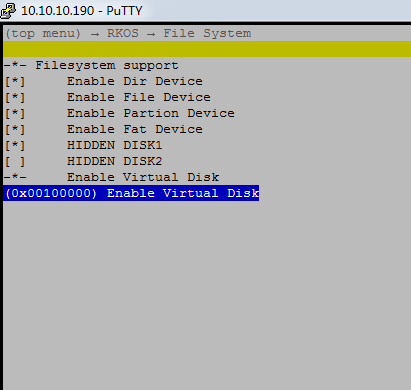

gc032a 延长曝光时间，降低帧率

```
修改帧率搜索AEC_exp_level_ ，每个档位控制不同环境下对应的帧率（浮动帧率），可以把所有档位都改成一致，但要保证AEC_exp_level_ 的值为AEC_anti_flicker _step的整数倍。


AEC_exp_level_ 所有档位改成一致时，就是固定帧率了


AEC_exp_level_ 和AEC_anti_flicker step的单位都是曝光行，
AEC_anti_flicker _step表示10ms曝光的行数，
AEC_exp_level 表示曝光的时间


最大曝光时间，AEC_exp_level_寄存器最大只能0xfff 
```


rkos上的补丁，修改初始化寄存器曝光时间延长到260ms。并且vicap取图超时时间加长

```
cw@SYS3:~/story/8_2206$ cd ^C
cw@SYS3:~/story/8_2206$ git show
commit 5ad5dad3c00b57a3443474dfb3d4b3ffaf9c3821 (HEAD -> aa)
Author: Wei Chen <wei.chen@rock-chips.com>
Date:   Tue Aug 4 18:14:27 2020 +0800

    frame
    
    Signed-off-by: Wei Chen <wei.chen@rock-chips.com>
    Change-Id: Ic2aab0c3d5384bd943b659600641bb001cc3d1bc

diff --git a/src/driver/camera/drv_gc032a.c b/src/driver/camera/drv_gc032a.c
index 1db63f0e..764cf96c 100644
--- a/src/driver/camera/drv_gc032a.c
+++ b/src/driver/camera/drv_gc032a.c
@@ -114,8 +114,8 @@ static struct sensor_reg g_gc032a_init_reg_table[] =
     {0x79, 0x60},
     /*ANALOG & CISCTL*/
     {0xfe, 0x00},
-    {0x03, 0x01},
-    {0x04, 0xce},
+    {0x03, 0x0f},
+    {0x04, 0xff},
     {0x05, 0x01},
     {0x06, 0xad},
     {0x07, 0x00},
@@ -406,23 +406,28 @@ static struct sensor_reg g_gc032a_init_reg_table[] =
     {0x08, 0x10},
 
     {0xfe, 0x01},
-    {0x25, 0x00},
-    {0x26, 0x9a},
 
-    {0x27, 0x01},
-    {0x28, 0xce},
-    {0x29, 0x03},
-    {0x2a, 0x02},
-    {0x2b, 0x04},
-    {0x2c, 0x36},
-    {0x2d, 0x07},
-    {0x2e, 0xd2},
-    {0x2f, 0x0b},
-    {0x30, 0x6e},
-    {0x31, 0x0e},
-    {0x32, 0x70},
-    {0x33, 0x12},
-    {0x34, 0x0c},
+//AEC_exp_level_=  AEC_anti_flicker _step * n
+//9a*25=f0a
+//9a*26=fa4
+    {0x25, 0x00},
+    {0x26, 0x9a}, //bask
+
+    {0x27, 0x0f},
+    {0x28, 0Xa4},
+    {0x29, 0x0f},
+    {0x2a, 0Xa4},
+    {0x2b, 0x0f},
+    {0x2c, 0Xa4},
+    {0x2d, 0x0f},
+    {0x2e, 0Xa4},
+    {0x2f, 0x0f},
+    {0x30, 0Xa4},
+    {0x31, 0x0f},
+    {0x32, 0Xa4},
+    {0x33, 0x0f},
+    {0x34, 0Xa4},
+//
     {0x3c, 0x30},
     {0xfe, 0x00},
 
diff --git a/src/driver/vicap/drv_vicap.c b/src/driver/vicap/drv_vicap.c
index cde72263..ad66ac5f 100644
--- a/src/driver/vicap/drv_vicap.c
+++ b/src/driver/vicap/drv_vicap.c
@@ -2353,7 +2353,7 @@ ret_err_t rk_vicap_ctrl_dqbuf(struct rk_vicap_dev *dev, struct vicap_video_buf *
         return RET_SYS_ERROR;
     }
 
-    ret = rk_semaphore_take(queue->qsem, TIME_OUT_SENCS(1));
+    ret = rk_semaphore_take(queue->qsem, TIME_OUT_SENCS(3));
     if (ret != RET_SYS_EOK)
     {
         VICAP_INFO(dev, "Err: take dqbuf sem failed, ret:0x%x!\n", ret);
@@ -2655,6 +2655,7 @@ static void rk_vicap_sample_block_irq(struct rk_vicap_dev *dev)
 /**
  * @brief  Handle the interrupt of vicap.
  */
+ int i=0;
 static void rk_vicap_irq(void)
 {
     struct rk_vicap_dev *vicapdev = &vicap_instance;
@@ -2662,6 +2663,7 @@ static void rk_vicap_irq(void)
 
     x = rk_interrupt_enter();
 
+    printf("===rk_vicap_irq= %d==\r\n==", i++);
     if (vicapdev->work_mode == VICAP_WORKMODE_BLOCK_PINGPONG)
     {
         rk_vicap_sample_block_irq(vicapdev);
cw@SYS3:~/story/8_2206$ 
```


### **10.1 camera测试命令**

如下命令创建文件cif.out,cif.jpeg，并抓图数据保存到cif.out,cif.jpeg。

```
file.setpath A:
file.mf cif.out
file.mf cif.jpeg
vicap_test dev_create
vicap_test dev_set --set-dev=vicap_0 --set-workmode=block --set-blocks=6 --set-format=fourcc=NV12,width=640,height=480 --stream-buf=8 --stream-count=1 --stream-mode=photo --skip-count=20
vicap_test dev_streamon
```

### 查帧率

```
vicap_test dev_set --set-dev=vicap_0 --set-workmode=block --set-blocks=6 --set-format=fourcc=NV12,width=640,height=480 --stream-buf=8 --stream-count=1 --stream-mode=preview --skip-count=20

```

客户-李春红:
改成多少？

传虎:
200000



```
vsync: vertical synchronization,  指与显示器的帧数同步. 简单来说就是启用了vsync的渲染过程,帧数不会超过显示器的帧数, 一个同步会被执行. 同步的地方就是显示器扫描线结束最后一行扫描准备开始第一行扫描的地方.

hsync: horizonal synchronization, 相比于vsync来说, 同步的单位从帧降到行,即是保证操作不是在扫描一行的中间出现,而是同步到下一行.

VBLANK: 显示器扫描线完成最后一行后,需要重返左上角,这个过程叫做: vblank,也叫VBI(vertical blank interval) ,因为扫描线变得blank,以防止看到一个斜线显示在屏幕上.
```

